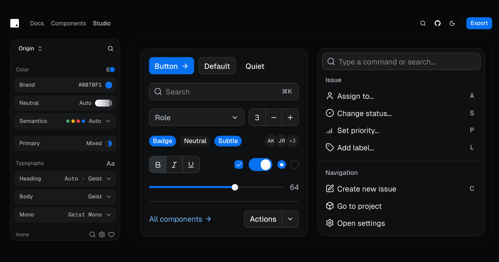

# dotUI

**dotUI Studio — build your design system, then own it as code.**

Compose your design system at [dotui.org/studio](https://dotui.org/studio) —
colors, typography, icons, density, radius and per-component styles — preview
every change live on real, accessible components built on React Aria and
Tailwind CSS, and export it into your codebase via the shadcn CLI or straight
into v0.

[](https://dotui.org/studio)

dotUI is in beta: expect APIs to change before 1.0.

## How it works

1. **Design** your system at [dotui.org/studio](https://dotui.org/studio) —
   not just a palette swap: every visual decision is yours.
2. **Export** it wherever you build:

   ```bash
   npx shadcn@latest init "https://dotui.org/r/init?preset=<your-preset>"
   ```

   then add components as you need them:

   ```bash
   npx shadcn@latest add @dotui/button
   ```

   Or open your design system directly in **v0** and start prompting with
   your brand already baked in — **Bolt** and **Lovable** are on the way.

3. **Own the code.** Components land in your project as plain React files —
   no dotUI package to depend on; restyle or rewrite anything.

## Documentation

Visit the [dotUI documentation](https://dotui.org/docs) for guides, component
APIs, and theming reference.

Two companion sites live in their own repos:
[ds.dotui.org](https://ds.dotui.org) in
[ds-directory](https://github.com/mehdibha/ds-directory) and
[colors.dotui.org](https://colors.dotui.org) in
[colors](https://github.com/mehdibha/colors).

## Community

- **Discord** — for community support, questions, and tips, join our
  [Discord](https://discord.gg/DXpj5V2fU8).
- **X** — to stay up-to-date on new releases and announcements, follow
  [@mehdibha](https://x.com/mehdibha).

## Contributing

See the [contribution guide](CONTRIBUTING.md).

## License

Distributed under the MIT License. See [LICENSE](LICENSE) for more information.
