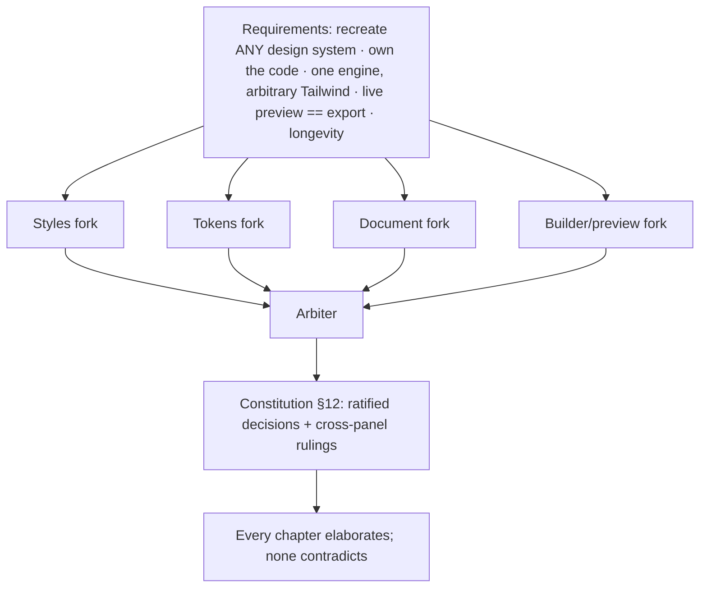

# Decision log — the forks, the choices, the rejected alternatives
> Part of [The Perfect dotUI (single-engine)](README.md) — an end-state architecture study (2026-07-04). Constitution-conformant.

Every other chapter describes *what* the system is. This one records *why it is that and not something else*. The perfect dotUI is the product of a design process with real forks — points where two or more coherent architectures were on the table, each defensible, and one had to win. Four panels each argued a domain (styles, tokens, config axes, preview/builder), an arbiter ratified a synthesis, and the losing branches were not discarded silently — their specific failure modes are the reason the winners are trustworthy.

This chapter is the ledger of those forks. Each entry has the same shape:

- **Decision** — one sentence, present tense. This is how the system works.
- **Context** — the requirement that forces a choice. A fork exists only because two design goals pull apart; naming that tension is half the justification.
- **The choice & its defense** — what was ratified and the mechanism that makes it hold.
- **Rejected alternatives** — the branches that lost, each with the concrete, checkable reason it failed. These are pulled faithfully from the panels' own analyses and self-declared weaknesses; nothing here is invented to make a loser look worse than it was.
- **Consequences** — what the decision commits the system to, stated with its honest costs. Every choice buys something and pays for it somewhere.

The entries are grouped by domain — **styles**, **tokens**, **the document**, **the builder & preview**, and **cross-cutting** — and closed by the **arbiter rulings** that resolved conflicts *between* panels, where two winning designs disagreed at their shared boundary and the arbiter had to pick the seam.

A note on register: these are settled decisions, not open questions. Where a decision has a genuine cost the system chooses to pay, the cost is stated plainly. A decision log that only lists wins is marketing; this one lists the bills.

The single most consequential fork in this study is that dotUI targets **exactly one style engine** — idiomatic Tailwind CSS v4, `tv()` plus utility strings. Everything downstream in the Styles section flows from having no second consumer to keep parity with. That fork is **N1**, and it opens the Styles section as its headline.

---

## Styles

### N1 · No engine-neutral IR — styles are Tailwind, resolved not lifted

**Decision.** Component styles **are** Tailwind. The publisher-successor **resolves** `styles.ts` — params, density, named-style deltas, scalar vars, declared var-writes — into the shipped `tv()` config in [`base.tsx`](04-styles.md); it does not lift the source into a JSON intermediate representation. `styles.ts` *is* the source; the shipped file is its resolution, not a translation of it.

**Context.** With a single engine, an engine-neutral intermediate representation has no second consumer. Its only benefits that stand *independent* of a second engine are stable-id targeting (rule-ids that survive class-string churn) and engine-neutral delta storage — and neither of those repays a full lift/normalize compiler, a closed authoring whitelist, and the parity apparatus that only an IR justifies. The fork: build the neutral IR anyway for its second-order benefits, or accept that with one engine the source *is* the shippable format and resolve it directly.

**The choice & its defense.** Resolution replaces lowering. `resolve()` evaluates pure helpers and inlines them (fragment sharing across a sync group, Button ⇄ ToggleButton, survives), resolves `params` named-style deltas against the user's selections into a concrete `tv()` config, folds density, resolves scalar/component vars, and preserves declared var-writes verbatim — producing a `ResolvedComponentStyles` (a concrete `tv()` config per sync group) ready for the `tv()` emitter. Because the output *is* Tailwind, the CLAUDE.md workflow — "compare against the shadcn equivalent to catch missing classes" — works on both the source and the shipped file, and the shadcn-diff review is a literal string diff with zero compiler in between. Arbitrary Tailwind is first-class: `:has()`, `**:[svg]`, descendant / `peer-*` / sibling combinators, container queries, arbitrary values — there is no whitelist ceiling and no portability constraint on authored CSS. The only style lint that remains is the hardcoded-value discipline (CLAUDE.md's "would two design systems disagree on it?"), which warns on design-meaningful literals with a token hint and leaves component mechanics as plain values — a warning a contributor can justify, **not** a totality gate that blocks the build.

**Rejected alternatives.**

- **A lightweight-IR middle path** — a thin neutral representation that keeps stable-id targeting and engine-neutral deltas without the full parity machinery. It still pays for a lift/normalize pass, stable-id bookkeeping, and a JSON round-trip, in exchange for benefits a single-engine world barely uses: overrides and diffs can key off `tv()` section paths and named-style ids just as well, and there is no second engine to hold neutral deltas *for*. The middle path buys a round-trip nobody rides.
- **A full owned-slot Contract** — the two-engine study's mechanism for guaranteeing a second engine could render every style structurally. With no second engine to reach parity with, it is pure cost: a closed property vocabulary that caps what a design system can express, cross-node normalization machinery, and a lowering table every new Tailwind family must be added to — all to protect a parity property that no longer has two sides. Rejected outright.

**Consequences.** Two real benefits of an IR are given up, honestly. **Stable-id targeting** is gone: overrides, diffs, and `codeStyle` transforms key off the `tv()` structure (base / slot / variant / compound) plus named-style ids, not off durable rule-ids — a large refactor of a component's `tv()` shape can move those handles, where opaque rule-ids would have held them still. **Engine-neutral delta storage** is gone, but it is moot with one engine — a Tailwind-only world has nothing to keep the deltas neutral *for*. What the system gains for those costs is decisive: dramatically less machinery (no lowering table, no whitelist, no lift lint, no round-trip check), authoring that is unconstrained real Tailwind, and a shadcn-diff workflow that is a literal string diff. This is the fork the rest of the Styles section presumes — S2 and S3 of the two-engine study do not exist here because the IR that motivated them does not.

### N2 · The var-strip bug is fixed by resolution completeness, not an IR node

**Decision.** Named-style `vars` blocks and inline `[--x:var(--y)]` writes resolve into the shipped output verbatim; there is no publish step that *could* strip them. A resolution-completeness invariant — "the shipped output contains every declared var-write and scalar the source referenced" — guards the class of bug where a named style's variable write (`menu.highlight = accent`) silently vanishes on export.

**Context.** A real class of export bug is a value the user set in a named style that never reaches the shipped file — the publisher drops it somewhere between source and output, and the export looks subtly wrong with no error. The two-engine study caught this with a both-engine lowering guard: a value that lowered on one engine but not the other was a detectable gap. With one engine, that cross-check is gone, so the guarantee has to come from somewhere else. The fork: reintroduce an IR node whose totality check catches the drop, or make the drop *structurally impossible* by never having a step that strips.

**The choice & its defense.** Resolution has no strip step. Stage 5 of style resolution carries declared var-writes into the shipped output as-is; because they are copied, not re-derived, there is no code path that can lose one. The invariant that protects this is a positive one — a test asserts the resolved output *includes* every var and scalar the source referenced — rather than a differential one that inferred the drop from an engine mismatch. The bug is not "caught late"; it is unrepresentable, because the only way to lose a declared write would be to write a strip step, and none exists.

**Rejected alternatives.**

- **Reintroducing an IR node purely to host a totality check.** This pays the entire cost of N1's rejected IR to recover one guard that a direct completeness test provides for free. A single-engine world does not need an intermediate representation to assert "nothing declared was dropped" — it needs a test over the resolved `tv()` output, which is exactly what ships. Rejected as machinery in search of a justification.

**Consequences.** The guarantee now rests on a completeness test over resolved output rather than on a structural cross-engine diff — a positive assertion that must enumerate what the source referenced. That enumeration is cheap (it walks the same `styles.ts` the resolver already parsed) and it is the single reason the `menu.highlight` export bug cannot recur. The system accepts one focused invariant in place of a whole representation layer.

### N3 · Component overrides are raw Tailwind class-string deltas

**Decision.** User component overrides are stored in the dsdoc's `components` section as **raw Tailwind class-string deltas** over named-style params; there is no edit-time totality check, and arbitrary Tailwind is accepted, flows through resolution, and ships.

**Context.** "Recreate ANY design system" requires document-carried component overrides — when no curated named-style value matches Geist's flat black button, the document must carry the look itself. The question is what the document *stores* for that override. The two-engine study lifted every override to an engine-neutral delta at edit time so a second engine's totality could be checked at the keystroke. With one engine there is no totality to check and no neutrality to preserve. The fork: keep an edit-time lift/validate anyway, or store what the user actually typed.

**The choice & its defense.** With one engine, engine-neutral storage is moot and there is no edit-time totality check to run, so overrides are stored as the raw class strings the user authored. Targeting handles for overrides and diffs are named-style ids plus `tv()` section paths (base / slot / variant / compound) — the same handles N1 established — so an override still attaches to a precise place in the resolved config. Because the stored delta is real Tailwind, a user can paste *arbitrary* Tailwind and it flows through resolution unchanged and lands in the shipped file. This **widens** the "recreate any design system" promise rather than bounding it: there is no vocabulary ceiling on what a document can carry.

**Rejected alternatives.**

- **Lifting overrides to a validated delta at edit time (the two-engine model).** The lift existed to check a second engine's totality at the keystroke and to persist an engine-neutral form. Both motivations are gone: there is no second engine to check against, and neutrality is meaningless with one target. Keeping the lift would bound what a user can paste for no benefit — it would *narrow* the promise the raw-delta model widens. Rejected as cost with no payoff.

**Consequences.** The document can now carry arbitrary Tailwind, which is the point — but it also means an override is only as portable as Tailwind itself, and a malformed class string is a user error caught by the resolver's own handling rather than by an edit-time gate. The system accepts that looseness deliberately: the widened flexibility is worth more than a validation step whose only original purpose has been removed from scope.

### S1 · Tailwind-native authoring, resolved into the shipped `tv()`

**Decision.** Contributors author component styles as idiomatic Tailwind in `styles.ts` — a `tv()`-shaped `defineComponentStyles(meta, {…})` with `base`, `variants`, a mandatory `sizes()` geometry table, `params`, and inline var-writes. The shipped `base.tsx` is the *resolved* `tv()` config: `styles.ts` **is** the source, and the shipped file is its resolution.

**Context.** The registry must produce shippable, ownable code from one source, and CLAUDE.md names a real workflow — "compare against the shadcn equivalent to catch missing classes" — that only works if the source *is* Tailwind. With N1 having settled that there is no neutral IR, the remaining question is narrow: is the shipped file a hand-written second format, or a mechanical resolution of the source?

**The choice & its defense.** Authoring stays Tailwind and the compiler *resolves* it — no separate committed intermediate artifact, no derived Contract to keep in sync. Pure `tv()` helpers are evaluated and inlined, which unlocks fragment sharing (Button ⇄ ToggleButton) that a literal-only extractor cannot do. Named-style `params` are DRY delta layers over `base` in the source and resolve to a complete `tv()` config downstream, so forking, diffing, and export always operate on complete configs, never on delta layers. Contributors keep their muscle memory and their shadcn diff workflow; the shipped file reads like hand-written Tailwind because it *is* resolved Tailwind.

**Rejected alternatives.**

- **A typed `defineStyles` builder DSL as the primary format.** It loses precisely on authoring DX: contributors think in Tailwind, the shadcn copy-paste comparison becomes impossible, and a large typed prop surface is ceremony with no engine to justify it. Rejected as a human-facing format; the ergonomic `defineComponentStyles` / `sizes()` shape is kept, but it *is* Tailwind-shaped, not a neutral schema.
- **A hand-written / committed JSON source of truth.** Making a JSON structure the source makes every PR a semantic-diff-tooling dependency and every merge conflict a JSON-graph conflict; the button base is a few strings, not ~30 nested objects. Rejected in favor of greppable Tailwind that resolves mechanically.

**Consequences.** The system owns a resolver — `styles.ts` → shipped `tv()` — and its correctness matters, but its blast radius is bounded to one engine: a resolution bug is a Tailwind bug, visible directly in the diff against the source, not a defect that fans out to a second target. The accepted price is a resolver that must stay faithful to one canonical authoring style (see AR-5); the payoff is that the reviewable source stays familiar Tailwind and the shadcn-comparison workflow is alive on both sides of the pipe.

### S4 · Density as hand-authored geometry tables via `sizes()`, not a scale factor

**Decision.** Density × size geometry is authored as explicit tables through the `sizes()` helper (the canonical, mandatory way — see arbiter ruling AR-5); density is a first-class resolution dimension, never a single `--density` multiplier.

**Context.** [Density](08-density-sizing.md) touches every sizable component. Two models: a scalar multiplier over spacing tokens (density on the CSS-var hot path, ~150 duplicated ladders deleted) versus hand-authored per-tier tables (fidelity, more data).

**The choice & its defense.** Real ladders are hand-tuned non-linearly — compact `xs` is `h-5`, not `h-8 × 0.7`. A scalar cannot reproduce those steps; forcing it to would require per-token density curves, which reintroduces exactly the per-component authoring the scalar promised to delete. Density changes are keypress-frequency, so a structural-tier recompile of all components (a few milliseconds) is well within budget — the hot-path win the scale factor buys is a win density doesn't need. The `sizes()` helper collapses the triple-authored ladder into one table without pretending geometry is linear; the density × size table folds into the selected tier baked into classes (`codeStyle.density: 'baked'`, default) or ships as a `data-density` attribute axis (`'runtime'`).

**Rejected alternatives.**

- **`--density` as a scale factor over spacing tokens.** A fidelity regression the proposing panel self-declared: it flattens hand-tuned non-linear steps to arithmetic. Rejected because density does not need a hot-path scalar and the accuracy loss is real and visible.

**Consequences.** A fourth density tier is a data edit, not a refactor — but the geometry tables are the registry's largest single body of authored data, and they must be maintained per component. The system pays authoring bulk for pixel-accurate density.

---

## Tokens

### T1 · The Dimensional Token Graph over flat mode lists and over a frozen global contract

**Decision.** All values flow through one layered, id-stable [Dimensional Token Graph](05-tokens.md) — primitive → semantic → component-contract — whose mode axis is a dimension cube and whose component boundary is a generated per-group contract.

**Context.** Requirement #1 is "recreate ANY design system," which forces two things at once: an *editable* token vocabulary (users add/rename/retarget), and mode composition (high-contrast must work with *every* scheme and *every* brand). Three panels each solved part of this; none solved all of it.

**The choice & its defense.** The graph is the winning substrate because it is the only model that unifies primitives, semantics, and component vars into one validated, id-stable, symbolically-resolvable structure — the `tv()` emitter, DTCG, verification, preview diffing, and persistence all fall out of it as pure functions. Onto that chassis: dimensions × cells replace the flat mode list (composition for free), and a per-group system-owned contract replaces the frozen global role set (safety without a ceiling).

**Rejected alternatives.**

- **A global frozen 48-role component contract as the component-facing vocabulary.** Directly caps requirement #1: chart tokens (`--chart-1..5`) fit no role; today's 28 per-component scalar vars cannot fold into 9 scalar roles; card/popover/sidebar/tooltip collapse into one "panel" (breaking `modal.background` and other real distinctions); a brand-secondary surface triad is inexpressible. The proposing panel's own weakness list concedes role-count creep would follow — dissolving the "small frozen bottom" thesis. The *insight* survives as system-owned, per-group generated contracts with structural `pairsWith` — same safety, no global ceiling.
- **A flat mode list with an `inherits` chain.** Cannot compose orthogonal concerns: high-contrast × {light, dark, dim, brand} forces hand-enumerated `brand-dark-hc`… combinations. Cell-keyed values subsume the inherit chain's convenience (an option with no keys resolves through less-specific keys) while adding free composition, verified per cell.
- **Direct token binding via a compiled alias table with no layer discipline.** Deletion safety is advisory (a compiler warning), a component's dependency surface into mutable user-space is unbounded, and a token rename regenerates every consumer's class string — component source churns on vocabulary edits. Its mode cube, per-cell generation, and Figma mapping are all adopted; its binding model is not.

**Consequences.** One graph is one heavily-relied-upon code path: a bug in `resolve()` or `materializeRamps` affects the `tv()` emission, DTCG, preview, and verification simultaneously — this single-source-of-truth risk concentration is a real cost the system carries, and the guard against it is the graph's own strong invariants ([13-testing.md](13-testing.md)) rather than drift-between-emitters checks. The builder UI must make a ~200–400 node DAG feel like "pick two seed colors" for casual users. The system accepts concentrated risk and a hard UI challenge in exchange for one queryable model that every artifact projects from.

### T2 · Component contracts generated per sync group, system-owned

**Decision.** Component-contract nodes are generated at registry build from terse `defineContract()`/`surface()`/`scalar()` declarations in `styles.ts`, owned per sync group, and are system-owned: users retarget them but never delete or rename them.

**Context.** Components must reference a *stable* interface (so the vocabulary above can be reshaped without breaking them), but hand-authoring ~40 contract nodes × ~72 components would balloon the registry.

**The choice & its defense.** `surface()` expands to the bg/hover/active/line/`on` sibling nodes and — critically — creates the structural `pairsWith` edge that powers verification of *actually-rendered* pairs. `owner: 'button-like'` on every node *is* the sync mechanism: one owner, N components, `nodesByOwner('button-like')` is the group. Contracts are terse to author and generate the verification edges mechanically.

**Rejected alternatives.**

- **Hand-authored per-component contract nodes.** The proposing panel's own weakness: ~40 nodes × ~72 components hand-written balloons the registry without proportional benefit for components that never need retargeting. Generation is terser and also creates the `pairsWith` edges as a side effect.

**Consequences.** Contract evolution becomes a registry ABI: adding a node is a minor manifest bump (ships a default); renaming/removing is a major bump with a mechanical migration map. The open question of whether *users* can mint new contract nodes (a custom second ring) is resolved conservatively — contract extension is dotUI-registry-versioned; users retarget, dotUI extends.

### T3 · Readable permanent ids over opaque ULIDs

**Decision.** Every token node has a permanent, readable id minted from its initial slug (`color-primary`, `btn-bg-primary`); a separate renamable `name` drives emitted var names and display labels; references always use ids.

**Context.** The longevity requirement needs rename-safe references — renaming a token must not break the systems that reference it. One panel reached for opaque ULIDs (`tk_01H…`) to guarantee stability; the config-axes panel argued the guarantee comes from *discipline*, not opacity.

**The choice & its defense.** The config-axes argument wins: the rename-safety guarantee is "ids are permanent handles, labels rename freely" plus a registry lint that forbids removing or reusing a published id — and readable ids honor that discipline exactly as well as opaque ones, while keeping documents human-diffable and the authoring layer sane. A renamed emission ships a deprecation alias for one major version.

**Rejected alternatives.**

- **Opaque prefixed stable ids (`av_sousse`, `tk_01H…`).** They cost human diff readability and authoring ergonomics and add ceremony without adding any guarantee readable permanent ids can't provide. The rare id-space refactor goes through the same deprecation-note remap either way. Opacity buys nothing the discipline doesn't already buy.

**Consequences.** The safety rests on author discipline plus lint/CI, not on the type system alone — a contributor who hard-deletes instead of deprecating, or reuses an id, breaks the totality the migrations depend on. The system accepts a lint-enforced convention as the price of diffable documents.

### T4 · Producers × cells; independently-generated dark, no ramp reversal

**Decision.** Ramps are pluggable producer declarations (`oklch`/`tailwind`/`contrast`/`material`/`fixed`/open registry) whose config is cell-keyed; dark is genuinely generated per cell (the `oklch` producer is `isDark`-aware) and ramp reversal exists nowhere.

**Context.** Casual users want a good dark for free from one seed; power users want to paste a hand-tuned palette; a Linear-style system wants a third scheme. Today's `dark = reverseRamp(stretchLightness(light))` produces documented per-token tone errors.

**The choice & its defense.** Cell-keyed producer config *is* independently-seeded dark — it deletes reversal at the root. The default `oklch` producer auto-derives a strong dark via `isDark` so casual users are not forced to seed every cell; a second dark seed is an opt-in refinement. `fixed` accepts hand-authored ramps per cell verbatim — the "paste my Radix/corporate palette" flow that today's `resolveColorConfig` rejects. High-contrast is not a separate producer: `contrastBoost` raises the target ramp toward AAA inside the *same* producer, which is why hc composes with every scheme for free.

**Rejected alternatives.**

- **Reverse-ramp dark as the default derivation.** Deleted at the root, not softened. It carries documented tone errors and cannot express an independent dark accent. Per-cell producer config subsumes the "free dark from one seed" convenience without the reversal compromise.
- **Rejecting `fixed` / hand-authored ramps (today's stance).** Reversed. "Recreate any design system" includes pasting Geist's hand-tuned grays; a generative-only engine cannot. `fixed` is first-class.

**Consequences.** Independently-seeded dark is more work for a user who wants a *bespoke* dark than reverse-ramp was — the default must ship a genuinely strong auto-derived dark or the flexibility becomes a burden. Every producer must now behave correctly for arbitrary polarities and surfaces; a third-party producer that only handles light could silently degrade dark cells. Producers run at compile time in JS, so a user who changes a seed re-runs the dotUI generator — but since values ship as CSS custom properties, a seed change also re-materializes live in the builder's own preview without a rebuild.

### T5 · Propose-don't-impose contrast autofix

**Decision.** Contrast verification runs per reachable cell over structurally-derived pairings; autofix is a *proposed, cell-scoped graph edit* the user accepts, never a silent correction of resolved output.

**Context.** The a11y guarantee must be enforceable (requirement: a system literally cannot ship an illegible primary button in strict mode) without breaking the source ↔ preview ↔ export equivalence that fidelity depends on.

**The choice & its defense.** Pairings come from three sources in priority order — structural contract pairs (`surface()` creates them), engine `on`-pairs, and declared semantic pairs — so the pairs that *actually render* are always known. `nudgeForTarget` produces a `{ tid, cellKey, newValue }` that appends an override key to the *failing cell only*, applied on user accept: it cannot regress other cells (scoped by construction) and it stays visible in the stored graph.

**Rejected alternatives.**

- **Autofix that corrects the resolved output while leaving the token untouched.** Silently diverges resolved values from the source graph, so preview/export no longer equals what the document says — breaking fidelity and DTCG round-trip coherence, and hiding the failure instead of teaching the user. Replaced by propose-and-accept, cell-scoped keys.
- **Per-token user-space `pairsWith` as the *primary* pairing source.** Makes the a11y guarantee depend on users maintaining metadata; a forgotten or wrong `pairsWith` silently drops coverage of a rendered pair. Demoted to an optional third source behind the structural contract pairs.

**Consequences.** For a tightly-constrained brand palette, autofix may not converge and degrades gracefully to a report — the guarantee is "we tell you, and offer a scoped fix," not "we always fix it." Alpha/mix compositions are verified against the resolved composite over the cell's surface, which is more work than pair-of-solids checking.

---

## The document

### D1 · A pinned immutable Registry Manifest over diff-vs-live-defaults and over schema-major-pinned baselines

**Decision.** Every [dsdoc](09-dsdoc.md) pins an immutable, content-addressed [Registry Manifest](03-registry.md) snapshot; an omitted value means "the pinned manifest's value," never "whatever today's code says."

**Context.** The canonical form omits defaults to keep documents tiny and diffs meaningful. But "omit the default" only works if the default is *stable* — and dotUI's baseline (axes, token defaults, style layers) changes far more often than the document *shape*. The fork is entirely about what "the default" is pinned to.

**The choice & its defense.** The manifest snapshot is immutable, content-addressed (`2028.03.01-a3f`), and kept forever npm-style. A two-year-old document resolves against its *own frozen manifest* — its axes, values, defaults, and style layers are exactly what they were the day it was authored. This kills the silent-reinterpretation bug structurally: defaults are frozen data inside a snapshot, not live code. `reconcile(doc, newManifest)` is then an *explicit, reviewable* act that shows a deprecation diff before anything changes.

**Rejected alternatives.**

- **Diff against live code-derived defaults (today's model).** The documented longevity bug: renaming a default silently reinterprets every stored system, and a decode failure silently discards the user's work. Superseded structurally.
- **Pin the omitted-defaults baseline by schema major.** The baseline changes far more often than the document shape, so pinning by schema major either freezes the baseline within a major or forces a schema bump for every trivial baseline tweak — a rigidity the proposing panel listed as its own weakness. An immutable content-addressed snapshot pins vocabulary *independently* of schema shape and is strictly better.

**Consequences.** "Published means permanent" is a real storage and operational liability: the registry can never delete a snapshot a document might pin, and must serve `/r/manifest/<v>` for arbitrarily old versions. The retention answer (arbiter ruling AR-10) is a hot-serve window plus a cold-storage tier — permanent, but tiered.

### D2 · The Dimensional Token Graph as the single document token model

**Decision.** The dsdoc stores tokens as one `tokens: TokenGraphOverlay` section — an overlay over the pinned manifest's baseline graph — replacing any separate primitives/modes/tokens trio.

**Context.** The config-axes panel proposed a `primitives` / `modes` / `tokens` trio inside the document. The tokens panel proposed the Dimensional Token Graph as the one model for *everything*. At the shared boundary these disagree: is the document's token model the graph, or a simpler three-field split?

**The choice & its defense.** The graph wins (arbiter conflict resolution): the dsdoc stores an overlay (added/changed dimensions, ramps, nodes) over the pinned baseline graph. There is one model, not two — the builder edits the graph, the document persists a graph overlay, the compiler merges baseline ⊕ overlay. `GenerationRecipe.modeDerivation (reverse|reseed|shift)` does not exist as a separate concept; per-cell producer config subsumes it (see T4).

**Rejected alternatives.**

- **A separate `primitives` / `modes` / `tokens` trio in the document.** Introduces a second token representation that must be kept coherent with the graph the tokens panel already proved out. Collapsed into the single overlay — one model, one set of invariants, one migration story.
- **A declared `modeDerivation` policy field (`reverse`/`reseed`/`shift`).** Redundant once producer config is cell-keyed. `reseed` is a second seed in a cell key; `shift` is a producer knob in a cell key; `reverse` is deleted. Removed as a distinct concept.

**Consequences.** The document commits to the graph's full expressive weight even for simple systems — a "just two seeds" design still serializes as a graph overlay. The canonical-form machinery (omit baseline-identical entries under the lock) keeps that overlay small in practice, but the *model* the document speaks is always the graph.

### D3 · Raw class-string component overrides

**Decision.** User component overrides are stored as **raw Tailwind class-string deltas** over named-style params (formalized as decision **N3** above); raw Tailwind input and the builder's style editor both funnel into the same resolution path, which accepts arbitrary Tailwind with no edit-time totality check.

**Context.** "Recreate ANY design system" requires document-carried component overrides — when no curated named-style value matches Geist's flat black button, the document must carry the look itself. The question is what the document *stores*.

**The choice & its defense.** With one engine, engine-neutral storage is moot and there is no totality check to run at edit time, so the document stores the raw class strings the user authored, keyed by named-style id + `tv()` section path. Arbitrary Tailwind flows through resolution and ships — this *widens* the "recreate any design system" promise rather than bounding it. (Full defense in N3.)

**Rejected alternatives.**

- **Lifting overrides to a validated delta at edit time.** The lift's two motivations — checking a second engine's totality and persisting an engine-neutral form — are both out of scope with one engine, so the lift would bound what a user can paste for no benefit. Rejected; see N3.

**Consequences.** The document can carry arbitrary Tailwind, which is the widened flexibility this design chooses; the cost is that an override is only as portable as Tailwind, and a malformed string is a resolver-level error rather than an edit-time gate. See N3.

### D4 · Detachable structural sync groups

**Decision.** A synced axis's selection is stored **once** under the group id (divergence is unrepresentable by default), and the only way a member diverges is an explicit `detached` record plus a component-scoped selection, validator-enforced.

**Context.** Button ⇄ ToggleButton must not drift by accident — the data model should make accidental divergence impossible. But real systems sometimes want "mostly synced with one intentional exception" (ToggleButton's selected state).

**The choice & its defense.** Store-once makes accidental drift structurally impossible; the detach record makes intentional divergence *declared* rather than accidental. The validator enforces the biconditional: a component-scoped selection of a synced axis exists **iff** a matching detach record exists. The builder renders synced axes once at the group header, shows a "detached" chip on the exception, and re-sync is one click (delete both records).

**Rejected alternatives.**

- **Full-sync-only with no per-member escape hatch.** Real systems want the one intentional exception; forcing full sync pushes users to duplicate axes — the proposing panel's own weakness cites ToggleButton's selected state. The detach escape hatch (from the axis-kernel panel) keeps sync structural while making exceptions declared.

**Consequences.** There is a small validator surface to maintain (the detach biconditional, the "every `syncedAxes` entry appears in each member's `axes`" check). The system accepts that in exchange for a data model where the common case cannot drift and the exception cannot be accidental.

### D5 · Fan-out axes for grouped tweaks, not merged selection patches

**Decision.** Sticky grouped tweaks (translucent overlays, etc.) are ordinary axes with a fan-out `writes: WriteTarget[]` list carrying per-value `when` conditions; one-shot presets are `SelectionPatch` bundles applied once at edit time.

**Context.** "Translucent menus/popovers as a single switch" is one visual decision that touches several tokens. It could be a macro that *merges* several writes into `selections` at toggle time, or an axis whose one selection *fans out* at resolve time.

**The choice & its defense.** A fan-out axis resolves at resolve time: one selection, one generated switch, toggling off is just the other value, and export honors it through the same resolver. The two primitives are cleanly split — sticky tweaks (ongoing state) are axes; one-shot personalities ("start from Linear," no ongoing state) are patches.

**Rejected alternatives.**

- **Sticky grouped tweaks as selection patches merged at edit time.** Once a patch is merged into `selections`, the switch's state is ambiguous the moment any written value is edited, and un-applying requires an inverse patch. The fan-out axis has no such ambiguity. Patches remain only for one-shot presets, which have no ongoing state.

**Consequences.** A grouped tweak's several targets live in one axis's `writes` list with `when` predicates — a slightly richer axis schema than a plain enum. That richness is the whole point: grouped tweaks are a *data shape*, not special-cased code.

---

## The builder & preview

### B1 · An isomorphic worker/server compiler over precompiled-sheet purism and over main-thread compilation

**Decision.** One pure `resolve(manifest, dsdoc)` and one pure `compile(resolved, target)` run byte-identically in a browser worker (the live preview) and on the server (every export endpoint); the worker holds the [ResolvedSystem](11-compiler.md) and receives only tiny classified edits.

**Context.** The two headline builder requirements pull apart: *preview must equal export* (which wants one code path) and *theme-wide changes must hold 60fps over a full showcase* (which wants the hot path to touch nothing but CSS variables). A third pressure — user-defined tokens and custom styles are a *first-class product requirement*, not an edge case — rules out any closed precompiled matrix.

**The choice & its defense.** The isomorphic compiler makes fidelity structural: the class string on a preview DOM node is character-for-character the class string in the exported file, because both come from the same `compile()`. The worker holds the ResolvedSystem and receives small classified edits — never a whole-doc clone per tick — so value-keyed caches survive across frames (fixing the identity-cache defeat that makes today's iframe re-run the kernel every slider tick). The value tier is pure `setProperty` writes; a hue drag is rAF-coalesced → one ramp recomputed per cell → ~22 var writes → var-only invalidation, zero React renders.

**Rejected alternatives.**

- **A precompiled data-attribute preview sheet (`className="btn"` + `[data-c][data-density]` rules) as the preview substrate.** Breaks the first criterion structurally: the preview renders different markup and cascade mechanics (flat lowered CSS, attribute selectors) than the export (`tv()` utility class lists), and "reconstructing idiomatic Tailwind from the lowering" is a *second compiler* — exactly the divergence seam the design exists to eliminate. It also bets on a closed curated matrix, which conflicts with user-defined named styles being first-class. Its performance win is retained anyway — the isomorphic compiler's value tier is the same one-`setProperty` hot path.
- **A main-thread compiler with path-scoped subscriptions.** Its 60fps guarantee hinges on CRDT materialization preserving structural sharing precisely — a correctness-critical invariant the proposing panel itself flags as easy to violate silently. Moving the kernel and fold into a worker that owns the ResolvedSystem makes the hot path robust by construction: the main thread only ever applies var ops and class-map swaps.

**Consequences.** A client/server version-skew risk appears: `ResolvedSystem.version` is a content hash and the server must reject or refresh a stale client, or a stale client previews a different result than the server exports. The builder ships a non-trivial payload (publishables JSON, the static utility layer, lazy WASM Tailwind) per session. The system accepts version-handshake machinery and a payload budget for a fidelity guarantee that no test can be relied upon to catch after the fact.

### B2 · The preview runs Tailwind — the only engine

**Decision.** The live preview runs Tailwind, which is the only engine; there is no engine selection, no engine proxy, and no engine-specific cold-start machinery to reconcile.

**Context.** With a single engine, the question that dominated the two-engine builder — *which* engine does the preview execute, and does a document on one engine preview a proxy of the other — simply does not arise. The only remaining question is how the one engine's output reaches the preview DOM identically to how it reaches the exported file.

**The choice & its defense.** The preview executes Tailwind through the same `compile()` the export endpoints call, so preview equals export by construction (B1). There is no proxy-versus-literal decision to make and no precomputed atomic layer to build for a second engine's cold start — that entire machinery is deleted rather than trivialized. Scoped-inline (B3) mounts the resolved `tv()` output directly; the one place preview and export code differ at all is the `createLiveVariants` shim, which is why AR-9 elevates that shim to the single fidelity seam.

**Rejected alternatives.**

- **Carrying an engine-selection seam "just in case" a second engine returns.** The constitution is explicit that a second engine, if ever wanted, re-enters as an additional *serializer* over the same `ResolvedSystem` — never as a constraint on how the preview runs today. Building an engine seam now would pay for a fork that has been ruled out of scope. Rejected; the preview is Tailwind, full stop.

**Consequences.** There is no per-engine preview-performance asymmetry to equalize and no atomic-layer build cost to carry — the preview's cold start and interaction cost are simply Tailwind's. The system gives up nothing real here: the only thing removed is machinery whose entire purpose was to reconcile two engines that no longer coexist.

### B3 · Scoped-inline preview over iframe-first (iframe kept for device frames and embeds)

**Decision.** The editing preview mounts the real registry `base.tsx` files inline in the builder's own React tree under a `DesignScope` (scoped-inline); the iframe is reserved for device-width frames and third-party embeds.

**Context.** The iframe + postMessage boundary is the root cause of today's perf cliff (structured-clone defeats identity caches) and blocks shared-context features (hover a preview button → open its editor; AI highlights a node). But an iframe gives true isolation and correct viewport-media-query reflow that a fixed-width scope container cannot.

**The choice & its defense.** Scoped-inline removes the realm boundary — the docs `scoped` mode already proves closure + RAC portal redirection + CSS containment works — so the store, context, and hover-to-edit are shared, and the postMessage identity barrier is gone. The `./styles` import resolves to a live style module (`createLiveVariants`) whose sole job is guarded by a CI property test plus a computed-style diff (arbiter ruling AR-9). The iframe is not deleted; it is used *where it is right* — the `/embed/:docId/:view` route for device frames and third-party embeds (arbiter ruling AR-7).

**Rejected alternatives.**

- **Iframe + postMessage as the primary editing preview (today's architecture).** The realm boundary is the perf cliff and blocks shared-context features. Kept only where isolation is genuinely wanted: embeds and device frames.

**Consequences.** Scoped-inline trades hard isolation for speed: a badly-behaved showcase component or a colliding user-defined CSS var could leak across the scope boundary in ways an iframe would contain, and getting portal/overlay redirection perfectly right for every RAC component is ongoing work. Device-width preview cannot use viewport media queries in a fixed-width container — which is exactly why registry authoring *mandates* container queries and device frames go through the iframe (AR-7). The system accepts a softer isolation boundary and a container-query authoring rule as the price of one shared React tree.

### B4 · A generated panel where every control returns a real command

**Decision.** The builder panel is generated by walking axis schemas — one control per `kind`, no hand-written per-axis React — and each axis's `toCommand` must return a real Command (a stub control is a type error).

**Context.** Today's builder has per-axis React modules and a parallel `?lab=true` universe that drift. The requirement is that adding an axis to the manifest grows a control with zero UI code.

**The choice & its defense.** There is exactly one panel, generated from `manifest.axes ⊕ doc.axes`, filtered by shared `when` predicates (one rule for panel visibility *and* resolution), grouped by `ui.group`. The `toCommand`-returns-a-real-command type constraint makes a no-op control impossible to ship. Component axes are synthesized from contract declarations, but *exposure is curated* — an internal mechanic var is not an axis unless declared.

**Rejected alternatives.**

- **Auto-deriving a builder axis from every `--component-*` variable with no opt-out.** Removes curatorial control: some component vars are internal mechanics (hairlines, hit areas), not user knobs — the project's own hardcoded-values test says mechanics stay plain. Adopted instead: single-source derivation to kill triple-declaration drift, but exposure is *declared* in the schema.

**Consequences.** A purely schema-driven panel caps the delight of bespoke controls — the color-engine editor and ramp grids need `ui.control` rich-widget hints (presentation only, same state model). The system accepts a small rich-widget registry as the one concession to generated-UI purism.

### B5 · Commands / LWW op-log over a full CRDT

**Decision.** In-session editing is a Command op-log with last-writer-wins per `(node, key)` cell and a sync/presence seam — not a full CRDT; the persisted artifact is always the canonical dsdoc.

**Context.** The builder needs undo/redo, drag coalescing, AI staging on a throwaway branch, and a path to collaboration. A full CRDT gives multiplayer merge semantics but is heavy machinery for what is usually a single-user session, with subtle undo-over-interleaved-ops edge cases.

**The choice & its defense.** The op-log gives O(1) invertible undo/redo, drag coalescing into one undo entry, and `batch` as one step — and its LWW cells plus a stubbed sync/presence seam make collaboration *possible* without building it now. The persisted artifact is the canonical dsdoc, so the op-log is an editing convenience, never the source of truth.

**Rejected alternatives.**

- **A full CRDT document store (Yjs/Loro) as the foundation.** Heavy machinery for a mostly single-user session; it adds a materialization layer and merge-conflict semantics with subtle undo-over-collaborator-ops UX, and the panels that proposed it conceded merge semantics were under-specified. The LWW op-log keeps the command/branch API from day one and defers real multiplayer without rearchitecting.

**Consequences.** Real-time multiplayer is not shipped — only its seam. If collaboration becomes a priority, the LWW cells and sync channel are the on-ramp, but conflict semantics richer than last-writer-wins would be new work. The system accepts a deferred-multiplayer position in exchange for not paying CRDT complexity in the common single-user case.

---

## Cross-cutting

### X1 · One dsdoc, many packagings

**Decision.** Distribution is one [ResolvedSystem](11-compiler.md), many [packagings](12-distribution.md) — shadcn CLI, v0, Bolt/Lovable, zip, DTCG/Figma, MCP/agents — each a downstream projection of the same compile, never a parallel pipeline.

**Context.** Export is wide — shadcn CLI, v0, Bolt/Lovable, zip, DTCG/Figma, MCP/agents — and keeps widening. If each target were its own pipeline, they would drift, and "preview equals export" would hold for one target and fail for the rest.

**The choice & its defense.** Every target reads one `ResolvedSystem`; `compile(resolved, target)` differs only in the final packaging. `/r/bundle?doc=…&target=…` carries per-target profiles that declare their *constraints* (no `css`/`cssVars` fields, dep pinning, file layout) rather than forking the compiler. DTCG is a token-graph serialization, not a re-derivation; the MCP server exposes the same compose/export tools an agent needs. Flatten-on-export chooses `bg-primary` versus the var form per node.

**Consequences.** A new export target is a packaging profile plus a distribution endpoint, not a compiler. The compiler must stay target-agnostic — target-specific logic that leaks into `resolve()`/`compile()` core is the failure mode this guards against.

### X2 · codeStyle as AST transforms, never regex or `// MARK:` anchors

**Decision.** `codeStyle` options ([the ownership layer](11-compiler.md)) are AST transforms over the emitted `tv()` output, with a CI invariant that every transform is AST-equivalent modulo formatting; they are never regexes over strings or hand-maintained comment anchors.

**Context.** "The exported design system should read like the user's codebase, not ours" — arrow vs function declaration, `tv()` class arrays vs one line per slot, section comments or not. Today's approach leans on in-band `// MARK:` anchors that desync from source.

**The choice & its defense.** Section boundaries come from the `tv()` structure itself (base / slots / variants / compounds), not comment markers; every knob is a transform over the emitter's typed AST. The retained knobs are `format`, `functions` (arrow | declaration), `tv: { classArrays, oneLinePerVariant }`, `comments`, `imports`, `layout`, `tokenIndirection` (flatten | preserve), and `density` (baked | runtime) — every engine-specific option is dropped with the second engine. The CI invariant (AST-equivalence modulo formatting) means a code-style transform cannot silently change semantics — `oxfmt`/format is never silently swallowed.

**Consequences.** codeStyle multiplies the emitter test matrix (one engine × code-style knobs), which is more golden-test surface than a no-options world — but far less than a two-engine matrix would carry. The system pays that test breadth to guarantee the exported file reads like the user's own code without ever altering behavior.

---

## Arbiter rulings (cross-panel conflicts)

The panels each won their domain, but four winning designs meet at shared boundaries, and at each boundary two designs disagreed. These are the rulings that fixed the seam. They are first-class decisions — the system depends on them exactly as much as on the domain choices above.

### AR-1 · Component nodes reference component-contract or semantic nodes; flatten-on-export

**Decision.** A component declaration may reference component-contract nodes (`{componentVar}`) or semantic nodes (`{semantic}`) — never primitives — and on export, where a contract node still points at its default target, the `tv()` emitter emits the idiomatic semantic utility (`bg-primary`); retargeted nodes emit the var form.

**The conflict.** The styles panel allowed component references to semantic *and* component-contract nodes. The tokens panel's stricter prose said components consume *only* layer-3 contract vars. Left unresolved, the emitter wouldn't know whether `bg-primary` is legal in a component or must always be `bg-(--btn-bg-primary)`.

**The ruling.** The token graph's edge rule wins as the reference rule: components may reference contract nodes *or* semantic nodes, never primitives — the tokens panel's "only layer-3" prose is overruled as too strict. On export, `codeStyle.tokenIndirection: 'flatten' (default) | 'preserve'` decides shape: `flatten` emits the semantic utility where the contract node is at its default (so exported code reads like hand-written shadcn), `preserve` keeps the var indirection. This is why exported files don't drown in `--btn-*` var references for untouched buttons while still allowing full retargeting.

**Consequences.** Two legal reference tiers in component source means the resolver must canonicalize both, and flatten-on-export means the *same* component emits different (equivalent) code depending on whether a node was retargeted — correct, but a reviewer diffing two exports must know that a `bg-primary` → `bg-(--btn-bg-primary)` flip is a retarget, not a bug.

### AR-2 · The Dimensional Token Graph replaces the dsdoc token trio

**Decision.** The dsdoc's token model is a single `TokenGraphOverlay`; the config-axes panel's `primitives`/`modes`/`tokens` trio is replaced.

**The conflict.** Two winning designs proposed two token representations for the document — the tokens panel's one graph, the config-axes panel's three fields. (Formalized above as D2; recorded here as a first-class arbiter ruling because it resolved a direct cross-panel disagreement.)

**The ruling.** One model. The graph is the single source; the document stores an overlay over the pinned baseline graph; `modeDerivation` does not exist as a separate concept because per-cell producer config subsumes it.

**Consequences.** See D2 — the document speaks the graph even for trivial systems, kept small by canonical form.

### AR-3 · Readable ids, ratified across panels

**Decision.** Readable permanent ids (not opaque ULIDs) are the id scheme for *both* token nodes and document referents.

**The conflict.** The tokens panel minted opaque ULID-like node ids; the config-axes panel argued readable-but-permanent ids for document referents. A system with opaque token ids but readable axis ids would be internally inconsistent and half-diffable.

**The ruling.** Readable everywhere. The guarantee is the "ids are permanent handles, labels rename freely" discipline plus a registry lint — which readable ids honor as well as opaque ones, while keeping *all* documents human-diffable. (See T3 for the full defense.)

**Consequences.** One id discipline across tokens and axes; one lint enforces both.

### AR-5 · `sizes()` is mandatory, not optional sugar

**Decision.** The `sizes()` helper is *the* canonical way to author density × size geometry tables; new components must use it, and ad-hoc per-density ladders do not pass review.

**The conflict.** The styles panel offered `sizes()` as *optional* typed sugar over string authoring, and left open whether the old triple-layer ladder style could persist. Optional sugar means two authoring styles coexist, which breaks the "one canonical source style" rule the codeStyle transforms depend on.

**The ruling.** `sizes()` is mandatory for new components. One authoring style for geometry means the resolution, the density-dimension folding, and the codeStyle transforms all operate over one shape. Ad-hoc ladders are a review failure, not a style preference.

**Consequences.** Contributors have less freedom in how they express size ladders — a deliberate normalization. The payoff is that density folding and `codeStyle.density` (baked/runtime) are mechanical over one table shape rather than pattern-matching arbitrary ladders.

### AR-7 · iframe for device frames and embeds only

**Decision.** The editing preview is scoped-inline; the iframe is used only for the device-width preview and for third-party embeds, and registry authoring *mandates* container queries so components reflow correctly inside the fixed-width scope container.

**The conflict.** Scoped-inline wins the editing loop (B3), but a fixed-width scope container cannot reflow components that use *viewport* media queries — an iframe can. Either mandate container queries (end-state-clean, one authoring rule) or keep an iframe in the hot loop (defeats scoped-inline's whole point).

**The ruling.** Both mechanisms, each where it is right: registry authoring mandates container queries (so inline scoped preview reflows correctly), and genuine device frames go through the `/embed/:docId/:view` iframe route. The editing loop never touches an iframe.

**Consequences.** A hard authoring rule — components must use container queries, not viewport media queries, for responsive behavior. This is a real constraint on how registry components are written, accepted because it keeps the editing preview inline and fast. (Container queries are mandatory anyway because registry components must reflow inside the fixed-width scope, so this rule costs nothing new.)

### AR-8 · LWW command log over CRDT

**Decision.** The in-session store is a custom LWW-cell command log with a sync/presence seam, not a full CRDT.

**The conflict.** The preview-builder panels split on the store substrate — Yjs/Loro CRDT versus a custom command log — and on whether sync/presence ship at launch.

**The ruling.** Custom LWW command log; the command/branch API exists from day one, real multiplayer merge is deferred behind the seam. (Full defense in B5.)

**Consequences.** Multiplayer is a seam, not a feature — see B5.

### AR-9 · Live-variants conformance is property test *and* computed-style diff

**Decision.** The one preview seam — `createLiveVariants` behind the `./styles` import — is verified by both a randomized property test (`createLiveVariants(resolved)(props) === tv(emit(resolved))(props)`) *and* computed-style sample diffs, not by property test alone.

**The conflict.** With no intermediate representation and no cross-emitter parity to lean on, the live style module is the *single* place preview and export code differ at all — which makes it load-bearing for the entire fidelity argument. One panel proposed a property test over `base.tsx` patterns; the question was whether that alone is enough to *trust* the shim as the only fidelity seam.

**The ruling.** Both, and elevated. The property test proves the callable's class output matches `tv(emit(resolved))` across randomized docs and props; the computed-style sample diff proves the *rendered result* matches for a sample matrix per component. Because there is no IR round-trip check and no both-engine guard behind it, this conformance suite is not one fidelity check among several — it is *the* fidelity invariant, the load-bearing guarantee of "what you see is what you own." The shim gets a conformance suite, not trust.

**Consequences.** More CI surface concentrated on the one seam that could invalidate the whole fidelity guarantee — the system deliberately over-tests the single narrow place where preview and export code paths are not literally identical, precisely because nothing else stands behind it.

### AR-10 · Headless strict export, cube guardrails, manifest retention

Three operational rulings that the panels raised as open questions and the arbiter closed.

**Headless strict export.** When `strict` contrast enforcement runs in a headless/CI/programmatic export with no user to accept a proposed fix, the export **blocks with a machine-readable report**; `--accept-fixes` applies the proposed cell-scoped fixes and emits a manifest of what was applied. The conflict was block-vs-auto-apply; the ruling keeps propose-don't-impose (T5) as the interactive default *and* gives automation an explicit, audited opt-in — never a silent auto-correction.

**Cube guardrails.** The builder soft-caps at **4 dimensions / 24 reachable cells** with UI guidance; verification is incremental on edit and full-matrix at export/publish. The conflict was whether strict-mode verification could stay interactive as the cube grows. The ruling: incremental verification (touched pairings × affected cells) keeps edits interactive under the cap, and the full matrix runs at export — so the interactive path never pays the whole cube's cost, and the export path never skips it.

**Manifest retention.** "Published means permanent" is resolved as a **hot-serve window plus a cold-storage tier** — old snapshots remain resolvable (a two-year-old dsdoc must open), but not all at hot-path latency. Nothing a document might pin is ever deleted; the cost is bounded by tiering, not by expiry.

**Consequences.** Strict export has two honest modes (block with report; accept-fixes with manifest) that CI pipelines must choose between explicitly. The 4-dimension / 24-cell cap is a real product limit — a system needing a fifth orthogonal dimension hits UI guidance, a deliberate guardrail against combinatorial verification blow-up. Manifest storage grows monotonically forever, tiered to keep the hot path fast and cold snapshots merely slower, never gone.

---

## The shape of the whole, in one table

Every ratified decision, its winner, and the one-line reason the alternative lost.

| # | Decision | Winner | Why the alternative lost |
|---|---|---|---|
| N1 | Style representation | Tailwind, resolved not lifted | A neutral IR has no second consumer; its independent benefits don't repay a lift/whitelist compiler |
| N2 | Var-strip guard | Resolution completeness test | An IR node just to host a totality check is machinery in search of a job |
| N3 | Override storage | Raw Tailwind class-string deltas | Edit-time lift bounds what you can paste with no engine to check against |
| S1 | Authoring format | Tailwind source → resolved `tv()` | A typed DSL kills the shadcn-diff workflow; JSON-as-source makes every PR a semantic-diff dependency |
| S4 | Density | Hand-authored `sizes()` tables | A scale factor can't reproduce hand-tuned non-linear ladders |
| T1 | Token model | Dimensional Token Graph | Frozen 48-role contract caps flexibility; flat mode list can't compose orthogonal modes |
| T2 | Contracts | Generated per sync group | Hand-authoring ~40 nodes × ~72 components balloons the registry |
| T3 | IDs | Readable permanent | Opaque ULIDs cost diffability, buy nothing the discipline doesn't |
| T4 | Generation | Producers × cells, real dark | Reverse-ramp carries tone errors; generative-only can't paste a palette |
| T5 | Contrast fix | Propose-don't-impose | Silent output correction breaks source↔preview↔export equivalence |
| D1 | Baseline | Pinned immutable manifest | Diff-vs-live silently reinterprets; schema-major pinning freezes the baseline |
| D2 | Doc tokens | Single graph overlay | A separate trio is a second token representation to keep coherent |
| D3 | Overrides | Raw class-string deltas | Edit-time lift narrows the promise with no engine to justify it |
| D4 | Sync groups | Store-once + explicit detach | Full-sync-only forces axis duplication for one exception |
| D5 | Grouped tweaks | Fan-out axes | Merged patches make the switch's state ambiguous after any edit |
| B1 | Compiler | Isomorphic worker/server | Precompiled sheet is a second compiler; main-thread hinges on fragile sharing |
| B2 | Preview engine | Tailwind, the only engine | An engine-selection seam pays for a fork ruled out of scope |
| B3 | Preview mount | Scoped-inline | Iframe boundary is the perf cliff and blocks shared context |
| B4 | Panel | Generated, real commands | Auto-axis for every var removes curatorial control over mechanics |
| B5 | Store | LWW command op-log | Full CRDT is heavy for a single-user session |
| X1 | Distribution | One system, many packagings | Parallel pipelines drift |
| X2 | codeStyle | AST transforms | Regex / `// MARK:` anchors desync from source |
| AR-1 | References | Contract/semantic + flatten | Strict layer-3-only drowns exports in var refs |
| AR-9 | Preview seam | Property test + computed diff | Property test alone doesn't prove the rendered result; it is the *only* fidelity seam |
| AR-10 | Ops | Block/accept-fixes · 4-cube cap · tiered retention | Silent auto-fix, unbounded cube, and deletion each break a guarantee |

---

*This log is the intellectual spine of the study. Every other chapter takes these decisions as settled and shows how they compose. Where a chapter states a cost, it is a cost named here first — the perfect dotUI is perfect because it knows exactly what it pays, and for what. The single-engine choice (N1) is the fork that shrinks the rest: with no second engine to keep parity with, an entire representation layer, its invariant, and its parity apparatus simply do not exist here, and the machinery that remains is the machinery the product actually needs.*
</content>
</invoke>
