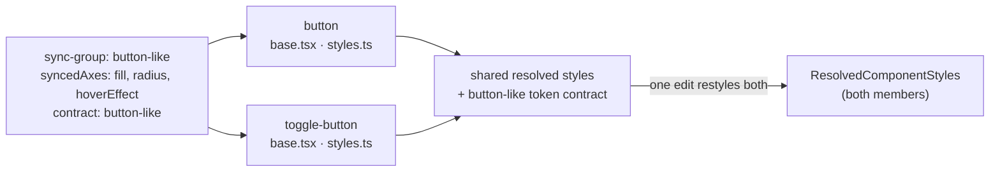
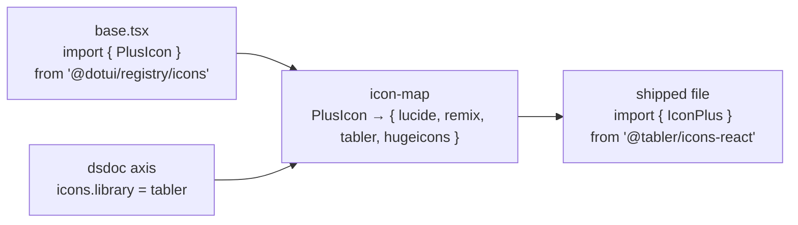
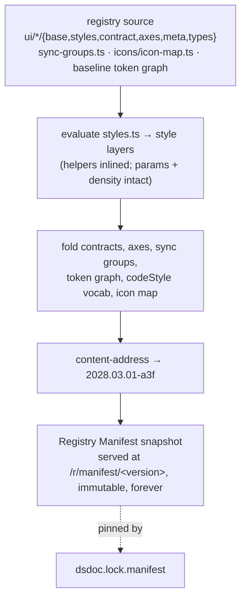

# The registry — item anatomy, kinds, and authoring rules
> Part of [The Perfect dotUI (single-engine)](README.md) — an end-state architecture study (2026-07-04). Constitution-conformant.

The registry is dotUI's product source of truth. It is one package, `@dotui/registry`, holding every item a user can install — the React Aria component templates, their styles, their demos, their metadata — plus the machinery that turns that source into a **Registry Manifest** snapshot the compiler pins against. Everything a user's design system references — every axis they can turn, every component whose look they retarget, every token in the baseline graph, every code-style option — traces back to a declaration authored here.

This chapter specifies the anatomy of a registry item file by file, the seven item kinds and what each ships, the sync-group and axis declarations items carry, the icon abstraction that actually swaps imports at compile time, how a manifest snapshot is built from registry source, and the numbered authoring rules that keep the source clean and portable. The worked fixture throughout is **Button** — shared with [Styles](04-styles.md), [Tokens](05-tokens.md), and [Axes](06-axes.md) — with **Menu** (declared vars) and **Loader** (file-variant) as supporting cases.

The registry does not know about `/create`, about the router, or about DTCG. It authors component behavior and Tailwind-string styles; the [Style](04-styles.md) and [Compiler](11-compiler.md) packages resolve and emit. The one hard boundary — the registry imports only its own package surfaces and published packages — is what lets the same source feed six export targets. This chapter's normative rules exist to hold that boundary.

---

## 1. Where the registry sits

```
packages/registry/          # @dotui/registry — THE product source
├── ui/<component>/          # ~72 UI items: RAC template + styles + meta + demos
├── hooks/<name>/            # reusable hooks (use-mobile, use-ripple…)
├── lib/<name>/              # framework-neutral utilities (cn, focus-styles…)
├── icons/                   # icon map + name tables + createIcon
├── styles/<name>/           # registry:style bases (the init item)
├── blocks/<name>/           # composed showcases (dashboard, sign-in…)
├── sync-groups.ts           # sync-group declarations (button-like, field-like…)
├── manifest/                # the manifest builder + committed baseline graph
└── index.ts                # the registered catalog
```

`@dotui/registry` imports only from `@dotui/style`, `@dotui/tokens`, `@dotui/runtime`, React Aria Components, and its own files (rule R1, §9). It never imports from `apps/web` — not the router, not fumadocs, not `@/components`. `apps/web` imports the registry; nothing imports back. This is a compiler-enforced dependency direction, not a convention: the registry is a library any consumer could depend on, and the export pipeline treats it as one.

> **Why not keep styles authored outside the registry** (as `@/lib/styles` is today)? Because the styling engine is *part of the item's authored form*. When `defineComponentStyles` lives in `@dotui/style` and the item imports it as a published package, the item is self-contained: it can be lint-checked, resolved to its shipped `tv()`, and reasoned about without reaching into an app. The registry authors styles; it does not author the style *framework*.

**Tradeoffs (§1).** One package for ~72 components plus blocks is large, and a change to a shared helper in `@dotui/style` fans out to every item's resolution. We accept this: the alternative — per-component packages — multiplies publish overhead and version skew for no authoring benefit, since items already share one manifest version. The registry is versioned as a whole; the manifest snapshot is its release unit.

---

## 2. Anatomy of a UI item

A UI item is a folder `packages/registry/ui/<component>/`. Every file has one job. Button is the reference; here is its complete folder, file by file.

| File | Ships to user? | Role |
|---|---|---|
| `base.tsx` | yes (transformed) | The behavior template — RAC primitive + slots + the style seam |
| `styles.ts` | no (resolved) | Full parametric style definition (`defineComponentStyles`) |
| `contract.ts` | no (folded into manifest) | Token-contract declarations (`defineContract`/`surface`/`scalar`) |
| `axes.ts` | no (folded into manifest) | Per-component axis declarations, or `axes:` in `meta.ts` |
| `meta.ts` | no (drives everything) | Registered item metadata: kind, files, deps, group, sync group |
| `types.ts` | no (drives docs) | Prop interfaces — the source of API reference docs |
| `index.tsx` | no (site-only) | The www-side wrapper — router links and other site concerns |
| `demos/*.tsx` | no | Docs demos, one component per file |
| `examples.tsx` | no | The `/create` preview grid entries |

The split is the same discipline as today's registry, sharpened: one canonical authored form per concern, and a clean line between *authored source* (`base.tsx`, `styles.ts`) and *derived artifacts* (the resolved `tv()`, the manifest slice, the shipped file). Nothing is hand-maintained in two places.

### 2.1 `base.tsx` — the behavior template

`base.tsx` is what the user receives via the shadcn CLI, after the compiler resolves its `./styles` import into a concrete `tv()` call. It is plain React Aria Components plus one style seam. The [Compiler](11-compiler.md) emits the resolved `tv()` config into the template, above the neutral component line.

One rule shapes the template beyond ordinary RAC usage: **every rendered slot carries a `data-slot` attribute** so the emitted classes have stable anchors — `data-slot="spinner"`, `data-slot="content"`, `data-slot="icon"` are the handles the styles target. Beyond that, the component API is an ordinary RAC design choice: relation states like a trailing icon can read from an explicit `suffix` prop *or* from an idiomatic `:has()` binding over free-form children — the study does not force explicit slots. Button below uses explicit `prefix`/`suffix` props because they read cleanly for this component, not because styling requires them.

Here is Button's template in the canonical authored form. It reads almost exactly like today's file:

```tsx
'use client'

import type * as React from 'react'
import * as ButtonPrimitive from 'react-aria-components/Button'
import { composeRenderProps } from 'react-aria-components/composeRenderProps'
import type { VariantProps } from '@dotui/style'

import { Loader } from '@dotui/registry/ui/loader'
import { Icon } from '@dotui/registry/ui/icon'

import { buttonStyles, useStyles } from './styles'
import type { ButtonStyles } from './styles'

type ButtonVariants = VariantProps<ButtonStyles>

interface ButtonProps
  extends React.ComponentProps<typeof ButtonPrimitive.Button>,
    ButtonVariants {
  isIconOnly?: boolean
  prefix?: React.ReactNode // leading icon slot
  suffix?: React.ReactNode // trailing icon slot
}

const Button = ({
  variant,
  size,
  isIconOnly,
  className,
  prefix,
  suffix,
  children,
  ...props
}: ButtonProps) => {
  const styles = useStyles(buttonStyles)
  return (
    <ButtonPrimitive.Button
      data-button=""
      data-icon-only={isIconOnly ? '' : undefined}
      data-icon-start={prefix != null ? '' : undefined}
      data-icon-end={suffix != null ? '' : undefined}
      className={composeRenderProps(className, (cn) =>
        styles({ variant, size, isIconOnly, className: cn }),
      )}
      {...props}
    >
      {composeRenderProps(children, (children, { isPending }) => (
        <>
          {isPending && <Loader data-slot="spinner" aria-label="loading" />}
          {prefix && <Icon data-slot="icon">{prefix}</Icon>}
          <span data-slot="content" className="truncate">
            {children}
          </span>
          {suffix && <Icon data-slot="icon">{suffix}</Icon>}
        </>
      ))}
    </ButtonPrimitive.Button>
  )
}

export type { ButtonProps }
export { Button, buttonStyles }
```

The template is neutral above the `styles(...)` line — the same behavior, the same slots, the same relation attributes. The compiler folds the resolved `tv()` config in behind the `./styles` import; nothing about the template changes. Wrapper-level code-style options (arrow vs declaration, file layout) apply as AST transforms over this file.

### 2.2 `styles.ts` — the parametric style definition

`styles.ts` is the full style definition, with every parameter. It is authored as Tailwind utility strings in a `tv()`-shaped config — the format contributors already know, and the format that lets them copy-compare against shadcn (rule R8, §9). It is never shipped as-is: the compiler *resolves* it — params, density, named-style deltas, scalar vars, declared var-writes — into a concrete `tv()` config, the shipped `base.tsx`. There is no JSON intermediate; `styles.ts` *is* the source, and the shipped file *is* the resolved `tv()`.

The authoring entry point is `defineComponentStyles(meta, config)` from `@dotui/style`:

```ts
import { defineComponentStyles, sizes } from '@dotui/style'
import buttonMeta from './meta'

export const buttonStyles = defineComponentStyles(buttonMeta, {
  base: {
    base: [
      'group/button relative inline-flex shrink-0 cursor-interactive items-center justify-center rounded-(--btn-radius) bg-clip-padding font-(--btn-font-weight) whitespace-nowrap transition-[background-color,border-color,color,box-shadow] select-none',
      'focus-reset focus-visible:focus-ring',
      '**:[svg]:pointer-events-none **:[svg]:shrink-0',
      'pending:cursor-default pending:border-border-disabled pending:bg-disabled pending:text-transparent',
      'pending:**:not-data-[slot=spinner]:opacity-0 pending:**:data-[slot=spinner]:text-fg-muted',
      'disabled:cursor-default disabled:border-border-disabled disabled:bg-disabled disabled:text-fg-disabled',
    ],
    variants: {
      variant: {
        default:
          'border bg-neutral text-fg-on-neutral hover:border-border-hover hover:bg-neutral-hover pressed:border-border-active pressed:bg-neutral-active',
        primary:
          'bg-primary text-fg-on-primary [--color-disabled:var(--neutral-500)] [--color-fg-disabled:var(--neutral-300)] hover:bg-primary-hover disabled:border-0 pending:border-0 pressed:bg-primary-active',
        quiet: 'bg-transparent text-fg hover:bg-inverse/10 pressed:bg-inverse/20',
        link: 'text-fg underline-offset-4 hover:underline',
        warning:
          'bg-warning text-fg-on-warning hover:bg-warning-hover pressed:bg-warning-active',
        danger:
          'bg-danger text-fg-on-danger hover:bg-danger-hover pressed:bg-danger-active',
      },
      isIconOnly: { true: 'p-0' },
    },
    defaultVariants: { variant: 'default', size: 'md' },
  },

  // density × size geometry — ONE table via sizes(), not three hand-authored ladders
  density: sizes({
    compact: {
      xs: { h: 5, px: 2, radius: 'sm', text: '0.625rem', icon: 2.5, iconPad: 1.5 },
      sm: { h: 6, px: 2, icon: 3, iconPad: 1.5 },
      md: { h: 7, px: 2, icon: 3.5, iconPad: 1.5 },
      lg: { h: 8, px: 2.5, icon: 4, iconPad: 2 },
    },
    default: {
      xs: { h: 6, gap: 1, px: 2, text: 'xs', icon: 3, iconPad: 1.5 },
      sm: { h: 7, gap: 1, px: 2.5, text: '0.8125rem', icon: 3.5, iconPad: 1.5 },
      md: { h: 8, gap: 1.5, px: 2.5, icon: 3.5, iconPad: 2 },
      lg: { h: 9, gap: 1.5, px: 2.5, icon: 4, iconPad: 2 },
    },
    comfortable: {
      xs: { h: 7, gap: 1, px: 2.5, text: '0.8125rem', icon: 3.5, iconPad: 1.5 },
      sm: { h: 8, gap: 1, px: 2.5, icon: 4, iconPad: 1.5 },
      md: { h: 9, gap: 1.5, px: 2.5, icon: 4, iconPad: 2 },
      lg: { h: 10, gap: 1.5, px: 3, icon: 4, iconPad: 2 },
    },
  }),
})

export type ButtonStyles = typeof buttonStyles
```

Three things about this file are load-bearing:

- **`base` is a `tv()` config of Tailwind strings.** Everything Tailwind is legal — `:has()`, `**:[svg]`, `peer-*`, descendant and sibling combinators, container queries, arbitrary values. There is no whitelist ceiling. The only style lint is the **hardcoded-value discipline** (rule R2, §9): a design-meaningful literal with an available token (`bg-[#635bff]`, `rounded-[7px]`) draws a **warning carrying the token hint** — CLAUDE.md's hardcoded-value rule as a lint a contributor can justify, not a gate that blocks the build.

- **`sizes()` is the canonical way to author density × size geometry.** The raw button `styles.ts` today hand-authors three near-identical density blocks — 150+ lines of duplicated `h-`/`px-`/`gap-`/`size-` ladders across the registry. `sizes()` renders the density × size table once; resolution folds the selected tier into the shipped classes (or ships a `data-density` axis under `codeStyle.density: 'runtime'`). Adding a fourth density tier is a data edit in one table, not a rewrite of 48 files. This is not optional sugar — new components must use it, and ad-hoc per-density ladders do not pass review (rule R9, §9).

- **`[--color-disabled:var(--neutral-500)]` is a declared var, not a lost one.** The `primary` variant writes CSS custom properties. Resolution carries these into the shipped output verbatim, scoped to the `variant=primary` value. There is no strip step that *could* drop them — which is why the class of bug where a variant's var writes previewed correctly but were stripped on export is structurally impossible (decision **N2**).

Slotted components use `slots:` instead of a single `base` string. Menu is the canonical slotted case, and it is also where declared vars shine:

```ts
export const menuStyles = defineComponentStyles(menuMeta, {
  base: {
    slots: {
      root: ['max-h-[inherit] scroll-my-1 overflow-y-auto rounded-[inherit] p-1 outline-hidden'],
      item: [
        'relative flex w-full cursor-interactive items-center gap-2 rounded-sm outline-hidden select-none',
        'focus:bg-highlight focus:text-fg-on-highlight',
        'disabled:text-fg-disabled',
      ],
      indicator: ['pointer-events-none absolute right-2 flex items-center justify-center'],
      itemLabel: [''],
      itemDescription: ['text-fg-muted'],
      section: ['scroll-my-1'],
      sectionTitle: ['px-2 py-1.5 text-xs text-fg-muted'],
    },
  },
  density: sizes({ /* per-tier item padding, section-title padding, icon size */ }),

  // the `highlight` axis — a named-style enum contributing class slices AND vars
  params: {
    highlight: {
      subtle: {
        slots: { item: 'overflow-hidden focus-visible:before:absolute focus-visible:before:inset-y-0 focus-visible:before:left-0 focus-visible:before:w-0.5 focus-visible:before:bg-accent' },
        vars: {
          '--color-highlight': 'var(--neutral-300)',
          '--color-fg-on-highlight': 'var(--on-neutral-300)',
        },
      },
      accent: {
        vars: {
          '--color-highlight': 'var(--accent-500)',
          '--color-fg-on-highlight': 'var(--on-accent-500)',
        },
      },
    },
  },
})
```

`highlight` is an **axis** (§5) whose two values (`subtle`, `accent`) each contribute a delta layer — class slices, CSS vars, or both — over the base `tv()` config. The `vars` are preserved into the shipped output so the accent-highlight look survives export. Each named-style value resolves to a *complete* `tv()` config before anything downstream reads it: the delta is an authoring convenience the compiler erases, so forking, diffing, and LLM generation all operate on whole configs.

### 2.3 `contract.ts` — component-contract token declarations

`contract.ts` declares the component's slice of the **Dimensional Token Graph** (see [Tokens](05-tokens.md)) — the component-contract layer. These are the parametric surfaces a user retargets: variant surface families, radius, declared scalars. They are generated per **sync group** (§3), system-owned (users retarget, never delete or rename), and they are the *only* nodes a component's style declarations may reference besides semantic nodes (rule R4, §9).

```ts
import { defineContract, surface, scalar } from '@dotui/tokens'

export const buttonContract = defineContract('button-like', {
  // surface() mints a paired family and a structural pairsWith edge that
  // powers contrast verification of the actually-rendered pair.
  neutralSurface: surface({ bg: 'neutral', fg: 'fg-on-neutral', hover: 'neutral-hover', active: 'neutral-active' }),
  primarySurface: surface({ bg: 'primary', fg: 'fg-on-primary', hover: 'primary-hover', active: 'primary-active' }),

  // scalar() declares a single component var with a typed default and an
  // optional link to a builder axis — ONE declaration, not three duplicated places.
  radius: scalar({ type: 'radius', default: 'radius.md', var: '--btn-radius', axis: 'shape.radius' }),
  fontWeight: scalar({ type: 'font-weight', default: 'font.medium', var: '--btn-font-weight' }),
})
```

`scalar()` ends the three-place duplication that plagues the current design (a default in `meta.ts`, again in a `styles.css` `:root` block, again in a manual import registration). One declaration derives the meta default and the `:root` CSS var. `surface()` mints a color family *and* the `pairsWith` edge that tells the token verifier which foreground/background pairs are actually rendered, so contrast checks run against real pairings per reachable cell rather than a static list.

Because the contract belongs to the `button-like` sync group, Button and ToggleButton share it: retargeting `primarySurface` to a flat black-on-white pair restyles both members at once (§3).

### 2.4 `meta.ts` — the registered metadata

`meta.ts` default-exports the item's registration. It is a shadcn-schema `RegistryItem` extended with dotUI fields: `group` (customizer UI grouping), `syncGroup` (§3), and `axes` (§5, when not in a separate `axes.ts`).

```ts
import type { RegistryItem } from '@dotui/registry'

export default {
  name: 'button',
  type: 'registry:ui',
  group: 'buttons',
  syncGroup: 'button-like',
  files: [{ type: 'registry:ui', path: 'ui/button/base.tsx', target: 'ui/button.tsx' }],
  registryDependencies: ['loader', 'icon', 'focus-styles'],
  axes: ['shape.radius'], // curated exposure — see §5
} satisfies RegistryItem
```

`registryDependencies` is CI-checked against the imports in the shipped file: an import of `@dotui/registry/ui/loader` with no `loader` entry fails the build (rule R1's teeth). `syncGroup` links the item to its group declaration in `sync-groups.ts`.

### 2.5 `types.ts`, `index.tsx`, `demos/`, `examples.tsx`

- **`types.ts`** holds JSDoc'd prop interfaces. It is the *source of API reference docs* — the references pipeline reads `types.ts`, never `base.tsx`. Documented props come from here, so this file stays complete and accurate independent of the template's internal prop spreading.

- **`index.tsx`** is the www-side wrapper: site-only concerns like rendering internal `href` strings as client-side router links. It is never shipped and is excluded from every export. Button's `index.tsx` wraps `LinkButton` so an internal `/pricing` href renders a client-side navigation instead of a full-page `<a>`; the shipped `base.tsx` has no router dependency. Even here the import boundary holds — the router arrives through React Aria's app-configured router integration, never an `apps/web` import (rule R1).

- **`demos/*.tsx`** are docs demos — one default-exported component per file, indexed lazily by the manifest builder (§6).

- **`examples.tsx`** feeds the `/create` preview grid. It imports only registry surfaces; its index and the grid's app-side glue are emitted *outside* the registry tree (into the app), so the registry stays items-only.

**Tradeoffs (§2).** Nine file roles per item is more ceremony than a single-file component. The payoff is that each concern has exactly one authored home, and the derived artifacts (resolved `tv()`, manifest slice, shipped file) are never hand-edited — so a change is made once and propagates. The cost lands on new-component onboarding; `sizes()` and `defineContract` shrink it by killing the largest duplicated surfaces.

---

## 3. Sync groups

Related components form **sync groups** so a style choice on one lands on all members. Button and ToggleButton share styles and must stay in sync; Field, Input, TextField, and NumberField share field geometry; the picker triggers share a trigger look. A sync group is declared once, in `sync-groups.ts`:

```ts
import { defineSyncGroup } from '@dotui/registry'

export const syncGroups = [
  defineSyncGroup({
    id: 'button-like',
    label: 'Buttons',
    members: ['button', 'toggle-button'],
    syncedAxes: ['button.fill', 'shape.radius', 'button.hoverEffect'],
    contract: 'button-like', // the shared component-contract slice (§2.3)
  }),
  defineSyncGroup({
    id: 'field-like',
    label: 'Fields',
    members: ['input', 'text-field', 'number-field', 'combobox-input'],
    syncedAxes: ['field.style', 'shape.radius'],
    contract: 'field-like',
  }),
]
```

The sync group owns three things: the **member list**, the **synced axes**, and the **shared contract slice**. Its guarantees:

- **A synced axis's selection is stored once, under the group id.** There is no per-member slot to diverge, so Button and ToggleButton cannot drift by accident — the [dsdoc](09-dsdoc.md) data model makes divergence unrepresentable.
- **Members share one resolved style config** (`syncGroup` on the resolved styles, §2.2 of [Styles](04-styles.md)). Authoring a shared fragment — the fill treatment, the hover effect — is one edit read by every member.
- **Intentional exceptions are declared, never accidental.** A member opts out of one synced axis by recording a `detach` in the dsdoc *and* writing a component-scoped selection; the validator enforces that a component-scoped selection of a synced axis exists iff a matching detach record exists. Making ToggleButton square while the Button group stays rounded is two records and a "detached" chip in the builder; re-syncing deletes both.

The registry's job is only the *declaration*: which components are members, which axes sync, which contract they share. Resolution, detach, and precedence live in the [dsdoc](09-dsdoc.md) and [compiler](11-compiler.md).



**Tradeoffs (§3).** Sharing one style config across members means a member with a genuinely divergent structure (ToggleButton's `selected` state) needs that state modeled in the shared config, not bolted on. The detach hatch covers per-axis exceptions; a member that must diverge *structurally* is a signal it does not belong in the group. We accept a slightly higher bar for group membership in exchange for zero accidental drift.

---

## 4. Item kinds

The registry ships seven item kinds. Each declares its kind in `meta.ts` and ships a specific set of files.

| Kind | `type` | Ships | Notes |
|---|---|---|---|
| **UI** | `registry:ui` | transformed `base.tsx` | The main kind; RAC + resolved styles, §2 |
| **Hook** | `registry:hook` | the hook `.ts(x)` | e.g. `use-mobile`, `use-ripple`; plain React, no styles |
| **Lib** | `registry:lib` | the utility source | `cn`, `focus-styles`, `responsive`; framework-neutral |
| **Icon set** | `registry:icon-set` | the icon map + wrappers for the picked library | §5.1 — resolution swaps the import table |
| **Style / base** | `registry:style` | the init payload: base CSS, plugins, deps | The `base` item; virtual deps bundled here, §4.1 |
| **Block / showcase** | `registry:block` | a composed multi-component layout | Dashboards, sign-in forms; imports UI items |
| **Manifest** | (served, not installed) | the pinned vocabulary snapshot | §6 — the compiler's authority |

### 4.1 The style/base item

The `base` item (`type: 'registry:style'`) is what `npx dotui init` writes: the base stylesheet, the Tailwind plugins, and the runtime dependencies every component assumes. Its emitted CSS is the token graph's serialization — the `@theme` semantics, the per-cell mode blocks, the primitive ramps — resolved for the user's dsdoc.

```ts
export default {
  name: 'base',
  type: 'registry:style',
  extends: 'none',
  dependencies: [
    'tailwind-variants', 'tailwind-merge', 'react-aria-components',
    'tailwindcss-react-aria-components', 'tailwindcss-autocontrast',
  ],
  registryDependencies: ['utils', 'focus-styles'],
  files: [],
} satisfies RegistryItem
```

Virtual dependencies (`utils`, `focus-styles`, the theme) are bundled into the init payload rather than served as separate addressable items, so `dotui init` writes one coherent base and per-component deps are relieved of them. The token layer serializes to CSS custom properties (`@theme` + per-cell mode blocks) — or DTCG for the Figma target — from the same resolved graph.

### 4.2 Blocks / showcases

A block is a composed layout — a dashboard shell, a sign-in card, a settings page — that imports UI items and demonstrates them working together. Blocks ship as multi-file installs and double as the showcase surface for `/create` and the "Open in v0" bundles. They import only registered UI items and lib utilities, so a block is portable by the same rules as any UI item.

**Tradeoffs (§4).** Folding virtual deps into the base item means those pieces are not independently addressable — a user cannot `dotui add focus-styles` alone. We accept this because they are not standalone components; they are the substrate every component needs, and shipping them once in `init` beats N per-item copies.

---

## 5. Axes in the registry

Every visual decision is a user-configurable **axis** (see [Axes](06-axes.md)). The registry authors the *baseline* axis declarations — the ones dotUI ships in the manifest. Global axes (density, radius factor, elevation family, motion, type scale, icon library) live in the registry's global axis files; component and group axes are declared alongside their items.

An axis is declared with `defineAxis`, kinds `enum | scalar | toggle | color | font | tokenTarget`:

```ts
import { defineAxis } from '@dotui/registry'

// a group-scoped enum axis (Button's fill treatment), synced across button-like
export const buttonFill = defineAxis({
  id: 'button.fill',
  kind: 'enum',
  label: 'Fill',
  scope: { level: 'group', group: 'button-like' },
  values: [
    { id: 'solid', label: 'Solid' },
    { id: 'soft', label: 'Soft' },
    { id: 'outline', label: 'Outline' },
  ],
  default: 'solid',
  writes: [{ to: 'styleLayer', component: 'button' }, { to: 'styleLayer', component: 'toggle-button' }],
})

// a group-scoped scalar axis, linked to the contract's radius scalar
export const buttonRadius = defineAxis({
  id: 'shape.radius',
  kind: 'scalar',
  tokenType: 'radius',
  label: 'Radius',
  scope: { level: 'group', group: 'button-like' },
  default: 'radius.md',
  pool: [
    { value: 'radius.none', label: 'None' },
    { value: 'radius.sm', label: 'Small' },
    { value: 'radius.md', label: 'Medium' },
    { value: 'radius.full', label: 'Full' },
  ],
  writes: [{ to: 'cssVar', name: '--btn-radius', scope: 'root' }],
})
```

Three registry-side rules govern axes:

- **Component axes are synthesized from contract declarations, but exposure is curated.** A `scalar()` in `contract.ts` *can* become an axis; whether it *should* be a user-facing knob is a curation decision. Internal mechanics vars (a hairline inset, a hit-area pad) declare no axis — no auto-axis for internal mechanics (rule R5, §9).
- **`writes` is a list, so one axis can fan out.** The translucent-overlays switch is a single global `toggle` whose `writes` retarget `--color-menu`, `--color-popover`, and `--color-tooltip` at once. Grouped tweaks are a data shape, not special-cased code.
- **Every axis must produce a real command.** The builder generates its control from the axis kind; an axis whose `writes` cannot lower to a command is a type error, so there are no dead controls (the today-unwired icon-library and typography panels cannot recur).

### 5.1 The icon abstraction

The icon library is a **real axis**, resolved by swapping the icon import table at compile time. The registry declares a cross-library **icon map** — semantic icon names mapped to each library's export name — and the compiler rewrites imports to the picked library on export.

```ts
// packages/registry/icons/icon-map.ts
export const iconLibraries = [
  { name: 'lucide',    package: 'lucide-react',        import: 'lucide-react' },
  { name: 'remix',     package: '@remixicon/react',    import: '@remixicon/react' },
  { name: 'tabler',    package: '@tabler/icons-react',  import: '@tabler/icons-react' },
  { name: 'hugeicons', package: '@hugeicons/react',     import: '@hugeicons/react' },
] as const

export const registryIcons = {
  PlusIcon:     { lucide: 'PlusIcon',     remix: 'RiAddLine',   tabler: 'IconPlus',   hugeicons: 'PlusSignIcon' },
  ChevronDown:  { lucide: 'ChevronDown',  remix: 'RiArrowDownS', tabler: 'IconChevronDown', hugeicons: 'ArrowDown01Icon' },
  // …one entry per registry-used icon
} as const
```

Components never import a concrete library. They import from the registry's icon layer by **semantic name**:

```tsx
import { PlusIcon } from '@dotui/registry/icons'
```

At export, the compiler resolves the dsdoc's `icons.library` axis, looks up each semantic name in `registryIcons`, and rewrites the import to the picked library's real export name and package. Choosing `tabler` rewrites `import { PlusIcon } from '@dotui/registry/icons'` to `import { IconPlus } from '@tabler/icons-react'` and pins `@tabler/icons-react` as the dependency. The swap is a compiler transform over the import table, not a runtime wrapper — the shipped file imports directly from the user's chosen library, with no dotUI indirection left in the code they own.



For the live preview, the registry ships each library's wrappers lazily; the runtime picks the active library's set. But the *export* path — the code the user owns — carries no map and no wrapper, only a direct import from their library.

**Tradeoffs (§5).** The icon map must carry every icon the registry uses across four libraries, and a missing mapping is a lint error (a registry-used icon absent from `registryIcons` fails the build). This is real maintenance, but it is what makes the icon-library axis honest: the swap is complete or the build fails, never a silent fall-back to one library.

---

## 6. Building a manifest snapshot

`pnpm build:manifest` compiles the registry source into an immutable **Registry Manifest** snapshot — dotUI's pinned vocabulary. It is content-addressed (`2028.03.01-a3f`), served at `/r/manifest/<version>`, and kept forever. A dsdoc's `lock` pins exactly one manifest version; the resolver runs against *that* frozen snapshot, so a two-year-old document resolves against the vocabulary it was authored with.

The manifest is the single artifact the compiler, the builder, the agents, and the JSON Schema all read. What goes in:

| Manifest section | Built from | Purpose |
|---|---|---|
| `axes` | `defineAxis` declarations across the registry | Every configurable knob — kinds, scopes, values, `writes`, `when` |
| `contracts` | `defineContract`/`surface`/`scalar` per item | Component-contract token nodes and `pairsWith` edges |
| `styleLayers` | `styles.ts` (evaluated, params + density intact) | Per-component base/density/param layers, ready to resolve |
| `syncGroups` | `defineSyncGroup` declarations | Members, synced axes, shared contract per group |
| `tokens` | the committed baseline graph | ~76 semantic tokens, 2 dimensions (scheme, contrast), default ramps |
| `components` | `meta.ts` + `types.ts` | Variant vocabulary, defaults, applicable axes, prop types |
| `codeStyle` | the code-style option declarations | The vocabulary the export code-style panel is generated from |
| `icons` | `icon-map.ts` | The cross-library name table for import rewriting |
| `demos` / `examples` | folder globs | Lazy indexes for docs and `/create` |

The build is deterministic. It globs the registry, evaluates each `styles.ts` to its style-layer form (params and density tables intact, ready for per-dsdoc resolution), folds contract and axis declarations in, snapshots the baseline token graph, and content-addresses the whole thing. The manifest is committed; CI's manifest-drift job diffs it against a fresh build, so the pinned snapshot and the source can never silently disagree.



Because the manifest carries every axis, contract, style layer, and the JSON Schema self-identifier, an AI agent (or any tool) can discover the entire configurable surface from the served snapshot and construct a valid dsdoc without dotUI code. The manifest is the machine-readable contract that today's system lacks.

**Tradeoffs (§6).** "Published means permanent" is a real storage liability — every snapshot must be servable forever. The [Distribution](12-distribution.md) chapter's retention tiering (hot-serve window plus cold storage) manages the cost; the architecture accepts it because it is the only way omission-means-pinned-default holds for old documents.

---

## 7. A complete worked item: Button

Pulling the pieces together, here is the Button folder end to end — the authored source, and what each artifact becomes.

**`meta.ts`** registers it: `registry:ui`, group `buttons`, sync group `button-like`, ships `base.tsx` → `ui/button.tsx`, depends on `loader`, `icon`, `focus-styles`, exposes the `shape.radius` axis (§2.4).

**`contract.ts`** declares the `button-like` contract: `neutralSurface`, `primarySurface`, `warningSurface`, `dangerSurface` (each a `surface()` with a `pairsWith` edge), and two scalars — `radius` (`--btn-radius`, linked to `shape.radius`) and `fontWeight` (`--btn-font-weight`) (§2.3).

**`styles.ts`** authors the full look: the base classes, six `variant` values, the `isIconOnly` boolean, and the `sizes()` density × size table (§2.2). The `primary` variant's `[--color-disabled:…]` writes are preserved into the shipped output.

**`axes.ts`** declares `button.fill` (group enum: solid/soft/outline) and `button.hoverEffect`, both synced across `button-like`; `shape.radius` is the shared scalar (§5).

**`base.tsx`** is the RAC template with `prefix`/`suffix` slot props, `data-slot` attributes, and the style seam (§2.1).

**`types.ts`** documents `ButtonProps` and `LinkButtonProps` for the references pipeline; **`index.tsx`** wraps `LinkButton` to route internal hrefs through the router; **`demos/`** and **`examples.tsx`** feed docs and `/create`.

The compiler resolves `styles.ts` into a concrete `tv()` config — the same one shown in the [Styles](04-styles.md) chapter, where the density table folds into the selected tier, `**:[svg]:…size-3.5` addresses the `icon` slot, and `[--color-disabled:…]` is carried through verbatim. From that resolved config:

- The **`tv()` emitter** produces a `tv()` call byte-comparable to a hand-authored file, folded into `base.tsx` above the seam.
- The **manifest** carries Button's style layers, its `button-like` contract nodes, its `button.fill`/`shape.radius` axes, and its membership in the sync group.

One authored folder; one shipped `tv()`; one manifest slice; zero hand-maintained duplicates. (The two-engine sibling study emits a second engine from this same template above the seam; here there is only the one, so the seam is a single line.)

---

## 8. What the registry is not

The registry authors component behavior and Tailwind-string styles, and declares axes, contracts, and sync groups. It does **not**:

- resolve tokens to concrete OKLCH values — it references semantic and component-contract nodes; the [Tokens](05-tokens.md) engine resolves them per cell;
- emit the shipped `tv()` — the [Style](04-styles.md) resolver and emitter do;
- know about `/create`, the router, or fumadocs — those are `apps/web` concerns behind the import boundary;
- store user selections — those live in the [dsdoc](09-dsdoc.md);
- serve anything — the `/r/*` endpoints and bundles are [Distribution](12-distribution.md).

Keeping the registry to *authoring* is what lets everything downstream be a pure function of it.

---

## 9. Authoring rules (normative)

These rules are enforced by registry lints (rule R6 of the [Testing](13-testing.md) canonical list) — import boundaries, id permanence, contract integrity, the hardcoded-value warning — not by convention. A boundary or integrity violation fails the build; the hardcoded-value rule is a warning a contributor can justify.

1. **Import boundary.** A registry item imports only from `@dotui/{style,tokens,runtime}`, relative paths within `@dotui/registry`, and published packages. No import from `apps/web` (router, fumadocs, `@/components`) in any file — including `index.tsx`, the never-shipped site wrapper, which reaches the router through React Aria's app-configured router integration. `registryDependencies` in `meta.ts` must match the imports of shipped files exactly — an undeclared registry import fails the build.

2. **No hardcoded design values (warning-lint).** The test is *would two design systems disagree on it?* If yes, it should go through a token or contract node (`bg-primary`, `rounded-(--btn-radius)`), not a literal (`bg-[#635bff]`, `rounded-[7px]`). A design-meaningful literal draws a **warning carrying the token hint**, not a build failure — a contributor can justify a deliberate one. Component mechanics (hairlines, hit areas, internal layout, `top-1/2`, `shrink-0`) stay plain values and draw no warning. This is a lint over authored strings, not a totality gate.

3. **Flag the missing axis.** A look with no covering axis is not solved by inventing a token. Flag it as a missing axis — so the gap surfaces as a product decision, not a silent hardcode.

4. **Contracts reference semantic or component-contract nodes only.** A component's style declarations reference `{semantic}` nodes or `{componentVar}` nodes (the parametric contract surface) — never primitives directly. This is the token graph's edge rule.

5. **Curated axis exposure.** Component axes are synthesized from contract declarations, but exposure is curated: internal mechanics vars declare no user-facing axis. No auto-axis for a hairline inset.

6. **`data-slot` on every rendered slot.** Every rendered slot carries a `data-slot` attribute so the emitted classes have stable anchors. Relation states (`iconStart`/`iconEnd`, addons) are an ordinary RAC API choice — explicit slot props *or* an idiomatic `:has()` binding over free-form children; the study does not force explicit slots.

7. **Everything Tailwind is legal.** `styles.ts` is authored as `tv()`-shaped Tailwind strings — `:has()`, `**:[svg]`, `peer-*`, descendant/sibling combinators, container queries, arbitrary values all first-class, no whitelist ceiling. The only style lint is the hardcoded-value warning (rule 2).

8. **Author in the canonical style.** Author registry source in one canonical form (Tailwind strings, the `tv()` shape, the file layout in §2) — code-style variation is a mechanical `codeStyle` AST transform over it, applied by the compiler. Compare against the shadcn equivalent when authoring styles to catch missing classes.

9. **`sizes()` for geometry; container queries not viewport queries.** Density × size geometry is authored via `sizes()` — one table, not per-density ladders; ad-hoc ladders do not pass review. Responsive component styles use container queries (a component sizes to its container, not the viewport); device-width framing is an iframe concern, not a registry one.

10. **Ids are permanent handles.** Axis ids, token ids, contract-node ids, and sync-group ids are permanent once published — labels rename freely, ids never do. A rename ships a deprecation alias; a lint forbids removing or reusing a published id.

---

## 10. Chapter summary

The registry is one package of authored items, each a folder with one home per concern: `base.tsx` (RAC behavior, `data-slot` anchors, the style seam), `styles.ts` (`defineComponentStyles` + `sizes()`, authored as `tv()`-shaped Tailwind), `contract.ts` (`defineContract`/`surface`/`scalar`), `axes.ts`/`meta.ts` (axis and sync-group declarations), `types.ts` (API docs), and demos. Seven item kinds cover UI, hooks, lib, icon sets, the style base, blocks, and the served manifest. Sync groups make Button ⇄ ToggleButton share one resolved style config and one set of synced axes with a declared detach hatch. The icon abstraction is a real map the compiler uses to rewrite imports to the user's chosen library. `pnpm build:manifest` folds every axis, contract, style layer, sync group, and the baseline token graph into an immutable, content-addressed snapshot the compiler pins against. Ten normative authoring rules — mostly hard lints, plus the hardcoded-value warning — keep the source portable and free of accidental hardcoded design values. The registry authors; everything downstream is a pure function of it.
