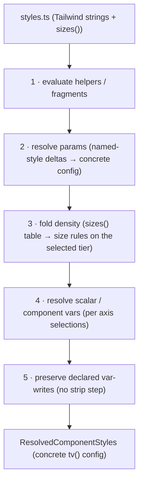

# Styles — authoring, resolution, and the `tv()` emitter

> Part of [The Perfect dotUI (single-engine)](README.md) — an end-state architecture study (2026-07-04). Constitution-conformant.

Styles are the point where dotUI earns or loses its whole promise. The token graph ([05-tokens.md](05-tokens.md)) decides *what colors and dimensions mean*; the axis system ([06-axes.md](06-axes.md)) decides *which knobs a user turns*; but component styles decide whether "a button with a primary variant" renders identically in the live preview and in the exported code — the same file, produced the same way, with nothing in between that could drift.

**Styles are Tailwind.** There is no engine-neutral intermediate: a contributor authors a `tv()`-shaped `styles.ts` with full Tailwind freedom, and the compiler in `@dotui/style` **resolves** it — evaluating helpers, resolving named-style params, folding density, resolving scalar vars, preserving declared var-writes — into a concrete `tv()` config, `ResolvedComponentStyles`, which the `tv()` emitter turns back into an idiomatic shipped `base.tsx`. Preview and export read the same `compile()`; the shipped file is the resolved source, not a translation of it. Because there is exactly one engine, none of the machinery that once existed only to keep a *second* engine renderable — a lifted JSON contract, a closed authoring whitelist, per-node ownership rules, a parallel emitter — is built. What remains is a resolver, an emitter, and one style lint.

```
AUTHORING (Tailwind-native)             RESOLVED (concrete tv() config)          EMITTED (one pure function)
──────────────────────────────         ──────────────────────────────────       ─────────────────────────
styles.ts                              ResolvedComponentStyles                   base.tsx: tv() + utility strings
  defineComponentStyles(meta,{…})        base / slots / variants / compounds     ┌─ codeStyle AST transforms ─┐
  tv-shaped utility strings ─resolve─▶   named-style params → concrete config ─emit─▶ tv({ base, variants, … })
  FULL Tailwind (:has(), peer-*, …)      density folded, scalar vars resolved    └─ flatten-on-export (bg-primary)
  sizes() geometry table                 declared var-writes preserved (N2)          vs bg-(--color-primary)
                                          │
                                          ├──▶ builder preview (createLiveVariants, same resolved config)
                                          ├──▶ /r/<item>?format=styles (agent-native tv() config)
                                          └──▶ DTCG has no styles; the tv() config is the style artifact
```

The whole chapter is one claim: with a single engine, the source of truth *is* Tailwind, and the compiler's job shrinks from "lift into a portable IR and re-render in two engines" to "resolve authoring conveniences into the one config we ship." The two-engine sibling study paid for the lift + parity apparatus because a second renderer needed a neutral contract to render from; here there is no second renderer, so there is no contract, and arbitrary Tailwind is first-class rather than fenced behind a whitelist.

---

## 1. Authoring — Tailwind strings with full freedom

A contributor authoring a component writes exactly what shadcn authors write: a `tv()`-shaped config of Tailwind utility strings. There is no typed style DSL to learn, and the shadcn copy-paste comparison that CLAUDE.md mandates (diff our classes against `apps/v4/registry/...`) stays a plain string diff. The entry point is `defineComponentStyles`:

```ts
// packages/registry/ui/button/styles.ts
import { defineComponentStyles, sizes } from '@dotui/style'
import buttonMeta from './meta'

export const buttonStyles = defineComponentStyles(buttonMeta, {
  base: {
    base: [
      'group/button relative inline-flex shrink-0 cursor-interactive items-center justify-center rounded-(--btn-radius) bg-clip-padding font-(--btn-font-weight) whitespace-nowrap transition-[background-color,border-color,color,box-shadow] select-none',
      'focus-reset focus-visible:focus-ring',
      '**:[svg]:pointer-events-none **:[svg]:shrink-0',
      'pending:cursor-default pending:border-border-disabled pending:bg-disabled pending:text-transparent pending:**:not-data-[slot=spinner]:opacity-0 pending:**:data-[slot=spinner]:text-fg-muted',
      'disabled:cursor-default disabled:border-border-disabled disabled:bg-disabled disabled:text-fg-disabled',
    ],
    variants: {
      variant: {
        default: 'border bg-neutral text-fg-on-neutral hover:border-border-hover hover:bg-neutral-hover pressed:border-border-active pressed:bg-neutral-active',
        primary: 'bg-primary text-fg-on-primary [--color-disabled:var(--neutral-500)] [--color-fg-disabled:var(--neutral-300)] hover:bg-primary-hover disabled:border-0 pending:border-0 pressed:bg-primary-active',
        quiet:   'bg-transparent text-fg hover:bg-inverse/10 pressed:bg-inverse/20',
        link:    'text-fg underline-offset-4 hover:underline',
        warning: 'bg-warning text-fg-on-warning hover:bg-warning-hover pressed:bg-warning-active',
        danger:  'bg-danger text-fg-on-danger hover:bg-danger-hover pressed:bg-danger-active',
      },
      isIconOnly: { true: 'p-0' },
    },
    defaultVariants: { variant: 'default', size: 'md' },
  },
  sizes: sizes({
    // density × size geometry — ONE table, not three hand-authored ladders
    compact:     { xs: { h: 5, px: 2,   radius: 'sm', text: '0.625rem', iconOnly: 5, icon: 2.5, iconPad: 1.5 }, sm: {/*…*/}, md: {/*…*/}, lg: {/*…*/} },
    default:     { xs: { h: 6, px: 2,   text: 'xs',   iconOnly: 6, icon: 3,   iconPad: 1.5 }, sm: {/*…*/}, md: { h: 8, px: 2.5, gap: 1.5, iconOnly: 8, icon: 3.5, iconPad: 2 }, lg: {/*…*/} },
    comfortable: { xs: { h: 7, px: 2.5, text: '0.8125rem', iconOnly: 7, icon: 3.5, iconPad: 1.5 }, sm: {/*…*/}, md: {/*…*/}, lg: {/*…*/} },
  }),
})
```

Everything Tailwind can express is legal here, with no ceiling:

- **`:has()`** — `has-data-icon-end:pr-2`, `has-[>svg]:pl-8`. The root reacts to its own subtree without any restriction, exactly as the real registry authors it.
- **Descendant / `**:` / `*:` selectors** — `**:[svg]:size-4`, `**:data-[slot=spinner]:text-fg-muted`, `*:[kbd]:ml-auto`. A parent styles its icon and kbd descendants directly.
- **`peer-*` and sibling combinators** — `peer-focus:ring`, `peer-checked:bg-primary`. Sibling-driven selection is ordinary Tailwind and ships verbatim.
- **`before:` / `after:` pseudo-elements** — the menu's focus indicator (`focus-visible:before:absolute focus-visible:before:bg-accent`) is authored as-is.
- **Arbitrary selectors and values** — `[&[data-bordered]]:border`, `rounded-[7px]`, `bg-[oklch(0.7_0.15_250)]`, container queries (`@md:grid-cols-2`), forced-colors.
- **Inline CSS-var writes** — `[--color-disabled:var(--neutral-500)]` inside a variant slice, and named-style `vars` blocks (§4, §9).

There is no rewriting of any of this into a portable form and no re-homing of cross-node selectors to an "owning" slot. A `**:[svg]:size-4` on the root stays a `**:[svg]:size-4` on the root, because the file we resolve *is* the file we ship. Nothing forces cross-node authoring to be re-expressible as own-slot declarations, because the one engine evaluates selectors natively — so the constraint simply does not exist.

### 1.1 States are plain Tailwind variants

Interactive states are ordinary Tailwind variants over React Aria's data-attributes and render-prop-driven attrs. There is no state vocabulary to declare and no second binding to keep in sync — the variant prefix *is* the whole story:

| Family | Representative variants |
|---|---|
| CSS pseudo | `hover:` `focus-visible:` `focus-within:` `placeholder-shown:` |
| RAC render / data-attr | `pressed:` `pending:` `disabled:` `selected:` `invalid:` `open:` |
| Relation (`:has()`) | `has-data-icon-start:` `has-data-icon-end:` `data-icon-only:` |
| Context | `in-data-modal:` `in-data-popover:` |
| Descendant | `**:[svg]:` `*:[svg]:` `**:data-[slot=…]:` |
| Merge-order guard | `with-[size]:` `not-with-[size]:` (`tailwindcss-with`) |
| Media / mode | `sm:` `md:` `dark:` forced-colors |

The component's API shape — free-form children read via `:has()` versus explicit `prefix`/`suffix` slot props — is a **component-design choice, not a styling constraint**. Nothing in the style layer forces explicit slots; the idiomatic RAC + `:has()` pattern the real registry already uses is exactly what ships. No styling rule pushes toward explicit slots, because `:has()` evaluates natively — the API is free to be whatever the component's design wants.

### 1.2 The hardcoded-value discipline — the one surviving style lint

The single lint over authored strings is CLAUDE.md's hardcoded-value rule, and it is a **warning with a token hint, not a build gate**. The test is the doc's own prose: *"would two design systems disagree on it?"*

- **Design-meaningful literals** get a warning that names the token to reach for. `bg-[#635bff]` → *"use `bg-primary`; add a semantic token if none fits."* `rounded-[7px]` → *"use `rounded-md` or a `radius` scalar param."* `text-[15px]` → *"use a `font-size` token."* The warning carries a source offset and the suggested utility.
- **Component mechanics stay plain values, always** — `p-0`, `border` (hairline width), `top-1/2`, `-translate-x-1/2`, `shrink-0`, `pointer-events-none`, `overflow-hidden`. No design system disagrees on these; they are internal mechanics, not design decisions, so the lint never flags them (this is exactly CLAUDE.md's "don't tokenize mechanics" rule).

Crucially, this is a **lint over authored strings** — a warning a contributor can read, act on, or justify — **not** a totality gate that blocks the build. There is no closed enum of allowed properties, no "add a family before you can use this look" governance step. A genuinely novel look that needs an exotic gradient or an arbitrary selector is authored directly; if it contains a design literal with a token equivalent, the contributor sees a hint and decides. The lint's job is to keep the source honest, not to make the source portable — portability is not a goal, because there is nothing to be portable *to*.

> **Why this is the whole lint budget.** A closed authoring whitelist only earns its cost when *"lints clean ⇒ renderable somewhere else"* has to be a structural build gate. With a single engine there is no "somewhere else," so the only thing a green lint promises is "no un-tokenized design literal slipped in" — a code-quality nicety, which degrades gracefully to a warning. The ceiling, the governance surface, and the "adding an allowed property family is a product decision" cost all vanish with the whitelist.

### 1.3 Helpers are evaluated

Pure helper calls in `styles.ts` are evaluated in a sandboxed module context at compile time and their results inlined before resolution. `outlineField({ focus: 'group' })`, shared class fragments, and small computed tables are ordinary function calls; the compiler runs them and resolves the *result*, not the call. A purity lint forbids side effects in anything reachable from a `styles.ts`. This is what unlocks **fragment sharing** — Button and ToggleButton import one `interactiveSurface` fragment and stay a sync group with a single source of truth for their shared classes.

### 1.4 `sizes()` is mandatory geometry authoring

`sizes()` renders a `density × size` geometry table into the density × size rules of the config. It is **not optional sugar**: new components author their size geometry through `sizes()`, and an ad-hoc per-density ladder (three hand-written variant blocks) does not pass review. Its keys are the geometry primitives (`h`, `px`, `gap`, `radius`, `text`, `icon`, `iconPad`, `iconOnly`); the resolver folds each row onto the correct slots. Adding a fourth density tier is a data edit — one more row — never a 48-file touch.

---

## 2. `ResolvedComponentStyles` — a concrete `tv()` config

Resolution's output is not a JSON contract to be re-rendered; it is a **normalized, concrete `tv()` config** per sync group — every authoring convenience already erased, ready for the emitter to print. The shape mirrors what `tv()` itself consumes:

```ts
// packages/style/src/resolved.ts
interface ResolvedComponentStyles {
  component: string                     // 'button'
  syncGroup?: string                    // Button ⇄ ToggleButton share one config via one group id
  slots?: string[]                      // ['root','content','icon','spinner'] — undefined for single-slot

  base: ClassList                       // resolved root/base classes
  variants: Record<string, Record<string, SlotClasses>>   // variant → value → classes (per slot)
  compoundVariants: CompoundRule[]      // ≥2 dimension pins, ordered for tv() compound precedence
  defaultVariants: Record<string, string>

  componentVars?: ComponentVarDecl[]    // --btn-radius etc: typed default, optional axis link
  declaredVars?: DeclaredVar[]          // CSS custom properties a variant/named-style WRITES — preserved verbatim
}

type ClassList = string | string[]                          // classArrays codeStyle picks the shape
type SlotClasses = ClassList | Record<string, ClassList>    // per-slot map when the component has slots

interface CompoundRule {
  when: Record<string, string>          // dimension pins (AND) — e.g. { size:'md', iconEnd:'true' }
  slot?: string                         // which slot the classes apply to
  class: ClassList
}

interface ComponentVarDecl {
  name: string                          // '--btn-radius'
  type: 'radius' | 'spacing' | 'font-weight' | 'color' | 'raw-number'
  default: string                       // resolved default: 'var(--radius-md)' or a semantic utility target
  axis?: string                         // links to a builder axis when configurable
}

interface DeclaredVar {
  name: string                          // '--color-disabled'
  value: string                         // 'var(--neutral-500)' — kept verbatim, never stripped
  when?: Record<string, string>         // scoped to a variant value / named-style selection
}
```

Three things about this shape carry the chapter's weight.

**It is `tv()`, not an abstraction over `tv()`.** `base`, `variants`, `compoundVariants`, `defaultVariants` are the exact keys `tailwind-variants` reads. The resolver produces one, the emitter prints one, and the diff between "what dotUI resolved" and "what shadcn hand-authors" is class-order and formatting — nothing structural. There are no rule-ids, no property families, no per-node ownership metadata, because none of that is needed to print a `tv()` file.

**`declaredVars` are first-class and preserved.** A variant that writes `[--color-disabled:var(--neutral-500)]` doesn't lose that write to a normalization pass — it is captured as a `DeclaredVar` and re-emitted verbatim. This is the structural reason the `menu.highlight` export bug is impossible (§5, decision **N2**).

**`componentVars` are the parametric surface, resolved with flatten-on-export.** `--btn-radius` is a component-contract node ([05-tokens.md](05-tokens.md)); at resolution its default is pinned, and at emission the `tv()` printer chooses the semantic utility (`bg-primary`) or the `var()` form per `codeStyle.tokenIndirection` (§6).

### 2.1 Token references

A resolved class may reference two kinds of node, and only two:

- a **component-contract node** — `--btn-radius`, `--btn-font-weight` — the parametric surface of the sync group, generated per group from `defineContract()` in the registry ([05-tokens.md §component contract](05-tokens.md)); or
- a **semantic node** — `primary-hover`, `neutral`, `fg-on-primary` — the user-space vocabulary (~76 shipped defaults).

A class may never reach past semantic into a raw ramp step. `[--color-disabled:var(--neutral-500)]` in the button source is the one apparent exception, and it is not a decl reference at all — it is a **declared var-write**, a component-contract node being pointed at a primitive *by the author*, which is exactly what the parametric surface is for. Because there is no lift pass to launder it through, it survives to the shipped file untouched.

---

## 3. Style resolution — five stages

`resolve()`'s style phase turns the authored `styles.ts` into `ResolvedComponentStyles`. It is deterministic and runs isomorphically: at `pnpm build:registry`, and incrementally in the builder worker one component at a time. Five stages, in order.



### 3.1 Evaluate pure helpers / fragments

ts-morph reads the `defineComponentStyles` config. Pure helper calls are evaluated in a sandbox and inlined (§1.3); shared fragments across a sync group are inlined once. The output is a config of literal strings and literal geometry tables — no function calls remain. Fragment sharing is what keeps Button and ToggleButton a single source of truth.

### 3.2 Resolve `params` — named-style deltas → a concrete config

Enum-param values (`input.style = outline | line | filled`, `menu.highlight = subtle | accent`) are *authored* as DRY delta layers over base — today's ergonomics, preserved. But the user's selection resolves to a **complete config** before anything downstream reads it: the delta layer for the selected value is merged into base/slots/variants, and no delta layers remain. Forking, diffing, LLM generation, and export all operate on complete configs; the delta is an authoring convenience the resolver erases. A user's `components` delta in the dsdoc ([09-dsdoc.md](09-dsdoc.md)) — stored as raw Tailwind class-string deltas over named-style params (decision **N3**) — is applied here too, appended to the class lists with `tailwind-merge` ordering. Because overrides are raw class strings and there is no edit-time totality check, a user may paste arbitrary Tailwind and it flows straight through.

### 3.3 Fold density

The `sizes()` table's `density × size` cells fold into size rules. With `codeStyle.density: 'baked'` (default), only the selected tier's rows land in the config — each `{ size }` row becomes `variants.size.<value>` classes on the correct slots (`h`/`px`/`gap`/`radius`/`text`/`iconPad`/`iconOnly` on root, `icon` on the icon slot), and the other two tiers drop. With `codeStyle.density: 'runtime'`, density ships as a `data-density` attribute axis so the consumer can switch tiers in their own app. Either way the builder previews the selected tier; only the export shape differs (§6).

### 3.4 Resolve scalar / component vars

`--btn-radius`, the radius factor, `--btn-font-weight`, and other component vars resolve per the user's axis selections. This is where `tokenIndirection` is decided per node: when a component-contract node still points at its default target, `'flatten'` (default) will let the emitter print the semantic utility (`bg-primary`); `'preserve'` marks it for the `var()` form so a consumer can retarget it in their own repo. Retargeted nodes always emit the `var()` form so the retarget stays live.

### 3.5 Preserve declared var-writes — the no-strip stage

Named-style `vars` blocks and inline `[--x:var(--y)]` writes are carried into the resolved config as `DeclaredVar` entries, scoped to the variant value or named-style selection that wrote them. **There is no strip step.** This stage does not clean anything up — it *records* the writes so the emitter re-prints them. This is the structural reason the old `menu.highlight` export bug cannot recur (§5): a var-write that is never stripped cannot go missing at publish. The "resolved output contains every declared var-write and scalar the source referenced" invariant ([13-testing.md](13-testing.md)) guards exactly this stage.

The output is `ResolvedComponentStyles`: one concrete `tv()` config per sync group, ready to print.

---

## 4. Named-style params, in full

The `params` block is how a component ships curated named looks — the 20% of styles that cover 80% of design systems. Each param is an enum axis; each value is a delta layer over base. Resolution (§3.2) turns the user's selection into a complete config, but it is worth seeing what a value can contain, because it is the same authoring surface as base — arbitrary Tailwind plus var-writes:

```ts
params: {
  highlight: {
    subtle: {
      slots: { item: 'overflow-hidden focus-visible:before:absolute focus-visible:before:inset-y-0 focus-visible:before:left-0 focus-visible:before:w-0.5 focus-visible:before:rounded-[inherit] focus-visible:before:bg-accent' },
      vars: { '--color-highlight': 'var(--neutral-300)', '--color-fg-on-highlight': 'var(--on-neutral-300)' },
    },
    accent: {
      vars: { '--color-highlight': 'var(--accent-500)', '--color-fg-on-highlight': 'var(--on-accent-500)' },
    },
  },
},
```

A named-style value carries two kinds of payload, both first-class:

- **`slots` class deltas** — appended to the named slots' class lists at resolution. Full Tailwind: the `subtle` highlight uses `before:` pseudo-elements and `:has()`-adjacent focus selectors directly.
- **`vars` blocks** — CSS custom-property writes that become `DeclaredVar` entries scoped to `{ namedStyle: { highlight: 'subtle' } }`. They are preserved verbatim (§3.5), never stripped.

When the user selects `highlight: accent`, resolution merges the `accent` delta into the menu's config and produces a complete `tv()` config in which the `accent` var-writes are present. There are no delta layers left for any downstream consumer to mishandle. Because component overrides are raw class-string deltas over these same named-style params (decision **N3**), a user retargeting `highlight` in their dsdoc simply appends a class string here, funneled through the same resolution.

---

## 5. Declared var-writes and why the `menu.highlight` bug is structurally impossible

The old failure (decision **N2**): `menu.highlight`'s enum values carried `vars` (CSS custom properties), which the publisher stripped before serializing the `tv()` config. The preview read the vars (the runtime provider wrote them to `:root`); the export did not (they never reached the shipped file). So `menu.highlight = accent` previewed as an accent highlight and *exported* as the default. The preview-equals-export promise broke, silently.

Here is the same authored source, from [`www/src/registry/ui/menu/styles.ts`](../../../www/src/registry/ui/menu/styles.ts):

```ts
params: {
  highlight: {
    subtle: {
      slots: { item: '… focus-visible:before:bg-accent' },
      vars: { '--color-highlight': 'var(--neutral-300)', '--color-fg-on-highlight': 'var(--on-neutral-300)' },
    },
    accent: {
      vars: { '--color-highlight': 'var(--accent-500)', '--color-fg-on-highlight': 'var(--on-accent-500)' },
    },
  },
},
```

Stage 5 of resolution (§3.5) records each `vars` block as a `DeclaredVar` scoped to its named-style value:

```ts
declaredVars: [
  { name: '--color-highlight',       value: 'var(--neutral-300)',  when: { highlight: 'subtle' } },
  { name: '--color-fg-on-highlight', value: 'var(--on-neutral-300)', when: { highlight: 'subtle' } },
  { name: '--color-highlight',       value: 'var(--accent-500)',   when: { highlight: 'accent' } },
  { name: '--color-fg-on-highlight', value: 'var(--on-accent-500)', when: { highlight: 'accent' } },
]
```

When the user selects `highlight: accent`, resolution produces a complete config whose `declaredVars` include the two `accent` writes; the emitter prints them onto the `item` slot's class list as `[--color-highlight:var(--accent-500)] [--color-fg-on-highlight:var(--on-accent-500)]`. **There is no publish step that could strip them, because there is no publish step that transforms them at all** — resolution *records* var-writes and emission *re-prints* them, and neither has a "clean up the vars" pass. The old bug is not fixed by care; it is made unrepresentable. The "resolved output includes every referenced var" invariant ([13-testing.md](13-testing.md)) is the regression fence, but the design is what makes the fence trivially green.

---

## 6. The `tv()` emitter and flatten-on-export

There is one emitter. It is a pure function of `ResolvedComponentStyles` and `codeStyle` — it never reads `styles.ts`, and there is no second emitter for it to stay in step with.

```ts
// packages/style/src/emit.ts
function emit(resolved: ResolvedComponentStyles, codeStyle: CodeStyle): RegistryFile[]
```

Because the resolved config is *already* a `tv()` config, emission is close to a pretty-print: it groups `base` / `variants` / `compoundVariants` / `defaultVariants` into a `tv({...})` call, prints each class list in the chosen shape, renders `componentVars` and `declaredVars`, and applies `codeStyle` (§7). A Tailwind user sees a file **byte-comparable to hand-authored shadcn output**, because there is no round-trip through a foreign representation to reconstruct — the source was Tailwind and so is the output.

**Flatten-on-export** is the one emission-time decision worth calling out — `codeStyle.tokenIndirection`:

- `'flatten'` (default) — when a component-contract node still points at its default target, print the idiomatic semantic utility: `bg-primary`, not `bg-(--color-primary)`. Reads like hand-written shadcn.
- `'preserve'` — print the `var()` form for every reference, for consumers who want to retarget tokens in their own repo.

A node the user has *retargeted* in their dsdoc always emits the `var()` form regardless, so the retarget is live. This is per-node, decided from the resolved `componentVars` and the token graph — the emitter asks "does this node still point at its default?" and picks the shape.

---

## 7. `codeStyle` — AST transforms over the `tv()` output

`codeStyle` is a dsdoc section ([09-dsdoc.md](09-dsdoc.md)); its style transforms run over the emitter's typed `tv()` AST, never as regex over strings and never against hand-maintained `// MARK:` anchors — section boundaries derive from the `tv()` structure (base / slots / variants / compounds). Every transform is AST-equivalent modulo formatting, a CI invariant ([13-testing.md](13-testing.md)).

```ts
interface CodeStyle {
  format: { printWidth: number; semicolons: boolean; quotes: 'single'|'double'; trailingComma: 'none'|'es5'|'all' }
  functions: 'arrow' | 'declaration'                // operates on the wrapper AST
  tv: { classArrays: boolean; oneLinePerVariant: boolean }
  comments: { sectionSeparators: boolean; density: 'none'|'terse'|'full' }
  imports: { style: 'namespace'|'named'; sortOrder: 'source'|'alpha'; groupBlankLines: boolean }
  layout: { styleLocation: 'inline'|'sidecar'; barrelExports: boolean }
  tokenIndirection: 'flatten' | 'preserve'          // §6
  density: 'baked' | 'runtime'                       // §3.3
}
```

Every option here shapes the one `tv()` output; there is no parallel set governing some other target's code. Adding a code-style axis is one emitter branch; it cannot desync from source because the source is one AST and the transform is proven equivalent to it.

---

## 8. Worked example — Button, end to end

The fixture is the real button. Authored input is §1's `styles.ts`; the un-abbreviated source is [`www/src/registry/ui/button/styles.ts`](../../../www/src/registry/ui/button/styles.ts). Here is the full pipeline, resolved and emitted with one engine only.

### 8.1 Authored (the real strings, condensed)

The `base.base` string, the six `variant` values, and the `sizes()` table from §1. The real `default`-density `md` size row is `h-8 gap-1.5 px-2.5 has-data-icon-end:pr-2 has-data-icon-start:pl-2 data-icon-only:size-8 **:[svg]:not-with-[size]:size-3.5` — arbitrary `:has()`, descendant, and merge-order-guard selectors, authored verbatim.

### 8.2 Resolved config (slice, `density=default` baked)

`resolve()` evaluates helpers, resolves the (empty here) `params`, folds the `default` density tier into the `size` variant, resolves `--btn-radius`/`--btn-font-weight`, and records the primary variant's two var-writes. Cross-node selectors are **unchanged** — there is nothing to re-home:

```ts
{
  component: 'button',
  syncGroup: 'button-like',
  componentVars: [
    { name: '--btn-radius', type: 'radius', default: 'var(--radius-md)', axis: 'radius' },
    { name: '--btn-font-weight', type: 'raw-number', default: 'var(--font-weight-medium)' },
  ],
  defaultVariants: { variant: 'default', size: 'md' },
  base: [
    'group/button relative inline-flex shrink-0 cursor-interactive items-center justify-center rounded-(--btn-radius) bg-clip-padding font-(--btn-font-weight) whitespace-nowrap transition-[background-color,border-color,color,box-shadow] select-none',
    'focus-reset focus-visible:focus-ring',
    '**:[svg]:pointer-events-none **:[svg]:shrink-0',
    'pending:cursor-default pending:border-border-disabled pending:bg-disabled pending:text-transparent pending:**:not-data-[slot=spinner]:opacity-0 pending:**:data-[slot=spinner]:text-fg-muted',
    'disabled:cursor-default disabled:border-border-disabled disabled:bg-disabled disabled:text-fg-disabled',
    'text-sm *:[svg]:not-with-[size]:size-4',       // ← folded from the default density tier's base
  ],
  variants: {
    variant: {
      default: 'border bg-neutral text-fg-on-neutral hover:border-border-hover hover:bg-neutral-hover pressed:border-border-active pressed:bg-neutral-active',
      primary: 'bg-primary text-fg-on-primary [--color-disabled:var(--neutral-500)] [--color-fg-disabled:var(--neutral-300)] hover:bg-primary-hover disabled:border-0 pending:border-0 pressed:bg-primary-active',
      quiet:   'bg-transparent text-fg hover:bg-inverse/10 pressed:bg-inverse/20',
      link:    'text-fg underline-offset-4 hover:underline',
      warning: 'bg-warning text-fg-on-warning hover:bg-warning-hover pressed:bg-warning-active',
      danger:  'bg-danger text-fg-on-danger hover:bg-danger-hover pressed:bg-danger-active',
    },
    size: {
      // ← folded from sizes() default tier only; compact/comfortable dropped (density: 'baked')
      xs: 'h-6 gap-1 px-2 text-xs has-data-icon-end:pr-1.5 has-data-icon-start:pl-1.5 data-icon-only:size-6 **:[svg]:not-with-[size]:size-3',
      sm: 'h-7 gap-1 px-2.5 text-[0.8125rem] has-data-icon-end:pr-1.5 has-data-icon-start:pl-1.5 data-icon-only:size-7 **:[svg]:not-with-[size]:size-3.5',
      md: 'h-8 gap-1.5 px-2.5 has-data-icon-end:pr-2 has-data-icon-start:pl-2 data-icon-only:size-8 **:[svg]:not-with-[size]:size-3.5',
      lg: 'h-9 gap-1.5 px-2.5 has-data-icon-end:pr-2 has-data-icon-start:pl-2 data-icon-only:size-9 **:[svg]:not-with-[size]:size-4',
    },
    isIconOnly: { true: 'p-0' },
  },
  declaredVars: [
    { name: '--color-disabled',    value: 'var(--neutral-500)', when: { variant: 'primary' } },
    { name: '--color-fg-disabled', value: 'var(--neutral-300)', when: { variant: 'primary' } },
  ],
}
```

Watch what resolution *did not* do. `has-data-icon-end:pr-2` is still an idiomatic `:has()` variant on the root — no re-homing to an "owning slot," because the file we ship is the file we resolve. `**:[svg]:not-with-[size]:size-3.5` is still a descendant selector with a merge-order guard, authored and emitted as-is. `pending:**:not-data-[slot=spinner]:opacity-0` is still one compact descendant idiom, not an expanded per-slot rule table. The only structural changes are the ones the user asked for: the `default` density tier folded into `size` (and the other two dropped), and the primary variant's var-writes recorded so they survive to export.

### 8.3 Emitted `tv()` (`density=default` baked, `tokenIndirection:'flatten'`, `tv.classArrays:true`)

Byte-comparable to the hand-authored file, because the source and the output are the same engine:

```ts
import { tv } from 'tailwind-variants'

const buttonVariants = tv({
  base: [
    'group/button relative inline-flex shrink-0 cursor-interactive items-center justify-center rounded-(--btn-radius) bg-clip-padding font-(--btn-font-weight) whitespace-nowrap transition-[background-color,border-color,color,box-shadow] select-none',
    'focus-reset focus-visible:focus-ring',
    '**:[svg]:pointer-events-none **:[svg]:shrink-0',
    'pending:cursor-default pending:border-border-disabled pending:bg-disabled pending:text-transparent pending:**:not-data-[slot=spinner]:opacity-0 pending:**:data-[slot=spinner]:text-fg-muted',
    'disabled:cursor-default disabled:border-border-disabled disabled:bg-disabled disabled:text-fg-disabled',
    'text-sm *:[svg]:not-with-[size]:size-4',
  ],
  variants: {
    variant: {
      default: 'border bg-neutral text-fg-on-neutral hover:border-border-hover hover:bg-neutral-hover pressed:border-border-active pressed:bg-neutral-active',
      primary: 'bg-primary text-fg-on-primary [--color-disabled:var(--neutral-500)] [--color-fg-disabled:var(--neutral-300)] hover:bg-primary-hover disabled:border-0 pending:border-0 pressed:bg-primary-active',
      quiet:   'bg-transparent text-fg hover:bg-inverse/10 pressed:bg-inverse/20',
      link:    'text-fg underline-offset-4 hover:underline',
      warning: 'bg-warning text-fg-on-warning hover:bg-warning-hover pressed:bg-warning-active',
      danger:  'bg-danger text-fg-on-danger hover:bg-danger-hover pressed:bg-danger-active',
    },
    size: {
      xs: 'h-6 gap-1 px-2 text-xs has-data-icon-end:pr-1.5 has-data-icon-start:pl-1.5 data-icon-only:size-6 **:[svg]:not-with-[size]:size-3',
      sm: 'h-7 gap-1 px-2.5 text-[0.8125rem] has-data-icon-end:pr-1.5 has-data-icon-start:pl-1.5 data-icon-only:size-7 **:[svg]:not-with-[size]:size-3.5',
      md: 'h-8 gap-1.5 px-2.5 has-data-icon-end:pr-2 has-data-icon-start:pl-2 data-icon-only:size-8 **:[svg]:not-with-[size]:size-3.5',
      lg: 'h-9 gap-1.5 px-2.5 has-data-icon-end:pr-2 has-data-icon-start:pl-2 data-icon-only:size-9 **:[svg]:not-with-[size]:size-4',
    },
    isIconOnly: { true: 'p-0' },
  },
  defaultVariants: { variant: 'default', size: 'md' },
})
```

Note `bg-primary`, not `bg-(--color-primary)` — that is `tokenIndirection:'flatten'` recognizing the `primary` node still points at its default. Note the `size` variant carries only the `default`-density row — that is `density:'baked'` folding the selected tier into classes and dropping the other two. And note the primary variant re-emits `[--color-disabled:var(--neutral-500)]` and `[--color-fg-disabled:var(--neutral-300)]` inline — the declared var-writes, preserved (§5). The shadcn-diff workflow CLAUDE.md mandates is a literal string diff between this file and `apps/v4/registry/...`, with zero compiler in between.

### 8.4 The wrapper

One neutral component template sits above the style call — RAC behavior, slot elements with `data-slot` attributes, spinner injection, `composeRenderProps`. The style seam is a single `className={buttonVariants({ variant, size, isIconOnly })}` call, and the wrapper's own `codeStyle` (arrow vs declaration, imports, layout) applies to it directly. There is no second call shape to reconcile, and the `:has()` / descendant selectors in the `tv()` config do their own work at runtime — no render-time boolean scans the children.

---

## 9. Mini-example — `menu.highlight` var preservation

The `menu.highlight` param is the clearest demonstration of §5 in a single, small config. Its `accent` value is *only* var-writes — no class delta at all:

```ts
accent: {
  vars: { '--color-highlight': 'var(--accent-500)', '--color-fg-on-highlight': 'var(--on-accent-500)' },
},
```

If var-writes were a side channel that a publish step cleaned off the `tv()` config, `highlight: accent` would resolve to *nothing* — an empty delta — and export as the default `subtle` look while previewing as accent. That is exactly the old bug. Here, resolution records the two writes as `DeclaredVar` entries `when: { highlight: 'accent' }` (§3.5), and when the user selects `accent`, the emitter prints them onto the item slot:

```ts
// emitted menu item slot, highlight=accent
item: '… [--color-highlight:var(--accent-500)] [--color-fg-on-highlight:var(--on-accent-500)]',
```

The `focus:bg-highlight focus:text-fg-on-highlight` classes already on the item slot then resolve `--color-highlight` to `var(--accent-500)` at runtime — in the preview and in the exported file identically, because the exported file *contains the var-write*. The var-write is not a thing that can be forgotten, because nothing in the pipeline is empowered to forget it: resolution has no strip pass, emission has no strip pass. Preview equals export by construction, and the "resolved output includes every referenced var" invariant is the standing proof.

---

## 10. Where this chapter connects

- The `token` / `semantic` / `componentVar` values a class may reference, and the `pairsWith` verification of the pairs a component actually renders, are the **Dimensional Token Graph** — [05-tokens.md](05-tokens.md).
- The variants a config exposes become configurable knobs through the **axis system** — [06-axes.md](06-axes.md); component axes are synthesized from the config's variants but *curated* (no auto-axis for internal mechanics vars).
- **Density** as a first-class dimension, `sizes()` geometry, and shadcn `style-{mira,nova,vega}` parity — [08-density-sizing.md](08-density-sizing.md).
- User `components` deltas (raw class strings), `codeStyle`, and `lock` — [09-dsdoc.md](09-dsdoc.md).
- `resolve()` producing the `ResolvedComponentStyles` the emitter consumes, and `compile(resolved, target)` calling the emitter — [11-compiler.md](11-compiler.md).
- `createLiveVariants` and the `DesignScope` preview seam — the single place preview and export code differ, hence the load-bearing fidelity invariant — [10-builder.md](10-builder.md).
- The full canonical invariant list (preview == export byte-compare, live-variants conformance, resolution completeness / no-strip, registry lints) — [13-testing.md](13-testing.md).
- Why styles are Tailwind and resolved not lifted, why component overrides are raw class-string deltas, and why the var-strip bug is fixed by resolution completeness rather than an IR node (**N1**, **N2**, **N3**) — [00-decision-log.md](00-decision-log.md).
