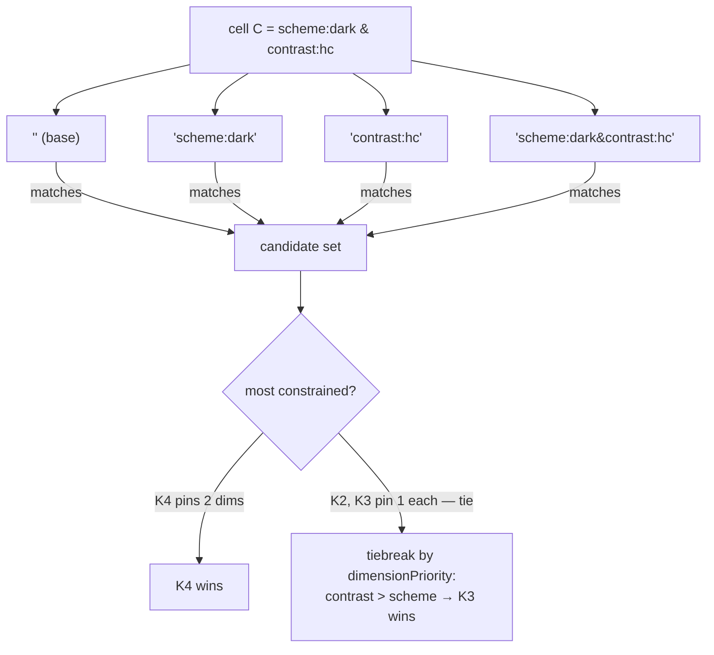

# The Dimensional Token Graph — tokens, modes, generation, contrast
> Part of [The Perfect dotUI (single-engine)](README.md) — an end-state architecture study (2026-07-04). Constitution-conformant.

Every color, radius, shadow, duration, and font in a dotUI design system is a node in one graph. Not three representations kept in sync — one **Dimensional Token Graph** (`TokenGraph`) from which every CSS custom property, every DTCG file, every contrast report, and every live-preview patch is a pure emission. The [resolver](11-compiler.md) merges the pinned manifest's baseline graph with the [dsdoc](09-dsdoc.md)'s overlay, materializes ramps through producers, and hands a symbolic `ResolvedGraph` to the [style emitters](04-styles.md). Nothing in the pipeline re-derives a value from CSS text.

This chapter specifies the graph: its node model, its three layers as edge rules, the component-contract layer generated per [sync group](06-axes.md), mode dimensions and the resolution algorithm, the producer registry, the edit invariants, verification, and emission to both serializer backends — CSS custom properties and DTCG. The worked fixtures are the real [Button](04-styles.md) and Menu from the registry.

---

## 1. The node model

A token is a **node** keyed by a **permanent readable id** and carrying a `values` map across the mode cube. Here is the full schema (`@dotui/tokens`, `TokenGraph.version: 3`):

```ts
type NodeId = string        // permanent readable id: 'color-primary', 'btn-bg-primary', 'p:neutral-500'
type Name   = string        // renamable display/emission handle; initialized = id (§1.3)
type CellKey = string       // '' | 'scheme:dark' | 'scheme:dark&contrast:hc' (§4), canonicalized
type DimensionId = string
type OptionId = string

type TokenType =
  | 'color' | 'dimension' | 'number' | 'fontFamily' | 'fontWeight'
  | 'duration' | 'cubicBezier' | 'shadow' | 'cursor' | 'blur' | 'opacity'

type NodeValue =
  | { kind: 'ref';   to: NodeId }                              // → another node
  | { kind: 'on';    of: NodeId }                              // autocontrast fg of a node
  | { kind: 'literal'; type: TokenType; value: string }
  | { kind: 'mix';   space: 'oklab'|'oklch'|'srgb'; stops: [NodeValue, number, NodeValue] }
  | { kind: 'alpha'; of: NodeId; amount: number }              // bg-inverse/10 → amount 0.1
  | { kind: 'calc';  expr: CalcExpr }                          // radius factor, type scale

type CalcExpr =
  | { op: 'ref'; to: NodeId }
  | { op: 'lit'; value: number; unit?: string }
  | { op: 'mul' | 'add' | 'sub' | 'div'; args: [CalcExpr, CalcExpr] }

interface BaseNode {
  id: NodeId
  name: Name                               // drives emitted var name; renamable (§1.3)
  type: TokenType
  layer: 'primitive' | 'semantic' | 'component'
  description?: string
  deprecated?: boolean                     // soft-delete: still resolves + emits, hidden from pickers
  aliasOf?: NodeId                          // deprecation alias: this id emits, forwards to another (§1.3)
  /** Values across the mode cube, keyed by partial cell selector (§4). '' is required. */
  values: Record<CellKey, NodeValue>
}

interface PrimitiveNode extends BaseNode {
  layer: 'primitive'
  ramp?: { rampId: string; step: string }  // set iff producer-owned; absent for free primitives
}

interface SemanticNode extends BaseNode {
  layer: 'semantic'
  category: 'background' | 'foreground' | 'border' | 'ring'
           | 'shadow' | 'space' | 'radius' | 'type' | 'motion'
  pool?: string[]                          // picker constraint: allowed ramps ('*' = any)
  pairsWith?: NodeId                       // optional declared contrast pair (fg node → its bg)
}

interface ComponentNode extends BaseNode {
  layer: 'component'
  owner: string                            // sync group: 'button-like' owns button ⇄ toggle-button
  role: 'surface' | 'on' | 'line' | 'ring' | 'text' | 'scalar'
  pairsWith?: NodeId                       // STRUCTURAL: on-role node → its surface node (§3, §8)
  system: true                             // dotUI-curated; users retarget, never delete (§3)
}

interface TokenGraph {
  version: 3
  dimensions: ModeDimension[]              // §4
  dimensionPriority: DimensionId[]         // specificity tiebreak, declared once
  ramps: Record<string, RampSpec>          // §6 — generators, not output
  nodes: Record<NodeId, PrimitiveNode | SemanticNode | ComponentNode>
}
```

### 1.1 Value kinds, worked

Every visual value in the shipped system is one of six kinds. Real examples from the baseline vocabulary:

| Node | Value | Kind |
|---|---|---|
| `color-primary` | `{ kind: 'ref', to: 'p:neutral-950' }` | `ref` — an alias down a layer |
| `color-fg-on-primary` | `{ kind: 'on', of: 'color-primary' }` | `on` — the producer's readable foreground for that surface |
| `p:neutral-500` | `{ kind: 'literal', type: 'color', value: 'oklch(0.556 0 0)' }` | `literal` — a materialized ramp step |
| `color-shine` overlay | `{ kind: 'mix', space: 'oklab', stops: [{kind:'ref',to:'color-fg'}, 0.15, {kind:'literal',type:'color',value:'transparent'}] }` | `mix` — the shadow-shine composite |
| button quiet hover | `{ kind: 'alpha', of: 'color-inverse', amount: 0.1 }` | `alpha` — `bg-inverse/10` |
| `radius-md` | `{ kind: 'calc', expr: { op:'mul', args:[{op:'lit',value:0.375,unit:'rem'},{op:'ref',to:'radius-factor'}] } }` | `calc` — `calc(0.375rem * var(--radius-factor))` |

`ref`, `on`, `alpha`, `mix`, and `calc` operands resolve **in the same cell** as the node that holds them. Resolving `color-fg-on-primary` in `scheme:dark` reads `color-primary`'s dark value first, then computes the on-color against that — the foreground tracks the surface automatically, cell by cell.

### 1.2 Three layers as edge rules

The `layer` field is not documentation — it is a **directed edge constraint checked on every edit** (§7):

- a **primitive** may reference only primitives;
- a **semantic** may reference primitives or semantics;
- a **component** may reference semantics or components — **never primitives**.

Each arrow crosses at most one boundary. This is what makes every change contained: retarget `color-primary` and every component-contract node that follows it moves; nothing below layer 2 knows or cares. It is also why the button's escape hatches vanish. Today the primary variant carries `[--color-disabled:var(--neutral-500)]` and `[--color-fg-disabled:var(--neutral-300)]` — raw palette steps written inline in a component. In the graph those become **contract nodes** (`btn-bg-disabled → color-disabled`, retargetable), because a component may not name `p:neutral-500` directly. The edge rule makes the escape impossible to author, so it can never leak into an export.

The one relaxation, ratified by the constitution, resolves a cross-panel conflict: a **component decl may reference a component-contract node OR a semantic node** — never a primitive. The tokens judge's stricter "only layer-3" prose is overruled; a slice like `bg-primary` in a variant string references the semantic `color-primary` directly, and [style resolution](04-styles.md) records that as a token reference the emitter later flattens or preserves (`codeStyle.tokenIndirection`).

### 1.3 Permanent ids, renamable names, deprecation aliases

**Ids are permanent readable handles**, minted once from the node's initial slug: `color-primary`, `btn-bg-primary`, `p:neutral-500`. They are human-diffable in a stored dsdoc and they never change — the constitution rejects opaque ULIDs precisely so a two-year-old document reads like English. The guarantee is discipline, not opacity: a registry lint (`dotui/id-permanence`) fails any change that alters an existing id.

A separate **`name`** field drives the emitted CSS variable name and the display label, and *is* renamable. It initializes equal to the id. **References always use ids**, so renaming `name` touches exactly one field and zero edges. When a user renames `color-neutral` to `color-surface`, the graph is untouched except that one `name`; the next export emits `--color-surface` instead of `--color-neutral`, and — because a re-export of a long-lived consumer repo would otherwise silently break every `bg-neutral` utility — the emitter ships a **deprecation alias** for one major version:

```css
--color-surface: var(--neutral-200);
--color-neutral: var(--color-surface);   /* deprecation alias, one major version */
```

The alias is a node with `aliasOf: 'color-surface'` carrying the old name; it emits, forwards, and is hidden from pickers — a consumer repo that never wants name churn keeps compiling against the alias for the full deprecation window.

### Tradeoffs

- **One graph is heavier than a flat `ColorConfig` + a hardcoded vocabulary.** A real system is ~200–400 nodes. The [builder](10-builder.md) carries the entire burden of making a DAG feel like "pick two seeds"; a naive node-list UI would drown a casual user. The graph earns its weight only because the builder never exposes it raw.
- **Symbolic references mean deep `var()` chains** (`component → semantic → primitive → calc`). Debugging a color is a multi-hop lookup, and pathological hand-built graphs can approach browser var-resolution depth limits. Optional export-time flattening (`tokenIndirection: 'flatten'`) collapses the chain where a node still points at its default target.
- **The single source of truth concentrates risk.** A bug in `resolve()` hits the CSS variables, DTCG, preview, and verification at once. What used to require reconciling separate emitters becomes a set of invariants on one heavily-exercised path (constitution §10; [testing chapter](13-testing.md)).

---

## 2. The baseline: the 76-token vocabulary as graph

The shipped manifest's baseline graph reproduces the full 76-token semantic vocabulary exactly, node for node, with nothing lost and the old ramp-reversal compromises cured.

**Ramps → primitives.** Six `RampSpec`s (`neutral`, `accent`, `success`, `warning`, `danger`, `info`), each with the `oklch` producer, materialize `p:<ramp>-<step>` primitive nodes for steps `50..950`. Crucially these are **genuinely per-cell**: `p:neutral-50` is `oklch(0.985 0 0)` in the base cell and `oklch(0.145 0 0)` under `scheme:dark` — a producer-generated dark, *not* step 950's light value mirrored. Ramp reversal does not exist anywhere in the perfect dotUI.

**Semantic layer → 76 `SemanticNode`s.** The `DEFAULT_SEMANTICS` map becomes nodes, one per `--color-*`:

```jsonc
"color-neutral":       { "category":"background", "pool":["neutral","*"],
                         "values": { "": { "kind":"ref", "to":"p:neutral-200" } } },
"color-primary":       { "category":"background", "pool":["neutral","accent","*"],
                         "values": { "":            { "kind":"ref", "to":"p:neutral-950" },
                                     "scheme:dark":  { "kind":"ref", "to":"p:neutral-50" } } },
"color-fg-on-primary": { "category":"foreground",
                         "values": { "": { "kind":"on", "of":"color-primary" } } },
"color-fg-muted":      { "category":"foreground",
                         "values": { "":            { "kind":"ref", "to":"p:neutral-600" },
                                     "scheme:dark":  { "kind":"ref", "to":"p:neutral-400" } } },
"color-border":        { "category":"border",
                         "values": { "":            { "kind":"ref", "to":"p:neutral-300" },
                                     "contrast:hc":  { "kind":"ref", "to":"p:neutral-500" } } }
```

`color-fg-muted` is the token that today carries a documented compromise — under ramp reversal, one primitive step cannot hit the right muted tone in both schemes, so `neutral-600` is "slightly brighter muted text in dark." In the graph it carries an **honest per-cell value**: `p:neutral-600` in base, `p:neutral-400` in dark, each generated for its own scheme. The compromise is gone because the representation can express the truth.

`color-border` needs a contrast bump and nothing scheme-specific: **one** `contrast:hc` key raises it in *every* scheme at once, because it targets `p:neutral-500` of whichever cell's ramp is in play (§4).

The baseline also holds the non-color families as nodes: `radius-factor` (a free primitive), the eight `radius-*` `calc` nodes, `cursor-interactive`/`cursor-disabled`, `font-sans`/`font-mono`, `chart-1..5`, `ease-fluid-out`, plus the elevation, motion, spacing, type-scale, and border-width families that today are dead `--ds-*` stubs and here are real semantic nodes wired to real [axes](06-axes.md).

---

## 3. The component-contract layer

Layer 3 is the component-facing vocabulary — and it is **system-owned**. Users retarget contract nodes; they never delete or rename them. This is the discipline that makes the entire vocabulary above (layers 1–2) fully user-editable: the only names a component depends on are contract nodes, which are curated and versioned with the registry. A user can rename `color-neutral`, delete a semantic token, add a whole `brand` dimension — and no component breaks, because no component names anything below layer 3.

**Contracts are generated per sync group, not hand-authored.** A [`styles.ts`](04-styles.md) declares its contract terse, via `defineContract()` / `surface()` / `scalar()`, and the registry build expands it into nodes. Here is the real Button, whose six variants and disabled escape become a contract:

```ts
// button/styles.ts — registry source. owner 'button-like' → toggle-button shares it, synced for free.
const contract = defineContract('button-like', {
  radius:     scalar('dimension', ref('radius-md')),         // → c:btn-radius, role 'scalar'
  fontWeight: scalar('fontWeight', lit('500')),              // → c:btn-font-weight
  variants: {
    default: surface({ bg: ref('color-neutral'), hover: ref('color-neutral-hover'),
                       active: ref('color-neutral-active'), line: ref('color-border-hover') }),
    primary: surface({ bg: ref('color-primary'), hover: ref('color-primary-hover'),
                       active: ref('color-primary-active') }),
    quiet:   surface({ bg: alpha(ref('color-inverse'), 0),   // transparent base
                       hover: alpha(ref('color-inverse'), 0.1),
                       active: alpha(ref('color-inverse'), 0.2) }),
    warning: surface({ bg: ref('color-warning'), hover: ref('color-warning-hover'),
                       active: ref('color-warning-active') }),
    danger:  surface({ bg: ref('color-danger'), hover: ref('color-danger-hover'),
                       active: ref('color-danger-active') }),
  },
  disabled: surface({ bg: ref('color-disabled'), fg: ref('color-fg-disabled') }),
  // the primary variant's raw [--color-disabled:var(--neutral-500)] escape is now a contract retarget:
  perVariant: { primary: { disabledBg: ref('color-neutral-500-as-semantic'),  // via a semantic node
                           disabledFg: ref('color-fg-primary-disabled') } },
})
```

**`surface({ bg })` expands to a family of structurally-linked nodes.** For the `primary` variant it emits:

- `btn-bg-primary` — role `surface`, value `{kind:'ref', to:'color-primary'}`;
- `btn-fg-primary` — role `on`, value `{kind:'on', of:'btn-bg-primary'}`, **`pairsWith: 'btn-bg-primary'`**;
- `btn-bg-primary-hover`, `btn-bg-primary-active` — role `surface`, siblings;
- `btn-line-primary` (when `line:` is given) — role `line`.

The **`pairsWith` edge is structural** — created by `surface()`, not declared by a human. It is the pair the button *actually renders*: a `primary` label sits on a `primary` surface, so those two are checked for contrast in every reachable cell (§8). This is coverage today's on↔step-only reporter cannot see, because today nothing records which foreground renders on which surface.

**`owner: 'button-like'` on every node is the sync mechanism.** `nodesByOwner('button-like')` is the group; Button and ToggleButton consume the identical node set. A change to `btn-bg-primary` is, by construction, a change to both members — the [synced-group invariant](06-axes.md) is enforced in the token graph itself, not by remembering to edit two files.

**Scalars** (`c:btn-radius`, `c:btn-font-weight`) are role `scalar` — the 28 per-component scalar vars of today become contract nodes, and the component's class strings reference them (`rounded-(--btn-radius)`, `font-(--btn-font-weight)`).

**Curated named styles** are role-safe override bundles: `{ retargets: Record<contractId, NodeValue>, slices: TvOverride }`. A dotUI-authored "outline" style retargets `btn-bg-*` at transparent and `btn-line-*` at `color-border` — pointing contract nodes at **semantic** nodes (the edge rule forbids primitives). Because it resolves through *the user's* graph, the same "outline" bundle renders correctly in every design system.

**Contract evolution is the registry ABI.** Adding a contract node is a minor manifest bump (it ships with a sensible default). Renaming or removing one is a major bump with a mechanical migration map applied to stored dsdocs. Because each group's contract is explicit and small, this is tractable — and it is why users cannot mint contract nodes ad hoc (the arbiter's ruling: contract extension is registry-versioned; users retarget, dotUI extends).

### Tradeoffs

- **Generated contracts are an abstraction between the component author and the color.** "Why is this button this color" is now `slice → contract node → semantic → primitive`, a longer trail than a direct `bg-primary`. The [flatten-on-export](04-styles.md) default keeps the *shipped* code direct (`bg-primary`) wherever a node still points at its default, so the indirection lives in the builder, not the user's repo.
- **The system-owned invariant caps user power at layer 3.** A user who wants a genuinely new component slot (a second ring on Button) cannot add one — that is a registry change. The line is deliberate: an unbounded per-component contract surface would reintroduce the ABI-churn problem the layer exists to prevent.

---

## 4. Modes are dimensions

A mode is not an entry in a flat list — it is one **option** along an orthogonal **dimension**. The Cartesian product of dimensions is the mode cube; every node resolves independently per **cell**.

```ts
interface ModeDimension {
  id: DimensionId
  name: string                     // 'scheme', 'contrast', 'brand'
  options: ModeOption[]
  defaultOption: OptionId
  binding:
    | { kind: 'media'; queryFor: Record<OptionId, string> }   // (prefers-color-scheme: dark)
    | { kind: 'class' }                                       // .dark
    | { kind: 'data'; attr: string }                          // [data-brand="acme"]
  /** media-bound dimensions ALSO emit a data-attr override so manual forcing always works */
}

interface ModeOption {
  id: OptionId
  name: string                     // 'light' | 'dark' | 'hc' | 'acme'
  role?: { isDark?: boolean; contrastBoost?: number /* 0..1 → AA..AAA targets */ }
  surface?: NodeId                 // which bg node defines "the surface" for producers + verify
}
```

The default manifest ships **two dimensions**:

- `scheme: [light*, dark]` — `dark` has `role.isDark = true`; binding is `media` (`prefers-color-scheme`) with a `data-scheme` override for manual forcing;
- `contrast: [normal*, hc]` — `hc` has `role.contrastBoost = 1`; binding is `media` (`prefers-contrast: more`) plus a `data-contrast` override.

`dimensionPriority` defaults to `['contrast', 'scheme', 'brand']`.

A Linear-style system edits `scheme` to `[light, dark, midnight]` — one `addOption`. A brand sub-theme is a new `brand` dimension. This is why a flat mode list loses: high-contrast and brand must compose with *every* scheme. A list forces hand-authoring `brand-light`, `brand-dark`, `brand-dark-hc`, `midnight-hc`… Dimensions give `dark·hc` and `acme·midnight·hc` for free from independent deltas, and the verifier proves the composition (§8).

### 4.1 Cell-keyed values and the resolution algorithm

A node's `values` is keyed by **partial cell selectors**: `''` (the base, required on every node), `'scheme:dark'`, `'contrast:hc'`, `'scheme:dark&contrast:hc'`. Keys are canonicalized (dimensions in a fixed order, `&`-joined). To resolve node `T` in a concrete cell `C`:

```
resolve(T, C):
  1. candidates = { key ∈ T.values | every constraint in key is satisfied by C }   // '' always matches
  2. winner = the MOST CONSTRAINED candidate
       (more pinned dimensions wins; e.g. 'scheme:dark&contrast:hc' beats 'scheme:dark')
  3. ties (equal constraint count, different dimensions) broken by dimensionPriority
       (default contrast > scheme > brand): the key pinning the higher-priority dimension wins
  4. operands (ref/on/alpha/mix/calc) resolve recursively IN THE SAME CELL C
```



Authors write the minimum — a base plus overrides only where a cell genuinely diverges. Resolving `color-border` (from §2) in `dark·hc`: only `''` and `contrast:hc` match (there is no `scheme:dark` key on it), `contrast:hc` is most constrained → `p:neutral-500` **of the dark-generated ramp** (primitives are per-cell too, §6). Correct in all four cells from one authored key.

This subsumes an `inherits` chain — an option with no keys for a node simply resolves through less-specific keys — while adding the composition an inherit chain cannot express. A `dim` scheme option that shares dark's values until overridden needs no `scheme:dim` keys at all; it resolves through `''` (and any `scheme:dark`? no — `dim` ≠ `dark`, so through `''` only) until the user adds `scheme:dim` deltas.

### Tradeoffs

- **A second cascade to reason about, on top of CSS's own.** When a node has `scheme:dark`, `contrast:hc`, and `scheme:dark&contrast:hc` keys, the author trusts the priority order; a mis-set `dimensionPriority` silently changes which value wins in composite cells. The builder surfaces the resolved value per cell visually (a cell matrix), so the footgun is inspectable rather than latent.
- **The cube grows multiplicatively.** Four dimensions can mean dozens of reachable cells. The constitution **soft-caps the builder at 4 dimensions / 24 reachable cells** with UI guidance; verification is incremental on edit and full-matrix only at export (§8).

---

## 5. Generation: producers × ramps × cells

A ramp is a **generator declaration** whose config is itself cell-keyed. This is independently-seeded dark, and it deletes the reverse-ramp trick at the root.

```ts
interface RampSpec {
  id: string                       // 'neutral', 'accent', 'brand-secondary' — user-addable
  steps: string[]                  // 50..950, Radix 1..12, Material tones — per-ramp
  producer: {
    id: 'oklch' | 'tailwind' | 'contrast' | 'material' | 'fixed' | string
    config: Record<CellKey, ProducerConfig>   // seeds/knobs per cell, resolved by §4
  }
}

interface Producer<C> {            // open registry, same shape as today's kernel
  id: string
  schema: ZodType<C>
  produce(config: C, ctx: CellCtx): { scale: Record<string,string>; on: Record<string,string> }
}
interface CellCtx {
  cell: Cell; isDark: boolean; contrastBoost: number   // pulled from option roles
  steps: readonly string[]; surface: string            // resolved bg for this cell
}
```

`materializeRamps` runs `producer × cell` for cells whose resolved config differs, upserting one `PrimitiveNode` per `(ramp, step)` with the cell's value under the matching cell key. The result is cached — a producer runs once per changed `(ramp, cell)`.

### 5.1 The five built-in producers

| Producer | What it does differently | Config knobs (real) |
|---|---|---|
| **`oklch`** (default) | Perceptual Evil-Martians lightness anchors, background-independent, **`isDark`-aware**: shifts its lightness anchors when the cell's option carries `role.isDark`, auto-deriving a *real* dark from one seed — never a mirror. | `chromaMult`, `minChroma` (floor 0.11), `hueTorsion`, `chromaMode: consistent\|max`, `preserveSeedAt: <step>` |
| **`tailwind`** | The `oklch` producer with `hueTorsion` defaulted to 24° — the Tailwind-v4 palette torsion. | same as `oklch` |
| **`contrast`** | Per step, **binary-searches OKLCH lightness** (20 iterations) to hit a WCAG2/APCA ratio target against `ctx.surface`. **`contrastBoost` raises those targets toward AAA** — this is how `hc` composes with every scheme: hc is not a separate producer, it is a stronger target inside the same one. | `formula: wcag2\|apca`, `ratios: number[]`, `saturation: 0..100` |
| **`material`** | Seed → HCT via `@material/material-color-utilities`; `TonalPalette.fromHueAndChroma`; tones picked by `ctx.isDark` (`LIGHT_TONES` vs `DARK_TONES`), resampled to the ramp's steps; re-emitted as `oklch()`. First-class Material 3 palettes ([reconstruction](07-reconstructions.md)). | `tones: number[0..100]` |
| **`fixed`** | Hand-authored ramps **per cell**, verbatim (gamut-mapped to in-gamut `oklch()`). This is the **paste-my-palette flow** — the case `resolveColorConfig` rejects today is first-class here: `{ producer:'fixed', config: { '': {50:'#fafafa',…}, 'scheme:dark': {50:'#0a0a0a',…} } }`. | literal `Record<step, color>` per cell |

Beyond these five the registry is **open** — a third-party producer registers an `id`, a Zod `schema`, and a `produce`. `registerBuiltins()` only fills free ids, so a consumer pre-registration wins.

**Per-cell config is the point.** The neutral ramp's dark is not the light ramp reversed — the `oklch` producer runs again for the `scheme:dark` cell with `isDark: true` and emits genuinely dark-appropriate lightnesses. `p:neutral-50` = `oklch(0.985 0 0)` base, `oklch(0.145 0 0)` dark. **Custom steps** are per-ramp: `50..950` (11), Radix `1..12`, Material tones — all legal, because a step is just a key.

**Editing a producer-owned step converts the ramp to `fixed`** (you cannot half-generate, half-hand-edit a ramp). Free primitives like `radius-factor` are always hand-editable. Casual users still get dark for free: the default `oklch` producer's `isDark` path derives a good dark from the single seed; a second dark seed under `scheme:dark` config is an opt-in refinement, never a requirement.

### 5.2 On-colors

Every producer ends by computing `on` colors per step: the readable foreground for that step's surface. The default strategy in the shipped path is `onBlackWhite` (pure black/white by WCAG relative luminance), locked in parity with the exported `tailwindcss-autocontrast` plugin so **preview equals the shadcn-added output**. The kernel's richer hue-tinted `onColor` (with honest `meetsFloor`) is available as a producer option for systems that want tinted foregrounds.

### Tradeoffs

- **Independently-seeded dark is more work than reverse-ramp.** Reverse-ramp gives a usable dark from one seed instantly; a *great* dark may want a second seed and per-cell knob tuning. The default `isDark`-aware `oklch` producer ships a strong auto-dark so casual users aren't forced to seed every cell — the flexibility is opt-in, not a tax.
- **Every producer must behave for arbitrary polarity and surface.** A third-party producer that only handles light could silently degrade dark/dim. The producer contract requires `isDark`/`contrastBoost` handling, and the verifier (§8) catches a producer that ships an illegible cell.
- **Producer math runs at compile time, in JS.** The oklch/contrast generation happens in `resolve()`, not in the shipped CSS. A consumer who wants to re-seed a ramp re-runs it through dotUI (or the CSS-var preview, which regenerates live — §9); the shipped stylesheet carries materialized values, not the recipe. This is inherent to any generated-palette system and is not an engine artifact.

---

## 6. Resolution and emission: one resolver, two serializer backends

`resolve(graph)` is one topological sweep producing a symbolic `ResolvedGraph` in which **references stay symbolic**. The CSS backend wants `var(--color-bg)`; the DTCG backend wants a `{alias}`; both are "reference to node X," serialized differently. No backend re-derives anything from CSS text.

```ts
interface ResolvedGraph {
  order: NodeId[]                                       // topo, by layer then deps
  byCell: Record<CellKey, Map<NodeId, ResolvedValue>>   // DELTA form: only diffs vs less-specific
  onMap: Record<CellKey, Map<NodeId, string>>           // producer on-colors for kind:'on'
}
type ResolvedValue =
  | { form: 'var';     ref: NodeId }
  | { form: 'literal'; value: string }
  | { form: 'expr';    parts: (NodeId | string)[] }     // calc/mix/alpha, refs preserved
```

`byCell` is a **delta form**: a node unchanged in a cell is never re-emitted for that cell, keeping output small as the cube grows.

### 6.1 CSS custom properties backend — exact emitted CSS

Semantic node **names** emit into `@theme` (so `bg-primary`-style utilities exist); primitives and contract nodes emit into `:root` plus per-cell delta blocks. Each non-base option emits **paired selectors** — its media query (guarded `:root:not([data-<dim>])` so a manual override always wins) and its class/data-attr form — ordered by ascending specificity so the CSS cascade reproduces the resolver exactly. For the Button/Menu fixture across `light/dark × normal/hc`:

```css
:root {                                    /* base cell: light · normal */
  --neutral-50: oklch(0.985 0 0);   /* … */   --neutral-950: oklch(0.13 0 0);
  --color-neutral: var(--neutral-200);
  --color-primary: var(--neutral-950);
  --color-border: var(--neutral-300);
  --color-border-hover: var(--neutral-400);
  --color-fg-muted: var(--neutral-600);
  --color-highlight: var(--neutral-300);            /* menu highlight, subtle default */

  --btn-radius: calc(0.375rem * var(--radius-factor));
  --btn-font-weight: 500;
  --btn-bg-default: var(--color-neutral);
  --btn-fg-default: var(--on-neutral-200);
  --btn-bg-primary: var(--color-primary);
  --btn-fg-primary: var(--on-neutral-950);
  --btn-line-default: var(--color-border-hover);
}

@media (prefers-color-scheme: dark) { :root:not([data-scheme]) {
  --neutral-50: oklch(0.145 0 0);   /* … own dark generation, NOT a mirror */
  --neutral-950: oklch(0.985 0 0);
  --color-primary: var(--neutral-50);              /* scheme flip via one 'scheme:dark' key */
  --color-fg-muted: var(--neutral-400);            /* honest dark muted, compromise gone */
  --btn-fg-primary: var(--on-neutral-50);
}}
[data-scheme="dark"] {                             /* identical delta, manual forcing */
  --neutral-50: oklch(0.145 0 0);
  --neutral-950: oklch(0.985 0 0);
  --color-primary: var(--neutral-50);
  --color-fg-muted: var(--neutral-400);
  --btn-fg-primary: var(--on-neutral-50);
}

@media (prefers-contrast: more) { :root:not([data-contrast]) {
  --color-border: var(--neutral-500);              /* one 'contrast:hc' key, all schemes */
  --color-border-hover: var(--neutral-600);
}}
[data-contrast="hc"] {
  --color-border: var(--neutral-500);
  --color-border-hover: var(--neutral-600);
}

[data-scheme="dark"][data-contrast="hc"] {         /* explicit compound cell, if authored */
  /* only nodes with a 'scheme:dark&contrast:hc' key emit here */
}
```

This one emitter subsumes today's three separate paths (`emitPrimitivesCss`, `emitCss`, per-component `styles.css`). The hand-reconciliation between them becomes a single generation, guarded by one invariant ([testing chapter](13-testing.md)): a property test that **browser cascade ≡ compiler resolution** for random graphs and cubes. The class strings on the preview DOM come from the same emission the export endpoints call, so preview equals export by construction.

### 6.2 DTCG / Figma backend

Each **dimension → a Figma Variables collection**; each **option → a mode**; each **node → a variable**. `ref` values emit as live DTCG `{alias}` references; primitives emit as resolved per-cell colors (Figma can't run producers). Stable ids ride `$extensions.dotui.id`, so a re-import updates in place instead of duplicating. Compound-key values flatten per collection with `$extensions.dotui.cells` preserving the exact keys for lossless dotUI↔dotUI round-trips. Figma round-trip is honest about its limit: generative recipes freeze to `fixed` on re-import (Figma has no oklch producer to preserve). The projection is the backbone of [Figma distribution](12-distribution.md).

The CSS button consumes `bg-(--btn-bg-primary)`; the DTCG file exports a `btn-bg-primary` variable aliasing `{color-primary}` — **the same node id, serialized twice**. The two backends never diverge because the graph, not the serialization, is the source of truth: each serializer is a pure projection of the shared `ResolvedGraph`.

---

## 7. Graph edits and invariants

Every mutation goes through one writer. A rejected edit never mutates state, so the preview never sees an inconsistent graph.

```ts
function applyEdit(g: TokenGraph, e: GraphEdit): Result<TokenGraph, GraphError>
// ops: setValue(id, cellKey, value) · retarget(id, cellKey, toId) · rename(id, name)
//      addNode(node) · deleteNode(id, resolution) · addDimension/addOption/removeOption
// checks, all O(V+E) at ~200–400 nodes:
//   findCycle          (Tarjan; per-cell aliasing counts as edges)
//   findLayerViolation (the edge rules of §1.2)
//   findDuplicateName  (emitted var names must be unique)
//   contractIntegrity  (system nodes: no delete, no rename, base value present)
//   idPermanence       (an existing id may never change — lint + writer guard)
```

- **Add** — fresh id; nothing references it; safe by construction. Appears in every picker whose `pool` admits it.
- **Rename** — `name` only. Emission derives var names at emit time; graph and edges untouched. Long-lived exports ship a deprecation alias for one major version (§1.3).
- **Retarget** — a value change, never structural. Every dependent (including every contract node, in every cell) follows on the next resolve.
- **Delete** (semantic / free-primitive only) — **guarded**. `HAS_DEPENDENTS` returns the reverse-index set plus four resolutions:

  | Resolution | Effect |
  |---|---|
  | **inline** | snapshot the resolved value into each dependent (the reference becomes a literal) |
  | **reparent** | point dependents at a chosen sibling node |
  | **cascade** | delete the subtree, with a blast-radius preview |
  | **soft-delete** | `deprecated: true` — still resolves + emits, hidden from pickers (the default for shipped-vocabulary nodes) |

  A **contract node can never be orphaned**: deleting `color-primary` while `btn-bg-primary` references it is exactly the guarded case, and `contractIntegrity` forbids deleting the contract node itself.
- **Remove a mode option** — guarded the same way: cell keys referencing it are listed; resolutions are drop-keys or fold-into-base.

The implementation uses structural sharing, so an edit allocates only the changed spine and undo/redo is a pointer-swap over snapshots.

---

## 8. Verification: per-cell, structural, propose-don't-impose

Pairings are **derived from the graph, not hand-listed**, from three sources in priority order:

1. **Contract pairs** — every `ComponentNode` with `pairsWith` (created structurally by `surface()`), per variant: `btn-fg-primary ↔ btn-bg-primary`, `btn-fg-primary ↔ btn-bg-primary-hover`. These are the pairs that **actually render** — the coverage today's on↔step-only reporter cannot see.
2. **Engine on-pairs** — every `{kind:'on'}` value with its `of` node (the producer's own contract).
3. **Declared semantic pairs** — optional `pairsWith` on `SemanticNode`s, seeded for the default vocabulary (`color-fg ↔ color-bg`), user-extendable for custom tokens.

`verifyGraph` resolves every pairing in **every reachable cell**, scoring WCAG2 and APCA. Cells whose option carries `contrastBoost` hold targets **raised toward AAA** — this is how `hc` verification is stricter automatically. Alpha/mix compositions are verified against the resolved composite over the cell's surface. Verification is **incremental**: an edit re-verifies only pairings transitively touched (reverse index) × cells whose keys the edit affects. The full matrix runs at export/publish.

**The per-cell matrix** for the Button primary variant:

| Pairing | light·normal | dark·normal | light·hc | dark·hc |
|---|---|---|---|---|
| `btn-fg-primary ↔ btn-bg-primary` | AAA | AAA | AAA (AAA target) | AAA |
| `btn-fg-primary ↔ btn-bg-primary-hover` | AA | AAA | AA→**fail** at AAA target | AAA |

Three user-selectable **enforcement levels**: `report` (builder readout), `autofix`, `strict` (export blocked until every pair passes — a design system literally cannot ship an illegible primary button).

**Autofix is a proposed, cell-scoped graph edit** — never silent output correction. `nudgeForTarget` produces `{ id, cellKey: 'scheme:dark&contrast:hc', newValue }`, appending an override key to the **failing cell only**, never mutating the base value, applied on user accept. It cannot regress other cells (scoped by construction), and it never diverges resolved output from source (rejecting the substitute-in-output approach, which would break source↔preview↔export equivalence). For tightly-constrained brand palettes it degrades gracefully to a report.

**Headless strict export** (CI / programmatic, no human present): the export **blocks with a machine-readable report**; `npx dotui export … --accept-fixes` applies the proposed cell-scoped fixes and emits a manifest of exactly what was changed. This is the arbiter's ruling on the "user is absent" case — never silent auto-apply without a manifest, never a hard block with no escape.

### Tradeoffs

- **The a11y guarantee is only as complete as the structural pairs.** Contract `pairsWith` covers rendered surface/on pairs; a component that puts `color-fg-muted` on `color-card` renders a pair no structural edge records unless a declared semantic `pairsWith` exists. The three-source model narrows this to *user-forgotten* declared pairs, never the rendered contract pairs — the pairs that actually ship are always known.
- **Autofix can fight explicit brand intent.** Nudging `btn-fg` off a brand color to clear contrast may override what the user wanted. Propose-don't-impose is the answer: the fix is always a visible, acceptable proposal, and it may not converge for a maximally-constrained palette — at which point it degrades to a report the user resolves by hand.

---

## 9. Preview speed: a token edit is a CSS var write

The [`DesignScope`](10-builder.md) provider owns one `<style>` rule block per emitted cell selector, refcounted, patched in place. Edits are classified by shape:

- **Value edit / retarget** (no shape change) → `diffToCssPatch(prev, next)` yields `{ cellKey, name, value }` patches; the provider writes them via `setProperty` on the owning rule. **No React re-render** — the DOM references `var(--…)`, the browser recomputes the cascade. Retargeting `btn-bg-primary` is one `--btn-bg-primary: var(--color-accent)` write.
- **Producer edit** (seed / knob) → re-run the producer for the affected `(ramp × cells)` — milliseconds — then patch the changed `--<ramp>-<step>` vars. Still no re-render.
- **Shape edit** (add/delete node, add dimension/option, rename) → re-emit only the affected style blocks — one `<style>` swap, still outside React.
- **Forcing a preview cell** ("show me dark·hc") → flip `data-scheme` / `data-contrast` on the scope root. Instant, zero recompute.

A hue drag traces: rAF-coalesced command → worker recomputes **one ramp per cell** → ~22 `setProperty` writes → var-only invalidation. Zero React renders, zero sheet swaps, 60fps over a full showcase. Because the graph is queryable, scoped previews emit from it directly — there is no CSSOM-scraping harvest step, which the flat system needed precisely because it had no token model to query.

---

## 10. Persistence and longevity

A design system's tokens persist as the [dsdoc](09-dsdoc.md)'s `tokens: TokenGraphOverlay` section — an overlay of added/changed dimensions, ramps, and nodes over the **pinned manifest's** baseline graph, never a diff against live defaults.

```ts
interface TokenGraphOverlay {
  dimensions?: Record<DimensionId, Partial<ModeDimension>>  // added or edited dimensions/options
  dimensionPriority?: DimensionId[]
  ramps?: Record<string, Partial<RampSpec>> // added or retuned producers
  nodes?: Record<NodeId, Partial<BaseNode>> // added nodes + per-node value/name overrides
  order?: NodeId[]                          // stable emission + diff order for added nodes
}
```

Because nothing is diffed against live defaults, **changing a dotUI default can never reinterpret a stored system** — the flat system's silent-fallback failure mode is structurally gone. Ids anchor everything: renames, vocabulary evolution, and default changes cannot invalidate a shared document. A two-year-old dsdoc opens against its frozen manifest, resolves byte-identically, and optionally `reconcile(doc, newManifest)` produces a reviewable diff (rename → auto-remap, merge → fold, removed → declared fallback + warning). DTCG exports carry ids in `$extensions.dotui.id`, so external round-trips update in place. Contract changes ride the manifest version with mechanical migration maps. **Sharing a system is sharing its overlay; updating one is applying individually-validated `GraphEdit`s that can never corrupt the contract components depend on.**

---

## 11. Worked example: `color-brand-glow` + a `dim` scheme

A user starts from the 76-token baseline (reproduced in full as the graph of §2) and wants a soft brand glow on button focus rings, plus a third scheme between light and dark. The full walkthrough:

**Step 1 — add the semantic node.** One `addNode`:

```jsonc
{ "id": "color-brand-glow", "name": "color-brand-glow", "type": "color",
  "layer": "semantic", "category": "ring", "pool": ["accent","*"],
  "values": {
    "":            { "kind":"mix", "space":"oklch",
                     "stops":[{"kind":"ref","to":"p:accent-400"}, 0.6, {"kind":"literal","type":"color","value":"transparent"}] },
    "scheme:dark": { "kind":"mix", "space":"oklch",
                     "stops":[{"kind":"ref","to":"p:accent-500"}, 0.4, {"kind":"literal","type":"color","value":"transparent"}] }
  } }
```

`applyEdit` runs `findCycle` (none), `findLayerViolation` (a semantic referencing a primitive — legal), `findDuplicateName` (unique) → committed. The node now emits in both backends and every cell and appears in every picker whose pool admits `accent`.

**Step 2 — use it, with zero component change.** `retarget('btn-ring', '', 'color-brand-glow')`. Button already consumes the `btn-ring` contract node; retargeting is a value edit, one `--btn-ring: var(--color-brand-glow)` write. No `styles.ts` touched, no ToggleButton touched (same `owner`).

**Step 3 — add the `dim` scheme.** One `addOption` on the `scheme` dimension: `{ id:'dim', name:'dim', role:{ isDark:true }, binding contributes a data-scheme="dim" selector }`. Every token resolves in `dim·normal` and `dim·hc` immediately — no `scheme:dim` keys exist yet, so base/dark-free resolution applies (each node resolves through `''`). The cube is now `[light,dark,dim] × [normal,hc]` = 6 cells, well under the 24-cell soft cap.

**Step 4 — differentiate `dim`.** The user overrides only the neutral ramp's `scheme:dim` producer config (`surface lightness 0.20`, between light's 0.98 and dark's 0.16). `materializeRamps` runs the `oklch` producer for the `dim` cell → new `p:neutral-*` values under the `scheme:dim` key. **Every surface-following token shifts for free** — `color-bg`, `color-card`, `btn-bg-default` all resolve through the neutral ramp, so `dim` gets a coherent mid-dark surface with no per-token authoring. `contrast:hc` composes onto `dim` automatically (`dim·hc` resolves the neutral ramp's dim config *and* the `contrast:hc` overrides).

**Step 5 — verification autofix.** The verifier walks the two new cells. `btn-fg-default ↔ btn-bg-default` **fails APCA in `dim·hc`** (the mid-dark surface plus the AAA-boosted target is too tight for the default foreground). Autofix proposes:

```jsonc
{ "id": "btn-fg-default", "cellKey": "scheme:dim&contrast:hc",
  "newValue": { "kind":"on", "of":"btn-bg-default" }  /* recompute a stronger on-color for this cell */ }
```

The user accepts. **Only `dim·hc` changes** — `light`, `dark`, `dim·normal`, and every other cell are provably untouched (the fix is a new override key on one cell). The `report` readout goes green.

**Step 6 — export in `strict` mode, every backend.** Now every pair passes, so strict export succeeds:

- the **CSS** export gains a `[data-scheme="dim"]` delta block and a `--color-brand-glow` declaration;
- the **DTCG** file gains a `dim` mode in the *Scheme* collection and a `brand-glow` variable with live `{accent-400}` aliases;
- the **shadcn CLI**, **v0**, **Bolt/Lovable**, and **zip** packagings all serialize the identical resolved graph the preview just rendered.

Preview equals export by construction — the same `resolve` + `compile` ran in the worker and on the server.

---

One graph. Three layers as edge rules. N-dimensional modes with a most-constrained-wins cascade. Contracts generated per sync group, system-owned, structurally paired. Pluggable per-cell producers. Permanent readable ids with renamable emission names and deprecation aliases. Verified per cell, propose-don't-impose. References stay symbolic, so both serializers — CSS custom properties and DTCG — are **pure functions of the one graph.**
