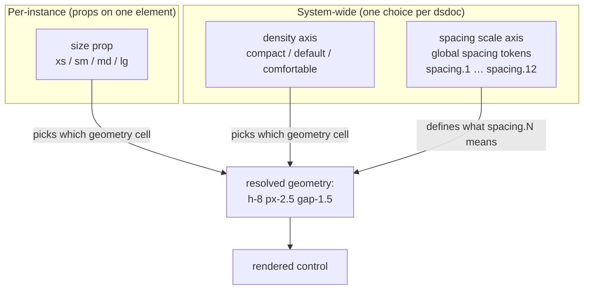
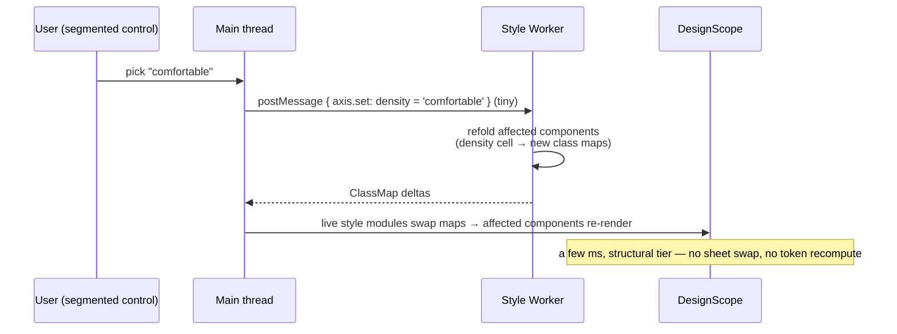

# Density & sizing
> Part of [The Perfect dotUI (single-engine)](README.md) — an end-state architecture study (2026-07-04). Constitution-conformant.

Density is the axis that scales a whole design system's geometry — heights, paddings, gaps, icon sizes, corner radii, type — up or down as one system-wide decision. It is what separates a Material-3-style comfortable system from a Linear-style compact one, and it is one of the hardest axes to model correctly, because "make everything smaller" is *not* a linear operation. This chapter specifies how the perfect dotUI models density: as a **dimension** on the component's `tv()` config whose cells are hand-authored geometry tables written through the `sizes()` helper, resolved by the compiler, and either folded into the shipped classes or shipped as a runtime `data-density` axis.

The one-sentence version: **density is three named geometry tables per component, authored through [`sizes()`](04-styles.md), resolved by `resolve()`, and either baked into `tv()` classes or shipped as a runtime `data-density` axis at export — never a CSS multiplier, never a continuous slider.**

---

## 1. The three tiers

dotUI ships three density tiers, and only three:

| Tier | Slug | Character | shadcn analogue |
|---|---|---|---|
| Compact | `compact` | dense, information-rich (Linear, GitHub) | `style-mira` |
| Default | `default` | the balanced middle (shadcn default) | `style-nova` |
| Comfortable | `comfortable` | roomy, touch-friendly (Material 3) | `style-vega` |

`default` is the base cell — the tier every component is authored against first — and `compact`/`comfortable` are the two deltas around it. The tier is a single system-wide selection stored on the [dsdoc](09-dsdoc.md); every component reads the same tier through the resolved [DesignScope](10-builder.md). There is no per-component density override: density is a *global* axis in the axis-scope sense (§7), because a design system with three densities coexisting on one page is not a design system, it is a bug.

Three is a curated number, not a technical ceiling. Adding a fourth tier is a bounded data edit (§10) — the model does not resist it — but the shipped roster is deliberately three, matching the three shadcn style tiers dotUI reconstructs, so that "what density is this component?" always has a small, nameable answer.

### Why named tiers and not a number

A tier is a *name a designer chooses*, not a scalar a designer dials. "Compact" carries intent — it says "I want the Linear look" — and it resolves to a table someone tuned by hand for that intent. A number (`density: 0.8`) carries no intent and resolves to arithmetic. The distinction is the entire argument of this chapter, developed in §2 and §4.

---

## 2. Why density is a `tv()` dimension

Component styles [are Tailwind](04-styles.md): each component is a `tv()` config with `base`, `variants`, and a mandatory `sizes()` geometry table. Density lives in that config as an ordinary variant dimension, a peer of `variant` and `size`. There is no separate density mechanism, no special node — density is just another key the resolver folds and the emitter renders.

Concretely, a resolved control's geometry is one cell of a `(density, size)` grid. Button's `md` size at `default` density is `h-8`; compact's `md` is a *different* cell declaring `h-7`; comfortable's is `h-9`. The `sizes()` table (§4) authors all of them at once; `resolve()` picks the active cell for the selected tier and folds it into the shipped `tv()` config.

This has three consequences that the two rejected alternatives (§3) cannot match:

1. **A density change is a variant-prop flip.** Selecting a tier changes which cell resolves. No `tv({extend})` re-chaining, no recomposition cascade — the [structural tier](10-builder.md) refolds the affected components and hot-swaps their class maps in a few milliseconds (§9). It is exactly as cheap as switching a default variant.
2. **Density is just Tailwind.** Because density is a `tv()` dimension, it renders as ordinary variant classes (baked) or as `data-density` variant classes (runtime, §10) — from one authored table, through one emitter. There is no second density path to keep in sync.
3. **A fourth tier is a data edit.** Adding a tier adds a value to the axis and a column to every component's geometry table. The *machinery* does not change (§10).

### Tradeoffs (density as a dimension)

- **Cross-product cost.** Density multiplies the resolved cell count: a component with 4 sizes × 3 densities has 12 geometry cells to author and resolve, versus 4 without density. The `sizes()` authoring model (§4) collapses the *authoring* cost to one table, and the [structural-tier](10-builder.md) refold keeps the *runtime* cost to milliseconds, but the resolved `tv()` config is larger. This is the honest price of hand-tuned geometry, and the design pays it deliberately.
- **Every component must author all three tiers.** `sizes()` requires a `default` cell; `compact` and `comfortable` are strongly encouraged and, for any component whose geometry differs by tier (nearly all of them), required by review. A component that ships only `default` renders identically at all three tiers — sometimes correct (a component with no intrinsic geometry) but usually a gap. The registry lint flags a component whose `compact`/`comfortable` tables are byte-identical to `default` as a likely authoring omission, not an error (some components genuinely don't scale).

---

## 3. Why not the two obvious alternatives

Density is one of the sharpest forks in the whole architecture, and the [decision log](00-decision-log.md) records it. Two alternatives are tempting and both are wrong.

### 3.1 Not a `--density` multiplier

The seductive model: express density as one CSS custom property, `--density: 1`, and multiply every spacing token by it. Compact is `--density: 0.85`, comfortable is `--density: 1.15`, and every `h-8`/`px-2.5`/`gap-1.5` becomes `calc(base × var(--density))`. This puts density on the pure [value tier](10-builder.md) — a density change would be a single `setProperty`, 60fps, zero refold — and it deletes every hand-authored density table.

It is a fidelity regression, and the button table proves it. Here are button's real authored heights, per tier, per size:

| size | compact | default | comfortable |
|---|---|---|---|
| xs | `h-5` | `h-6` | `h-7` |
| sm | `h-6` | `h-7` | `h-8` |
| md | `h-7` | `h-8` | `h-9` |
| lg | `h-8` | `h-9` | `h-10` |

A multiplier over `default` cannot reproduce this. Take `default md = h-8` (2rem). Compact `md` is `h-7` (1.75rem) — a ratio of `0.875`. But compact `xs` is `h-5` (1.25rem) against default `xs = h-6` (1.5rem) — a ratio of `0.833`. **The ratio is not constant across sizes.** A single `--density` factor forces one ratio for the whole ladder; the hand-authored ladder uses a different ratio at each rung because small controls tolerate less shrinkage before they stop being tappable, and large controls tolerate more.

It gets worse below the height axis. Consider the paddings and icon sizes in the same table:

- Compact `xs` uses `px-2` **and** icon `size-2.5`; compact `lg` uses `px-2.5` and icon `size-4`. Padding grows by one step across the size range while icon size grows by 1.5 steps — a different curve.
- Comfortable `xs` uses `text-[0.8125rem]` (13px) but comfortable `md`/`lg` inherit `text-sm` (14px). Type doesn't scale with the same factor as height; it has floors and plateaus a designer chose.
- Compact `xs` sets a bespoke `text-[0.625rem]` (10px) — a value no rung of the default ladder contains. It is not `default xs text × 0.8`; it is a hand-picked value for "the smallest button that still reads."

These are **non-linear, per-rung, per-property choices**. Rounding is the final nail: `calc(2rem × 0.875)` is `1.75rem`, which happens to be `h-7`, but `calc(1.5rem × 0.875)` is `1.3125rem` — a value that is *not* on the spacing scale and would render a button that doesn't align to any other control. Snapping the product back to the scale reintroduces exactly the hand-tuning the multiplier was meant to eliminate, except now it's implicit and unauditable.

The multiplier buys a hot-path win that density does not need. Density changes are **keypress-frequency**, not drag-frequency — a user picks a tier from a segmented control, they don't scrub it. A structural-tier refold of all components costs a few milliseconds (§9), comfortably within budget for a click. dotUI spends those milliseconds to keep the hand-tuned ladders. The [decision log](00-decision-log.md) records this as: *density as hand-authored geometry tables via `sizes()` over a scale factor.*

> There is one legitimate `calc()` in the density story — input's `--input-h` ladder (§5) uses `calc(var(--input-h) - var(--addon-button-inset) * 2)` to size an addon relative to the field height. That is *geometry within a cell*, deriving one measurement from another authored measurement. It is not density-as-multiplier; the `--input-h` value itself is hand-authored per tier.

### 3.2 Not continuous density

If three named tiers are good, why not a slider from 0 to 100? Because a continuous density axis has no cells to author. Every intermediate value would have to *interpolate* between the hand-tuned tables — and interpolation is precisely the multiplier problem back again, now hidden inside the slider. At density `0.5` between compact and default, what is button `xs` height? Interpolating `h-5`↔`h-6` gives `1.375rem`, off-scale, misaligned. There is no honest answer because the designer never authored that rung.

Continuous density also breaks naming, reconstruction, and export. A tier is a name a reconstruction targets ("Material 3 is comfortable") and a name the exported code carries (`data-density="compact"`). A float `0.63` targets nothing and documents nothing. The [reconstruction proofs](07-reconstructions.md) pin each golden system to a *named* tier; a continuous axis would make those proofs unfalsifiable.

The [decision log](00-decision-log.md) records this as part of the same ruling: named tiers with authored tables, not a continuous scale.

---

## 4. The `sizes()` geometry-table authoring model

Density lives in the `tv()` config as a variant dimension, but nobody hand-writes twelve parallel size cells per component. The canonical authoring surface is **`sizes()`** — the helper that renders a `density × size` geometry table into `styles.ts` before resolution runs. Per the [decision log](00-decision-log.md) and the [style ruling](04-styles.md), `sizes()` is **not optional sugar**: new components author their density ladders through it, and ad-hoc per-density tv layers do not pass review.

### 4.1 A geometry row

A `sizes()` table is `Record<Density, Record<SizeName, GeometryRow>>`. A `GeometryRow` is a small, typed record of geometry measurements — the vocabulary a designer actually thinks in when sizing a control:

```ts
interface GeometryRow {
  h?: TokenScalar          // height           → h-*        / size-* when square
  minH?: TokenScalar       // min-height       → min-h-*
  px?: TokenScalar         // inline padding   → px-*
  py?: TokenScalar         // block padding    → py-*
  gap?: TokenScalar        // flex/grid gap    → gap-*
  text?: TokenScalar       // font-size        → text-*     (accepts scale steps AND literals)
  leading?: TokenScalar    // line-height      → leading-*
  icon?: TokenScalar       // default icon box → the icon slot's size (§6)
  iconPad?: TokenScalar    // padding beside a leading/trailing icon → has-data-icon-*:p*
  radius?: TokenRef        // corner radius    → rounded-* / the component's --radius var
  vars?: Record<string, TokenScalar>  // derived per-size token set (input's ladder, §5)
}
// TokenScalar: a spacing/font scale step (8, 2.5, '0.625rem') resolved against the token graph.
// TokenRef:    a named token reference ('radius.sm').
```

Every field is optional; a row declares only the properties that differ at that cell. Fields resolve against the [Dimensional Token Graph](05-tokens.md) — `h: 8` is `spacing.8`, `text: 'sm'` is `fontSize.sm`, `radius: 'sm'` is the radius ramp — so a density row never contains a raw pixel value that isn't a deliberate literal (`text: '0.625rem'` is permitted for the hand-picked case; `h: '30px'` earns the hardcoded-value warning with a token hint, per the [style discipline](04-styles.md)).

### 4.2 One table replaces triple-authored ladders

Without `sizes()`, a component authors three parallel tv layers — `compact`, `default`, `comfortable` — each repeating the full slot/variant shape, each spelling out class strings by hand. Across ~72 components this is the source of the largest duplication in the registry: the same size ladder, written three times, hand-kept-consistent by review. `sizes()` collapses it. One call, one table, keyed by tier then size, and the helper renders it into the density dimension resolution consumes.

The saving is not just line count; it is *consistency by construction*. Because the three tiers are columns of one table, a reviewer reads them side by side — `xs: {h:5} / {h:6} / {h:7}` — and sees the ladder as a ladder. Triple-authored layers hide the relationship: the compact `xs` string and the comfortable `xs` string are 150 lines apart and only equal by discipline. `sizes()` makes "is this ladder monotonic and sensible?" a glance.

### 4.3 Worked example: button's real table

Here is button's authored geometry as a `sizes()` table — the exact `default`-tier values transcribed from the shipped `styles.ts`, with `compact` and `comfortable` as the two deltas. This is what a contributor writes; the twelve-cell cross-product below it is what the compiler derives.

```ts
export const buttonStyles = defineComponentStyles(meta, {
  base: { /* variant families, isIconOnly, base classes — see chapter 04 */ },
  density: sizes({
    compact: {
      xs: { h: 5, px: 2,   gap: 1, text: '0.625rem', icon: 2.5, iconPad: 1.5 },
      sm: { h: 6, px: 2,   gap: 1, text: 'xs', leading: 'relaxed', icon: 3,   iconPad: 1.5 },
      md: { h: 7, px: 2,   gap: 1, text: 'xs', leading: 'relaxed', icon: 3.5, iconPad: 1.5 },
      lg: { h: 8, px: 2.5, gap: 1, text: 'xs', leading: 'relaxed', icon: 4,   iconPad: 2 },
    },
    default: {
      xs: { h: 6, px: 2,   gap: 1,   text: 'xs',        icon: 3,   iconPad: 1.5 },
      sm: { h: 7, px: 2.5, gap: 1,   text: '0.8125rem', icon: 3.5, iconPad: 1.5 },
      md: { h: 8, px: 2.5, gap: 1.5,                    icon: 3.5, iconPad: 2 },
      lg: { h: 9, px: 2.5, gap: 1.5,                    icon: 4,   iconPad: 2 },
    },
    comfortable: {
      xs: { h: 7,  px: 2.5, gap: 1,   text: '0.8125rem', icon: 3.5, iconPad: 1.5 },
      sm: { h: 8,  px: 2.5, gap: 1,   icon: 4, iconPad: 1.5 },
      md: { h: 9,  px: 2.5, gap: 1.5, icon: 4, iconPad: 2 },
      lg: { h: 10, px: 3,   gap: 1.5, icon: 4, iconPad: 2 },
    },
  }),
})
```

The full geometry cross-product the compiler derives — 3 tiers × 4 sizes = 12 cells:

| tier | size | height | padding-x | gap | text | icon box | icon pad |
|---|---|---|---|---|---|---|---|
| compact | xs | `h-5` | `px-2` | `gap-1` | `text-[0.625rem]` | `size-2.5` | `pr-1.5` |
| compact | sm | `h-6` | `px-2` | `gap-1` | `text-xs/relaxed` | `size-3` | `pr-1.5` |
| compact | md | `h-7` | `px-2` | `gap-1` | `text-xs/relaxed` | `size-3.5` | `pr-1.5` |
| compact | lg | `h-8` | `px-2.5` | `gap-1` | `text-xs/relaxed` | `size-4` | `pr-2` |
| default | xs | `h-6` | `px-2` | `gap-1` | `text-xs` | `size-3` | `pr-1.5` |
| default | sm | `h-7` | `px-2.5` | `gap-1` | `text-[0.8125rem]` | `size-3.5` | `pr-1.5` |
| default | md | `h-8` | `px-2.5` | `gap-1.5` | `text-sm` | `size-3.5` | `pr-2` |
| default | lg | `h-9` | `px-2.5` | `gap-1.5` | `text-sm` | `size-4` | `pr-2` |
| comfortable | xs | `h-7` | `px-2.5` | `gap-1` | `text-[0.8125rem]` | `size-3.5` | `pr-1.5` |
| comfortable | sm | `h-8` | `px-2.5` | `gap-1` | `text-sm` | `size-4` | `pr-1.5` |
| comfortable | md | `h-9` | `px-2.5` | `gap-1.5` | `text-sm` | `size-4` | `pr-2` |
| comfortable | lg | `h-10` | `px-3` | `gap-1.5` | `text-sm` | `size-4` | `pr-2` |

Read the `height` column top to bottom within a size and the non-linearity from §3.1 is right there: `xs` runs `5→6→7`, `lg` runs `8→9→10`. Read the `text` column and see the plateaus — comfortable flattens to `text-sm` at `sm` and never grows past it; compact holds `text-xs/relaxed` across sm/md/lg but drops to a bespoke `text-[0.625rem]` at `xs`. No single factor produces this table. A designer did, cell by cell, and `sizes()` is the form that lets them.

### 4.4 What resolution does with the table

The `density` layer of `styles.ts` is a `sizes()` call. At `pnpm build:registry`, [style resolution](04-styles.md) evaluates it (it is a pure helper — evaluated and inlined like any fragment) and folds each cell into the component's `tv()` config. With `codeStyle.density: 'baked'` (§10, default), only the selected tier's column survives, folded into the `size` variant. With `'runtime'`, all three columns land as `data-density`-gated classes.

Concretely, `default md` resolves into `tv()` variant classes such as:

```ts
size: {
  md: 'h-8 px-2.5 gap-1.5 text-sm has-data-icon-end:pr-2 **:[svg]:not-with-[size]:size-3.5',
  // …xs sm lg
}
```

Note three things about the shape: the `icon` measurement renders as the icon slot's own `size-3.5` (§6); `iconPad` becomes a root `pr-2` gated on the `has-data-icon-end` relation state; and everything else is a plain root utility on the `md` cell. Density authored as one row, resolved into ordinary `tv()` variant classes like every other geometry.

### Tradeoffs (`sizes()`)

- **A closed geometry vocabulary.** `GeometryRow` covers the fields real controls need (h, padding, gap, text, icon, radius, derived vars). A component that needs a geometry property outside that set — a bespoke `clip-path` inset that scales with density, say — either extends the row type (a small, reviewed data change) or drops to raw per-cell classes with an explicit note. The fixtures need no such escape; the vocabulary is sized to the registry's real needs, and widening it is a data edit, not a rewrite.
- **`sizes()` is mandatory for new components.** This is a deliberate constraint on authoring freedom (the [decision log](00-decision-log.md) ruling). A contributor cannot hand-roll a bespoke per-density ladder even if they find it more natural, because inconsistent density authoring breaks the reviewability and the fold. The cost is a small learning curve; the benefit is that every component's density story reads the same way.

---

## 5. Derived per-size token sets: input's ladder

Some components don't size their own box directly — they size a *field of related measurements* that several slots read. Input is the canonical case. Instead of one height, an input at a given tier×size fixes a whole token set: `--input-h`, `--icon-size`, `--edge-to-text`, `--edge-to-visual`, `--text-to-visual`, `--top-to-text`, `--addon-gap`, `--addon-button-inset`. The addon slot then derives *its* geometry from those with `calc()`:

```
--tag height   = calc(var(--input-h) - var(--addon-button-inset) * 2)
addon-button h = calc(var(--input-h) - var(--addon-button-inset) * 2)
```

`sizes()` handles this with the `vars` field on a geometry row — a **derived per-size token set**. Input's density table binds a named set per cell:

```ts
density: sizes({
  default: {
    sm: { vars: { inputH: 7, iconSize: 3.5, edgeToText: 2,   addonButtonInset: 1,   addonGap: 1 } },
    md: { vars: { inputH: 8, iconSize: 4,   edgeToText: 2.5, addonButtonInset: 1.5, addonGap: 2 } },
    lg: { vars: { inputH: 9, iconSize: 4,   edgeToText: 2.5, addonButtonInset: 1.5, addonGap: 2 } },
  },
  compact:     { sm: { vars: {...h6} }, md: { vars: {...h7} }, lg: { vars: {...h8} } },
  comfortable: { sm: { vars: {...h8} }, md: { vars: {...h9} }, lg: { vars: {...h10} } },
})
```

Resolution turns each `vars` set into CSS custom-property writes on that cell, and the slots reference them via `calc()` utilities. The shipped output is the real authored Tailwind form (`[--input-h:--spacing(8)]` on the cell plus `h-[calc(var(--input-h)-var(--addon-button-inset)*2)]` on the addon). These declared var-writes are carried into the output verbatim — there is no strip step, so the ladder can never be silently dropped (the [resolution-completeness invariant](13-testing.md), decision **N2**).

The density mechanics here are notable: the *entire density ladder* for input is these eight numbers per cell. Shifting input from default to compact is shifting `--input-h` from `spacing.8` to `spacing.7` (and its siblings) — and every slot that reads the derived set follows. This is the derived-token pattern doing density's work: one authored set per cell, many computed measurements.

---

## 6. Density, the icon slot, and relation states

Density interacts with two structural patterns from chapter 04, and both matter for geometry.

**Icon sizing lands on the icon slot.** The authored `icon` field in a `GeometryRow` is conceptually "how big are icons in this button." The shipped Tailwind form is a descendant selector on root (`**:[svg]:not-with-[size]:size-3.5`) — a `:has()`/descendant pattern that Tailwind renders natively, so per-density icon sizing needs no re-homing gymnastics. The icon slot merges its default size first so a user-passed `size` on the icon still wins ("default unless overridden" via merge order). Density-scaled icons are just size-keyed classes on the slot.

**Icon padding stays root-owned, gated on a relation state.** The `iconPad` field ("extra edge padding when there's a leading/trailing icon") is *root's* padding. It stays a root `pr-*`/`pl-*` utility but is gated on the `has-data-icon-end`/`has-data-icon-start` relation state. So `has-data-icon-end:pr-1.5` at compact `xs` is the intersection of `{size:'xs', density:'compact'}` and the icon-end relation — density and relation composing cleanly as ordinary Tailwind variants. Whether that relation is driven by explicit `prefix`/`suffix` slot props or by `:has()` over free-form children is a [component-API choice](04-styles.md), not a styling constraint — either way the class is the same.

The takeaway: density doesn't get its own special normalization. It rides the same variant-and-`:has()` machinery every geometry declaration uses, which is exactly why a fourth tier (§10) needs no new plumbing.

---

## 7. Density vs the size prop vs the spacing axis

Three things that all touch "how big" are cleanly separated. Confusing them is the classic modeling error; the perfect dotUI keeps them orthogonal.



| | **density** | **size prop** | **spacing scale** |
|---|---|---|---|
| Scope | system-wide axis | per-instance prop | system-wide axis |
| Stored on | dsdoc `selections` (global) | not stored — a prop on `<Button size>` | dsdoc `tokens` overlay |
| Where it lives | `tv()` density dimension | `tv()` size dimension | token graph |
| What it selects | which geometry *cell* (the whole table's active column) | which geometry *cell* (the active row) | what each `spacing.N` token *resolves to* |
| Cardinality | 3 tiers | 4 sizes (button) | ~12 scale steps |
| A change affects | every component | the one instance | every `spacing.N` reference |
| Preview tier | [structural](10-builder.md) | (a prop, not an axis) | [value](10-builder.md) |

### 7.1 The density × size matrix

Density and size are **two dimensions of the same geometry table** — they compose into a grid, not a hierarchy. A resolved control is one cell: `(density, size)` → a `GeometryRow`. Button's grid is the 12-cell table in §4.3. This is why they must be separate:

- **`size` is a per-instance decision.** A page has a large primary Button and small icon Buttons at the *same time*; size is a prop the developer sets per `<Button>`. It cannot be a system-wide axis.
- **`density` is a system-wide decision.** Every control on the page is the same tier; the whole system is compact or it isn't. It cannot be a per-instance prop.

They meet in the table. Selecting comfortable shifts the *active column* for every control on the page; setting `size="lg"` on one button picks the *row* for that button. The cell where they cross is the rendered geometry. `sizes()` authors the whole grid at once, which is exactly why the two axes read naturally as a table — because that's what they are.

### 7.2 Spacing scale is not density

The **spacing scale axis** (chapter 06) governs what the spacing *tokens* mean — it can stretch or compress the entire `spacing.1 … spacing.12` ramp, shifting all spacing system-wide. It is a [value-tier](10-builder.md) axis: retargeting spacing tokens is CSS-variable writes, no refold, because geometry rows reference spacing tokens by name (`h: 8` → `var(--spacing-8)`).

This is a genuinely different lever from density:

- **Spacing scale** changes what `spacing.8` resolves to (e.g. 2rem → 1.9rem). *Every* `spacing.8` reference in the system moves together — buttons, inputs, gaps, page padding. It's a uniform rescale of the ruler.
- **Density** changes *which* spacing token a control's geometry cell references (button md height goes from `spacing.8` to `spacing.7`). Different controls move by different amounts, per the hand-tuned table.

A design system can turn both knobs: compact density (shift button md to the `spacing.7` rung) *on top of* a slightly-tightened spacing scale (make `spacing.7` itself a hair smaller). They compose because density picks tokens and spacing defines them. This composition is why the multiplier model (§3.1) is redundant *and* wrong: the uniform-rescale job the multiplier wanted to do is already the spacing scale's job — done properly, at the token layer, on the value tier — and density is left to do the job only it can do, the non-linear per-rung retargeting.

### Tradeoffs (three separate levers)

- **Conceptual surface.** A user has three "how big" controls to understand — the per-instance `size` prop, the density tier, and the spacing scale. This is more to learn than one slider. The payoff is that each does one job well and they compose without interference; a single conflated control could not express "compact density on a roomy spacing scale."

---

## 8. shadcn compatibility: mira / nova / vega

dotUI's three tiers map one-to-one onto shadcn's three style tiers, and this mapping is load-bearing for two reasons: it's how contributors check class parity, and it's how the shadcn [reconstruction](07-reconstructions.md) validates.

| dotUI tier | shadcn style | shadcn CSS file |
|---|---|---|
| compact | `style-mira` | `apps/v4/registry/styles/style-mira.css` |
| default | `style-nova` | `apps/v4/registry/styles/style-nova.css` |
| comfortable | `style-vega` | `apps/v4/registry/styles/style-vega.css` |

When authoring or reviewing a component's geometry, a contributor compares the tier's row against the matching shadcn style tier — shared rules live in `style-{name}.css` and per-component classes live in the registry file itself, so both must be read (a class that looks "missing" often just lives in the other file). This is how the density ladders stay honest against a reference implementation: `compact xs = h-5` because that's what mira sizes the equivalent control, not because a multiplier produced it.

This mapping is a *compatibility note*, not a coupling. dotUI's tiers are its own; the shadcn correspondence is the calibration reference the ladders were tuned against, and the [shadcn reconstruction](07-reconstructions.md) is the standing test that they still line up — a reconstruction gap here surfaces as a failing visual-regression test naming the mismatched tier.

---

## 9. Density in preview

Density is a **structural-tier** command in the [builder](10-builder.md). Selecting a tier does not touch CSS variables (that's the value tier) and does not change the token or utility universe (that's the global tier) — it changes *which classes apply* to which components. The [Style Worker](10-builder.md) holding the [ResolvedSystem](11-compiler.md) receives one tiny classified edit (an `axis.set` on the density axis), refolds *only the affected components'* resolved styles against the new density cell, and hot-swaps their live style modules' class maps.



The cost is a few milliseconds — a refold of pure config→class-string work over the components on screen, then a scoped re-render of only those components. No token producer runs (density touches no ramp), no stylesheet is replaced (density changes classes, not the utility or theme sheets), no React tree above the affected components re-renders. It is the same structural-tier path as switching a default variant, because density *is* a dimension like variant.

This is why density does not need the value-tier speed the multiplier (§3.1) would have bought: the structural refold is already comfortably within a click's budget, and it preserves the hand-tuned tables that the value-tier path would have destroyed. The [live-variants conformance test](13-testing.md) covers density like any dimension — `createLiveVariants('button')({density:'comfortable', ...}) === tv(emit(resolved))({density:'comfortable', ...})` — so the preview's density geometry is byte-identical to the exported code's. With no intermediate representation and no cross-engine gate, this shim is the single seam where preview and export code differ, which makes density fidelity a property the study can actually prove.

---

## 10. Export: `codeStyle.density` — baked vs runtime

Density is the one axis with two honest export shapes, and the [dsdoc](09-dsdoc.md)'s `codeStyle` chooses between them:

```ts
interface CodeStyle {
  // …other codeStyle knobs (chapter 11)…
  density: 'baked' | 'runtime'   // default: 'baked'
}
```

The question this answers: *does the exported code carry the density dimension, or is the selected tier folded away?*

### 10.1 `baked` (default)

The selected tier is resolved and its classes folded directly into the shipped `tv()` config; the density dimension disappears from the output entirely. The user picked comfortable in the builder; the exported button ships comfortable geometry as plain `size`-keyed classes, with no way to switch density at runtime. This is what most users want — they chose their density, they own code sized for it, and there's no dead dimension bloating the file.

**`baked`, comfortable md:**
```tsx
const buttonVariants = tv({
  base: '…',
  variants: {
    size: {
      md: 'h-9 gap-1.5 px-2.5 has-data-icon-end:pr-2 **:[svg]:not-with-[size]:size-4',
      // …xs sm lg, all comfortable geometry, no density dimension present
    },
  },
})
```

The other two tiers' tables are dropped. The [compiler](11-compiler.md) resolves density before emit exactly as it resolves the selected named style — the density dimension is a builder-time concern that doesn't survive into baked output. This is the mode the [decision log](00-decision-log.md) records as default: *baked folds the selected tier into classes.*

### 10.2 `runtime`

The full density dimension ships as a `data-density` attribute axis; all three tiers' geometry lands in the exported `tv()` config, and the consumer switches density at runtime by setting `data-density` on a container. This is for users who want density switching *in their own app* — a settings toggle, a compact "power user" mode.

Density becomes a data-attribute variant, every tier present:
```tsx
const buttonVariants = tv({
  base: '…',
  variants: {
    size: {
      md: [
        'in-data-[density=compact]:h-7 in-data-[density=compact]:px-2 …',
        'h-8 gap-1.5 px-2.5 …',                                 // default
        'in-data-[density=comfortable]:h-9 in-data-[density=comfortable]:px-2.5 …',
      ],
      // …
    },
  },
})
// consumer: <div data-density="compact"> … </div>
```

The `size` cell carries all three tiers' utilities, each tier past `default` prefixed with its `in-data-[density=…]:` variant, so the container attribute selects the active geometry with no JavaScript. One `tv()` config, one emitter, one authored table — the runtime axis is just more variant classes.

### 10.3 The tradeoff, stated plainly

| | `baked` (default) | `runtime` |
|---|---|---|
| Density dimension in output | folded away | shipped as `data-density` axis |
| File size | smallest (one tier) | ~3× the geometry classes |
| Runtime density switching | none | yes, via `data-density` |
| Who wants it | most users — "I chose my density" | apps with a density toggle |

The [decision log](00-decision-log.md) records this as `codeStyle.density: 'baked' (default) | 'runtime'`. The honest cost of `baked` is that the elegant density dimension is a build-time convenience that doesn't survive into the shipped artifact — a contributor reasoning about "why is density a dimension if the export doesn't have it?" needs to hold both facts: it's a dimension *in the `tv()` config* (so it resolves and emits uniformly), and it's *optionally folded* at export (so most users get lean code). The `runtime` mode exists precisely so the dimension *can* survive when a user asks for it, at the cost of tripling the geometry class count.

---

## 11. Adding a fourth tier

Because density is a dimension whose cells are `sizes()` tables, adding a tier is a **bounded data edit**, not a code change. It touches data in exactly the places you'd predict and nowhere else. End to end:

1. **Extend the axis.** Add the new tier's slug to the density axis's values in the [Registry Manifest](03-registry.md) baseline — e.g. `spacious` after `comfortable`. This is the one schema change, and it's one line.
2. **Author a column per component.** For every component whose geometry differs by tier, add a `spacious` block to its `sizes()` table — one more `Record<SizeName, GeometryRow>`. This is the bulk of the work and it is pure data: a designer fills in the geometry, one cell at a time, exactly as they'd fill compact or comfortable. `sizes()` makes it a column-add. The registry lint flags any component that gained no `spacious` block, so nothing is silently forgotten.
3. **Rebuild.** `pnpm build:registry` re-resolves: each new `sizes()` column folds into the `tv()` config's density dimension. No emitter, resolver, or normalization code changes — the new tier flows through exactly like the existing three.
4. **Expose it in the builder.** The density axis's `enum` control reads its options from the axis values; the fourth option appears automatically. The tier classification (structural) is derived from the axis, so the new tier is correctly a structural-tier command with no wiring.
5. **Bump the manifest version.** The new tier is a manifest-vocabulary addition (chapter 03), so it ships in a new immutable [manifest](03-registry.md). Two-year-old dsdocs pinned to an older manifest never see it (they open against their frozen vocabulary); new and reconciled docs do.

What does *not* change is the whole point: no producer, no emitter, no `resolve()`/`compile()` logic, no preview plumbing, no export mode. The [decision log](00-decision-log.md)'s framing — *density as hand-authored geometry tables* — is what makes this true: because a tier is data (a `sizes()` column), a fourth tier is more data.

The **worked cost** for a fourth tier across the registry: one manifest line, ~72 `sizes()` columns of pure geometry data (many trivial — copy the neighbor and nudge), one `pnpm build:registry`, one manifest bump. Compare the rejected multiplier model, where a fourth tier would be a fourth magic number that *still* couldn't reproduce a hand-tuned ladder — the data edit is more work than typing one float, and it is the *right* work, because a density tier is a set of design decisions and there is no shortcut that isn't a fidelity loss.

### Tradeoffs (fourth tier as data)

- **~72 columns is real authoring effort.** Adding a tier is data, but it's a lot of cells — every component that scales needs its new column tuned. There is no auto-generation (that would be the multiplier). The lint ensures completeness; a designer ensures fidelity. This is the deliberate cost of tiers-as-tables: cheap machinery, honest authoring.
- **A tier is permanent vocabulary.** Once a tier ships in a manifest, dsdocs may pin to it forever, so it can't be silently removed — retirement is a manifest-version deprecation with a declared fallback (chapter 03), the same discipline as any vocabulary change. Tiers are cheap to *add* and, correctly, not free to *remove*.

---

## 12. Summary

- Density is three named tiers — **compact / default / comfortable** — mapped to shadcn's **mira / nova / vega**, chosen system-wide on the dsdoc.
- Density is a **`tv()` variant dimension**, a peer of `variant`/`size`/booleans, flowing through `resolve()` and the one emitter with no special-casing.
- It is **not a `--density` multiplier** (hand-tuned ladders are non-linear per-rung — compact `xs` is `h-5`, not `h-8 × 0.7`) and **not continuous** (there are no cells to interpolate).
- Geometry is authored through **`sizes()`** — one `density × size` table of typed `GeometryRow`s per component — replacing triple-authored ladders; mandatory for new components.
- **density × size is a grid**: density is the system-wide column, `size` is the per-instance row, the cell is the rendered geometry; the **spacing scale** is a separate value-tier axis that redefines what the tokens *mean*.
- In **preview**, density is a **structural-tier** command — a few-ms refold of affected components, no token recompute, no sheet swap.
- At **export**, `codeStyle.density` is **`baked`** (fold the selected tier, default, lean) or **`runtime`** (ship the full `data-density` axis, ~3× geometry, switchable).
- A **fourth tier** is a bounded data edit: one manifest line, ~72 `sizes()` columns, a rebuild, a manifest bump — no producer, emitter, or pipeline change.
