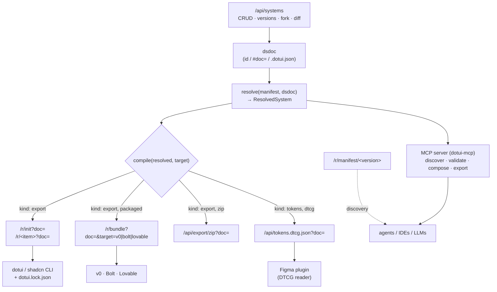
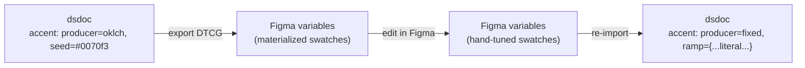
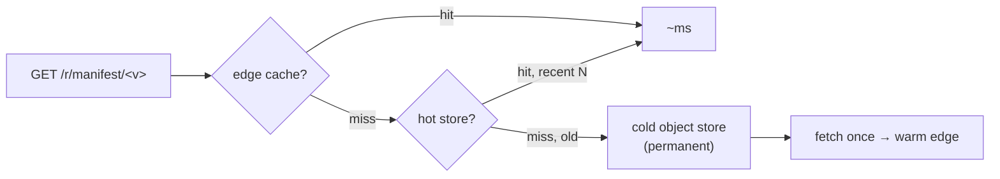

# Distribution — every way a design system leaves dotUI
> Part of [The Perfect dotUI (single-engine)](README.md) — an end-state architecture study (2026-07-04). Constitution-conformant.

A design system built in dotUI is one artifact: a [dsdoc](09-dsdoc.md), pinned to an immutable [Registry Manifest](03-registry.md). Distribution is the set of surfaces that turn that one artifact into something a consumer can use — a shadcn install, a v0 project, a zip, a Figma token file, an agent's tool call. Every one of those surfaces is the *same* two-stage pipeline behind a different packaging: `compile(resolve(manifest, dsdoc), target)`. There is one resolver, one compiler, and many packagings. Nothing on this page re-derives styles, re-picks tokens, or re-runs a producer; the endpoints only *shape* what the compiler already produced.

That single fact is the spine of the chapter. Preview equals export because the builder's worker and every server route run the *identical* `resolve`/`compile` from [`@dotui/compiler`](11-compiler.md). Adding a distribution target never means adding a pipeline — it means adding one **target profile**, a declarative description of a consumer's constraints. This chapter is the catalog of surfaces, their exact request and response shapes, and the profile mechanism that keeps the catalog open.

---

## 1. The surface map

Every surface reads one `ResolvedSystem` and every surface pins one manifest. They differ only in *what packaging* they emit and *who consumes it*.



Two families of route exist, split by host and by cache posture:

- **`/r/*` — the registry**: stateless, doc-parameterized, CDN-cached, shadcn-schema-compatible. Given a dsdoc reference and a target, it returns registry JSON. It never writes; it is safe to hammer.
- **`/api/*` — the application API**: stateful where it must be (system storage, fork, history), stateless where it can be (zip, DTCG). It backs the builder and any programmatic client.

The dsdoc reference in every `/r/*` and `/api/*` route is one of three forms, resolved by a shared loader before anything else runs:

| `doc=` form | Meaning | Resolves via |
|---|---|---|
| `doc=<systemId>@<version>` | a named, server-stored system version | `/api/systems` lookup |
| `doc=<base64url(deflate(dsdoc))>` | an inline canonical dsdoc | in-place decode + migrate |
| `doc=<owner>/<slug>[@v]` | human-readable server system | `/api/systems` lookup |

The inline form is the anonymous path: the builder deflates the canonical dsdoc into the query string exactly as it deflates the `#doc=` share fragment ([dsdoc §9](09-dsdoc.md)). Because the dsdoc carries its own `lock`, an inline `doc=` from two years ago still resolves against its frozen manifest — the route migrates the schema, pins the manifest, and compiles, with no server state involved. This is the structural fix for the old preset codec: a stale reference never silently degrades to defaults, because it carries the vocabulary it was authored against.

---

## 2. Manifest discovery — `/r/manifest/<version>`

```
GET /r/manifest/2028.03.01-a3f
Accept: application/json
```

Returns the immutable [Registry Manifest](03-registry.md) snapshot: dotUI's pinned vocabulary at that version. This is the *self-describing* root of the whole system — every axis declaration, every sync group's resolved `tv()` shape, the baseline [Dimensional Token Graph](05-tokens.md) (~76 semantic tokens, 2 dimensions `scheme` and `contrast`), the icon map, the codeStyle option declarations, and the component roster.

```jsonc
{
  "$schema": "https://dotui.org/schema/manifest/v1.json",
  "manifest": "2028.03.01-a3f",
  "manifestHash": "9c1e44aa0f2b7d31",
  "registry": "dotui.org",
  "publishedAt": "2028-03-01T00:00:00Z",
  "axes":      { /* AxisDecl[] keyed by id — the full configurable surface */ },
  "tokens":    { /* baseline TokenGraph: layers, dimensions, cells, producers */ },
  "contracts": { /* per-sync-group component-contract nodes + pairsWith edges */ },
  "styles":    { /* per-sync-group tv() style shape (base / slots / variants / compounds) */ },
  "syncGroups":  { /* members, syncedAxes, shared styles */ },
  "components":  [ /* roster: id, group, syncGroup, axes[] */ ],
  "codeStyle":   { /* CodeStyle option declarations, for the generated panel */ },
  "icons":       { /* icon library options + import maps */ }
}
```

The manifest is why agents can author dsdocs without reading dotUI's source (§8). It is content-addressed and immutable: fetch it once, cache it forever. The response carries `Cache-Control: public, max-age=31536000, immutable` — the URL *is* the version, so it can never go stale.

`GET /r/manifest/latest` is the one mutable alias, returning a `302` to the current content-addressed version so a caller who wants "today's vocabulary" gets a cacheable redirect rather than a moving payload.

---

## 3. The shadcn registry — `/r/registry.json`, `/r/init`, `/r/<item>`

These three routes are the shadcn-CLI-compatible surface. They speak the shadcn registry schema so `npx shadcn` works unmodified, and they carry the doc reference through so a user's exact design system installs, not dotUI's defaults.

### 3.1 `/r/registry.json` — the discovery index

```
GET /r/registry.json
```

```jsonc
{
  "$schema": "https://ui.shadcn.com/schema/registry.json",
  "name": "dotui",
  "homepage": "https://dotui.org",
  "items": [
    { "name": "button", "type": "registry:ui", "title": "Button",
      "description": "…", "registryDependencies": ["loader", "focus-styles"] },
    /* … one entry per registered UI item … */
  ]
}
```

Identity and dependency metadata only — no `doc=` param, no files, no css. It is the browsable catalog. Unlike the old registry index, it also advertises the axis surface for machines: each item carries an `x-dotui` extension block naming its `group`, `syncGroup`, and the ids of the axes that apply to it. shadcn ignores unknown fields; agents read them. Axis metadata is no longer invisible to machines — the discovery index tells a caller what is configurable per component, and `/r/manifest/<v>` tells it *how*.

### 3.2 `/r/init?doc=<ref>` — the base item

```
GET /r/init?doc=ds_01J8ZGEIST00@1.0.0
```

Returns the `registry:style` base item the shadcn CLI consumes for `npx shadcn init`. It is `compile(resolved, { kind: 'export', codeStyle })` packaged as the base item — the one place the token layer, plugins, and shared lib land.

```jsonc
{
  "$schema": "https://ui.shadcn.com/schema/registry-item.json",
  "name": "dotui",
  "type": "registry:style",
  "extends": "none",
  "dependencies": ["tailwind-variants", "tailwind-merge", "cnfast",
                   "react-aria-components", "tailwindcss-react-aria-components", "…"],
  "registryDependencies": [],
  "css":     { /* @plugin lines, @utility focus-ring, per-cell theme blocks */ },
  "cssVars": { /* @theme inline block */ },
  "files": [
    { "type": "registry:lib", "path": "lib/utils.ts", "target": "src/lib/utils.ts",
      "content": "export { cn } from \"cnfast\";\n" }
  ],
  "config": {
    "style": "default",
    "tailwind": { "cssVariables": true },
    "aliases": { "components": "@/components", "ui": "@/components/ui",
                 "utils": "@/lib/utils", "lib": "@/lib", "hooks": "@/hooks" },
    "registries": { "@dotui": "https://dotui.org/r/{name}?doc=ds_01J8ZGEIST00@1.0.0" }
  }
}
```

`config.registries['@dotui']` is how the doc reference is baked into the consumer's `components.json`: `shadcn init` merges it in, so a later `shadcn add @dotui/button` fetches `/r/button` *carrying the same doc*. The CLI's per-component dep URLs are also absolute-and-doc-carrying (§3.3), so an install works even when a bare `shadcn add` drops the registry map — the dsdoc reference rides on every URL.

The token layer here emits **every reachable cell**: `:root`, `.dark`, and any user-added dimension option's delta block, guarded by paired selectors so the cascade reproduces the graph resolution ([tokens §Emission](05-tokens.md)). Every user-added token exports — there is no separate `tokens` field to drop, because tokens *are* the graph, and the graph *is* what emits.

### 3.3 `/r/<item>?doc=<ref>` — one resolved item

```
GET /r/button?doc=ds_01J8ZGEIST00@1.0.0
```

Returns the shipped registry item — the component source with its resolved styles, ready to install:

```jsonc
{
  "name": "button", "type": "registry:ui",
  "title": "Button", "description": "…",
  "dependencies": ["react-aria-components"],            // sniffed from emitted content
  "registryDependencies": [
    "https://dotui.org/r/loader?doc=ds_01J8ZGEIST00@1.0.0"  // deps carry the same doc
  ],
  "files": [
    { "path": "ui/button/base.tsx", "type": "registry:ui", "target": "ui/button.tsx",
      "content": "/* tv() config with resolved classes */" }
  ]
}
```

The `content` is what the `tv()` emitter produced: an idiomatic `tv()` config byte-comparable to a hand-authored file (flatten-on-export means a contract node still pointing at its default emits `bg-primary`, not the var form). `codeStyle` AST transforms have already shaped quotes, arrow-vs-declaration, one-line-per-variant, and comment density. The class strings are character-for-character what the preview DOM showed — same `compile`, same output.

The shipped `base.tsx` **is** the resolved `tv()`; `styles.ts` is the source, resolved not lifted. There is no separate engine-neutral projection to request — with one engine there is nothing to be neutral *between*. A consumer or an alternate tool that wants to reason about a component's structure reads the emitted `tv()` config directly (its `base` / slots / variants / compounds are the structure) or the DTCG token file (§6.2) for the token side. The two-engine variant published a separate resolved-Contract JSON here so a second emitter could read it; with a single engine that projection has no second reader and is not built.

**Response headers** on `/r/<item>` and `/r/init`: `Cache-Control: public, max-age=60, s-maxage=31536000, immutable` when `doc=` is a pinned `@version` or an inline canonical blob (both are immutable inputs → immutable output), degrading to `s-maxage=3600, stale-while-revalidate=86400` when `doc=` names a *head* (mutable) system. The cache key is `(item, canonical-hash(resolved-inputs))` — see §9.

---

## 4. Bundles and target profiles — `/r/bundle?doc=&target=`

A **bundle** is a single self-contained project for a consumer that cannot follow a registry: v0, Bolt, Lovable. Each of those tools has its own constraints — v0 strips `css`/`cssVars` from registry items and mishandles `registryDependencies`, so the theme has to arrive as *real files*; Bolt wants a specific project layout; Lovable pins dependency versions differently. The old code met these constraints with a monument of hand-written workarounds. The perfect dotUI meets them with **target profiles**: a declarative schema describing each target's constraints, over which one bundle emitter runs.

### 4.1 The target profile schema

```typescript
interface TargetProfile {
  id: string                       // "v0" | "bolt" | "lovable" | …
  label: string
  framework: "next" | "vite-react" | "remix"    // scaffold shape the bundle assumes

  // How theme/token CSS must arrive. v0 strips registry css/cssVars, so it must be files.
  themeDelivery: "cssVars-fields" | "real-files"

  // Whether the target resolves registryDependencies, or everything must be inlined.
  dependencyResolution: "registry" | "inline-closure"

  // Dependency version policy.
  deps: { pin: "exact" | "caret" | "passthrough"; overrides?: Record<string, string> }

  // File layout: where the theme, entry, and component sources land.
  layout: {
    themeCss: string               // e.g. "app/globals.css"
    entry: string                  // e.g. "app/page.tsx"
    componentsDir: string          // e.g. "components/ui"
    importStyle: "relative" | "alias"   // v0: relative; alias-capable targets: alias
  }

  // Per-target content quirks, declared not coded.
  rewrites?: ImportRewrite[]       // e.g. one icon import remap
  autocontrast: "plugin" | "bake"  // v0 can't run the autocontrast plugin → bake --on-* foregrounds
}
```

A bundle request is `compile(resolved, { kind: 'export', codeStyle })` followed by per-target packaging. The compiler already knows how to emit component sources and the token layer; the profile tells the bundle emitter *how to package* them:

- `themeDelivery: "real-files"` → the token CSS is written as a project file, not a registry `css` field.
- `autocontrast: "bake"` → the token emitter resolves `on-*` foregrounds to literal values at compile time, because the target can't run the [autocontrast plugin](05-tokens.md).
- `dependencyResolution: "inline-closure"` → the compiler walks the item's import closure and inlines every source file, rewriting imports per `layout.importStyle`.
- `deps.pin: "exact"` → dependency versions are pinned from the manifest's locked versions.

### 4.2 The bundle response

```
GET /r/bundle?doc=ds_…@1.0.0&target=v0
```

```jsonc
{
  "$schema": "https://ui.shadcn.com/schema/registry-item.json",
  "name": "dotui-showcase",
  "type": "registry:block",
  "title": "dotUI Showcase",
  "description": "A showcase project themed to your design system.",
  "dependencies": ["react-aria-components@^1.19.0", "…"],  // per profile.deps
  "registryDependencies": [],                              // inline-closure → none
  "files": [
    { "type": "registry:file", "target": "app/globals.css",  "content": "/* theme, real file */" },
    { "type": "registry:file", "target": "app/layout.tsx",   "content": "…" },
    { "type": "registry:page", "target": "app/page.tsx",     "content": "/* seeded from doc */" },
    /* …the full transitive source closure, imports rewritten per profile.layout… */
  ]
}
```

The critical property: **a new target is one profile, not a new pipeline.** Bolt is `{ framework: "vite-react", themeDelivery: "real-files", dependencyResolution: "inline-closure", layout: { themeCss: "src/index.css", entry: "src/App.tsx", … } }`. Lovable differs only in `deps.pin` and `layout`. Neither adds a code path; both add a data record. The hand-written closure walker, the stub maintenance, the pinned version list, the special-case icon rewrite — all of it is now `TargetProfile` fields, and the closure walk is one emitter reading `dependencyResolution`.

### 4.3 Profile catalog

| Target | framework | themeDelivery | depResolution | deps.pin | autocontrast |
|---|---|---|---|---|---|
| `v0` | next | real-files | inline-closure | caret | bake |
| `bolt` | vite-react | real-files | inline-closure | exact | bake |
| `lovable` | remix | real-files | inline-closure | exact | bake |

All three share `themeDelivery: real-files` and `autocontrast: bake` because none runs a Tailwind plugin pipeline reliably; they diverge on framework and dependency policy. A target that *does* resolve registries and *can* run plugins would set `themeDelivery: cssVars-fields`, `dependencyResolution: registry`, `autocontrast: plugin` — and then it is `/r/init` + per-item installs, not a bundle at all. The profile schema spans both worlds; a bundle is the profile whose consumer can't do registry resolution.

**Tradeoffs.** Inline-closure bundles are large — the whole source closure ships in one item because the target can't follow registry links. That is inherent to those targets, not a dotUI choice; the profile makes the cost *declared* rather than hidden in a build script. And `autocontrast: bake` freezes the `on-*` foregrounds: a bundle consumer who later changes a background token won't get a re-derived foreground, because the plugin that would derive it isn't present. The bundle is a *snapshot* project, honest about being one.

---

## 5. Systems storage — `/api/systems`

Named systems live on the server. The storage model is **append-only**, dedup-by-hash, and every version is a full canonical dsdoc — so history, restore, fork, and diff are all *document* operations, not deltas to replay.

```typescript
// POST /api/systems                       — store a canonical doc, dedup by hash, append a version, bump head
// GET  /api/systems/:owner/:slug[@version] — retrieve (head, or a pinned content version)
// GET  /api/systems/:id                    — retrieve by meta.id
// POST /api/systems/:id/fork               — mint a new meta.id, record forkedFrom, copy head
// GET  /api/systems/:id/history            — the immutable StoredVersion list
// POST /api/systems/:id/restore?version=…  — make an old version the new head (a new append)
// GET  /api/systems/:id/diff?from=…&to=…   — document diff + visual diff

interface StoredVersion {
  version: string      // meta.version at save
  hash: string         // sha256(canonicalize(doc)) — content address
  doc: Dsdoc           // the full canonical document
  message?: string
  createdAt: string
}
```

The behaviors, elaborated in [dsdoc §10](09-dsdoc.md):

- **Immutable versions.** `POST` appends a `StoredVersion` and bumps head; nothing is overwritten. Dedup by hash means saving an unchanged doc is a no-op. Restore appends, so history is lossless.
- **Fork.** `POST /:id/fork` mints a fresh `meta.id`, sets `forkedFrom` to source id+version, copies head. The fork is a *separate system* with its own lineage, not a branch.
- **Versions and history.** `GET /:id/history` is the immutable list; a pinned `@version` retrieves that exact content.
- **Visual diff.** `GET /:id/diff?from=A&to=B` returns the document diff *and* a visual diff: both versions render through the same [resolver](11-compiler.md) into two `PreviewOutput`s and the endpoint compares them, so a review shows what changed *on screen*, not just in JSON. This is the same resolve/compile every export uses — the diff is trustworthy because it is not a second rendering path.

`POST /api/systems` is the materialization boundary: the builder's op-log folds its LWW cells into a fresh canonical dsdoc, which is hashed and appended. The persisted artifact is *always* the canonical dsdoc; the op-log is the editing representation. Auth-gated for owned systems; anonymous documents carry no server row until the first save moves `owner` from `anon` to a real identity.

---

## 6. Plain download and token export

### 6.1 `/api/export/zip?doc=<ref>`

```
GET /api/export/zip?doc=ds_…@1.0.0
→ 200 application/zip
  Content-Disposition: attachment; filename="geist.zip"
```

The whole resolved system as a downloadable archive: the base (theme CSS, plugins, lib) plus every registered component's shipped source, laid out as an installable folder tree with a `README.md` and a `dotui.lock.json` seeded for later `dotui update`. It is `compile(resolved, { kind: 'export', codeStyle })` packaged per the `zip` profile and streamed through an archiver. No account, no CLI, no third party — the "give me the files" path. The zip profile is just another `TargetProfile` (`framework: null`, `dependencyResolution: registry`, `themeDelivery: real-files`, `layout` = a plain `src/` tree).

### 6.2 `/api/tokens.dtcg.json?doc=<ref>`

```
GET /api/tokens.dtcg.json?doc=ds_…@1.0.0
→ 200 application/json  (W3C DTCG design-tokens format)
```

The [Dimensional Token Graph](05-tokens.md) projected to the W3C DTCG (Design Token Community Group) format — `compile(resolved, { kind: 'tokens', format: 'dtcg' })`. This is the format Figma, Style Dictionary, and any token tooling consume. The mapping is direct because the dsdoc *already is* a token graph:

```jsonc
{
  "$description": "Geist — exported from dotUI",
  "color": {
    "primary": {
      "$type": "color",
      "$value": "{neutral.1000}",
      "$extensions": {
        "dotui": { "id": "color-primary", "layer": "semantic", "category": "background" }
      }
    }
  },
  "$extensions": {
    "dotui": {
      "manifest": "2028.03.01-a3f",
      "dimensions": [
        { "id": "scheme",   "options": ["light", "dark"] },
        { "id": "contrast", "options": ["normal", "hc"] }
      ]
    }
  }
}
```

The DTCG backend maps **dimension → Figma collection**, **option → mode**, **node → variable**, and stashes every node's stable **id in `$extensions.dotui.id`**. That id is the round-trip key: it survives the trip to Figma and back. Alias tokens (`{neutral.1000}`) preserve the graph's reference edges, so Figma sees the same indirection the CSS does.

---

## 7. Figma — the plugin and its honest round-trip

Figma consumes the DTCG file. The dotUI Figma plugin reads `/api/tokens.dtcg.json?doc=<ref>` and materializes it as Figma variables:

- **Collections = dimensions.** `scheme` and `contrast` become variable collections; each collection's modes are the dimension's options. A user-added `brand` dimension becomes a third collection. This is why dimensions are collections and not flattened modes — Figma's collection/mode model is exactly the dsdoc's dimension/cell model.
- **Variables = nodes, keyed by id.** Each token becomes a Figma variable named by its `name`, but *identified* internally by `$extensions.dotui.id`. On re-import, the plugin matches by id, so a Figma-side rename doesn't break the link and a dotUI-side label change doesn't orphan the variable.
- **Aliases survive.** DTCG `{ref}` aliases become Figma variable aliases, so `color-primary → neutral-1000` is one indirection in Figma, not a flattened literal.

### The honest round-trip limit

The plugin round-trips **values and structure faithfully, generative recipes lossily.** Figma has no notion of an OKLCH producer, a contrast target, or a per-cell `material` HCT generation. So on **export to Figma**, a *generated* ramp is materialized to its concrete per-step, per-mode values — Figma sees a fixed swatch grid. On **re-import from Figma**, those values come back as a `fixed` (literal) producer, because that is all Figma could hold:



This is stated plainly in the plugin UI: *"Re-importing freezes generated ramps to fixed values. Your OKLCH recipe becomes a hand-tuned palette."* It is not a bug to hide — it is the boundary between a *generative* token model and a *literal* one. A designer who tunes swatches in Figma genuinely *wants* those literal values; the plugin honors that by writing them as `fixed`, which the [tokens layer](05-tokens.md) treats as first-class (the paste-my-palette flow). What is lost is the *recipe*, not the *values*. Semantic tokens, dimensions, aliases, and ids all round-trip cleanly; only the generation policy flattens.

**Tradeoffs.** The round-trip is a one-way ratchet for recipes: once frozen through Figma, the ramp is literal and a producer knob (chroma multiplier, hue torsion) no longer applies. A user who wants to keep editing the recipe should edit in dotUI, not Figma; a user who wants Figma to be the source of truth accepts fixed ramps. The plugin makes the choice explicit rather than pretending Figma can hold a producer it can't.

---

## 8. Agent-native distribution

Agents are a first-class consumer, not an afterthought. The distinguishing property is that **an agent can discover the entire configurable surface and author a valid dsdoc without reading dotUI's source** — because the manifest and the JSON Schemas are served, self-describing, and complete.

### 8.1 The MCP server — `dotui-mcp`

A Model Context Protocol server exposing the whole pipeline as tools. An agent connects, discovers, composes, and exports — all through the same `resolve`/`compile` the builder and the routes use.

| Tool | Signature | Backed by |
|---|---|---|
| `dotui_discover` | `() → { manifest, axes, components, tokens }` | `GET /r/manifest/latest` |
| `dotui_validate` | `(doc: Dsdoc) → { ok, migrated?, errors[] }` | `@dotui/schema` migrate + validate |
| `dotui_compose` | `(commands: Command[], base?: Dsdoc) → Dsdoc` | the same `Command` API the builder emits |
| `dotui_edit` | `(doc: Dsdoc, commands: Command[]) → Dsdoc` | apply commands, re-canonicalize |
| `dotui_preview` | `(doc, view) → PreviewOutput` | `compile(resolve(…), { kind:'preview' })` |
| `dotui_export` | `(doc, target) → files[]` | the matching `/r/*` or `/api/*` route |
| `dotui_reconcile` | `(doc, manifest) → { doc, changes[], blocked[] }` | `reconcile` ([dsdoc §8](09-dsdoc.md)) |

`dotui_compose` and `dotui_edit` take the *same `Command` objects* the builder's panel emits ([builder §9](10-builder.md)) — each command carries an `aiHint`, so the axis schema *is* the agent's vocabulary. The agent cannot emit a mutation the schema doesn't declare; the safety and the ceiling are the same fact. Where an agent's intent maps to no axis, `dotui_compose` returns it in an `unmapped` list — the missing-axis product signal ([builder §9.2](10-builder.md)), now flowing from agents as well as screenshots.

Every MCP tool is a thin wrapper over a function already covered by the [testing invariants](13-testing.md). There is no agent-specific compiler, no agent-specific resolver. An agent's export byte-equals a human's export from the same doc, because it *is* the same export.

### 8.2 Self-describing documents — JSON Schema

The dsdoc identifies its own schema:

```jsonc
{ "$schema": "https://dotui.org/schema/dsdoc/v1.json", "dsdoc": 1, "meta": { … }, … }
```

The schema is Draft 2020-12, served at that URL, and complete enough to validate a dsdoc *without dotUI code*. Any agent — or any JSON-Schema-aware tool — can:

1. `GET /r/manifest/latest` to learn the axes, components, and token vocabulary;
2. author a dsdoc against `https://dotui.org/schema/dsdoc/v1.json`;
3. `dotui_validate` (or validate locally against the schema) to confirm it;
4. `dotui_export` to get files.

This closes the old gap where axis metadata was invisible to machines. The manifest exposes *what is configurable*; the JSON Schema exposes *the shape a config must take*; the MCP server exposes *the operations*. An agent needs none of dotUI's internals.

### 8.3 llms.txt and markdown alternates

The documentation surface is agent-legible by construction, derived from the same source the site renders so it cannot drift:

- **`/llms.txt`** — an [llmstxt.org](https://llmstxt.org) index: the one-paragraph summary plus a link list of every docs page and every registry item, generated from the docs source.
- **`/llms-full.txt`** — every docs page's processed markdown concatenated, for single-fetch ingestion.
- **`/docs/<path>.md`** — a markdown alternate of every docs page, advertised on the HTML page via `<link rel="alternate" type="text/markdown">`.
- **`/.well-known/api-catalog`** — an [RFC 9727](https://www.rfc-editor.org/rfc/rfc9727) linkset pointing at `/r/registry.json`, `/r/manifest/latest`, the installation guide, and `/llms.txt`, so an agent starting from the well-known URI can find every machine surface.

Content negotiation on `GET /` with `Accept: text/markdown` returns a markdown homepage, so an agent that fetches the root gets prose, not an HTML shell.

**Tradeoffs.** The agent surface is only as expressive as the axis set — an agent, exactly like the panel and the screenshot importer, cannot reach a look no axis covers. That is correct (the AI can't emit an unrepresentable mutation) and it is the ceiling (its power grows only when the axis set does). The `unmapped` signal is how that ceiling gets reported and, over time, raised.

---

## 9. Caching, CDN, and manifest retention

### 9.1 Cache keys and headers

Every `/r/*` response is a pure function of its inputs, so the cache key is a hash of those inputs:

```
cacheKey = sha256( route, canonical-hash(resolvedInputs), format, targetProfileId? )
```

`canonical-hash(resolvedInputs)` is the content hash of the *canonical dsdoc after migration and manifest pinning* — not the raw `doc=` string. Two different `doc=` encodings that canonicalize to the same document share a cache entry. This is the payoff of canonical form ([dsdoc §8](09-dsdoc.md)): identity is content, so caching is automatic and correct.

| Surface | Cache-Control | Rationale |
|---|---|---|
| `/r/manifest/<version>` | `max-age=31536000, immutable` | URL is the content address |
| `/r/manifest/latest` | `max-age=60` + 302 | mutable alias, redirect is cheap |
| `/r/registry.json` | `s-maxage=3600, swr=86400` | changes only on publish |
| `/r/init`, `/r/<item>` (pinned/inline doc) | `s-maxage=31536000, immutable` | immutable inputs → immutable output |
| `/r/init`, `/r/<item>` (head doc) | `s-maxage=3600, swr=86400` | head can move; SWR hides recompute |
| `/r/bundle` | `s-maxage=86400, swr=604800` | large, recompute rare |
| `/api/export/zip` | `s-maxage=3600` (pinned: `immutable`) | streamed archive |
| `/api/tokens.dtcg.json` | `s-maxage=3600` (pinned: `immutable`) | small, cheap |
| `/api/systems/*` (reads) | `private, no-store` | owned, mutable |

The immutability of a pinned `doc=<id>@<version>` or an inline canonical blob is the reason those responses cache forever: the inputs cannot change, so the output cannot change. A head reference caches shorter with stale-while-revalidate, so the CDN serves the last good response while the origin recomputes — recompute is a worker-fast `resolve`/`compile`, but SWR means no request ever waits on it.

### 9.2 Manifest retention — permanent, hot + cold

"Published means permanent" is the manifest contract: a dsdoc pins a manifest version, and that version must resolve *forever*, or the two-year-old link breaks. dotUI can never delete a published manifest snapshot. The cost is bounded by a two-tier policy:

- **Hot window.** The most recent *N* manifest versions (and any version referenced by an actively-served head system) live on the CDN edge and in hot storage, resolving in single-digit milliseconds. This covers essentially all live traffic — most documents pin a recent manifest.
- **Cold tier.** Older snapshots move to cold object storage. They are still permanent and still resolvable — a request for `/r/manifest/2026.01.02-x` that misses the hot tier fetches from cold storage (a slower first byte, then cached at the edge for the hot window). Because a manifest URL is content-addressed and immutable, a cold-tier hit is warmed exactly once per hot-window eviction cycle.



Nothing published is ever deletable, but nothing old occupies hot storage either. The archival cost is object storage — cheap, append-only, and proportional to publish count, not to traffic.

**Tradeoffs.** The permanence guarantee is a real, unbounded storage liability: the manifest store only grows, and a request for a very old snapshot pays a cold-fetch latency on first access. dotUI accepts this because the alternative — garbage-collecting old manifests — would break the exact promise that makes a shared dsdoc trustworthy for years. Cold storage caps the *cost*; it cannot eliminate the *commitment*, and dotUI takes the commitment deliberately.

---

## 10. The CLI — `dotui init / add / update / export`

The `dotui` CLI is the consumer-repo agent. It wraps shadcn-compatible install flows and adds the one thing shadcn lacks: a durable pin and a non-clobbering update.

```
dotui init https://dotui.org/r/init?doc=ds_…@1.0.0   # write base + dotui.lock.json
dotui add button field menu                          # install items, carrying the pinned doc
dotui update                                          # reconcile + plan + apply
dotui export --zip                                    # local resolve+compile, no network
dotui update --dry-run                                # print the plan, touch nothing
```

`dotui init` and `dotui add` are thin over the shadcn registry routes (§3), except that `init` *always writes `dotui.lock.json`* — the safety that makes `update` possible.

### 10.1 `dotui.lock.json`

```typescript
interface DotuiLock {
  registry: "dotui.org"
  doc: { id: string; version: string }   // the installed system + content version
  manifest: string                        // pinned manifest version
  manifestHash: string
  codeStyle: CodeStyle                    // the exact code taste files were emitted with
  files: Record<string, {                 // per-installed-file
    target: string                        // path in the consumer repo
    pristineHash: string                  // sha256 of the file as dotUI emitted it
  }>
}
```

The lock records *exactly* what was installed and *how it was shaped*: the doc, the manifest pin, the `codeStyle`, and a **pristine content hash per file**. There is no `engine` field to record — there is one engine, and it is never user-facing. The pristine hash is the pivot of the whole update story — it lets `plan` tell an untouched file from a hand-edited one without guessing.

### 10.2 `plan()` — the update algorithm

`npx dotui update` runs a pure `plan(lock, doc, manifest)`. Purity is why `--dry-run` is trustworthy: the plan is a value, and applying it is a separate step.

```mermaid
flowchart TD
  START["dotui update"] --> REC["reconcile(doc, newManifest)"]
  REC -->|changes[], blocked[]| REVIEW{"review lock upgrade"}
  REVIEW -->|accept| COMPILE["compile with SAME codeStyle → fresh files"]
  COMPILE --> PERFILE{"per file:<br/>currentHash == pristineHash?"}
  PERFILE -->|yes, untouched| CLEAN["clean overwrite<br/>update pristineHash"]
  PERFILE -->|no, edited| MERGE["3-way merge:<br/>pristine / current / fresh"]
  MERGE -->|no conflict| APPLY["apply merged"]
  MERGE -->|conflict| MARK["write conflict markers<br/>or AI-assisted merge"]
  CLEAN & APPLY & MARK --> LOCK["rewrite dotui.lock.json"]
```

Step by step:

1. **Reconcile the lock.** `reconcile(doc, newManifest)` upgrades the manifest pin, applying the deprecation table and returning a **reviewable changes list** — `"Sousse renamed to Tunis — no action"`, `"new axis hover-effect available"`, `"legacy-shadow removed — snapped to shadow-sm, warned"`. No value silently degrades; every drop is surfaced ([dsdoc §8.2](09-dsdoc.md)). Blocked upgrades stop the plan with an explanation.

2. **Recompile with the *same* `codeStyle`.** The fresh files are emitted with the exact code taste from the lock, so a diff is a *content* diff, not a formatting diff. This is the reason 3-way merge is tractable: both sides share quote style, arrow-vs-declaration, and comment density.

3. **Per file, compare `currentHash` to `pristineHash`:**
   - **Match (untouched).** The user never edited this file → **clean overwrite** with the fresh content, and the lock's `pristineHash` updates to the new content.
   - **Mismatch (edited).** The user hand-edited it → **3-way merge** with the pristine baseline (common ancestor), the current file (user edits), and the fresh file (dotUI's changes). A clean merge applies silently; a conflict writes standard `<<<<<<< / ======= / >>>>>>>` markers, or — with `--ai-merge` — invokes an AI-assisted merge that resolves formatting-only conflicts and flags semantic ones for review.

4. **Rewrite the lock** with the new doc/manifest pins and updated pristine hashes.

`--dry-run` prints exactly this plan (which files overwrite, which merge, which conflict, what the reconcile surfaced) and touches nothing — trustworthy *because `plan` is pure*, so the dry run and the real run compute the identical plan.

**Why the pristine hash and not a timestamp or a `.orig` backup.** A hash is the only signal that survives a `git checkout`, a formatter run, or a fresh clone. It answers precisely one question — "is this file byte-identical to what dotUI wrote?" — which is exactly the question that decides clean-overwrite vs. merge. A plain `shadcn add` without the lock still clobbers; the lock is the safety, and `dotui init` always writes it.

**Tradeoffs.** Three-way merge of generated code is genuinely hard, even with a shared `codeStyle`: a `tv()` config reordered by a user, or a variant hand-added in the file rather than the doc, produces a conflict that no formatter reconciles. The `--ai-merge` option raises the ceiling but is not free of judgment. dotUI's stance is to make the *common* case (untouched files) perfectly clean and the *edited* case *honest* — conflict markers a human resolves, never a silent clobber. The merge quality on heavily-edited files is the real cost, and it is stated, not hidden.

---

## 11. The distribution matrix

Every target, what it receives, its fidelity guarantee, and its update story:

| Target | Route / entry | Receives | Fidelity guarantee | Update story |
|---|---|---|---|---|
| **shadcn CLI** | `/r/init` + `/r/<item>` | base (theme CSS, plugins, lib) + per-item `tv()` source | byte-comparable to hand-authored; preview = export by construction | `dotui update` — reconcile + `plan()`, clean overwrite / 3-way merge |
| **v0 / Bolt / Lovable** | `/r/bundle?target=…` | one self-contained project (real theme files, inlined closure) | snapshot fidelity; `on-*` foregrounds baked (frozen) | none — re-generate a new bundle |
| **Plain zip** | `/api/export/zip` | full system as a folder tree + seeded lock | identical to CLI install; `dotui.lock.json` included | `dotui update` in the extracted repo |
| **DTCG / Figma** | `/api/tokens.dtcg.json` + plugin | token graph as W3C DTCG; dimensions=collections, ids in `$extensions` | values + structure + aliases faithful; **recipes freeze to fixed on re-import** | re-import DTCG (re-freezes recipes) |
| **Agents / MCP** | `dotui-mcp`, `/r/manifest`, JSON Schema | manifest, schema, compose/edit/export tools | export byte-equals a human's from the same doc | `dotui_reconcile` + re-export |
| **Named system** | `/api/systems` | append-only versioned dsdocs, fork, visual diff | every version is a full canonical doc | version history + restore |
| **Anonymous share** | `#doc=` / short-link / `.dotui.json` | compressed canonical dsdoc, self-pinning | opens against its frozen manifest, migrated forward | edit → re-share |

The two-engine variant carried an extra row here — a second CLI target for its second emitter, plus a resolved-Contract projection row — kept in computed-style parity by machinery this design doesn't build. With one engine there is one CLI target and one emitted form; the matrix is that much shorter.

The column that matters most is *fidelity*, and it has exactly one strong guarantee everywhere the compiler emits code: **preview equals export because the export path is the preview path.** The bundle targets weaken it deliberately (a snapshot, foregrounds baked); the Figma round-trip weakens it deliberately (recipes freeze); every weakening is a *declared* boundary, in a target profile or a plugin notice — never a silent divergence.

---

## 12. Chapter tradeoffs

- **Permanent manifests are an unbounded storage commitment.** "Published means permanent" is what makes a two-year-old share link trustworthy; the price is a manifest store that only grows and a cold-fetch latency for very old snapshots. The hot/cold tier caps cost, not commitment (§9.2).
- **Bundles are snapshots, not living installs.** The v0/Bolt/Lovable profiles inline the whole closure and bake `on-*` foregrounds because those targets can't resolve registries or run the autocontrast plugin. There is no `update` for a bundle — you regenerate. The profile makes this cost explicit rather than hiding it in a build script (§4.2).
- **The Figma round-trip is a one-way ratchet for recipes.** Values, structure, dimensions, and ids round-trip cleanly; a *generated* ramp exported to Figma and re-imported comes back `fixed`. This is the honest boundary between a generative token model and Figma's literal one — surfaced in the plugin, not buried (§7).
- **Three-way merge on generated code is hard.** Sharing `codeStyle` between install and update makes the common (untouched) case perfectly clean, but a heavily hand-edited file still conflicts. dotUI chooses honest conflict markers (and optional AI-assisted merge) over silent clobbering; the merge experience on divergent files is the real residual cost (§10.2).
- **The agent surface is only as expressive as the axis set.** An MCP agent, like the panel and the screenshot importer, cannot reach a look no axis covers — the safety and the ceiling are one fact. The `unmapped` signal is how the ceiling is reported and, over time, raised (§8.3).
- **Two route families (`/r/*` and `/api/*`) is a seam to keep coherent.** The registry routes are stateless and CDN-cached; the API routes are stateful where storage demands it. Both call the same `resolve`/`compile`, but a contributor must know which family a new surface belongs to — driven by whether it needs server state, not by preference.
