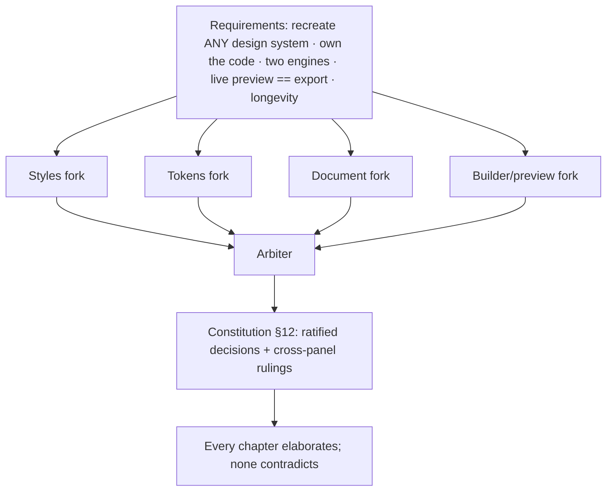

# Decision log — the forks, the choices, the rejected alternatives
> Part of [The Perfect dotUI](README.md) — an end-state architecture study (2026-07-04). Constitution-conformant.

Every other chapter describes *what* the system is. This one records *why it is that and not something else*. The perfect dotUI is the product of a design process with real forks — points where two or more coherent architectures were on the table, each defensible, and one had to win. Four panels each argued a domain (style IR, tokens, config axes, preview/builder), an arbiter ratified a synthesis, and the losing branches were not discarded silently — their specific failure modes are the reason the winners are trustworthy.

This chapter is the ledger of those forks. Each entry has the same shape:

- **Decision** — one sentence, present tense. This is how the system works.
- **Context** — the requirement that forces a choice. A fork exists only because two design goals pull apart; naming that tension is half the justification.
- **The choice & its defense** — what was ratified and the mechanism that makes it hold.
- **Rejected alternatives** — the branches that lost, each with the concrete, checkable reason it failed. These are pulled faithfully from the panels' own analyses and self-declared weaknesses; nothing here is invented to make a loser look worse than it was.
- **Consequences** — what the decision commits the system to, stated with its honest costs. Every choice buys something and pays for it somewhere.

The entries are grouped by domain — **styles**, **tokens**, **the document**, **the builder & preview**, and **cross-cutting** — and closed by the **arbiter rulings** that resolved conflicts *between* panels, where two winning designs disagreed at their shared boundary and the arbiter had to pick the seam.

A note on register: these are settled decisions, not open questions. Where a decision has a genuine cost the system chooses to pay, the cost is stated plainly. A decision log that only lists wins is marketing; this one lists the bills.

---

## Styles

### S1 · Tailwind-native authoring over a typed DSL and over builder-only JSON

**Decision.** Contributors author component styles as Tailwind utility strings in `styles.ts` under a closed whitelist; the engine-neutral [Style Contract](04-styles.md) is a *derived, committed build artifact*, never a hand-written source format.

**Context.** The registry must produce two engines from one source ([04-styles.md](04-styles.md)), which demands an engine-neutral intermediate representation. But CLAUDE.md names a real workflow — "compare against the shadcn equivalent to catch missing classes" — that only works if the source *is* Tailwind. The fork: make the neutral IR the thing humans write (clean multi-engine story, hostile DX), or keep Tailwind authoring and *derive* the IR (familiar DX, a compiler to build and trust).

**The choice & its defense.** Authoring stays Tailwind; the compiler lifts strings into the Contract. The load-bearing guarantee is that the lint rule `dotui/style-subset` **is** the compiler's lowering pass running in dry-run mode — one code path, so a green lint means the file compiles, with exact source offsets and mechanical fixes. Pure `tv()` helpers are evaluated and inlined, which unlocks fragment sharing (Button ⇄ ToggleButton) that a literal-only extractor cannot do. A round-trip self-check (Tailwind → Contract → Tailwind must be computed-style identity) proves the lift is lossless. Contributors keep their muscle memory and their shadcn diff workflow; the Contract exists but nobody types it.

**Rejected alternatives.**

- **A typed `defineStyles` builder DSL as the primary format.** It loses precisely on authoring DX: contributors think in Tailwind, the shadcn copy-paste comparison becomes impossible, and the large `PropKey`/`TokenValue` surface is ceremony the closed-whitelist lint makes unnecessary. Its compiler internals survive as the lift/normalization machinery — only the human-facing format is rejected.
- **Hand-written / committed JSON Contract as the source of truth.** The Contract-as-source makes every PR a semantic-diff-tooling dependency and every merge conflict a JSON-graph conflict; the button base is ~30 `Decl` objects versus a few strings. As a *derived* committed artifact (like today's `__generated__`), it gives every downstream benefit while the reviewable source stays greppable Tailwind.
- **Author-Mode-only authoring (the builder writes JSON; no code path for contributors).** A visual editor as the sole path is a bottleneck by its own admission — any editor gap strands the contributor with no escape hatch, and the raw source is unreviewable in git. Kept instead as an *additive* write path over the same Contract with the same `validate()`, preserving its genuine wins (visual curation, LLM proposals) without the bet.

**Consequences.** The system owns a real compiler — a lowering table every new Tailwind utility family must be added to, and a lint that must stay exactly in sync with it. A bug in lowering is a correctness bug in *both* engines at once, so the blast radius of a compiler defect exceeds a single mis-authored class string. This is the accepted price for keeping authoring familiar and the shadcn-comparison workflow alive.

### S2 · The owned-slot Contract

**Decision.** In the Style Contract, no rule ever describes a property of a node other than its own slot; cross-node selectors (`:has()`, `**:[svg]`, complement expansions) exist only in authoring sugar and are re-homed to the owning slot by normalization.

**Context.** StyleX has no selector engine — no `:has()`, no descendant combinators, no arbitrary cross-node selectors. The requirement is true engine parity ([04-styles.md](04-styles.md)); the hardest fixtures are exactly the cross-node ones in the real button and menu (`**:[svg]:not-with-[size]:size-3.5`, `pending:**:not-data-[slot=spinner]:opacity-0`). Either the neutral IR permits cross-node relationships (and StyleX cannot render them) or it forbids them structurally.

**The choice & its defense.** The owned-slot invariant is the single mechanism that makes StyleX reach parity. Icon sizing authored on root is re-homed to a `size` decl on the `icon` slot; `has-data-icon-end:pr-2` stays a *root-owned* padding decl gated on a dual-bound relation state — the declaration was always about root's own padding, only the trigger crossed nodes; the pending "hide everything but the spinner" complement expands to per-slot `opacity:0` decls. Because the Contract contains no cross-node selector, the StyleX emitter cannot emit an invalid key — parity is structural, not tested-in.

**Rejected alternatives.**

- **Rendering `:has()` / descendant / group predicates as StyleX selector-object keys.** Not valid StyleX: `':is([data-pending]) *:not([data-slot=spinner])'` and `&:has([data-icon-end])` as `stylex.create` keys either fail to compile or depend on experimental contextual APIs. The parity claim collapses on exactly the hard fixtures. Replaced by owned-slot normalization + dual-bound relation states.
- **Lowering `:has()` to a self-attribute condition key.** Semantically wrong: self-attr ≠ contains-child. A button *containing* an end-icon is not a button that *is* an end-icon. Rejected as a correctness bug wearing a portability costume.

**Consequences.** The Contract's property vocabulary (`PropKey`) is a closed, curated enum — a permanent maintenance surface and a hard ceiling. A genuinely novel look (a new filter, an exotic gradient, a niche grid feature) is blocked until someone adds a family with two engine renderings, or reaches for an `EscapeHatch`. The system accepts a bounded vocabulary as the cost of a provable parity guarantee.

### S3 · Dual-bound states with explicit slot props

**Decision.** Each state carries one vocabulary with two bindings — a Tailwind variant (RAC data-attrs, `:has()`) and a StyleX binding (render-prop boolean / pseudo / self-attr) — and relation states (iconStart/iconEnd) are driven by explicit slot props (`prefix`/`suffix`), never by scanning children.

**Context.** `pressed:`/`pending:`/`invalid:` must map identically to RAC data-attrs (Tailwind) and RAC render-prop booleans (StyleX). Relation states are harder: "does this button have an end icon?" must be the *same truth* for both engines, or parity breaks at the source.

**The choice & its defense.** One `StateDecl` vocabulary, two bindings per state, is the same table viewed from two directions — the state model and the variant whitelist graft cleanly because they *are* the same table. For relations, explicit slot props make `hasIconEnd` a deterministic boolean; the slot element carries `data-icon-end`, so Tailwind's `:has()` binding and StyleX's boolean read one source. The StyleX icon-size default ("default unless the user set one") needs no runtime guard at all — merge order gives it: the generated Icon slot merges the default style *before* the user style, and StyleX's last-wins merge is exactly "default unless overridden."

**Rejected alternatives.**

- **Runtime children-scanning (`useSlotRelations`) for relation states.** The style-IR panel's own declared weakness: scanning arbitrary React children on every render is a correctness surface (fragments, portals, memoized children) and a perf tax, and it creates a *second* truth source that diverges from Tailwind's `:has()`. Replaced by explicit slot props reading one source.
- **A runtime `iconHasNoExplicitSize` boolean for the icon-size guard.** The most fragile boolean in the losing design. Eliminated entirely via StyleX merge order — no boolean, no scan, no divergence.

**Consequences.** The exported component API changes shape: icons and addons become explicit `prefix`/`suffix` slots rather than free-form children. This is stricter than "throw any children in" — a deliberate ergonomic narrowing that buys a single deterministic truth source both engines share.

### S4 · Density as hand-authored geometry tables via `sizes()`, not a scale factor

**Decision.** Density × size geometry is authored as explicit tables through the `sizes()` helper (the canonical, mandatory way — see arbiter ruling AR-6); density is a first-class Contract dimension (`role:'density'`), never a single `--density` multiplier.

**Context.** [Density](08-density-sizing.md) touches every sizable component. Two models: a scalar multiplier over spacing tokens (density on the CSS-var hot path, ~150 duplicated ladders deleted) versus hand-authored per-tier tables (fidelity, more data).

**The choice & its defense.** Real ladders are hand-tuned non-linearly — compact `xs` is `h-5`, not `h-8 × 0.7`. A scalar cannot reproduce those steps; forcing it to would require per-token density curves, which reintroduces exactly the per-component authoring the scalar promised to delete. Density changes are keypress-frequency, so a structural-tier recompile of all components (a few milliseconds) is well within budget — the hot-path win the scale factor buys is a win density doesn't need. The `sizes()` helper collapses the triple-authored ladder into one table without pretending geometry is linear.

**Rejected alternatives.**

- **`--density` as a scale factor over spacing tokens.** A fidelity regression the proposing panel self-declared: it flattens hand-tuned non-linear steps to arithmetic. Rejected because density does not need the Tier-1 hot path and the accuracy loss is real and visible.

**Consequences.** A fourth density tier is a data edit, not a refactor — but the geometry tables are the registry's largest single body of authored data, and they must be maintained per component. The system pays authoring bulk for pixel-accurate density.

---

## Tokens

### T1 · The Dimensional Token Graph over flat mode lists and over a frozen global contract

**Decision.** All values flow through one layered, id-stable [Dimensional Token Graph](05-tokens.md) — primitive → semantic → component-contract — whose mode axis is a dimension cube and whose component boundary is a generated per-group contract.

**Context.** Requirement #1 is "recreate ANY design system," which forces two things at once: an *editable* token vocabulary (users add/rename/retarget), and mode composition (high-contrast must work with *every* scheme and *every* brand). Three panels each solved part of this; none solved all of it.

**The choice & its defense.** The graph is the winning substrate because it is the only model that unifies primitives, semantics, and component vars into one validated, id-stable, symbolically-resolvable structure — both emitters, DTCG, verification, preview diffing, and persistence all fall out of it as pure functions. Onto that chassis: dimensions × cells replace the flat mode list (composition for free), and a per-group system-owned contract replaces the frozen global role set (safety without a ceiling).

**Rejected alternatives.**

- **A global frozen 48-role component contract as the component-facing vocabulary.** Directly caps requirement #1: chart tokens (`--chart-1..5`) fit no role; today's 28 per-component scalar vars cannot fold into 9 scalar roles; card/popover/sidebar/tooltip collapse into one "panel" (breaking `modal.background` and other real distinctions); a brand-secondary surface triad is inexpressible. The proposing panel's own weakness list concedes role-count creep would follow — dissolving the "small frozen bottom" thesis. The *insight* survives as system-owned, per-group generated contracts with structural `pairsWith` — same safety, no global ceiling.
- **A flat mode list with an `inherits` chain.** Cannot compose orthogonal concerns: high-contrast × {light, dark, dim, brand} forces hand-enumerated `brand-dark-hc`… combinations. Cell-keyed values subsume the inherit chain's convenience (an option with no keys resolves through less-specific keys) while adding free composition, verified per cell.
- **Direct token binding via a compiled alias table with no layer discipline.** Deletion safety is advisory (a compiler warning), a component's dependency surface into mutable user-space is unbounded, and a token rename regenerates every consumer's class string — component source churns on vocabulary edits. Its mode cube, per-cell generation, and Figma mapping are all adopted; its binding model is not.

**Consequences.** One graph is one heavily-relied-upon code path: a bug in `resolve()` or `materializeRamps` affects Tailwind, StyleX, DTCG, preview, and verification simultaneously — the parity tests that today catch drift between three emitters become one path that needs its own strong invariants ([13-testing.md](13-testing.md)). The builder UI must make a ~200–400 node DAG feel like "pick two seed colors" for casual users. The system accepts concentrated risk and a hard UI challenge in exchange for one queryable model that every artifact projects from.

### T2 · Component contracts generated per sync group, system-owned

**Decision.** Component-contract nodes are generated at registry build from terse `defineContract()`/`surface()`/`scalar()` declarations in `styles.ts`, owned per sync group, and are system-owned: users retarget them but never delete or rename them.

**Context.** Components must reference a *stable* interface (so the vocabulary above can be reshaped without breaking them), but hand-authoring ~40 contract nodes × ~72 components would balloon the registry.

**The choice & its defense.** `surface()` expands to the bg/hover/active/line/`on` sibling nodes and — critically — creates the structural `pairsWith` edge that powers verification of *actually-rendered* pairs. `owner: 'button-like'` on every node *is* the sync mechanism: one owner, N components, `nodesByOwner('button-like')` is the group. Contracts are terse to author and generate the verification edges mechanically.

**Rejected alternatives.**

- **Hand-authored per-component contract nodes.** The proposing panel's own weakness: ~40 nodes × ~72 components hand-written balloons the registry without proportional benefit for components that never need retargeting. Generation is terser and also creates the `pairsWith` edges as a side effect.

**Consequences.** Contract evolution becomes a registry ABI: adding a node is a minor manifest bump (ships a default); renaming/removing is a major bump with a mechanical migration map. The open question of whether *users* can mint new contract nodes (a custom second ring) is resolved conservatively — contract extension is dotUI-registry-versioned; users retarget, dotUI extends.

### T3 · Readable permanent ids over opaque ULIDs

**Decision.** Every token node has a permanent, readable id minted from its initial slug (`color-primary`, `btn-bg-primary`); a separate renamable `name` drives emitted var names and display labels; references always use ids.

**Context.** The longevity requirement needs rename-safe references — renaming a token must not break the systems that reference it. One panel reached for opaque ULIDs (`tk_01H…`) to guarantee stability; the config-axes panel argued the guarantee comes from *discipline*, not opacity.

**The choice & its defense.** The config-axes argument wins: the rename-safety guarantee is "ids are permanent handles, labels rename freely" plus a registry lint that forbids removing or reusing a published id — and readable ids honor that discipline exactly as well as opaque ones, while keeping documents human-diffable and the authoring layer sane. A renamed emission ships a deprecation alias for one major version.

**Rejected alternatives.**

- **Opaque prefixed stable ids (`av_sousse`, `tk_01H…`).** They cost human diff readability and authoring ergonomics and add ceremony without adding any guarantee readable permanent ids can't provide. The rare id-space refactor goes through the same deprecation-note remap either way. Opacity buys nothing the discipline doesn't already buy.

**Consequences.** The safety rests on author discipline plus lint/CI, not on the type system alone — a contributor who hard-deletes instead of deprecating, or reuses an id, breaks the totality the migrations depend on. The system accepts a lint-enforced convention as the price of diffable documents.

### T4 · Producers × cells; independently-generated dark, no ramp reversal

**Decision.** Ramps are pluggable producer declarations (`oklch`/`tailwind`/`contrast`/`material`/`fixed`/open registry) whose config is cell-keyed; dark is genuinely generated per cell (the `oklch` producer is `isDark`-aware) and ramp reversal exists nowhere.

**Context.** Casual users want a good dark for free from one seed; power users want to paste a hand-tuned palette; a Linear-style system wants a third scheme. Today's `dark = reverseRamp(stretchLightness(light))` produces documented per-token tone errors.

**The choice & its defense.** Cell-keyed producer config *is* independently-seeded dark — it deletes reversal at the root. The default `oklch` producer auto-derives a strong dark via `isDark` so casual users are not forced to seed every cell; a second dark seed is an opt-in refinement. `fixed` accepts hand-authored ramps per cell verbatim — the "paste my Radix/corporate palette" flow that today's `resolveColorConfig` rejects. High-contrast is not a separate producer: `contrastBoost` raises the target ramp toward AAA inside the *same* producer, which is why hc composes with every scheme for free.

**Rejected alternatives.**

- **Reverse-ramp dark as the default derivation.** Deleted at the root, not softened. It carries documented tone errors and cannot express an independent dark accent. Per-cell producer config subsumes the "free dark from one seed" convenience without the reversal compromise.
- **Rejecting `fixed` / hand-authored ramps (today's stance).** Reversed. "Recreate any design system" includes pasting Geist's hand-tuned grays; a generative-only engine cannot. `fixed` is first-class.

**Consequences.** Independently-seeded dark is more work for a user who wants a *bespoke* dark than reverse-ramp was — the default must ship a genuinely strong auto-derived dark or the flexibility becomes a burden. Every producer must now behave correctly for arbitrary polarities and surfaces; a third-party producer that only handles light could silently degrade dark cells. StyleX consumers who change a seed must re-run the dotUI generator — producers run at compile time in JS, so live in-consumer regeneration is a Tailwind-CSS-var-only capability.

### T5 · Propose-don't-impose contrast autofix

**Decision.** Contrast verification runs per reachable cell over structurally-derived pairings; autofix is a *proposed, cell-scoped graph edit* the user accepts, never a silent correction of resolved output.

**Context.** The a11y guarantee must be enforceable (requirement: a system literally cannot ship an illegible primary button in strict mode) without breaking the source ↔ preview ↔ export equivalence that fidelity depends on.

**The choice & its defense.** Pairings come from three sources in priority order — structural contract pairs (`surface()` creates them), engine `on`-pairs, and declared semantic pairs — so the pairs that *actually render* are always known. `nudgeForTarget` produces a `{ tid, cellKey, newValue }` that appends an override key to the *failing cell only*, applied on user accept: it cannot regress other cells (scoped by construction) and it stays visible in the stored graph.

**Rejected alternatives.**

- **Autofix that corrects the resolved output while leaving the token untouched.** Silently diverges resolved values from the source graph, so preview/export no longer equals what the document says — breaking fidelity and DTCG round-trip coherence, and hiding the failure instead of teaching the user. Replaced by propose-and-accept, cell-scoped keys.
- **Per-token user-space `pairsWith` as the *primary* pairing source.** Makes the a11y guarantee depend on users maintaining metadata; a forgotten or wrong `pairsWith` silently drops coverage of a rendered pair. Demoted to an optional third source behind the structural contract pairs.

**Consequences.** For a tightly-constrained brand palette, autofix may not converge and degrades gracefully to a report — the guarantee is "we tell you, and offer a scoped fix," not "we always fix it." Alpha/mix compositions are verified against the resolved composite over the cell's surface, which is more work than pair-of-solids checking.

---

## The document

### D1 · A pinned immutable Registry Manifest over diff-vs-live-defaults and over schema-major-pinned baselines

**Decision.** Every [dsdoc](09-dsdoc.md) pins an immutable, content-addressed [Registry Manifest](03-registry.md) snapshot; an omitted value means "the pinned manifest's value," never "whatever today's code says."

**Context.** The canonical form omits defaults to keep documents tiny and diffs meaningful. But "omit the default" only works if the default is *stable* — and dotUI's baseline (axes, token defaults, style layers) changes far more often than the document *shape*. The fork is entirely about what "the default" is pinned to.

**The choice & its defense.** The manifest snapshot is immutable, content-addressed (`2028.03.01-a3f`), and kept forever npm-style. A two-year-old document resolves against its *own frozen manifest* — its axes, values, defaults, and style layers are exactly what they were the day it was authored. This kills the silent-reinterpretation bug structurally: defaults are frozen data inside a snapshot, not live code. `reconcile(doc, newManifest)` is then an *explicit, reviewable* act that shows a deprecation diff before anything changes.

**Rejected alternatives.**

- **Diff against live code-derived defaults (today's model).** The documented longevity bug: renaming a default silently reinterprets every stored system, and a decode failure silently discards the user's work. Superseded structurally.
- **Pin the omitted-defaults baseline by schema major.** The baseline changes far more often than the document shape, so pinning by schema major either freezes the baseline within a major or forces a schema bump for every trivial baseline tweak — a rigidity the proposing panel listed as its own weakness. An immutable content-addressed snapshot pins vocabulary *independently* of schema shape and is strictly better.

**Consequences.** "Published means permanent" is a real storage and operational liability: the registry can never delete a snapshot a document might pin, and must serve `/r/manifest/<v>` for arbitrarily old versions. The retention answer (arbiter ruling AR-10) is a hot-serve window plus a cold-storage tier — permanent, but tiered.

### D2 · The Dimensional Token Graph as the single document token model

**Decision.** The dsdoc stores tokens as one `tokens: TokenGraphOverlay` section — an overlay over the pinned manifest's baseline graph — replacing any separate primitives/modes/tokens trio.

**Context.** The config-axes panel proposed a `primitives` / `modes` / `tokens` trio inside the document. The tokens panel proposed the Dimensional Token Graph as the one model for *everything*. At the shared boundary these disagree: is the document's token model the graph, or a simpler three-field split?

**The choice & its defense.** The graph wins (arbiter conflict resolution): the dsdoc stores an overlay (added/changed dimensions, ramps, nodes) over the pinned baseline graph. There is one model, not two — the builder edits the graph, the document persists a graph overlay, the compiler merges baseline ⊕ overlay. `GenerationRecipe.modeDerivation (reverse|reseed|shift)` does not exist as a separate concept; per-cell producer config subsumes it (see T4).

**Rejected alternatives.**

- **A separate `primitives` / `modes` / `tokens` trio in the document.** Introduces a second token representation that must be kept coherent with the graph the tokens panel already proved out. Collapsed into the single overlay — one model, one set of invariants, one migration story.
- **A declared `modeDerivation` policy field (`reverse`/`reseed`/`shift`).** Redundant once producer config is cell-keyed. `reseed` is a second seed in a cell key; `shift` is a producer knob in a cell key; `reverse` is deleted. Removed as a distinct concept.

**Consequences.** The document commits to the graph's full expressive weight even for simple systems — a "just two seeds" design still serializes as a graph overlay. The canonical-form machinery (omit baseline-identical entries under the lock) keeps that overlay small in practice, but the *model* the document speaks is always the graph.

### D3 · Contract-delta component overrides, not raw class strings

**Decision.** User component overrides are stored as lifted Style Contract deltas (JSON), not as raw Tailwind class strings; raw Tailwind input and the builder's style editor both funnel through the same lift/validate at edit time.

**Context.** "Recreate ANY design system" requires document-carried component overrides (when no curated enum value matches Geist's flat black button, the document must carry the look itself). But the document also targets StyleX, where an unliftable class must be rejected — and it must be rejected *when the user types it*, not at export.

**The choice & its defense.** Whatever the user authors — a raw Tailwind string or a builder-editor gesture — is lifted to a Contract delta at edit time, where StyleX totality is checked immediately. The document stores the *lifted* delta, so it is engine-neutral by the time it is persisted, and a class with no StyleX mapping is a clear error at edit time under `engine: 'stylex'`, never a silent divergence at export.

**Rejected alternatives.**

- **Storing raw class strings in the document.** They are engine-specific by construction and defer the StyleX-totality check to export, where a failure is far from the edit that caused it. Rejected in favor of edit-time lifting.

**Consequences.** Users cannot freely paste *arbitrary* Tailwind and get StyleX out — the vocabulary is bounded by the lift, which slightly dents the "any design system" promise for the StyleX target specifically. Under `engine: 'tailwind'` the bound is looser; under `engine: 'stylex'` it is enforced at the keystroke.

### D4 · Detachable structural sync groups

**Decision.** A synced axis's selection is stored **once** under the group id (divergence is unrepresentable by default), and the only way a member diverges is an explicit `detached` record plus a component-scoped selection, validator-enforced.

**Context.** Button ⇄ ToggleButton must not drift by accident — the data model should make accidental divergence impossible. But real systems sometimes want "mostly synced with one intentional exception" (ToggleButton's selected state).

**The choice & its defense.** Store-once makes accidental drift structurally impossible; the detach record makes intentional divergence *declared* rather than accidental. The validator enforces the biconditional: a component-scoped selection of a synced axis exists **iff** a matching detach record exists. The builder renders synced axes once at the group header, shows a "detached" chip on the exception, and re-sync is one click (delete both records).

**Rejected alternatives.**

- **Full-sync-only with no per-member escape hatch.** Real systems want the one intentional exception; forcing full sync pushes users to duplicate axes — the proposing panel's own weakness cites ToggleButton's selected state. The detach escape hatch (from the axis-kernel panel) keeps sync structural while making exceptions declared.

**Consequences.** There is a small validator surface to maintain (the detach biconditional, the "every `syncedAxes` entry appears in each member's `axes`" check). The system accepts that in exchange for a data model where the common case cannot drift and the exception cannot be accidental.

### D5 · Fan-out axes for grouped tweaks, not merged selection patches

**Decision.** Sticky grouped tweaks (translucent overlays, etc.) are ordinary axes with a fan-out `writes: WriteTarget[]` list carrying per-value `when` conditions; one-shot presets are `SelectionPatch` bundles applied once at edit time.

**Context.** "Translucent menus/popovers as a single switch" is one visual decision that touches several tokens. It could be a macro that *merges* several writes into `selections` at toggle time, or an axis whose one selection *fans out* at resolve time.

**The choice & its defense.** A fan-out axis resolves at resolve time: one selection, one generated switch, toggling off is just the other value, and export honors it through the same resolver. The two primitives are cleanly split — sticky tweaks (ongoing state) are axes; one-shot personalities ("start from Linear," no ongoing state) are patches.

**Rejected alternatives.**

- **Sticky grouped tweaks as selection patches merged at edit time.** Once a patch is merged into `selections`, the switch's state is ambiguous the moment any written value is edited, and un-applying requires an inverse patch. The fan-out axis has no such ambiguity. Patches remain only for one-shot presets, which have no ongoing state.

**Consequences.** A grouped tweak's several targets live in one axis's `writes` list with `when` predicates — a slightly richer axis schema than a plain enum. That richness is the whole point: grouped tweaks are a *data shape*, not special-cased code.

---

## The builder & preview

### B1 · An isomorphic worker/server compiler over precompiled-sheet purism and over main-thread compilation

**Decision.** One pure `resolve(manifest, dsdoc)` and one pure `compile(resolved, target)` run byte-identically in a browser worker (the live preview) and on the server (every export endpoint); the worker holds the [ResolvedSystem](11-compiler.md) and receives only tiny classified edits.

**Context.** The two headline builder requirements pull apart: *preview must equal export* (which wants one code path) and *theme-wide changes must hold 60fps over a full showcase* (which wants the hot path to touch nothing but CSS variables). A third pressure — user-defined tokens and custom styles are a *first-class product requirement*, not an edge case — rules out any closed precompiled matrix.

**The choice & its defense.** The isomorphic compiler makes fidelity structural: the class string on a preview DOM node is character-for-character the class string in the exported file, because both come from the same `compile()`. The worker holds the ResolvedSystem and receives small classified edits — never a whole-doc clone per tick — so value-keyed caches survive across frames (fixing the identity-cache defeat that makes today's iframe re-run the kernel every slider tick). The value tier is pure `setProperty` writes; a hue drag is rAF-coalesced → one ramp recomputed per cell → ~22 var writes → var-only invalidation, zero React renders.

**Rejected alternatives.**

- **A precompiled data-attribute preview sheet (`className="btn"` + `[data-c][data-density]` rules) as the preview substrate.** Breaks the first criterion structurally: the preview renders different markup and cascade mechanics (flat lowered CSS, attribute selectors) than the export (`tv()` utility class lists), and "reconstructing idiomatic Tailwind from the lowering" is a *second compiler* — exactly the divergence seam the design exists to eliminate. It also bets on a closed curated matrix, which conflicts with user-defined named styles being first-class. Its performance win is retained anyway — the isomorphic compiler's value tier is the same one-`setProperty` hot path.
- **A main-thread compiler with path-scoped subscriptions.** Its 60fps guarantee hinges on CRDT materialization preserving structural sharing precisely — a correctness-critical invariant the proposing panel itself flags as easy to violate silently. Moving the kernel and fold into a worker that owns the IR makes the hot path robust by construction: the main thread only ever applies var ops and class-map swaps.

**Consequences.** A client/server version-skew risk appears: `IR.version` is a content hash and the server must reject or refresh a stale client, or a stale client previews a different result than the server exports. The builder ships a non-trivial payload (publishables JSON, the static utility layer, lazy WASM Tailwind) per session. The system accepts version-handshake machinery and a payload budget for a fidelity guarantee that no test can be relied upon to catch after the fact.

### B2 · Preview executes the selected engine

**Decision.** The live preview runs the engine the document selects — StyleX documents preview real StyleX, Tailwind documents preview real Tailwind — with a static precomputed atomic layer keeping StyleX cold start on par with Tailwind's.

**Context.** The config-axes panel proposed rendering the *Tailwind* emission even when `engine: 'stylex'`, with StyleX parity guaranteed by shared IR + shared CSS vars + a CI computed-style diff. This is cheaper (no live StyleX compilation in the browser) but means a StyleX user previews a proxy, not their actual output.

**The choice & its defense.** The arbiter ruled the preview must literally execute the selected engine: StyleX users must preview exactly what they export. StyleX atomic-rule emission is deterministic JS hash-and-emit (no WASM), regenerated on structural changes only; a static precomputed atomic layer for the base document keeps its cold start equal to Tailwind's. "Proven-parity" is a strong property, but for the flagship promise — *what you see is what you own* — a proxy preview is not good enough.

**Rejected alternatives.**

- **Render the Tailwind emission even under `engine: 'stylex'`, backed by a CI parity suite.** Acceptable-parity, not literal-parity: a StyleX user sees Tailwind output and trusts a test that the exported StyleX matches. The arbiter rejected the proxy for the engine the user actually ships. The parity CI is *kept* — but as a guard on top of real execution, not as a substitute for it.

**Consequences.** StyleX gets a heavier structural/global tier than Tailwind (it regenerates atomic rules; Tailwind appends to a static layer) — the two engines are equal on *fidelity* but not identical on *preview performance*. The system pays a precomputed-atomic-layer build cost to equalize cold start, and accepts a slightly heavier StyleX interaction cost, to keep the preview honest to the shipped engine.

### B3 · Scoped-inline preview over iframe-first (iframe kept for device frames and embeds)

**Decision.** The editing preview mounts the real registry `base.tsx` files inline in the builder's own React tree under a `DesignScope` (scoped-inline); the iframe is reserved for device-width frames and third-party embeds.

**Context.** The iframe + postMessage boundary is the root cause of today's perf cliff (structured-clone defeats identity caches) and blocks shared-context features (hover a preview button → open its editor; AI highlights a node). But an iframe gives true isolation and correct viewport-media-query reflow that a fixed-width scope container cannot.

**The choice & its defense.** Scoped-inline removes the realm boundary — the docs `scoped` mode already proves closure + RAC portal redirection + CSS containment works — so the store, context, and hover-to-edit are shared, and the postMessage identity barrier is gone. The `./styles` import resolves to a live style module (`createLiveVariants`) whose sole job is guarded by a CI property test (arbiter ruling AR-9). The iframe is not deleted; it is used *where it is right* — the `/embed/:docId/:view` route for device frames and third-party embeds (arbiter ruling AR-7).

**Rejected alternatives.**

- **Iframe + postMessage as the primary editing preview (today's architecture).** The realm boundary is the perf cliff and blocks shared-context features. Kept only where isolation is genuinely wanted: embeds and device frames.

**Consequences.** Scoped-inline trades hard isolation for speed: a badly-behaved showcase component or a colliding user-defined CSS var could leak across the scope boundary in ways an iframe would contain, and getting portal/overlay redirection perfectly right for every RAC component is ongoing work. Device-width preview cannot use viewport media queries in a fixed-width container — which is exactly why registry authoring *mandates* container queries and device frames go through the iframe (AR-7). The system accepts a softer isolation boundary and a container-query authoring rule as the price of one shared React tree.

### B4 · A generated panel where every control returns a real command

**Decision.** The builder panel is generated by walking axis schemas — one control per `kind`, no hand-written per-axis React — and each axis's `toCommand` must return a real Command (a stub control is a type error).

**Context.** Today's builder has per-axis React modules and a parallel `?lab=true` universe that drift. The requirement is that adding an axis to the manifest grows a control with zero UI code.

**The choice & its defense.** There is exactly one panel, generated from `manifest.axes ⊕ doc.axes`, filtered by shared `when` predicates (one rule for panel visibility *and* resolution), grouped by `ui.group`. The `toCommand`-returns-a-real-command type constraint makes a no-op control impossible to ship. Component axes are synthesized from contract declarations, but *exposure is curated* — an internal mechanic var is not an axis unless declared.

**Rejected alternatives.**

- **Auto-deriving a builder axis from every `--component-*` variable with no opt-out.** Removes curatorial control: some component vars are internal mechanics (hairlines, hit areas), not user knobs — the project's own hardcoded-values test says mechanics stay plain. Adopted instead: single-source derivation to kill triple-declaration drift, but exposure is *declared* in the schema.

**Consequences.** A purely schema-driven panel caps the delight of bespoke controls — the color-engine editor and ramp grids need `ui.control` rich-widget hints (presentation only, same state model). The system accepts a small rich-widget registry as the one concession to generated-UI purism.

### B5 · Commands / LWW op-log over a full CRDT

**Decision.** In-session editing is a Command op-log with last-writer-wins per `(node, key)` cell and a sync/presence seam — not a full CRDT; the persisted artifact is always the canonical dsdoc.

**Context.** The builder needs undo/redo, drag coalescing, AI staging on a throwaway branch, and a path to collaboration. A full CRDT gives multiplayer merge semantics but is heavy machinery for what is usually a single-user session, with subtle undo-over-interleaved-ops edge cases.

**The choice & its defense.** The op-log gives O(1) invertible undo/redo, drag coalescing into one undo entry, and `batch` as one step — and its LWW cells plus a stubbed sync/presence seam make collaboration *possible* without building it now. The persisted artifact is the canonical dsdoc, so the op-log is an editing convenience, never the source of truth.

**Rejected alternatives.**

- **A full CRDT document store (Yjs/Loro) as the foundation.** Heavy machinery for a mostly single-user session; it adds a materialization layer and merge-conflict semantics with subtle undo-over-collaborator-ops UX, and the panels that proposed it conceded merge semantics were under-specified. The LWW op-log keeps the command/branch API from day one and defers real multiplayer without rearchitecting.

**Consequences.** Real-time multiplayer is not shipped — only its seam. If collaboration becomes a priority, the LWW cells and sync channel are the on-ramp, but conflict semantics richer than last-writer-wins would be new work. The system accepts a deferred-multiplayer position in exchange for not paying CRDT complexity in the common single-user case.

---

## Cross-cutting

### X1 · One dsdoc, many packagings

**Decision.** Distribution is one [ResolvedSystem](11-compiler.md), many [packagings](12-distribution.md) — shadcn CLI, v0, Bolt/Lovable, zip, DTCG/Figma, MCP/agents — each a downstream projection of the same compile, never a parallel pipeline.

**Context.** Export is wide — shadcn CLI, v0, Bolt/Lovable, zip, DTCG/Figma, MCP/agents — and keeps widening. If each target were its own pipeline, they would drift, and "preview equals export" would hold for one target and fail for the rest.

**The choice & its defense.** Every target reads one `ResolvedSystem`; `compile(resolved, target)` differs only in the final packaging. `/r/bundle?doc=…&target=…` carries per-target profiles that declare their *constraints* (no `css`/`cssVars` fields, dep pinning, file layout) rather than forking the compiler. DTCG is a token-graph serialization, not a re-derivation; the MCP server exposes the same compose/export tools an agent needs.

**Consequences.** A new export target is a packaging profile plus a distribution endpoint, not a compiler. The compiler must stay target-agnostic — target-specific logic that leaks into `resolve()`/`compile()` core is the failure mode this guards against.

### X2 · codeStyle as AST transforms, never regex or `// MARK:` anchors

**Decision.** `codeStyle` options ([the ownership layer](11-compiler.md)) are AST transforms over the emitters' typed output, with a CI invariant that every transform is AST-equivalent modulo formatting; they are never regexes over strings or hand-maintained comment anchors.

**Context.** "The exported design system should read like the user's codebase, not ours" — arrow vs function declaration, `tv()` class arrays vs one line per slot, section comments or not. Today's approach leans on in-band `// MARK:` anchors that desync from source.

**The choice & its defense.** Section boundaries come from the Contract's rule grouping, not comment markers; every knob is a transform over the emitter's typed AST. The CI invariant (AST-equivalence modulo formatting) means a code-style transform cannot silently change semantics — `oxfmt`/format is never silently swallowed.

**Consequences.** codeStyle multiplies the emitter test matrix (engine × code-style knobs), which is more golden-test surface than a single-style world. The system pays that test breadth to guarantee the exported file reads like the user's own code without ever altering behavior.

---

## Arbiter rulings (cross-panel conflicts)

The panels each won their domain, but four winning designs meet at shared boundaries, and at each boundary two designs disagreed. These are the rulings that fixed the seam. They are first-class decisions — the system depends on them exactly as much as on the domain choices above.

### AR-1 · Contract nodes reference component-contract or semantic nodes; flatten-on-export

**Decision.** A component declaration may reference component-contract nodes (`{componentVar}`) or semantic nodes (`{semantic}`) — never primitives — and on export, where a contract node still points at its default target, the Tailwind emitter emits the idiomatic semantic utility (`bg-primary`); retargeted nodes emit the var form.

**The conflict.** The style-IR panel's Contract allowed decls to reference semantic *and* component-contract nodes. The tokens panel's stricter prose said components consume *only* layer-3 contract vars. Left unresolved, the emitters wouldn't know whether `bg-primary` is legal in a component or must always be `bg-(--btn-bg-primary)`.

**The ruling.** The token graph's edge rule wins as the reference rule: components may reference contract nodes *or* semantic nodes, never primitives — the tokens panel's "only layer-3" prose is overruled as too strict. On export, `codeStyle.tokenIndirection: 'flatten' (default) | 'preserve'` decides shape: `flatten` emits the semantic utility where the contract node is at its default (so exported code reads like hand-written shadcn), `preserve` keeps the var indirection. This is why exported files don't drown in `--btn-*` var references for untouched buttons while still allowing full retargeting.

**Consequences.** Two legal reference tiers in component source means the round-trip test (Tailwind → Contract → Tailwind) must canonicalize both. Flatten-on-export means the *same* component emits different (equivalent) code depending on whether a node was retargeted — correct, but a reviewer diffing two exports must know that a `bg-primary` → `bg-(--btn-bg-primary)` flip is a retarget, not a bug.

### AR-2 · The Dimensional Token Graph replaces the dsdoc token trio

**Decision.** The dsdoc's token model is a single `TokenGraphOverlay`; the config-axes panel's `primitives`/`modes`/`tokens` trio is replaced.

**The conflict.** Two winning designs proposed two token representations for the document — the tokens panel's one graph, the config-axes panel's three fields. (Formalized above as D2; recorded here as a first-class arbiter ruling because it resolved a direct cross-panel disagreement.)

**The ruling.** One model. The graph is the single source; the document stores an overlay over the pinned baseline graph; `modeDerivation` does not exist as a separate concept because per-cell producer config subsumes it.

**Consequences.** See D2 — the document speaks the graph even for trivial systems, kept small by canonical form.

### AR-3 · Readable ids, ratified across panels

**Decision.** Readable permanent ids (not opaque ULIDs) are the id scheme for *both* token nodes and document referents.

**The conflict.** The tokens panel minted opaque ULID-like node ids; the config-axes panel argued readable-but-permanent ids for document referents. A system with opaque token ids but readable axis ids would be internally inconsistent and half-diffable.

**The ruling.** Readable everywhere. The guarantee is the "ids are permanent handles, labels rename freely" discipline plus a registry lint — which readable ids honor as well as opaque ones, while keeping *all* documents human-diffable. (See T3 for the full defense.)

**Consequences.** One id discipline across tokens and axes; one lint enforces both.

### AR-4 · Preview executes the selected engine

**Decision.** The preview runs the document's engine; it does not render a Tailwind proxy for StyleX documents.

**The conflict.** The config-axes panel's engine seam rendered the Tailwind emission under `engine: 'stylex'` and leaned on a CI computed-style diff for parity; the preview-builder panel ran the selected engine directly.

**The ruling.** Execute the selected engine (full defense in B2). Proven-parity is kept as a *guard*, not as a substitute for showing the user their real output.

**Consequences.** See B2 — StyleX carries a heavier structural tier, equalized at cold start by a precomputed atomic layer.

### AR-5 · `sizes()` is mandatory, not optional sugar

**Decision.** The `sizes()` helper is *the* canonical way to author density × size geometry tables; new components must use it, and ad-hoc per-density ladders do not pass review.

**The conflict.** The style-IR panel offered `sizes()` as *optional* typed sugar over string authoring, and left open whether the old triple-layer ladder style could persist. Optional sugar means two authoring styles coexist, which breaks the "one canonical source style" rule the codeStyle transforms depend on.

**The ruling.** `sizes()` is mandatory for new components. One authoring style for geometry means the lift, the density-dimension folding, and the codeStyle transforms all operate over one shape. Ad-hoc ladders are a review failure, not a style preference.

**Consequences.** Contributors have less freedom in how they express size ladders — a deliberate normalization. The payoff is that density folding and `codeStyle.density` (baked/runtime) are mechanical over one table shape rather than pattern-matching arbitrary ladders.

### AR-6 · Explicit slot props over children scanning

**Decision.** Relation states (iconStart/iconEnd) are driven by explicit slot props (`prefix`/`suffix`); Tailwind keeps idiomatic `:has()` bindings, and the StyleX icon-size default is guaranteed by merge order (default style before user style) — no runtime children scan anywhere.

**The conflict.** The style-IR panel's Contract needed relation booleans; one path computed them by scanning children (`useSlotRelations`), another by explicit slot props. Scanning creates a truth source that diverges from Tailwind's `:has()`.

**The ruling.** Explicit slot props are the single truth source; both engines' bindings read it. Tailwind's `:has()` binding and StyleX's boolean read the same `data-icon-end`. The icon-size guard is eliminated via merge order rather than a scanned boolean. (Full defense in S3.)

**Consequences.** The exported component API uses explicit `prefix`/`suffix` slots — stricter than free-form children, in exchange for deterministic parity.

### AR-7 · iframe for device frames and embeds only

**Decision.** The editing preview is scoped-inline; the iframe is used only for the device-width preview and for third-party embeds, and registry authoring *mandates* container queries so components reflow correctly inside the fixed-width scope container.

**The conflict.** Scoped-inline wins the editing loop (B3), but a fixed-width scope container cannot reflow components that use *viewport* media queries — an iframe can. Either mandate container queries (end-state-clean, one authoring rule) or keep an iframe in the hot loop (defeats scoped-inline's whole point).

**The ruling.** Both mechanisms, each where it is right: registry authoring mandates container queries (so inline scoped preview reflows correctly), and genuine device frames go through the `/embed/:docId/:view` iframe route. The editing loop never touches an iframe.

**Consequences.** A hard authoring rule — components must use container queries, not viewport media queries, for responsive behavior. This is a real constraint on how registry components are written, accepted because it keeps the editing preview inline and fast.

### AR-8 · LWW command log over CRDT

**Decision.** The in-session store is a custom LWW-cell command log with a sync/presence seam, not a full CRDT.

**The conflict.** The preview-builder panels split on the store substrate — Yjs/Loro CRDT versus a custom command log — and on whether sync/presence ship at launch.

**The ruling.** Custom LWW command log; the command/branch API exists from day one, real multiplayer merge is deferred behind the seam. (Full defense in B5.)

**Consequences.** Multiplayer is a seam, not a feature — see B5.

### AR-9 · Live-variants conformance is property test *and* computed-style diff

**Decision.** The one preview seam — `createLiveVariants` behind the `./styles` import — is verified by both a randomized property test (`createLiveVariants(x)(props) === tv(emitFiles(...))(props)`) *and* computed-style sample diffs, not by property test alone.

**The conflict.** The live style module is load-bearing for the entire fidelity argument (it is the one place preview and export code differ). One panel proposed a property test over `base.tsx` patterns; the question was whether that alone is enough to *trust* the shim as the single fidelity seam.

**The ruling.** Both. The property test proves the callable's class output matches across randomized docs and props; the computed-style sample diff proves the *rendered result* matches for a sample matrix per component. The shim gets a conformance suite, not trust.

**Consequences.** More CI surface on the one seam that could invalidate the whole fidelity guarantee — the system deliberately over-tests the single narrow place where preview and export code paths are not literally identical.

### AR-10 · Headless strict export, cube guardrails, manifest retention

Three operational rulings that the panels raised as open questions and the arbiter closed.

**Headless strict export.** When `strict` contrast enforcement runs in a headless/CI/programmatic export with no user to accept a proposed fix, the export **blocks with a machine-readable report**; `--accept-fixes` applies the proposed cell-scoped fixes and emits a manifest of what was applied. The conflict was block-vs-auto-apply; the ruling keeps propose-don't-impose (T5) as the interactive default *and* gives automation an explicit, audited opt-in — never a silent auto-correction.

**Cube guardrails.** The builder soft-caps at **4 dimensions / 24 reachable cells** with UI guidance; verification is incremental on edit and full-matrix at export/publish. The conflict was whether strict-mode verification could stay interactive as the cube grows. The ruling: incremental verification (touched pairings × affected cells) keeps edits interactive under the cap, and the full matrix runs at export — so the interactive path never pays the whole cube's cost, and the export path never skips it.

**Manifest retention.** "Published means permanent" is resolved as a **hot-serve window plus a cold-storage tier** — old snapshots remain resolvable (a two-year-old dsdoc must open), but not all at hot-path latency. Nothing a document might pin is ever deleted; the cost is bounded by tiering, not by expiry.

**Consequences.** Strict export has two honest modes (block with report; accept-fixes with manifest) that CI pipelines must choose between explicitly. The 4-dimension / 24-cell cap is a real product limit — a system needing a fifth orthogonal dimension hits UI guidance, a deliberate guardrail against combinatorial verification blow-up. Manifest storage grows monotonically forever, tiered to keep the hot path fast and cold snapshots merely slower, never gone.

---

## The shape of the whole, in one table

Every ratified decision, its winner, and the one-line reason the alternative lost.

| # | Decision | Winner | Why the alternative lost |
|---|---|---|---|
| S1 | Authoring format | Tailwind strings → derived Contract | A typed DSL kills the shadcn-diff workflow; JSON-as-source makes every PR a semantic-diff dependency |
| S2 | Contract shape | Owned-slot invariant | Cross-node selectors as StyleX keys don't compile; self-attr ≠ contains-child |
| S3 | State model | Dual-bound + slot props | Children-scanning is a correctness surface and a second truth source |
| S4 | Density | Hand-authored `sizes()` tables | A scale factor can't reproduce hand-tuned non-linear ladders |
| T1 | Token model | Dimensional Token Graph | Frozen 48-role contract caps flexibility; flat mode list can't compose orthogonal modes |
| T2 | Contracts | Generated per sync group | Hand-authoring ~40 nodes × ~72 components balloons the registry |
| T3 | IDs | Readable permanent | Opaque ULIDs cost diffability, buy nothing the discipline doesn't |
| T4 | Generation | Producers × cells, real dark | Reverse-ramp carries tone errors; generative-only can't paste a palette |
| T5 | Contrast fix | Propose-don't-impose | Silent output correction breaks source↔preview↔export equivalence |
| D1 | Baseline | Pinned immutable manifest | Diff-vs-live silently reinterprets; schema-major pinning freezes the baseline |
| D2 | Doc tokens | Single graph overlay | A separate trio is a second token representation to keep coherent |
| D3 | Overrides | Contract deltas | Raw class strings defer the StyleX-totality check to export |
| D4 | Sync groups | Store-once + explicit detach | Full-sync-only forces axis duplication for one exception |
| D5 | Grouped tweaks | Fan-out axes | Merged patches make the switch's state ambiguous after any edit |
| B1 | Compiler | Isomorphic worker/server | Precompiled sheet is a second compiler; main-thread hinges on fragile sharing |
| B2 | Preview engine | Selected engine | A Tailwind proxy isn't what a StyleX user ships |
| B3 | Preview mount | Scoped-inline | Iframe boundary is the perf cliff and blocks shared context |
| B4 | Panel | Generated, real commands | Auto-axis for every var removes curatorial control over mechanics |
| B5 | Store | LWW command op-log | Full CRDT is heavy for a single-user session |
| X1 | Distribution | One system, many packagings | Parallel pipelines drift |
| X2 | codeStyle | AST transforms | Regex / `// MARK:` anchors desync from source |
| AR-1 | References | Contract/semantic + flatten | Strict layer-3-only drowns exports in var refs |
| AR-9 | Preview seam | Property test + computed diff | Property test alone doesn't prove the rendered result |
| AR-10 | Ops | Block/accept-fixes · 4-cube cap · tiered retention | Silent auto-fix, unbounded cube, and deletion each break a guarantee |

---

*This log is the intellectual spine of the study. Every other chapter takes these decisions as settled and shows how they compose. Where a chapter states a cost, it is a cost named here first — the perfect dotUI is perfect because it knows exactly what it pays, and for what.*
