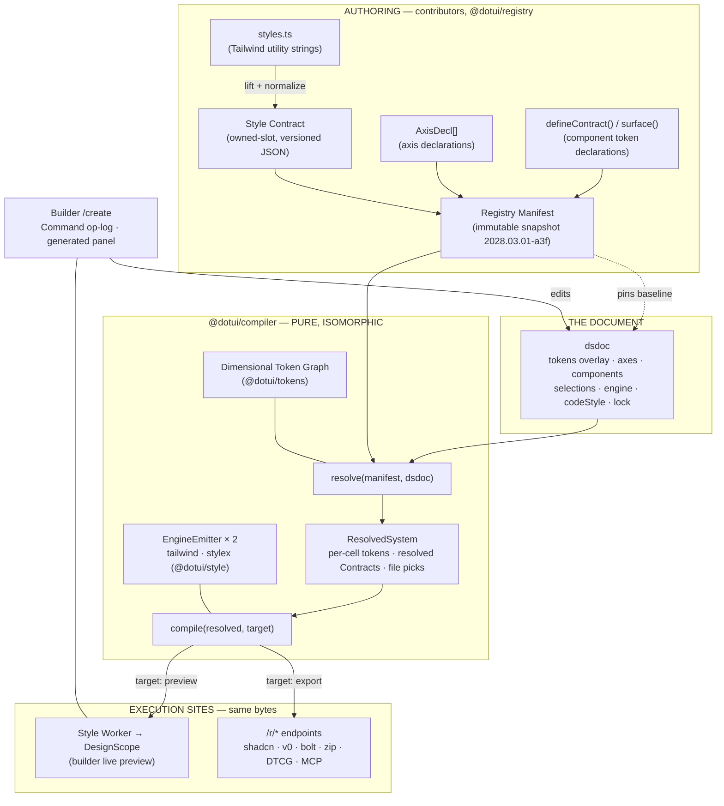
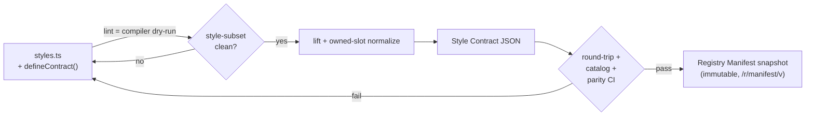
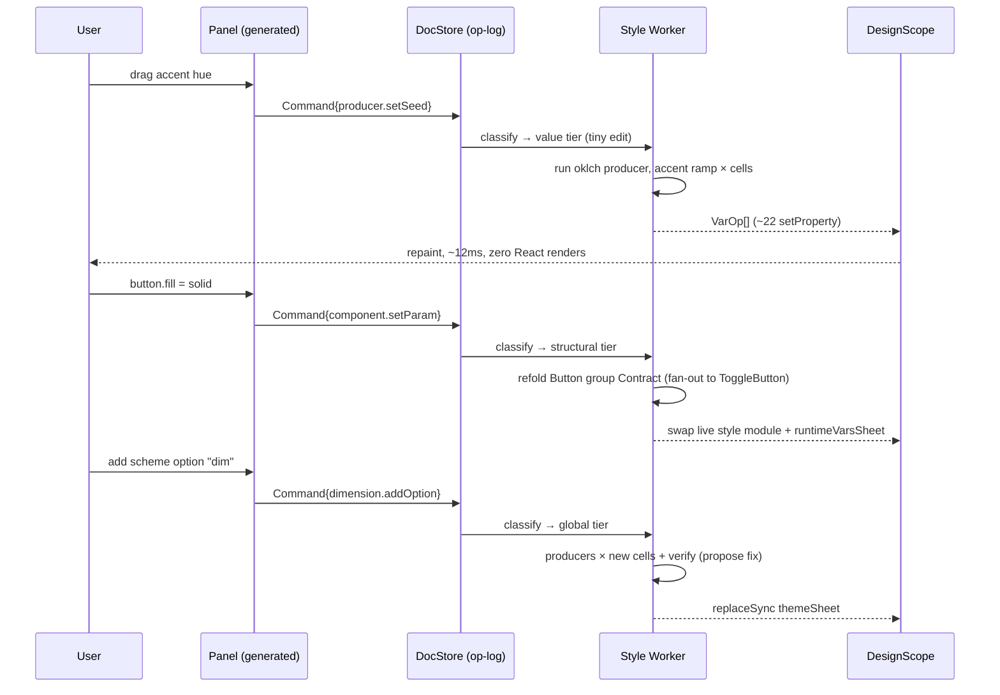
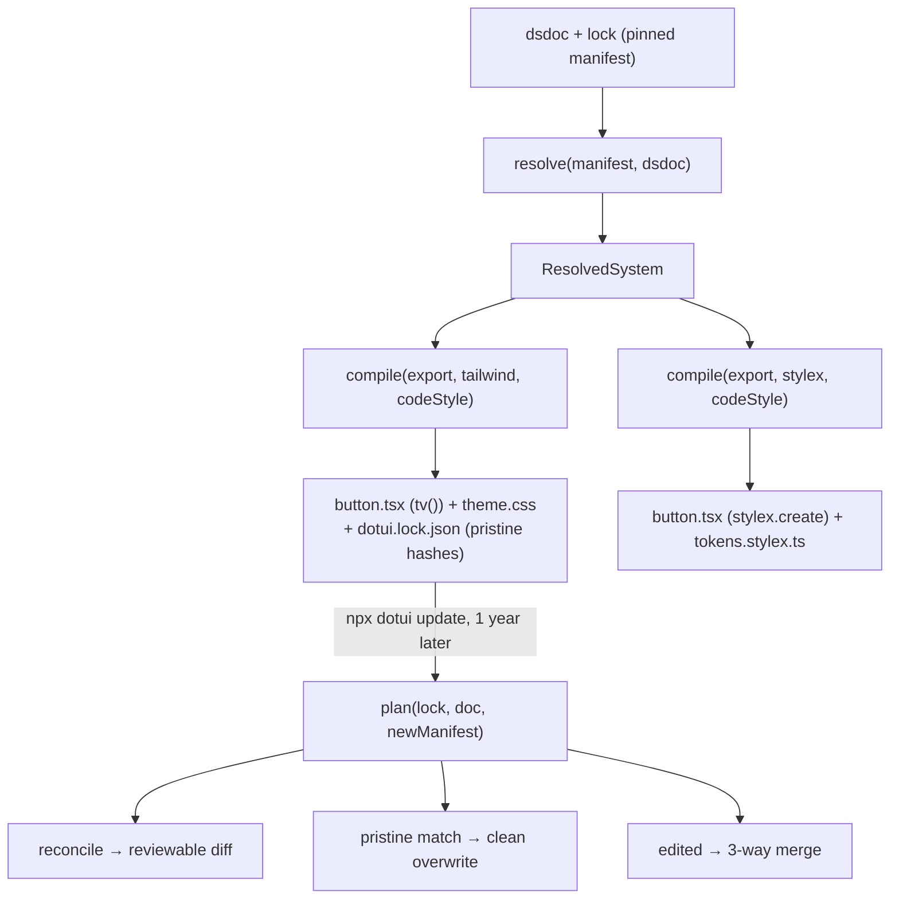

# System overview — how the perfect dotUI fits together
> Part of [The Perfect dotUI](README.md) — an end-state architecture study (2026-07-04). Constitution-conformant.

dotUI is a design-system builder. A user opens [dotui.org/create](https://dotui.org/create), composes a complete design system — colors, typography, icons, density, radius, per-component styles, code style — previews every change live on real React Aria components, and exports code they own: into their codebase via the shadcn CLI, straight into v0, Bolt, Lovable, a zip, DTCG/Figma, or an agent. Two style engines are first-class: idiomatic Tailwind v4 (`tv()` + utility strings) and idiomatic StyleX (`stylex.create`).

This chapter is the map. It names every load-bearing artifact, shows the two pure functions that connect them, and walks three end-to-end narratives — a contributor authoring a component, a user building a system, a user exporting and updating a year later. Every later chapter is a zoom into one region of this map. Read this first; follow the cross-links for depth.

---

## 1. The one-paragraph shape, expanded

A design system is a **dsdoc** — one versioned JSON document, pinned to an immutable **Registry Manifest** snapshot. Two pure functions turn that document into everything: a **resolver**, `resolve(manifest, dsdoc) → ResolvedSystem`, and a **compiler**, `compile(resolved, target) → output`. Both live in `@dotui/compiler` and run **byte-identically** in a browser worker (the builder's live preview) and on the server (every export endpoint). That single fact — one resolve path, one compile path, two execution sites — is why **preview equals export by construction**, not by a parity test chasing two diverging programs.

Component styles are authored the way contributors already think: Tailwind utility strings in the registry's `styles.ts`. A style compiler *lifts* those strings into an engine-neutral **Style Contract** — slots × dimensions × states × token-typed declarations, under an **owned-slot invariant** — from which two pure emitters produce idiomatic Tailwind and idiomatic StyleX. Every value the styles reference flows through the **Dimensional Token Graph**: three layers (primitive → semantic → component-contract), stable ids, mode dimensions × cells, pluggable per-cell producers. The graph serializes to CSS custom properties, `stylex.defineVars`/`createTheme`, and DTCG.

The builder is a *generated* UI over **Axis** declarations — no per-axis React. Every edit is a **Command** in an op-log store, classified by a pure function into **value / structural / global** tiers; the value tier is pure CSS-variable writes, which is what lets a hue drag hold 60fps over a full component showcase. The live preview mounts the real shipped component files inside a **DesignScope**. Distribution is one resolved system, many packagings.

### 1.1 The named artifacts, in one table

| Artifact | Canonical name | What it is | Owner | Home package |
|---|---|---|---|---|
| The user's design system | **dsdoc** (`Dsdoc`) | versioned JSON, media type `application/vnd.dotui.dsdoc+json`, file `*.dotui.json` | the user | `@dotui/schema` |
| dotUI's pinned vocabulary | **Registry Manifest** (`manifest`) | immutable, content-addressed snapshot (`2028.03.01-a3f`) of every axis, component, token baseline | dotUI | `@dotui/registry` |
| The engine-neutral style IR | **Style Contract** (`StyleContract`) | per sync-group; slots × dimensions × states × token-typed decls; owned-slot invariant | derived build artifact | `@dotui/style` |
| The token model | **Dimensional Token Graph** (`TokenGraph`) | three layers, mode dimensions × cells, pluggable producers | dotUI baseline ⊕ user overlay | `@dotui/tokens` |
| Resolver output | **ResolvedSystem** | per-cell token values (symbolic), per-group resolved Contracts, file picks, codeStyle | computed | `@dotui/compiler` |
| Configurable knob | **Axis** (`AxisDecl`) | typed declaration; scope global/group/component; `writes` list | manifest or dsdoc overlay | `@dotui/schema` |
| Builder edit primitive | **Command** | op-log entry; tier value/structural/global derived from the axis | in-session | `@dotui/runtime` |
| Preview provider | **DesignScope** | scoped-inline; three adopted stylesheets | in-session | `@dotui/runtime` |
| Consumer-repo pin | **`dotui.lock.json`** | doc id/version, manifest pin, engine, pristine file hashes, codeStyle | the consumer repo | `dotui` (CLI) |

The two pure functions bind them:

```ts
// @dotui/compiler
function resolve(manifest: Manifest, dsdoc: Dsdoc): ResolvedSystem
function compile(resolved: ResolvedSystem, target: Target): Output
```

Everything else — the builder, the CLI, the MCP server, the Figma plugin, the docs demos — is a caller of one or both.

### 1.2 Architecture map



The spine is vertical: authoring produces the manifest; the manifest pins the document; the two pure functions turn the document into a `ResolvedSystem` and then into output; the output is realized at two execution sites that are guaranteed identical because they run the same compiled `compile`. The builder is a side actor that mutates the document and watches the preview site.

---

## 2. The artifacts in detail

### 2.1 The dsdoc

The dsdoc is the only thing the user owns and edits. Its top level (canonical):

```ts
interface Dsdoc {
  $schema: "https://dotui.org/schema/dsdoc/v1.json"
  dsdoc: 1                       // integer SCHEMA major → pure migration ladder
  meta: DsdocMeta                // id (ULID, minted once), name, slug, content version, owner, forkedFrom?
  lock: RegistryLock             // { registry, manifest, manifestHash, components? } — the pin
  engine: "tailwind" | "stylex"
  tokens: TokenGraphOverlay      // added/changed dimensions, ramps, nodes over the baseline graph
  axes?: Record<AxisId, AxisDecl>        // USER-declared axes (baseline axes live in the manifest)
  components?: Record<ComponentId, ComponentDelta>  // user Style Contract deltas (lifted JSON, never raw strings)
  syncGroups?: Record<SyncGroupId, SyncGroupState>  // detach records: { detached?: Record<ComponentId, AxisId[]> }
  presets?: Record<PresetId, SelectionPatch>       // one-shot apply bundles
  selections: Selections         // what was chosen (the tiny, diffable part)
  codeStyle: CodeStyle           // the style of the exported code itself
}
```

Three version numbers live here and are **never confused**:

- `dsdoc` — the *schema major*. Bumped by dotUI; drives a pure, numbered migration ladder with a per-version fixture corpus. A two-year-old document migrates loudly, never silently resets.
- `meta.version` — the *content* version of the user's system, bumped on publish.
- `lock.manifest` — the *vocabulary* version: which frozen manifest snapshot the document's referents resolve against.

The **declaration-vs-selection split** is the reason a share is tiny. Declarations (manifest axes + document overlays) describe *what can be chosen and how it renders*; `selections` records *what was chosen*. A system that only nudged the accent hue and the radius encodes to a handful of bytes. Canonical form sorts keys and omits defaults — and omission is unambiguous *because the lock pins the baseline*: an omitted value means "the pinned manifest's value," never "whatever today's code says." That single rule kills the entire class of silent-reinterpretation bugs. Full lifecycle in [The dsdoc](09-dsdoc.md).

### 2.2 The Registry Manifest

The manifest is dotUI's artifact; users never edit it. Each published snapshot is immutable and content-addressed (`2028.03.01-a3f`), kept forever npm-style, and served at `/r/manifest/<version>`. It carries every axis declaration, every sync group's Style Contract, the baseline Dimensional Token Graph (~76 semantic tokens, 2 dimensions: `scheme`, `contrast`), the icon map, and the codeStyle option declarations.

Because the manifest is *frozen data* rather than *live code*, opening an old document is deterministic: its axes, its defaults, its style layers are exactly what they were the day it was authored. Upgrading the pin is an explicit, reviewable act — `reconcile(doc, newManifest)` produces a diff (renames auto-remap, merges fold, removals snap to a declared fallback with a warning), never a silent drift. See [The registry](03-registry.md).

### 2.3 The Style Contract

Contributors do not author the Contract; they author Tailwind strings, and the style compiler lifts them. The Contract is the engine-neutral middle where parity becomes structural:

```ts
interface StyleContract {
  ir: 1
  component: string              // 'button'
  syncGroup?: string             // Button ⇄ ToggleButton share ONE Contract
  slots: SlotMeta[]              // root, content, icon, spinner…
  dimensions: Dimension[]        // variant / size / boolean / density — density is role:'density'
  states: StateDecl[]            // dual-bound: one vocabulary, a Tailwind binding AND a StyleX binding
  rules: Rule[]                  // flat, normalized, token-typed declarations
  componentVars?: ComponentVarDecl[]   // --btn-radius, typed default, param link
  declaredVars?: DeclaredVar[]         // var-writes a variant performs (menu.highlight) — exported by BOTH engines
}
```

Two invariants make the Contract load-bearing:

- **Owned-slot invariant** — no rule ever describes a property of a node other than its own slot. Cross-node authoring sugar (`:has()`, `**:[svg]`, the `pending:` descendant hide) is *re-homed* by normalization: icon sizing lands on the icon slot; `has-data-icon-end:pr-2` stays a root-owned padding decl gated on the `iconEnd` relation state. This is the single mechanism that lets StyleX — which has no selector engine — reach true parity.
- **Token-typed declarations** — color/radius/density-affected families accept only token/semantic/mix/componentVar values; only mechanics families accept literals. A hardcoded design value with an available token is a typed compile error naming the missing family. CLAUDE.md's hardcoded-value rule, enforced by the type system.

The Contract's [edge rule](05-tokens.md) on token references: a decl may reference **component-contract nodes** (`{componentVar}`) or **semantic nodes** (`{semantic}`) — never primitives. Full treatment in [Styles](04-styles.md).

### 2.4 The Dimensional Token Graph

Every value flows through one graph. Three layers, enforced as edge rules on every edit:

```
primitive  (ramps + free primitives)   — a primitive may reference only primitives
   ↓
semantic   (user-space vocabulary,     — a semantic may reference primitives or semantics
            the shipped ~76 tokens)
   ↓
component  (per sync-group contract,    — a component may reference semantics or components
            system-owned, retargetable)
```

Modes are **dimensions**, not a flat list. The default system ships `scheme: [light*, dark]` and `contrast: [normal*, hc]`. Their Cartesian product is the **mode cube**; a concrete combination is a **cell** with a key like `'scheme:dark&contrast:hc'`. Every node's `values` are cell-keyed; resolution is "most-constrained key wins, ties by `dimensionPriority`." One `contrast:hc` override on `color-border` fixes every scheme at once — that composition is exactly why a flat mode list loses.

Ramps generate through **producers** (`oklch` default, `tailwind`, `contrast`, `material`, `fixed`, plus an open registry), each configured per cell. Dark is a real independently-derived dark (the `oklch` producer is `isDark`-aware), never a ramp reversal — ramp reversal exists nowhere. Verification derives contrast pairings *structurally* from the graph (`surface()` creates `pairsWith` edges) and checks WCAG2 + APCA per reachable cell. See [The Dimensional Token Graph](05-tokens.md).

### 2.5 Axes

Every visual decision is an **Axis**. Nothing about the look is a hardcoded choice.

```ts
type AxisDecl = EnumAxis | ScalarAxis | ToggleAxis | ColorAxis | FontAxis | TokenTargetAxis
interface AxisBase {
  id: AxisId                     // permanent, readable: "button.fill", "overlays.translucent"
  label: string; description?: string
  scope: { level: "global" } | { level: "group"; group } | { level: "component"; component }
  when?: { axis: AxisId; equals: unknown }     // shared by panel visibility AND resolution
  writes: WriteTarget[]          // a LIST → one axis can fan out across many tokens/components
}
```

Axes live in the manifest (baseline) or as document overlays (user-declared). The manifest declares the full set — elevation family, focus-ring style, motion, type scale, spacing scale, border width, icon library (a real axis: resolution swaps the icon import map at publish), fonts (self-hosted at export), hover effect, translucency (a fan-out toggle), the scheme/contrast dimensions, shadows. Component axes are synthesized from Contract declarations, but exposure is curated — internal mechanics vars never become axes. Full catalog in [The axis system](06-axes.md).

### 2.6 Commands, tiers, and DesignScope

In-session editing is a **Command** op-log — last-writer-wins per cell, with a sync/presence seam but not a full CRDT. Every command is classified into one of three tiers by a pure function of the axis it targets:

| Tier | Axis targets… | Mechanism | React renders |
|---|---|---|---|
| **value** | token value, producer seed/knob, scalar var, mode flip | worker recomputes → batched `setProperty` | none |
| **structural** | which classes apply: enum style, density, default variant, group param; fileVariant | worker refolds affected components → live style-module swap | affected only |
| **global** | the token/utility universe or the engine: add/rename token, add mode/dimension, custom style, engine switch | worker full recompile → atomic three-sheet replace | scoped |

The preview is a scoped-inline **DesignScope**: the same React tree as the panel, mounting the *real* registry `base.tsx` files whose `./styles` import resolves to live style modules. Three adopted stylesheets (`themeSheet`, `utilitiesSheet`, `runtimeVarsSheet`) carry the emitted CSS; value-tier drags are inline `setProperty` writes on the scope root. See [The builder](10-builder.md).

---

## 3. Narrative A — a contributor authors Button, and it lands in a manifest snapshot

A dotUI contributor adds or revises the Button component. This is the authoring flow: source in, manifest snapshot out.

**1. Author the Tailwind strings.** The contributor writes `packages/registry/ui/button/styles.ts` exactly as they do today — `defineComponentStyles(meta, {…})` over utility strings, with `sizes()` for the density × size geometry table. The real fixture is the reference:

```ts
export const buttonStyles = defineComponentStyles(meta, {
  base: {
    base: [
      'group/button relative inline-flex shrink-0 cursor-interactive items-center justify-center rounded-(--btn-radius) bg-clip-padding font-(--btn-font-weight) whitespace-nowrap transition-[background-color,border-color,color,box-shadow] select-none',
      'focus-reset focus-visible:focus-ring',
      '**:[svg]:pointer-events-none **:[svg]:shrink-0',
      'pending:cursor-default pending:border-border-disabled pending:bg-disabled pending:text-transparent',
      'pending:**:not-data-[slot=spinner]:opacity-0',
      'disabled:cursor-default disabled:border-border-disabled disabled:bg-disabled disabled:text-fg-disabled',
    ],
    variants: {
      variant: {
        default: 'border bg-neutral text-fg-on-neutral hover:border-border-hover hover:bg-neutral-hover pressed:border-border-active pressed:bg-neutral-active',
        primary: 'bg-primary text-fg-on-primary [--color-disabled:var(--neutral-500)] hover:bg-primary-hover pressed:bg-primary-active disabled:border-0 pending:border-0',
        quiet: 'bg-transparent text-fg hover:bg-inverse/10 pressed:bg-inverse/20',
        // link / warning / danger …
      },
      isIconOnly: { true: 'p-0' },
    },
    defaultVariants: { variant: 'default', size: 'md' },
  },
  density: sizes({
    compact: { xs: { h: 5, px: 2, radius: 'sm', text: '0.625rem', icon: 2.5, iconPad: 1.5 }, /* … */ },
    default: { md: { h: 8, px: 2.5, gap: 1.5, icon: 3.5, iconPad: 2 }, /* … */ },
    comfortable: { /* … */ },
  }),
})
```

Alongside it, the contributor declares Button's component-contract tokens once, terse — `defineContract('button-like', { radius: scalar(...), variants: { default: surface({...}), primary: surface({...}) }, disabled: surface({...}) })`. `surface()` expands to the `btn-bg-primary` / `btn-fg-primary` (with a structural `pairsWith` edge) / hover / active / line siblings. ToggleButton declares `owner: 'button-like'` and shares every node — the sync group is one set of nodes, so a Button style change *is* a ToggleButton change, landed together.

**2. Lint is the compiler's dry run.** The `dotui/style-subset` lint runs the compiler's lowering pass in dry-run mode over the strings. `lints clean ⇒ compiles`. It rejects anything outside the closed whitelist with a mechanical fix — a hardcoded hex where a token exists, a selector referencing a utility class name. The `[--color-disabled:var(--neutral-500)]` var-write is captured as a `declaredVar`, not stripped. Import-boundary and id-permanence lints run in the same pass. See [Testing & invariants](13-testing.md).

**3. Lift and normalize.** `pnpm build:registry` runs the style compiler: extract + evaluate pure helpers (fragment sharing between Button and ToggleButton falls out), tokenize + lower each class, then the **owned-slot pass** re-homes cross-node rules. `**:[svg]:…size-3.5` becomes a `size` decl on the icon slot; `has-data-icon-end:pr-2` stays a root-owned `paddingEnd` decl gated on the `iconEnd` relation state; the `pending:` descendant-hide expands to per-slot `opacity:0` rules. Named styles resolve to complete Contracts. The result is the Style Contract:

```json
{ "ir": 1, "component": "button", "syncGroup": "button-like",
  "slots": [{"id":"root"},{"id":"content"},{"id":"icon","childTargets":{"svg":true}},{"id":"spinner"}],
  "componentVars": [{"name":"--btn-radius","type":"radius","default":{"token":"radius.md"},"param":"radius"}],
  "states": [
    {"id":"pressed","kind":"rac-render","tw":{"variant":"pressed"},"sx":{"renderProp":"isPressed"}},
    {"id":"iconEnd","kind":"relation","tw":{"variant":"has-data-icon-end"},"sx":{"runtimeBool":"hasIconEnd"}}],
  "rules": [
    {"slot":"root","when":{"dims":{"variant":"primary"},"states":["pressed"]},
      "decls":[{"prop":"bg","value":{"semantic":"primary-active"}}]},
    {"slot":"icon","when":{"dims":{"size":"md","density":"default"}},
      "decls":[{"prop":"size","value":{"token":"spacing.3.5"}}]}],
  "declaredVars": [{"name":"--color-disabled","value":{"token":"neutral.500"},"when":{"dims":{"variant":"primary"}}}] }
```

**4. Round-trip and parity self-check.** The compiler proves the lift is lossless: `Tailwind → Contract → Tailwind` is computed-style identity (canonical class order). The catalog-completeness test proves both engine emitters are total over the `PropKey × TokenValue × StateDecl` vocabulary — a family with only one engine's lowering cannot ship. The parity CI renders the full `variant × size × density × state` matrix in both engines and diffs `getComputedStyle`. Divergences are enumerated escapes or a waived parity note; the fixtures need zero escapes.

**5. Snapshot the manifest.** The compiled Contract, the generated component-contract nodes (merged into the baseline Token Graph), the axis declarations, and the codeStyle option declarations are assembled into a new **Registry Manifest** snapshot — content-addressed, immutable, published to `/r/manifest/<version>`. This snapshot is now a permanent handle: every dsdoc authored against it resolves identically forever. Contributor workflow in full: [Contributing](14-contributing.md).



---

## 4. Narrative B — a user builds a system at /create

A user lands on `/create` and forks the default document. Four edits, all previewing live.

**Open the doc.** The builder loads the default dsdoc, calls `resolve(manifest, dsdoc)` once in the Style Worker to produce a `ResolvedSystem`, then `compile(resolved, {kind:'preview', engine:'tailwind'})` to produce the initial `PreviewOutput` (three CSS strings). The DesignScope adopts them; the showcase mounts the real `base.tsx` files. Cold start is instant: the default document's `PreviewOutput` is baked at build time and byte-equals a fresh server compile (a CI invariant), so there is no unstyled frame. The generated panel walks `manifest.axes ⊕ doc.axes` and renders one control per kind — no per-axis React was written.

**Drag a hue.** The user drags the accent seed. This is a **value-tier** command — the axis targets a producer seed. The trace:

```
pointermove (120Hz) → rAF-coalesced → postMessage {producer.setSeed} (~200 bytes)   <0.2ms main
  Style Worker: run oklch producer for the ONE accent ramp, per cell (~11 steps)    1–4ms OFF-main
  ← VarOp[] (~22 entries: --accent-50…950, --on-accent-*)
main: root.style.setProperty(k,v) ×22                                               <0.3ms
browser: var-only invalidation (flat static sheets, no re-match) + paint            ~8ms
                                              main-thread total ≈ 12ms < 16.6ms
```

Zero React renders, zero sheet swaps, one pending value-edit per key as backpressure. Every `bg-primary`, every menu highlight, every accent-referencing custom style repaints through `var()` re-substitution because the token indirection was preserved — never resolved to a literal in the Contract.

**Pick a named style.** The user opens the Button family editor and sets `button.fill = solid` (or a curated named style). This is a **structural-tier** command — it changes which classes apply. The worker refolds *only the Button group's* Contract (the named-style delta resolves to a complete Contract), swaps the live style module's class map, and `replaceSync`s the affected sheet. Because Button and ToggleButton share one Contract via `owner: 'button-like'`, the fan-out applies to both simultaneously — the family view shows them in sync. If the user later wants ToggleButton square while Button stays rounded, they **detach** that one axis: the validator permits a component-scoped selection only when a matching `detached` record exists, so divergence is representable *only when declared*.

**Add a dim mode.** The user adds a `dim` option to the `scheme` dimension. This is a **global-tier** command — it changes the mode cube. The worker re-runs the token producers for the new cells (`dim·normal`, `dim·hc`), re-emits `themeSheet` with new cell-gated blocks, and `replaceSync`s it (~15ms, one click). Verification walks the new cells; if `btn-fg-default ↔ btn-bg-default` fails APCA in `dim·hc`, the verifier *proposes* a cell-scoped graph edit (append an override key to that failing cell only) — propose, don't impose. The user accepts; only that one cell changes. Switching the preview to show `dim` is then a value-tier `setAttribute` on the scope root — instant, zero recompute.

Throughout, the persisted artifact is always the canonical dsdoc. The op-log is the in-session editing substrate; each command is invertible (undo/redo is O(1), a drag coalesces to one entry). An anonymous user's system travels as a `#doc=` fragment URL; on overflow it falls back to a server short-link or a `.dotui.json` download. Full walkthrough: [The builder](10-builder.md).



---

## 5. Narrative C — export to Tailwind and StyleX, then update a year later

The user is done. They export the same dsdoc two ways, then update a year later.

**Export to a Tailwind project via the shadcn CLI.** The user runs `npx shadcn init https://dotui.org/r/init?doc=<id>`. The server route calls the *identical* `compile(resolve(manifest, dsdoc), {kind:'export', engine:'tailwind', codeStyle})`. The Tailwind `EngineEmitter` re-collapses the normalized Contract into an idiomatic `tv()` config — byte-comparable to a hand-authored file, including the re-collapsed `**:[svg]:not-with-[size]:size-3.5` icon rule and the `has-data-icon-end:pr-2` relation. `codeStyle` AST transforms apply the user's taste (arrow vs declaration, one-line-per-variant, comment density). The token graph emits to `theme.css` — every cell, every added token. **Flatten-on-export** means a contract node still pointing at its default target emits the idiomatic semantic utility (`bg-primary`); only retargeted nodes emit the var form. The class strings in `button.tsx` are character-for-character what the preview DOM showed. `init` writes `dotui.lock.json` into the repo — doc id/version, manifest pin, engine, `codeStyle`, and a pristine content hash per file.

**Export the same doc to a StyleX project.** The user sets `engine: "stylex"` and exports again. Same `resolve`, same `ResolvedSystem` — only the emitter differs. The StyleX `EngineEmitter` produces `stylex.create` + boolean composition; the token graph emits `stylex.defineVars` (media-bound options as native conditional values) + `createTheme` per class/data-bound option. No `:has()`, no descendant selectors, no invalid keys — the owned-slot Contract contains none. The resolved OKLCH values and geometry are identical to the Tailwind export because they were resolved *before* the emitter ran. Both engines are total pure functions of the same Contract, proven by the catalog-completeness test.

**Update a year later.** The user runs `npx dotui update`. The CLI runs a pure `plan(lock, doc, manifest)`. First it upgrades the lock through `reconcile` against the newer manifest, surfacing a reviewable changes list ("Sousse renamed to Tunis — no action"; "new axis `hover-effect` available"). Then, per file: a file whose current hash matches the pristine hash in the lock is overwritten cleanly with the user's `codeStyle`; a file the user hand-edited gets a 3-way merge against the pristine baseline with conflict markers (optionally AI-assisted). `--dry-run` is trustworthy because `plan` is pure. Nothing clobbers; nothing silently drifts. Full distribution surface — v0, Bolt, Lovable, zip, DTCG/Figma, MCP — in [Distribution](12-distribution.md).



---

## 6. The core invariants and where each is enforced

The architecture rests on a handful of invariants. Each has a single, named enforcement site — the whole point is that fidelity is *structural*, proven once, not re-checked ad hoc.

| Invariant | Statement | Enforced by / where |
|---|---|---|
| **preview == export** | The class string on a preview DOM node is byte-identical to the class string in the exported file. | One `compile()` in `@dotui/compiler`, run in the worker and the `/r/*` routes. Not a test — a shared code path. Guarded by the cold-start parity CI (baked default `PreviewOutput` byte-equals a fresh server compile) and the live-variants conformance test (`createLiveVariants(x)(props) === tv(emitFiles(...))(props)`). |
| **owned-slot** | No Contract rule describes a property of a node other than its own slot. | The owned-slot normalization pass in `@dotui/style` (lift). Cross-node sugar is re-homed; the Contract schema cannot express a foreign-slot decl. This is what makes StyleX parity possible. |
| **token edge rules** | primitive→primitive only; semantic→{primitive,semantic}; component→{semantic,component}; component decls reference contract or semantic nodes, never primitives. | `applyEdit` in `@dotui/tokens` rejects any layer violation at edit time; a rejected edit never mutates state, so the preview never sees an inconsistent graph. Registry lints enforce it on `styles.ts`. |
| **pinned manifest** | An omitted value in a dsdoc means "the pinned manifest's default," never "today's code." | The `lock` + canonical form in `@dotui/schema`; `resolve()` reads defaults from the frozen snapshot. Lock upgrades go through `reconcile()` with a reviewable diff. |
| **catalog completeness** | Every `PropKey`/`TokenValue`/`StateDecl` has BOTH engine lowerings. | Build-time completeness test in `@dotui/style`; a family with one engine's rendering cannot ship. |
| **cascade ≡ resolution** | The emitted CSS cascade reproduces the graph's cell resolution exactly. | Property tests over random graphs/cubes; paired media+attr selectors ordered by ascending specificity. |
| **id permanence** | Every node/axis/value id is a permanent handle; labels rename freely, references use ids. | Registry `id-permanence` lint; renamed emissions ship a deprecation alias for one major version. |
| **sync integrity** | A component-scoped selection of a synced axis exists iff a matching `detach` record exists. | The dsdoc validator in `@dotui/schema`. |
| **codeStyle is AST-equivalent** | Every codeStyle transform is AST-equivalent modulo formatting. | CI invariant over emitter output; transforms are AST passes, never regex or `// MARK:` anchors. |

The dependency is layered: `preview == export` rests on the compiler being pure and isomorphic; that in turn rests on `owned-slot` (so both engines *can* emit the same Contract), on `token edge rules` (so resolution is deterministic), and on `pinned manifest` (so `resolve` has stable defaults). The testing chapter catalogs the full suite: [Testing & invariants](13-testing.md).

---

## 7. Why this shape

A few shape-level choices are best understood by contrast — the honest alternatives are argued in full in the [Decision log](00-decision-log.md).

**Why not author the Contract directly?** A JSON Contract as *source* makes every PR a semantic-diff-tooling dependency and every merge a JSON-graph conflict; Button's base is ~30 decl objects versus a few strings, and it discards the shadcn copy-paste muscle memory the registry was built on. The Contract is a *derived, committed build artifact*; contributors author Tailwind, and the round-trip self-check proves the lift loses nothing.

**Why not one flat mode list?** High-contrast and brand sub-themes must compose with *every* scheme. A list forces `brand-light`, `brand-dark`, `brand-dark-hc`… by hand. Dimensions give `dark·hc` and `acme·dark` for free from independent deltas, and the verifier proves the composition per cell.

**Why not an iframe preview?** The realm boundary is the root cause of the perf cliff — structured-clone defeats identity caches, so every slider tick re-runs the kernel. Scoped-inline `DesignScope` (proven by today's docs `scoped` mode) shares the store and context, so a hue drag is var-only. Iframes are kept exactly where isolation is genuinely wanted: device-width frames and third-party embeds.

**Why pin an immutable manifest instead of diffing against live defaults?** Diffing against live defaults is the documented longevity bug: a renamed default silently reinterprets every stored system, and a decode failure silently discards it. An immutable, content-addressed snapshot makes an omitted value unambiguous and makes a two-year-old link resolve to exactly what it meant.

### Tradeoffs this architecture accepts

- **A compiler defect blasts wide.** One pure `compile()` and one resolver serve preview, every export target, and docs. A bug in the token resolver or an emitter corrupts both engines at once — a larger blast radius than a mis-authored class string. The mitigation is the invariant suite (§6): property tests over random graphs, catalog completeness, round-trip, cold-start parity, cascade ≡ resolution. The bet is that a small, heavily-tested pure core is safer than three hand-synced emitters.
- **Immutable manifests are a permanent storage liability.** "Published means permanent" means dotUI can never delete a snapshot a document might pin, and must serve `/r/manifest/<v>` for arbitrarily old versions. Accepted with a hot-serve window plus a cold-storage tier.
- **The closed style subset is a real ceiling.** A genuinely novel CSS family (mask, exotic gradient) is blocked until a `PropKey` family is added with both engine renderings — or falls back to an engine-scoped, CI-surfaced `EscapeHatch`. The fixtures need zero escapes; the ceiling is the price of structural parity.
- **The builder client carries real payload.** Registry data (~200KB gz) plus the static Tailwind utility layer (~40KB) plus lazy WASM Tailwind for novel classes ship per session, and the client must stay version-locked with the server compiler (a content-hash handshake closes the skew). Accepted for the fidelity guarantee.
- **3-way merge on hand-edited files is genuinely hard.** Formatter divergence can produce noisy conflicts. The pristine-hash baseline makes untouched files clean; edited files fall to conflict markers or optional AI-assisted merge. The mechanism is sound; the experience on formatter-divergent files is the residual risk.

---

## 8. Reading order from here

- Build vs. run mental model: [The compiler](11-compiler.md) is the precise definition of `resolve` and `compile`; read it right after this chapter.
- The three authoring surfaces: [The registry](03-registry.md) (item anatomy), [Styles](04-styles.md) (the Style Contract and two engines), [The Dimensional Token Graph](05-tokens.md) (tokens, modes, producers, contrast).
- The configuration surface: [The axis system](06-axes.md) and [Density & sizing](08-density-sizing.md).
- The document and the app: [The dsdoc](09-dsdoc.md) and [The builder](10-builder.md).
- Proof and process: [Proof by reconstruction](07-reconstructions.md) (Material 3, Geist, Linear, enterprise, shadcn), [Distribution](12-distribution.md), [Testing & invariants](13-testing.md), [Contributing](14-contributing.md), and the [Decision log](00-decision-log.md).

The through-line to carry into all of them: **two artifacts (dsdoc, Registry Manifest), two pure functions (resolve, compile), one execution guarantee (worker == server).** Everything else is detail hung on that frame.
