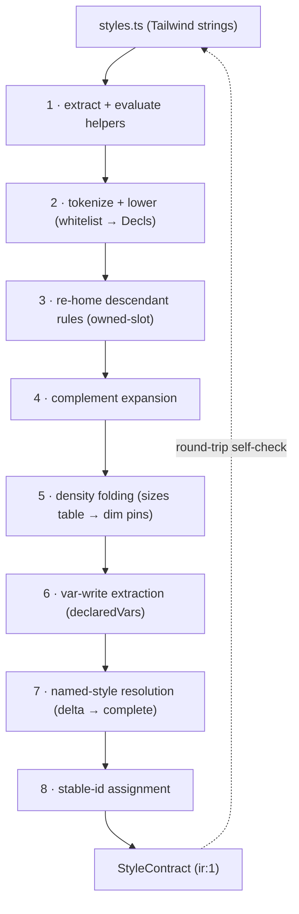

# Styles — authoring, the Style Contract, and two engines
> Part of [The Perfect dotUI](README.md) — an end-state architecture study (2026-07-04). Constitution-conformant.

Styles are the point where dotUI earns or loses its whole promise. The token graph ([05-tokens.md](05-tokens.md)) decides *what colors and dimensions mean*; the axis system ([06-axes.md](06-axes.md)) decides *which knobs a user turns*; but component styles decide whether "a button with a primary variant" renders identically in the live preview, in the exported Tailwind file, and in the exported StyleX file — three artifacts produced three different ways that must agree byte for computed-byte.

This chapter is the pipeline that guarantees that agreement. Contributors author Tailwind utility strings in `styles.ts` under a closed whitelist. The style compiler in `@dotui/style` lifts those strings into an engine-neutral **Style Contract** and normalizes it under one hard invariant. Two pure emitters — Tailwind and StyleX — turn the Contract back into idiomatic code. Between authoring and emission sit eight normalization passes and a battery of totality tests. Nothing in the pipeline is heuristic: the lint that guards authoring *is* the compiler's lowering pass running dry, and the parity CI renders the full state matrix in both engines and diffs `getComputedStyle`.

```
AUTHORING (Tailwind-native DX)      DERIVED (single source of truth)          EMITTED (pure functions)
──────────────────────────────      ──────────────────────────────────        ─────────────────────────
styles.ts                           StyleContract (versioned JSON, ir:1)       Tailwind: tv() + utility strings
  defineComponentStyles(meta,{…})    slots × dimensions × states               ┌─ codeStyle AST transforms ─┐
  tv-shaped utility strings ──lift──▶  × token-typed declarations   ──emit──▶  StyleX: stylex.create + props
  closed whitelist            +      OWNED-SLOT INVARIANT                       │
  sizes() geometry tables  normalize   │                                       └── parity CI (computed-style diff)
                                        ├──▶ builder preview (createLiveVariants, same Contract)
                                        ├──▶ /r/<item>?format=contract  (agent-native)
                                        └──▶ DTCG has no styles; the Contract is the style artifact
```

---

## 1. Authoring — Tailwind strings under a closed whitelist

A contributor authoring a component writes exactly what shadcn authors write: a `tv()`-shaped config of Tailwind utility strings. There is no typed style DSL to learn, and the shadcn copy-paste comparison that CLAUDE.md mandates (diff our classes against `apps/v4/registry/...`) stays a plain string diff. The entry point is `defineComponentStyles`:

```ts
// packages/registry/ui/button/styles.ts
import { defineComponentStyles, sizes } from '@dotui/style'
import buttonMeta from './meta'

export const buttonStyles = defineComponentStyles(buttonMeta, {
  base: {
    base: [
      'group/button relative inline-flex shrink-0 cursor-interactive items-center justify-center rounded-(--btn-radius) bg-clip-padding font-(--btn-font-weight) whitespace-nowrap transition-[background-color,border-color,color,box-shadow] select-none',
      'focus-reset focus-visible:focus-ring',
      '**:[svg]:pointer-events-none **:[svg]:shrink-0',
      'pending:cursor-default pending:border-border-disabled pending:bg-disabled pending:text-transparent pending:**:not-data-[slot=spinner]:opacity-0 pending:**:data-[slot=spinner]:text-fg-muted',
      'disabled:cursor-default disabled:border-border-disabled disabled:bg-disabled disabled:text-fg-disabled',
    ],
    variants: {
      variant: {
        default: 'border bg-neutral text-fg-on-neutral hover:border-border-hover hover:bg-neutral-hover pressed:border-border-active pressed:bg-neutral-active',
        primary: 'bg-primary text-fg-on-primary [--color-disabled:var(--neutral-500)] [--color-fg-disabled:var(--neutral-300)] hover:bg-primary-hover disabled:border-0 pending:border-0 pressed:bg-primary-active',
        quiet:   'bg-transparent text-fg hover:bg-inverse/10 pressed:bg-inverse/20',
        link:    'text-fg underline-offset-4 hover:underline',
        warning: 'bg-warning text-fg-on-warning hover:bg-warning-hover pressed:bg-warning-active',
        danger:  'bg-danger text-fg-on-danger hover:bg-danger-hover pressed:bg-danger-active',
      },
      isIconOnly: { true: 'p-0' },
    },
    defaultVariants: { variant: 'default', size: 'md' },
  },
  sizes: sizes({
    // density × size geometry — ONE table, not three hand-authored ladders
    compact:     { xs: { h: 5, px: 2,   radius: 'sm', text: '0.625rem', iconOnly: 5, icon: 2.5, iconPad: 1.5 }, sm: {/*…*/}, md: {/*…*/}, lg: {/*…*/} },
    default:     { xs: { h: 6, px: 2,   text: 'xs',   iconOnly: 6, icon: 3,   iconPad: 1.5 }, sm: {/*…*/}, md: { h: 8, px: 2.5, gap: 1.5, iconOnly: 8, icon: 3.5, iconPad: 2 }, lg: {/*…*/} },
    comfortable: { xs: { h: 7, px: 2.5, text: '0.8125rem', iconOnly: 7, icon: 3.5, iconPad: 1.5 }, sm: {/*…*/}, md: {/*…*/}, lg: {/*…*/} },
  }),
})
```

Three whitelists bound this authoring surface. Each is **closed** — anything outside it is a lint error, not a silent pass. The lint rule `dotui/style-subset` is not a separate re-implementation of the compiler: it is the compiler's lowering pass (§4) run in dry-run mode. If the code lints clean, it lowers; if it lowers, it lints clean. One code path, so the green check is a guarantee, not a hope.

### 1.1 Variant whitelist

Every variant prefix in a class chain must map to exactly one Contract state (§3) or one structural pattern the normalizer knows how to re-home (§4.3). The whitelist:

| Family | Members (representative) | Maps to |
|---|---|---|
| CSS pseudo | `hover:` `focus-visible:` `focus-within:` `placeholder-shown:` | `css-pseudo` state |
| RAC render | `pressed:` `pending:` `disabled:` `selected:` | `rac-render` state (render-prop boolean) |
| RAC data-attr | `invalid:` `open:` `data-[…]:` | `rac-data` state (self attribute) |
| Relation | `has-data-icon-start:` `has-data-icon-end:` `data-icon-only:` | `relation` state (dual-bound) |
| Context | `in-data-modal:` `in-data-popover:` | `context` state |
| Descendant | `**:[svg]:` `*:[svg]:` `**:data-[slot=…]:` | re-homed to the owning slot |
| Custom | `with-[size]:` `not-with-[size]:` `group-*/name:` | `tailwindcss-with` merge-order guard |
| Media | `sm:` `md:` `dark:` forced-colors | `media` state |

Banned, each with a mechanical fix suggestion:

- `[&.some-class]:…` — a selector that references a *utility class name*. StyleX has no way to key off another element's class. **Fix:** "gate on a data attribute instead — `has-data-bordered:` — and set `data-bordered` on the slot."
- `peer-*:…` — sibling-combinator selection has no StyleX lowering. **Fix:** "hoist the trigger to a self data-attribute or a relation state."
- Arbitrary selectors whose body is neither a data-attribute nor an element selector.

### 1.2 Utility whitelist

Every utility must lower to a `(PropKey, TokenValue)` pair via a normalization table generated from Tailwind's resolved theme. Three sub-rules:

- **Custom utilities** (`focus-ring`, `focus-reset`, `cursor-interactive`) are registered with their `@apply` expansions so the lowering table knows them.
- **Hardcoded design values that have a token** are lint errors carrying the token hint. `bg-[#635bff]` → *"use `bg-primary`; add a token if none fits"*; `rounded-[7px]` → *"use `rounded-md` or a `radius` scalar param."* This is CLAUDE.md's hardcoded-value rule enforced structurally rather than in review. The test the CLAUDE.md doc states in prose — *"would two design systems disagree on it?"* — is here a typed fact: color/radius/typography families accept only token-typed values.
- **Mechanics literals** are allowlisted: `border`, `p-0`, `top-1/2`, `-translate-x-1/2`, hairline widths, `shrink-0`, `pointer-events-none`. These are component internal mechanics, not design decisions; no design system disagrees on them, so they stay plain values (this is exactly CLAUDE.md's "don't tokenize mechanics" rule).

### 1.3 Arbitrary-value whitelist

- CSS-var shorthand: `rounded-(--btn-radius)`, `font-(--btn-font-weight)`, `bg-(--color-tooltip)` — allowed; these reference component-contract nodes (§2.3).
- `calc()` over named vars, `--spacing(n)`, keyword/length literals, multi-value var padding — allowed.
- Inline var *writes* inside a variant slice — `[--color-disabled:var(--neutral-500)]` — allowed and captured (§4.6). This is load-bearing: it is the mechanism that makes `menu.highlight` correct on export.
- Class-name-referencing selectors and un-tokenized design hexes — banned (§1.1, §1.2).

### 1.4 Helpers are evaluated

Pure helper calls in `styles.ts` are evaluated in a sandboxed module context at compile time and their results inlined before lifting. `outlineField({ focus: 'group' })`, `tokens({ h: 6 })`, and shared class fragments are ordinary function calls; the compiler runs them and lifts the *result*, not the call. A purity lint forbids side effects in anything reachable from a `styles.ts`. This is what unlocks **fragment sharing** — Button and ToggleButton import one `interactiveSurface` fragment and stay a sync group with a single source of truth for their shared classes.

### 1.5 `sizes()` is mandatory geometry authoring

`sizes()` renders a `density × size` geometry table into the density × size rules of the Contract. It is **not optional sugar** (constitution §3, arbiter ruling): new components author their size geometry through `sizes()`, and an ad-hoc per-density ladder (three hand-written variant blocks) does not pass review. Its keys are the geometry primitives (`h`, `px`, `gap`, `radius`, `text`, `icon`, `iconPad`, `iconOnly`); the compiler folds each row into `dims:{ size, density }`-pinned rules on the correct slots. Adding a fourth density tier is a data edit — one more row — never a 48-file touch.

> **Tradeoffs.** The whitelist is a real ceiling. A genuinely novel look that needs an un-modeled arbitrary selector (a mask, an exotic gradient, a sibling combinator) is blocked until a `PropKey` family is added (which requires two engine renderings and a catalog-test entry) or the contributor uses an `EscapeHatch` (§8). The fixtures need zero escapes, so the ceiling costs nothing in practice today — but it is a governance surface, and "add a family" is a product-sized decision, not a config change. We accept this cost because it is the *only* way to make "lints clean ⇒ portable to StyleX" a structural fact rather than a reviewer's judgment.

---

## 2. The Style Contract

The Contract is plain versioned JSON — a committed build artifact, never hand-authored (the reviewable source is the Tailwind strings; the round-trip self-check in §4 proves the lift is lossless). It is what the preview runtime, both emitters, the compiler, the agent API (`/r/<item>?format=contract`), and dsdoc `components` deltas all read.

```ts
// packages/style/src/contract.ts
interface StyleContract {
  ir: 1                              // schema version; migrations are pure v(n)→v(n+1), fail LOUDLY on unmapped ids
  component: string                  // 'button'
  syncGroup?: string                 // Button ⇄ ToggleButton share one Contract via one group id
  slots: SlotMeta[]                  // ordered; slot 0 is the root
  root: string                       // slot the variant props attach to

  dimensions: Dimension[]            // variant / size / boolean / density
  states: StateDecl[]                // the dual-bound state vocabulary this component uses (§3)

  rules: Rule[]                      // flat normalized declaration list — the heart of the IR
  compounds: Rule[]                  // rules with ≥2 dimension pins (kept separate for emitter compound ordering)

  componentVars?: ComponentVarDecl[] // --btn-radius etc: contract-node handles, typed default, optional axis link
  declaredVars?: DeclaredVar[]       // CSS custom properties a variant value or named style WRITES (first-class)
  escapes?: EscapeHatch[]            // engine-scoped raw output, audited (§8)
}

interface SlotMeta {
  id: string                         // 'root' | 'icon' | 'content' | 'spinner'
  childTargets?: { svg?: boolean }   // marks the mechanics case: this slot owns its <svg> child's sizing
  props?: SlotProp[]                 // explicit slot props (prefix/suffix) that feed relation states — never children scanning
}

interface Dimension {
  id: string                         // 'variant' | 'size' | 'isIconOnly' | 'density'
  values: string[]
  default: string
  role: 'style' | 'size' | 'boolean' | 'density'   // density is a PEER dimension, not a bespoke layer
}

interface Rule {
  slot: string                       // decls describe THIS slot's own properties — the owned-slot invariant
  when: {
    dims?: Record<string, string>    // dimension pins (AND)
    states?: string[]                // state ids (AND)
  }
  decls: Decl[]
  id?: string                        // stable id assigned at first compile; deltas/codeStyle/diffs target it
}

interface Decl { prop: PropKey; value: TokenValue | 'unset'; guard?: string }  // guard: merge-order default marker (§4.3)

// PropKey is a CLOSED, curated enum of CSS-property FAMILIES. Each family knows its expected
// TokenType and its rendering in EACH engine:
//   paddingX → { tw:'px-*', sx:'paddingInline' }   size → { tw:'size-*', sx:{width,height} }
//   truncate → 3-decl expansion            bg → { tw:'bg-*', sx:'backgroundColor' }
//   fg ring radius fontSize gap height translateX transitionProperty opacity cursor …

type TokenType = 'color' | 'radius' | 'spacing' | 'font-size' | 'blur' | 'opacity'
              | 'cursor' | 'shadow' | 'keyword' | 'raw-number'

type TokenValue =
  | { token: string }                            // 'radius.md'  → var(--radius-md) in BOTH engines
  | { semantic: string }                         // 'primary-hover' → var(--color-primary-hover) (autocontrast-aware)
  | { componentVar: string }                     // '--btn-radius' — a component-contract node handle
  | { literal: string; type: TokenType }         // mechanics only — color/radius/typography families FORBID literals
  | { calc: string }                             // 'input-h - addon-inset*2' — one spec'd mini-grammar, rendered per engine
  | { mix: { space: 'oklab'|'oklch'|'srgb'; a: TokenValue; pct: number; b: TokenValue } }  // bg-inverse/10
```

Two rules in this schema carry most of the weight.

### 2.1 The owned-slot invariant

**No `Rule` ever describes a property of a node other than its own `slot`.** Cross-node authoring sugar — `**:[svg]:size-4` (root styling its icon descendant), `has-data-icon-end:pr-2` (root padding triggered by a child), `pending:**:not-…:opacity-0` (root hiding all its descendants) — exists in the strings and may *reappear in emitted Tailwind* as a peephole idiom, but it never survives into the Contract. The normalizer (§4.3–§4.4) re-homes every cross-node declaration to the slot that owns the property being set.

This is the single mechanism that lets StyleX reach parity. StyleX has no selector engine — no `:has()`, no descendant combinators, no arbitrary cross-node selectors. If the Contract contained a rule like "root, when a child has `data-icon-end`, set the icon's size," there would be no valid `stylex.create` for it. Because the Contract contains *only* own-slot declarations gated on dual-bound states, both engines can render every rule.

### 2.2 The hardcoded-value test is in the types

`PropKey` families that carry design meaning (`bg`, `fg`, `ring`, `radius`, `fontSize`, and the density-affected spacing families) accept only `token` / `semantic` / `componentVar` / `mix` values. Only mechanics families (`opacity` as a raw number, `translateX` as a literal fraction, `border` width) accept `{ literal }`. A missing look is therefore a *typed compile error naming the missing family* — the "flag the missing axis" moment from CLAUDE.md surfaced mechanically instead of relying on a reviewer to notice `bg-[#635bff]`.

### 2.3 Token references: contract nodes and flatten-on-export

A component decl may reference two kinds of node, and only two:

- a **component-contract node** — `{ componentVar: '--btn-radius' }` — the parametric surface of the sync group: variant surface families, radius, declared scalars, generated per group from `defineContract()` in the registry ([05-tokens.md §component contract](05-tokens.md)); or
- a **semantic node** — `{ semantic: 'primary-hover' }` — the user-space vocabulary (~76 shipped defaults).

It may **never** reference a primitive directly. This is the token graph's edge rule (constitution §3, resolving the tokens fork): the stricter "only layer-3" prose is overruled — a contract may reach a semantic node — but it may not reach past semantic into a raw ramp step. `[--color-disabled:var(--neutral-500)]` in the button source is the *one* apparent exception, and it is not a decl reference at all — it is a `declaredVar` write (§4.6), a component-contract node being *pointed at a primitive by the author*, which is exactly what the parametric surface is for.

**Flatten-on-export.** When a contract node still points at its default target, the Tailwind emitter emits the idiomatic semantic utility — `bg-primary`, not `bg-(--color-primary)`. When a node has been *retargeted* by the user's dsdoc, it emits the var form so the retarget is live. This is `codeStyle.tokenIndirection`:

- `'flatten'` (default) — clean, idiomatic, reads like hand-written shadcn.
- `'preserve'` — every reference emits the var form, for consumers who want to retarget in their own repo.

Either way the StyleX emitter reads the same `--color-*` variables the token backend writes, so a color retarget repaints both engines with zero recompilation.

---

## 3. The state model — one vocabulary, two bindings

Every interactive state is declared once with two bindings: how Tailwind selects it, and how StyleX selects it. The vocabulary is shared; the bindings differ because the engines differ.

```ts
interface StateDecl {
  id: string
  kind: 'css-pseudo' | 'rac-render' | 'rac-data' | 'relation' | 'context' | 'media'
  tw: { variant: string }                                   // how Tailwind selects it
  sx: { pseudo: string }                                    // ':hover'
     | { renderProp: string }                               // RAC render-prop boolean, read at the call site
     | { attrSelector: string }                             // self-attribute (StyleX supports self conditions)
     | { runtimeBool: string }                              // a boolean the neutral wrapper computes from slot props
     | { media: string }                                    // '@media (min-width: 48rem)'
}
```

| State | kind | Tailwind binding | StyleX binding |
|---|---|---|---|
| `hover` / `focusVisible` | css-pseudo | `hover:` / `focus-visible:` | `':hover'` / `':focus-visible'` |
| `pressed` / `pending` / `disabled` / `selected` | rac-render | `pressed:` … (RAC data-attr variant) | RAC render-prop boolean (`isPressed`…) |
| `invalid` / `placeholderShown` / `open` | rac-data | `invalid:` | self `[data-invalid]` |
| `iconStart` / `iconEnd` | relation | `has-data-icon-end:` | `runtimeBool: hasIconEnd` (from the `suffix` slot prop) |
| `iconOnly` | relation | `data-icon-only:` | prop `isIconOnly` |
| `inModal` / `inPopover` | context | `in-data-modal:` | container-kind context flag |
| `sm` / `md`, forced-colors | media | `sm:` | `'@media (min-width: 48rem)'` |

Two arbiter rulings (constitution §3) fix the two places relation states could go wrong.

**Relation booleans come from explicit slot props, never children scanning.** In the end-state component API, icons and addons are explicit slots: the Button takes `prefix` and `suffix` props (and slot-context registration for composed children), so `hasIconEnd = suffix != null` is a trivial, deterministic boolean. The slot element carries `data-icon-end`, so Tailwind's `:has()` binding and StyleX's boolean read the *same* truth source. There is no `useSlotRelations` render pass scanning arbitrary React children — which would be a correctness surface (fragments, portals, memoized children) and a second truth source that could diverge from Tailwind's `:has()`.

**The StyleX icon-size guard is merge order, not a runtime boolean.** Today's `**:[svg]:not-with-[size]:size-3.5` means "default icon size unless the user set one." Normalized (§4.3), the size decl lives on the `icon` slot. Tailwind keeps the idiomatic `not-with-[size]:` guard. StyleX needs **no guard at all**: the generated Icon slot merges `styles.icon_size_md` *before* the user-passed style, and StyleX's last-style-wins merge gives "default unless overridden" for free. The most fragile runtime boolean in the naive design is eliminated by ordering.

---

## 4. Normalization — the lift, pass by pass

`compile(styles.ts) → StyleContract` is deterministic and runs at `pnpm build:registry` (incrementally in the builder dev server, one component at a time). Eight passes, in order.



### 4.1 Extract + evaluate

ts-morph reads the `defineComponentStyles` config. Pure helper calls are evaluated in a sandbox and inlined (§1.4). The output is a config of literal strings and literal geometry tables — no function calls remain.

### 4.2 Tokenize + lower

Each class splits into a variant chain plus a utility. Variants lower against the whitelist to state ids or structural patterns; utilities lower against the normalization table to `Decl`s. `bg-primary` → `{ prop:'bg', value:{ semantic:'primary' } }`. `rounded-(--btn-radius)` → `{ prop:'radius', value:{ componentVar:'--btn-radius' } }`. `bg-inverse/10` → `{ prop:'bg', value:{ mix:{ space:'oklab', a:{semantic:'inverse'}, pct:10, b:{literal:'transparent',type:'keyword'} } } }`. Anything unknown is a lint error with a source offset and a fix — because this pass *is* the lint (§1).

### 4.3 Re-home descendant rules (the owned-slot pass)

The heart of the invariant. Every cross-node authoring form is moved to the slot that owns the property:

- `**:[svg]:not-with-[size]:size-3.5` on root → a `size` decl on the **`icon` slot** (`childTargets.svg` marks the mechanics case). The `not-with-[size]:` guard becomes the icon slot's merge-order default (§3), recorded on the decl.
- `has-data-icon-end:pr-2` on root → a **root-owned** `paddingEnd` decl gated on the `iconEnd` relation state. The declaration was *always* about root's own padding; only the trigger crossed nodes, and the trigger becomes a state.
- `**:data-[slot=spinner]:text-fg-muted` on root → an `fg` decl on the **`spinner` slot**.

### 4.4 Complement expansion

`pending:**:not-data-[slot=spinner]:opacity-0` means "while pending, hide everything but the spinner." It expands to a per-slot `opacity: 0` rule under `pending` for every declared slot ≠ `spinner` — total, because the end-state component owns its DOM and wraps user content in a `content` slot. The Tailwind emitter re-collapses this to the compact descendant idiom as a peephole; the StyleX emitter applies `opacity` per slot element. The complement is finite precisely because the slot set is closed.

### 4.5 Density folding

Density layers become `dims:{ density: X }` pins on ordinary rules. The `sizes()` table lands here directly: each `{ density, size }` cell becomes rules pinned on both dimensions, on the correct slots (`h`/`px`/`gap`/`radius`/`text` on root, `icon` on the icon slot, `iconOnly` on root under the `iconOnly` state, `iconPad` on root under `iconStart`/`iconEnd`). Density is now a peer `Dimension` with `role:'density'` — adding a tier is a data edit, and (per `codeStyle.density`, §9) it can export baked or as a runtime axis.

### 4.6 Var-write extraction

`[--color-disabled:var(--neutral-500)]` inside a variant slice becomes a `declaredVars` entry scoped to that variant value:

```json
{ "name": "--color-disabled", "value": { "token": "neutral.500" }, "when": { "dims": { "variant": "primary" } } }
```

This is first-class, so **both** engines emit it. This pass is why the `menu.highlight = accent` export bug (variant `vars` silently stripped at publish, so the export diverged from the preview) is structurally impossible in the end state — a `declaredVar` is a Contract node, and the catalog-completeness test (§7) fails the build if either emitter lacks a lowering for it. §11 walks this fixture in full.

### 4.7 Named-style resolution

Enum-param values (`input.style = outline | line | filled`, `menu.highlight = subtle | accent`) are *authored* as DRY delta layers over base — today's ergonomics, preserved. But each value **resolves to a complete Contract** before anything downstream reads it. Forking, diffing, LLM generation, and export all operate on complete documents; the delta is an authoring convenience the compiler erases. A user's `components` delta in the dsdoc ([09-dsdoc.md](09-dsdoc.md)) is applied here too, funneled through the same lift/validate as authored source.

### 4.8 Stable-id assignment

Rules, dimensions, states, and params get stable ids on first compile. dsdoc `components` deltas, `codeStyle` targeting, and visual diffs reference these ids. Renames ship migration maps; an unmapped id fails **loudly** with the specific id — never the old behavior of silently falling back to defaults and discarding a user's system.

**Round-trip self-check.** `Tailwind → Contract → Tailwind` must be semantically identity: same computed styles, canonical class order and grouping. This is the compiler's proof that the lift loses nothing on the Tailwind side (the StyleX side is proven by the parity CI, §7).

---

## 5. The two emitters

Both emitters implement one interface:

```ts
interface EngineEmitter {
  engine: 'tailwind' | 'stylex'
  emit(contract: ResolvedContract, codeStyle: CodeStyle): RegistryFile[]
}
```

They are pure functions of the resolved Contract. Neither reads `styles.ts`; neither knows the other exists.

### 5.1 Tailwind emitter

The inverse of the lift, plus peepholes. It groups rules back into a `tv()` config (base / slots / variants / compounds), re-collapses the normalizations into idiomatic compact strings, renders tokens as utility suffixes, and bakes the selected density (or ships it as a `data-density` axis). A Tailwind user sees a file **byte-comparable to hand-authored output**. The peepholes:

- **Icon re-homing → descendant idiom.** An `icon`-slot `size` decl with a `childTargets.svg` marker and a merge-order guard re-collapses to `**:[svg]:not-with-[size]:size-3.5` on the parent's class string.
- **Relation state → `:has()`.** A root decl gated on `iconEnd` re-collapses to `has-data-icon-end:pr-2`.
- **Complement → descendant not-selector.** Per-slot `pending` opacity rules re-collapse to `pending:**:not-data-[slot=spinner]:opacity-0`.
- **Flatten-on-export** (§2.3) chooses `bg-primary` vs `bg-(--color-primary)` per node.

The round-trip check (§4.8) guarantees these peepholes reproduce the authored form.

### 5.2 StyleX emitter

The same rules as `stylex.create` plus boolean composition at the call site:

- `css-pseudo` / `rac-data` states → nested condition objects (`{ default: …, ':hover': … }`, `{ default: …, '[data-invalid]': … }`).
- `rac-render` / `relation` states → separate boolean-keyed styles (`pressed_primary`, `size_md_iconEnd`) selected at the call site from render-prop booleans or slot-prop booleans.
- density and dimension values → keyed styles composed by prop.
- tokens → a generated `tokens.stylex.ts` (`stylex.defineVars` over the semantic vocabulary; values point at the same `--color-*` vars the token backend writes — see [05-tokens.md](05-tokens.md)).

No descendant selectors, no `:has()`, no invalid keys — by construction, because the Contract contains none. The **icon-size guard is merge order**: `icon_size_md` is spread before the user's style in `stylex.props`, so the default loses to any user override (§3).

### 5.3 The neutral component template

One wrapper per component sits above the style-application line: RAC behavior, slot elements with `data-slot` attributes, spinner injection, `composeRenderProps` equivalent. The single engine-specific seam is the style call — `className={styles({…})}` for Tailwind vs `{...stylex.props(…)}` for StyleX. Because the template is neutral above that seam, wrapper-level `codeStyle` (arrow vs declaration, file layout) applies to both engines identically.

---

## 6. `codeStyle` — mechanical AST transforms

`codeStyle` is a dsdoc section ([09-dsdoc.md](09-dsdoc.md)); its style transforms run over the emitters' typed output ASTs, never as regex over strings and never against hand-maintained `// MARK:` anchors (section boundaries come from the Contract's rule grouping). Every transform is AST-equivalent modulo formatting — a CI invariant (constitution §8, §10).

```ts
interface CodeStyle {
  format: { printWidth: number; semicolons: boolean; quotes: 'single'|'double'; trailingComma: 'none'|'es5'|'all' }
  functions: 'arrow' | 'declaration'                // shared: operates on the neutral wrapper AST
  tv: { classArrays: boolean; oneLinePerVariant: boolean }
  sx: { varsModule: 'shared' | 'colocated'; conditionStyle: 'object' | 'separate-keys' }
  comments: { sectionSeparators: boolean; density: 'none'|'terse'|'full' }
  imports: { style: 'namespace'|'named'; sortOrder: 'source'|'alpha'; groupBlankLines: boolean }
  layout: { styleLocation: 'inline'|'sidecar'; barrelExports: boolean }
  tokenIndirection: 'flatten' | 'preserve'          // §2.3
  density: 'baked' | 'runtime'                       // §9 — arbiter ruling: a codeStyle option
}
```

Adding a code-style axis is an emitter branch; it cannot desync from source because the source is one AST, and the transform is proven equivalent to it.

---

## 7. Totality tests — parity is enforced, not hoped

Four invariants make cross-engine parity a property of one artifact, not two hand-synced codebases. These are the style-layer entries in the canonical test list ([13-testing.md](13-testing.md)).

1. **Catalog completeness.** A build-time test iterates every `PropKey × TokenValue-shape` and every `StateDecl` kind and asserts *both* engines have a lowering. A family with one rendering cannot ship. This is what makes "add a `PropKey` family" a real gate (§1).
2. **Parity CI.** A golden test renders the full `(variant × size × density × state)` matrix in both engines against the same token graph and diffs `getComputedStyle`. Divergence not covered by a waived `EscapeHatch` fails the build. On the fixtures the diff is empty *by construction*: the truth table (`isPressed && variant==='primary'` ⇔ `pressed:` under `variant.primary`) and the token graph (`--color-primary-active` in both) are shared.
3. **Round-trip.** `Tailwind → Contract → Tailwind` is semantic identity with canonical class order (§4.8).
4. **Live-variants conformance.** `createLiveVariants(contract)(props) === tv(tailwindEmit(contract))(props)` as a property test, *plus* a computed-style sample diff — the single seam between the builder's live preview and the emitted output ([10-builder.md](10-builder.md)). This is why "preview equals export" is a theorem, not a QA aspiration.

---

## 8. Escape hatches and parity waivers

The whitelist is closed, but a contributor is never hard-blocked on genuinely novel CSS:

```ts
interface EscapeHatch {
  slot: string
  when: { dims?: Record<string,string>; states?: string[] }
  tw?: string                        // raw Tailwind for this engine
  sx?: object                        // raw stylex.create fragment for this engine
  note: string                       // why the subset couldn't express it
}
```

An escape must carry **both** engine renderings, or a reviewed **parity waiver** that the parity CI surfaces in its report. An unwaived divergence fails the build. Escapes are enumerated in every CI run, so drift is visible rather than silent. The fixtures need zero escapes — the hatch exists so a contributor working on a niche filter or exotic gradient has a relief valve, not a wall.

> **Tradeoffs.** The escape hatch is a deliberate hole in the "everything is portable" guarantee. We keep it because a permanently closed system with no relief valve blocks contributors on real work until a product-sized subset extension lands — and the audited, CI-surfaced, both-engine-or-waiver shape keeps the hole's edges visible. The cost is that `escapes` is a place drift *can* live; the mitigation is that it can never live there *silently*.

---

## 9. Density in exported code

Density is a Contract `Dimension` (`role:'density'`), so how it lands in exported code is a `codeStyle.density` choice (constitution §3, arbiter ruling), supported by both engines:

- `'baked'` (default) — the selected tier is folded into the shipped classes/styles; the exported file has no density machinery, exactly like hand-authored shadcn.
- `'runtime'` — the density dimension ships as a `data-density` attribute axis, so the consumer can switch density at runtime in their own app.

The distinction is purely about "what does *code you own* include" — the builder always previews the selected tier; only the export shape differs.

---

## 10. Worked example — Button, end to end

The fixture is the real button. Authored input is §1's `styles.ts`. Here is the full pipeline.

### 10.1 Authored (the real strings, condensed)

The `base.base` string, the six `variant` values, and the `sizes()` table from §1 — the un-abbreviated source is [`www/src/registry/ui/button/styles.ts`](../../../www/src/registry/ui/button/styles.ts), whose `default` density `md` size row is `h-8 gap-1.5 px-2.5 has-data-icon-end:pr-2 data-icon-only:size-8 **:[svg]:not-with-[size]:size-3.5`.

### 10.2 Compiled Contract (slice)

```json
{
  "ir": 1, "component": "button", "syncGroup": "button-like",
  "slots": [
    { "id": "root" },
    { "id": "content" },
    { "id": "icon", "childTargets": { "svg": true }, "props": [{ "id": "prefix" }, { "id": "suffix" }] },
    { "id": "spinner" }
  ],
  "root": "root",
  "componentVars": [
    { "name": "--btn-radius", "type": "radius", "default": { "token": "radius.md" }, "axis": "radius" },
    { "name": "--btn-font-weight", "type": "raw-number", "default": { "token": "font-weight.medium" } }
  ],
  "dimensions": [
    { "id": "variant", "role": "style", "default": "default", "values": ["default","primary","quiet","link","warning","danger"] },
    { "id": "size", "role": "size", "default": "md", "values": ["xs","sm","md","lg"] },
    { "id": "isIconOnly", "role": "boolean", "default": "false", "values": ["false","true"] },
    { "id": "density", "role": "density", "default": "default", "values": ["compact","default","comfortable"] }
  ],
  "states": [
    { "id": "hover", "kind": "css-pseudo", "tw": { "variant": "hover" }, "sx": { "pseudo": ":hover" } },
    { "id": "pressed", "kind": "rac-render", "tw": { "variant": "pressed" }, "sx": { "renderProp": "isPressed" } },
    { "id": "pending", "kind": "rac-render", "tw": { "variant": "pending" }, "sx": { "renderProp": "isPending" } },
    { "id": "disabled", "kind": "rac-render", "tw": { "variant": "disabled" }, "sx": { "renderProp": "isDisabled" } },
    { "id": "iconEnd", "kind": "relation", "tw": { "variant": "has-data-icon-end" }, "sx": { "runtimeBool": "hasIconEnd" } },
    { "id": "iconStart", "kind": "relation", "tw": { "variant": "has-data-icon-start" }, "sx": { "runtimeBool": "hasIconStart" } },
    { "id": "iconOnly", "kind": "relation", "tw": { "variant": "data-icon-only" }, "sx": { "runtimeBool": "isIconOnly" } }
  ],
  "rules": [
    { "slot": "root", "when": {}, "decls": [
      { "prop": "radius", "value": { "componentVar": "--btn-radius" } },
      { "prop": "fontWeight", "value": { "componentVar": "--btn-font-weight" } },
      { "prop": "cursor", "value": { "token": "cursor.interactive" } },
      { "prop": "transitionProperty", "value": { "literal": "background-color, border-color, color, box-shadow", "type": "keyword" } }
    ]},
    { "slot": "root", "when": { "dims": { "variant": "default" } }, "decls": [
      { "prop": "border", "value": { "literal": "1px", "type": "raw-number" } },
      { "prop": "bg", "value": { "semantic": "neutral" } },
      { "prop": "fg", "value": { "semantic": "fg-on-neutral" } }
    ]},
    { "slot": "root", "when": { "dims": { "variant": "default" }, "states": ["hover"] }, "decls": [
      { "prop": "bg", "value": { "semantic": "neutral-hover" } },
      { "prop": "borderColor", "value": { "semantic": "border-hover" } }
    ]},
    { "slot": "root", "when": { "dims": { "variant": "default" }, "states": ["pressed"] }, "decls": [
      { "prop": "bg", "value": { "semantic": "neutral-active" } },
      { "prop": "borderColor", "value": { "semantic": "border-active" } }
    ]},
    { "slot": "root", "when": { "dims": { "variant": "primary" } }, "decls": [
      { "prop": "bg", "value": { "semantic": "primary" } },
      { "prop": "fg", "value": { "semantic": "fg-on-primary" } }
    ]},
    { "slot": "root", "when": { "dims": { "variant": "primary" }, "states": ["hover"] }, "decls": [
      { "prop": "bg", "value": { "semantic": "primary-hover" } }
    ]},
    { "slot": "root", "when": { "dims": { "variant": "primary" }, "states": ["pressed"] }, "decls": [
      { "prop": "bg", "value": { "semantic": "primary-active" } }
    ]},
    { "slot": "root", "when": { "dims": { "variant": "quiet" }, "states": ["hover"] }, "decls": [
      { "prop": "bg", "value": { "mix": { "space": "oklab", "a": { "semantic": "inverse" }, "pct": 10, "b": { "literal": "transparent", "type": "keyword" } } } }
    ]},

    { "slot": "root", "when": { "states": ["pending"] }, "decls": [
      { "prop": "cursor", "value": { "literal": "default", "type": "keyword" } },
      { "prop": "borderColor", "value": { "semantic": "border-disabled" } },
      { "prop": "bg", "value": { "semantic": "disabled" } },
      { "prop": "fg", "value": { "literal": "transparent", "type": "keyword" } }
    ]},
    { "slot": "content", "when": { "states": ["pending"] }, "decls": [
      { "prop": "opacity", "value": { "literal": "0", "type": "raw-number" } }
    ]},
    { "slot": "icon",    "when": { "states": ["pending"] }, "decls": [
      { "prop": "opacity", "value": { "literal": "0", "type": "raw-number" } }
    ]},
    { "slot": "spinner", "when": { "states": ["pending"] }, "decls": [
      { "prop": "fg", "value": { "semantic": "fg-muted" } }
    ]},

    { "slot": "root", "when": { "dims": { "size": "md", "density": "default" } }, "decls": [
      { "prop": "height", "value": { "token": "spacing.8" } },
      { "prop": "gap", "value": { "token": "spacing.1_5" } },
      { "prop": "paddingX", "value": { "token": "spacing.2_5" } }
    ]},
    { "slot": "root", "when": { "dims": { "size": "md", "density": "default" }, "states": ["iconEnd"] }, "decls": [
      { "prop": "paddingEnd", "value": { "token": "spacing.2" } }
    ]},
    { "slot": "root", "when": { "dims": { "size": "md", "density": "default" }, "states": ["iconOnly"] }, "decls": [
      { "prop": "size", "value": { "token": "spacing.8" } }
    ]},
    { "slot": "icon", "when": { "dims": { "size": "md", "density": "default" } }, "decls": [
      { "prop": "size", "value": { "token": "spacing.3_5" }, "guard": "not-with-size" }
    ]}
  ],
  "declaredVars": [
    { "name": "--color-disabled",    "value": { "token": "neutral.500" }, "when": { "dims": { "variant": "primary" } } },
    { "name": "--color-fg-disabled", "value": { "token": "neutral.300" }, "when": { "dims": { "variant": "primary" } } }
  ]
}
```

Watch the normalization: `has-data-icon-end:pr-2` stayed a **root-owned** `paddingEnd` decl gated on the `iconEnd` state; `**:[svg]:not-with-[size]:size-3.5` was re-homed to the **`icon` slot** with a `not-with-size` guard; `pending:**:not-data-[slot=spinner]:opacity-0` became per-slot `opacity` decls on `content` and `icon`; `pending:**:data-[slot=spinner]:text-fg-muted` became an `fg` decl on the `spinner` slot; and `[--color-disabled:var(--neutral-500)]` became a `declaredVar` scoped to `variant:primary` (survives export in both engines).

### 10.3 Emitted Tailwind (`density=default` baked, `tokenIndirection:'flatten'`, `tv.classArrays:true`)

Byte-comparable to the hand-authored file — the emitter re-collapses each normalization back to its idiomatic form:

```ts
import { tv } from 'tailwind-variants'

const buttonVariants = tv({
  base: [
    'group/button relative inline-flex shrink-0 cursor-interactive items-center justify-center rounded-(--btn-radius) bg-clip-padding font-(--btn-font-weight) whitespace-nowrap transition-[background-color,border-color,color,box-shadow] select-none',
    'focus-reset focus-visible:focus-ring',
    '**:[svg]:pointer-events-none **:[svg]:shrink-0',
    'pending:cursor-default pending:border-border-disabled pending:bg-disabled pending:text-transparent pending:**:not-data-[slot=spinner]:opacity-0 pending:**:data-[slot=spinner]:text-fg-muted',
    'disabled:cursor-default disabled:border-border-disabled disabled:bg-disabled disabled:text-fg-disabled',
    'text-sm *:[svg]:not-with-[size]:size-4',
  ],
  variants: {
    variant: {
      default: 'border bg-neutral text-fg-on-neutral hover:border-border-hover hover:bg-neutral-hover pressed:border-border-active pressed:bg-neutral-active',
      primary: 'bg-primary text-fg-on-primary [--color-disabled:var(--neutral-500)] [--color-fg-disabled:var(--neutral-300)] hover:bg-primary-hover disabled:border-0 pending:border-0 pressed:bg-primary-active',
      quiet:   'bg-transparent text-fg hover:bg-inverse/10 pressed:bg-inverse/20',
      link:    'text-fg underline-offset-4 hover:underline',
      warning: 'bg-warning text-fg-on-warning hover:bg-warning-hover pressed:bg-warning-active',
      danger:  'bg-danger text-fg-on-danger hover:bg-danger-hover pressed:bg-danger-active',
    },
    size: {
      xs: 'h-6 gap-1 px-2 text-xs has-data-icon-end:pr-1.5 has-data-icon-start:pl-1.5 data-icon-only:size-6 **:[svg]:not-with-[size]:size-3',
      sm: 'h-7 gap-1 px-2.5 text-[0.8125rem] has-data-icon-end:pr-1.5 has-data-icon-start:pl-1.5 data-icon-only:size-7 **:[svg]:not-with-[size]:size-3.5',
      md: 'h-8 gap-1.5 px-2.5 has-data-icon-end:pr-2 has-data-icon-start:pl-2 data-icon-only:size-8 **:[svg]:not-with-[size]:size-3.5',
      lg: 'h-9 gap-1.5 px-2.5 has-data-icon-end:pr-2 has-data-icon-start:pl-2 data-icon-only:size-9 **:[svg]:not-with-[size]:size-4',
    },
    isIconOnly: { true: 'p-0' },
  },
  defaultVariants: { variant: 'default', size: 'md' },
})
```

Note `bg-primary`, not `bg-(--color-primary)` — that is `tokenIndirection:'flatten'` recognizing the `primary` node still points at its default. Note the `size` variant carries only the `default`-density row — that is `density:'baked'` folding the selected tier into classes and dropping the other two. The `declaredVar` re-emits as `[--color-disabled:var(--neutral-500)]` inside `variant.primary`.

### 10.4 Emitted StyleX

```tsx
import * as stylex from '@stylexjs/stylex'
import { tokens } from './tokens.stylex'

const styles = stylex.create({
  root: {
    position: 'relative', display: 'inline-flex', flexShrink: 0,
    alignItems: 'center', justifyContent: 'center', whiteSpace: 'nowrap', userSelect: 'none',
    borderRadius: 'var(--btn-radius)', fontWeight: 'var(--btn-font-weight)',
    cursor: tokens.cursorInteractive,
    transitionProperty: 'background-color, border-color, color, box-shadow',
  },
  variant_default: {
    borderWidth: '1px', color: tokens.fgOnNeutral,
    backgroundColor: { default: tokens.neutral, ':hover': tokens.neutralHover },
    borderColor:     { default: null,           ':hover': tokens.borderHover },
  },
  variant_primary: {
    color: tokens.fgOnPrimary,
    '--color-disabled':    tokens.neutral500,     // declaredVar — emitted, not stripped
    '--color-fg-disabled': tokens.neutral300,
    backgroundColor: { default: tokens.primary, ':hover': tokens.primaryHover },
  },
  variant_quiet: {
    backgroundColor: { default: 'transparent', ':hover': tokens.inverseAlpha10 },
    color: tokens.fg,
  },
  pressed_default: { backgroundColor: tokens.neutralActive, borderColor: tokens.borderActive },
  pressed_primary: { backgroundColor: tokens.primaryActive },
  pending_root:    { cursor: 'default', borderColor: tokens.borderDisabled, backgroundColor: tokens.disabled, color: 'transparent' },
  pending_content: { opacity: 0 },
  pending_icon:    { opacity: 0 },
  pending_spinner: { color: tokens.fgMuted },
  size_md:         { height: tokens.spacing8, columnGap: tokens.spacing1_5, paddingInline: tokens.spacing2_5 },
  size_md_iconEnd: { paddingInlineEnd: tokens.spacing2 },
  size_md_iconOnly:{ width: tokens.spacing8, height: tokens.spacing8 },
  icon_size_md:    { width: tokens.spacing3_5, height: tokens.spacing3_5 },
})

export function Button({ variant = 'default', size = 'md', isIconOnly, prefix, suffix, children, ...props }: ButtonProps) {
  const hasIconEnd = suffix != null            // slot props, not children scanning
  return (
    <ButtonPrimitive {...props}>
      {(rp) => (
        <span {...stylex.props(
          styles.root,
          styles[`variant_${variant}`],
          rp.isPressed && styles[`pressed_${variant}`],
          rp.isPending && styles.pending_root,
          styles[`size_${size}`],
          hasIconEnd && styles[`size_${size}_iconEnd`],
          isIconOnly && styles[`size_${size}_iconOnly`],
        )}>
          {prefix && <Icon data-slot="icon" style={styles[`icon_size_${size}`]}>{prefix}</Icon>}
          <span data-slot="content" {...stylex.props(rp.isPending && styles.pending_content)}>{children}</span>
          {suffix && <Icon data-slot="icon" style={styles[`icon_size_${size}`]}>{suffix}</Icon>}
          {rp.isPending && <Spinner data-slot="spinner" {...stylex.props(styles.pending_spinner)} />}
        </span>
      )}
    </ButtonPrimitive>
  )
}
```

No `:has()`, no descendant selectors, no invalid StyleX keys. The icon default-size guard is StyleX merge order — `icon_size_md` is spread *before* any user `style` on the Icon, so a user override wins, matching Tailwind's `not-with-[size]:` exactly. The truth table (`rp.isPressed && variant==='primary'` ⇔ `pressed:` under `variant.primary`) and the token graph (`--color-primary-active` in both files) are shared, so the parity CI's computed-style diff over the `(variant × size × density × state)` matrix is empty by construction.

---

## 11. Mini-example — `menu.highlight` and why the export bug is structurally impossible

The old failure: `menu.highlight`'s enum values carried `vars` (CSS custom properties), which the publisher stripped before serializing the `tv()` config. The preview read the vars (the runtime provider wrote them to `:root`); the export did not (they never reached the shipped file). So `menu.highlight = accent` previewed as an accent highlight and *exported* as the default. The preview-equals-export promise broke, silently.

The authored source (real, from [`www/src/registry/ui/menu/styles.ts`](../../../www/src/registry/ui/menu/styles.ts)):

```ts
params: {
  highlight: {
    subtle: {
      slots: { item: 'overflow-hidden focus-visible:before:absolute focus-visible:before:inset-y-0 focus-visible:before:left-0 focus-visible:before:w-0.5 focus-visible:before:rounded-[inherit] focus-visible:before:bg-accent' },
      vars: { '--color-highlight': 'var(--neutral-300)', '--color-fg-on-highlight': 'var(--on-neutral-300)' },
    },
    accent: {
      vars: { '--color-highlight': 'var(--accent-500)', '--color-fg-on-highlight': 'var(--on-accent-500)' },
    },
  },
},
```

Var-write extraction (§4.6) lifts each `vars` block to `declaredVars` scoped to its named-style value:

```json
"declaredVars": [
  { "name": "--color-highlight",       "value": { "token": "neutral.300" },    "when": { "namedStyle": { "highlight": "subtle" } } },
  { "name": "--color-fg-on-highlight", "value": { "semantic": "on-neutral-300" }, "when": { "namedStyle": { "highlight": "subtle" } } },
  { "name": "--color-highlight",       "value": { "token": "accent.500" },     "when": { "namedStyle": { "highlight": "accent" } } },
  { "name": "--color-fg-on-highlight", "value": { "semantic": "on-accent-500" }, "when": { "namedStyle": { "highlight": "accent" } } }
]
```

A `declaredVar` is a Contract node. The catalog-completeness test (§7) fails the build if either emitter lacks a lowering for it, so *both* engines must emit it. When named-style resolution (§4.7) resolves `highlight:accent` to a complete Contract, the two `accent` `declaredVars` are part of that document; the Tailwind emitter writes them as `[--color-highlight:var(--accent-500)]` on the item slot, the StyleX emitter writes them as `'--color-highlight': tokens.accent500` on the composed style. There is no publish step that *could* strip them, because they are not a side channel on the tv config — they are a first-class node the totality test guards. The old bug is not fixed by care; it is made unrepresentable.

---

## 12. Where this chapter connects

- The `token` / `semantic` / `componentVar` values a decl may hold, and the `pairsWith` verification of the pairs a Contract actually renders, are the **Dimensional Token Graph** — [05-tokens.md](05-tokens.md).
- The dimensions a Contract exposes become configurable knobs through the **axis system** — [06-axes.md](06-axes.md); component axes are synthesized from contract declarations but *curated* (no auto-axis for internal mechanics vars).
- **Density** as a first-class dimension, `sizes()` geometry, and shadcn `style-{mira,nova,vega}` parity — [08-density-sizing.md](08-density-sizing.md).
- User `components` deltas, `codeStyle`, and `lock` — [09-dsdoc.md](09-dsdoc.md).
- `resolve()` producing the `ResolvedContract` each emitter consumes, and `compile(resolved, target)` calling the emitters — [11-compiler.md](11-compiler.md).
- `createLiveVariants` and the `DesignScope` preview seam — [10-builder.md](10-builder.md).
- The full canonical invariant list (parity, catalog completeness, round-trip, live-variants conformance, registry lints) — [13-testing.md](13-testing.md).
- Why Tailwind-native authoring beat a typed DSL and beat builder-only JSON, and why the owned-slot Contract beat P2's invalid StyleX selector objects — [00-decision-log.md](00-decision-log.md).
