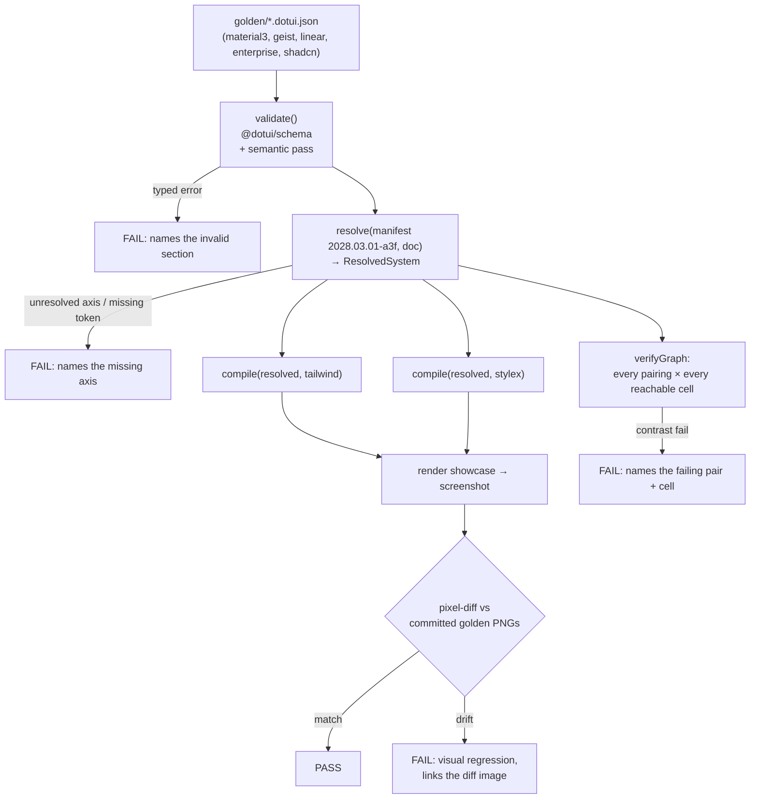

# Proof by reconstruction — Material 3, Geist, Linear, enterprise, shadcn
> Part of [The Perfect dotUI](README.md) — an end-state architecture study (2026-07-04). Constitution-conformant.

A design-system builder either recreates real design systems or it does not. Every other chapter describes a mechanism — the [Dimensional Token Graph](05-tokens.md), the [axis system](06-axes.md), the [Style Contract](04-styles.md), [density](08-density-sizing.md), the [compiler](11-compiler.md). This chapter proves those mechanisms are sufficient by pointing them at five systems with sharply different identities and showing each one reconstructed as a complete [dsdoc](09-dsdoc.md) pinned to one [Registry Manifest](03-registry.md).

The five golden reference dsdocs live in the repo at `packages/registry/golden/{material3,geist,linear,enterprise,shadcn}.dotui.json`. They are not documentation samples — they are executable proof. CI validates them against the schema, resolves them against their pinned manifest, compiles them to both engines, and visual-regression-tests the rendered showcase every build. A look that cannot be reached is not a note in a design doc; it is a red test that names the axis the manifest lacks. That mechanism is described in full at the end (§7).

The claim under test is precise. **Every visual decision is a user-configurable axis of the builder, never a hardcoded choice.** The test for whether something is an axis is the constitution's test: *would two design systems disagree on it?* The five systems below disagree on nearly everything a design system can disagree on — surface strategy, radius, weight, elevation model, density, contrast, motion, and the exact names of tokens. Each disagreement resolves to an axis value, a token-graph override, or — where a system's component look genuinely diverges from every curated named style — a bounded set of `ComponentOverride` deltas. This chapter is honest about the last category: it lists every override each system needs, and there are never more than four.

---

## 0. What a reconstruction is made of

Each reconstruction is `baseline(lock) ⊕ tokens ⊕ selections ⊕ components`, where:

- **`lock`** pins the manifest snapshot (`2028.03.01-a3f` throughout this chapter, so all five share one vocabulary and one baseline). Omitting a value means "the pinned manifest's default," never "today's code."
- **`tokens`** is a `TokenGraphOverlay` — added or retargeted ramps, dimensions, and nodes over the baseline Dimensional Token Graph.
- **`selections`** chooses axis values (global / group / component scope), stored once per scope with sync fan-out.
- **`components`** carries lifted **Style Contract deltas** for the 2–4 looks per system that no curated named style reaches.

A reconstruction therefore stresses four layers at once. The **token graph** must express the system's color and dimension identity (literal Geist grays, Material tonal ramps, the enterprise square-corner factor). The **axes** must carry its shape/space/elevation/motion decisions without inventing tokens. The **named styles** must cover its component looks where possible. The **contract-delta** escape hatch must carry the rest — and stay small, or the axis catalog has a hole.

The rest of this chapter walks the five systems, then closes with the coverage matrix (§6) and the CI mechanism (§7).

---

## 1. Material 3 — tonal surfaces, pill shapes, state layers

### Identity

Material 3 is recognizable from three decisions working together. **Tonal surfaces**: backgrounds are not neutral grays but low-chroma tints of the seed color, generated by Google's HCT tonal-palette algorithm — `surface`, `surface-container`, `surface-container-high` step up in elevation by tone, not by shadow. **Pill and rounded shapes**: the shape scale runs `none / xs / sm / md / lg / xl / full`, and the default components sit at `lg` (12px) to `full` (buttons are pills). **State layers**: hover and press are not color swaps but a translucent overlay of the "on" color at 8% / 12% opacity composited over the base — a mechanism, not a palette entry. Plus the `on-*` / `*-container` / `on-*-container` token quadruples that give M3 its distinctive four-token-per-role vocabulary.

### Reconstruction table

| Axis / mechanism | id | value |
|---|---|---|
| Color producer (all ramps) | `tokens.ramps[*].producer` | `material` (HCT) |
| Ramp steps | `tokens.ramps[*].steps` | Material tones `0 10 20 30 40 50 60 70 80 90 95 99 100` |
| Scheme dimension | `tokens.dimensions.scheme` | `[light*, dark]` (both HCT-generated per cell) |
| Contrast dimension | `tokens.dimensions.contrast` | `[normal*, hc(contrastBoost:1)]` — M3 medium/high-contrast |
| Radius family | `shape.radius` (group `button-like`) | `full` (pill buttons) |
| Radius scale base | `shape.radiusScale` | `md → 12px` (cards, sheets) |
| Elevation family | `elevation.family` | `tonal` — surface-container tones, no drop shadow at rest |
| State-layer effect | `interaction.stateLayer` | `on-overlay` (8% hover / 12% press) |
| Type family (sans) | `type.family.sans` | Roboto Flex → self-hosted at export |
| Type scale | `type.scale` | `material` (display/headline/title/body/label ladder) |
| Density | `selections.density` | `default` (M3 default) / `compact` (M3 dense) |
| Motion easing | `motion.easing` | `emphasized` (M3 emphasized cubic-bezier) |
| Motion duration | `motion.duration` | `medium2` (300ms standard) |
| Focus ring | `focus.ring` | `outline` — 3:1 outline offset from the shape |

### Token-graph notes

All ramps are **generated by the `material` producer** — no literal ramps. This is the paradigm case for a non-`oklch` producer: HCT tonal palettes are the identity, and the producer is chosen per ramp exactly so Material can be `material` while Geist is `fixed`. The producer is `isDark`-aware, so `scheme:dark` generates a genuine dark tonal palette per cell — never a reversed ramp.

The `on-*-container` quadruples are **`tokenRef` aliases** in the semantic layer. M3's `primary-container` is a semantic surface node; `on-primary-container` is a `{ kind: 'on', of: <primary-container node> }` autocontrast foreground, and the container itself is a `mix` of the primary tone toward surface. The four-token pattern (`primary`, `on-primary`, `primary-container`, `on-primary-container`) is four semantic nodes with structural `pairsWith` edges — which is exactly what the [contrast verifier](13-testing.md) needs to prove every rendered M3 pair passes at every reachable cell, with `hc` cells held to the raised target.

The **state layer** is the one mechanism that does not fit the plain fill model. It resolves through the `interaction.stateLayer` axis to `on-overlay`, whose contract writes emit hover/press as `color-mix(in oklab, var(--btn-fg) 8%, var(--btn-bg))` on the surface's `pairsWith` foreground — a `mix` token value, cell-resolved, verified as a composite over the surface.

### Component looks: named styles vs overrides

Material's default components map to named styles cleanly for **Button** (`filled` named style ≈ M3 filled button; `tonal`, `outlined`, `text` named styles cover the other M3 button variants) and **Card** (`elevated`/`filled`/`outlined` named styles align to M3's three card types). Two looks need `ComponentOverride` deltas:

- **`fab`** (floating action button) — M3's FAB is a distinct component look: `md`→`lg` radius, elevated tonal surface, larger icon-only hit area. No button named style is a FAB; the delta retargets radius and surface and sets the icon geometry.
- **`chip`** — M3 assist/filter/input chips carry the state layer, an 8px radius, and an optional leading-icon + trailing-close geometry that no curated chip named style matches exactly.

Two overrides. Everything else is axes plus named styles.

### Golden dsdoc fragment

```jsonc
{
  "$schema": "https://dotui.org/schema/dsdoc/v1.json",
  "dsdoc": 1,
  "meta": { "id": "ds_01J8ZMATERIAL3", "name": "Material 3", "slug": "material3",
            "version": "1.0.0", "owner": { "kind": "org", "id": "org_dotui", "handle": "dotui" },
            "license": "Apache-2.0" },
  "lock": { "registry": "dotui.org", "manifest": "2028.03.01-a3f", "manifestHash": "9c1e44aa0f2b7d31" },
  "engine": "tailwind",
  "tokens": {
    "dimensions": {
      "scheme":   { "options": ["light", "dark"], "defaultOption": "light" },
      "contrast": { "options": ["normal", "hc"], "defaultOption": "normal",
                    "roles": { "hc": { "contrastBoost": 1 } } }
    },
    "ramps": {
      "primary":   { "producer": { "id": "material", "config": { "": { "seed": "#6750A4" } } },
                     "steps": ["0","10","20","30","40","50","60","70","80","90","95","99","100"] },
      "secondary": { "producer": { "id": "material", "config": { "": { "seed": "#625B71" } } } },
      "neutral":   { "producer": { "id": "material", "config": { "": { "seed": "#605D62", "chroma": 4 } } } }
    },
    "nodes": {
      "color-primary":              { "layer": "semantic", "values": { "": { "kind": "ref", "to": "primary-40" },
                                                                       "scheme:dark": { "kind": "ref", "to": "primary-80" } } },
      "color-on-primary":           { "layer": "semantic", "values": { "": { "kind": "on", "of": "color-primary" } },
                                      "pairsWith": "color-primary" },
      "color-primary-container":    { "layer": "semantic", "values": { "": { "kind": "ref", "to": "primary-90" },
                                                                       "scheme:dark": { "kind": "ref", "to": "primary-30" } } },
      "color-on-primary-container": { "layer": "semantic", "values": { "": { "kind": "on", "of": "color-primary-container" } },
                                      "pairsWith": "color-primary-container" },
      "color-surface-container":    { "layer": "semantic", "values": { "": { "kind": "ref", "to": "neutral-94" },
                                                                       "scheme:dark": { "kind": "ref", "to": "neutral-12" } } }
    }
  },
  "selections": {
    "density": "default",
    "global": { "elevation.family": "tonal", "interaction.stateLayer": "on-overlay",
                "type.family.sans": "roboto-flex", "type.scale": "material",
                "motion.easing": "emphasized", "motion.duration": "medium2",
                "focus.ring": "outline", "shape.radiusScale": "md" },
    "groups": { "button-like": { "button.fill": "filled", "shape.radius": "full" } }
  },
  "components": {
    "fab":  { "delta": { "slots": { "root": { "set": { "radius": "{shape.radius.lg}", "surface": "{color-primary-container}" } } } } },
    "chip": { "delta": { "slots": { "root": { "set": { "radius": "8px" } }, "close": { "add": "trailing" } } } }
  }
}
```

---

## 2. Geist / Vercel — black-primary flat, hand-tuned grays

### Identity

Geist is the negative image of Material. **Flat**: no tonal surfaces, no shadows at rest — a hairline border defines every surface. **Black-primary buttons**: the primary button is pure black on white in light mode and pure white on black in dark mode, achieved by pointing `color-primary` at the extreme end of the neutral ramp. **Hand-tuned grays**: Geist's grays are not algorithmically generated — they are hand-picked and shipped as `gray-1` through `gray-10` plus a `gray-1000`, with an independent dark ramp that is *not* a reversal of light. Small radius (`md` ≈ 6px), medium weight, a tight but not compact density, and the crisp `#0070f3` accent blue for links and focus.

### Reconstruction table

| Axis / mechanism | id | value |
|---|---|---|
| Neutral ramp | `tokens.ramps.neutral.producer` | `fixed` (hand-authored per cell) |
| Neutral steps | `tokens.ramps.neutral.steps` | `50 100 200 300 400 500 600 700 800 900 950 1000` (extra `1000`) |
| Accent ramp | `tokens.ramps.accent.producer` | `oklch`, seed `#0070f3`, `scheme:dark` reseed `#3291ff` |
| Radius family | `shape.radius` (group `button-like`) | `md` |
| Radius scale base | `shape.radiusScale` | `md → 6px` |
| Elevation family | `elevation.family` | `flat-border` — hairline, no rest shadow |
| Type family (sans) | `type.family.sans` | Geist Sans → self-hosted |
| Type family (mono) | `type.family.mono` | Geist Mono |
| Font weight (buttons) | `type.weight.button` | `medium` (500) |
| Density | `selections.density` | `default` |
| Focus ring | `focus.ring` | `accent` — `#0070f3` ring |
| Motion easing | `motion.easing` | `standard` |
| Component fill | `button.fill` | `ComponentOverride` (see below) |

### Token-graph notes

The neutral ramp is the canonical **`fixed` producer** case — the "paste my palette" flow. Each step carries an explicit light and dark literal; dark is authored, not derived:

```jsonc
"neutral": { "producer": { "id": "fixed", "config": {
  "":            { "50": "#fafafa", "200": "#ebebeb", "500": "#8f8f8f", "900": "#171717", "1000": "#000000" },
  "scheme:dark": { "50": "#0a0a0a", "200": "#2e2e2e", "500": "#7d7d7d", "900": "#ededed", "1000": "#ffffff" }
} }, "steps": ["50","100","200","300","400","500","600","700","800","900","950","1000"] }
```

The extra `1000` step is legal — steps are per-ramp, and Geist genuinely uses a pure-black / pure-white endpoint that no `950` gives. `color-primary` is a **semantic override** pointing at `neutral-1000`, with `color-on-primary` its autocontrast `on` — this is what makes the button black-on-white in light and white-on-black in dark from a single node, because `neutral-1000` is itself cell-flipped in the fixed ramp.

The accent ramp is `oklch`-generated with an **independent dark reseed** (`#3291ff`), because Geist's dark blue is brighter than a mechanical lightness shift would give.

### Component looks: named styles vs overrides

Geist's flat black button matches no curated named style — the curated set has `default`, `primary`, `quiet`, `link`, `warning`, `danger` looks (the real registry vocabulary), none of which is "solid black fill, hover to 90% opacity." So:

- **`button`** — `ComponentOverride`: the primary look is `bg-primary text-on-primary hover:opacity-90`, retargeting the base surface and using an opacity hover rather than a `-hover` token. This fans out to **`toggle-button`** through the `button-like` sync group, so both land together (the constitution's sync rule).
- **`input`** — Geist inputs have a specific inner-shadow-on-focus look (`focus:ring-2 ring-accent/20` plus a border color flip) that the curated `input` named styles don't carry.

Two overrides (one of which is a synced pair, so it is authored once). This is the worked Geist dsdoc that recurs across the study; the full document appears in [the dsdoc chapter](09-dsdoc.md).

### Golden dsdoc fragment

```jsonc
{
  "engine": "tailwind",
  "tokens": {
    "ramps": {
      "neutral": { "producer": { "id": "fixed", "config": {
        "":            { "50": "#fafafa", "500": "#8f8f8f", "1000": "#000000" },
        "scheme:dark": { "50": "#0a0a0a", "500": "#7d7d7d", "1000": "#ffffff" } } },
        "steps": ["50","100","200","300","400","500","600","700","800","900","950","1000"] },
      "accent":  { "producer": { "id": "oklch", "config": {
        "": { "seed": "#0070f3" }, "scheme:dark": { "seed": "#3291ff" } } } }
    },
    "nodes": {
      "color-primary":    { "layer": "semantic", "values": { "": { "kind": "ref", "to": "neutral-1000" } } },
      "color-on-primary": { "layer": "semantic", "values": { "": { "kind": "on", "of": "color-primary" } },
                            "pairsWith": "color-primary" },
      "font-sans":        { "layer": "semantic", "values": { "": { "kind": "literal", "type": "fontFamily",
                            "value": "'Geist', ui-sans-serif, system-ui" } } }
    }
  },
  "selections": {
    "density": "default",
    "global": { "elevation.family": "flat-border", "focus.ring": "accent",
                "shape.radiusScale": "md", "type.family.sans": "geist", "type.weight.button": "medium" },
    "groups": { "button-like": { "shape.radius": "md" } }
  },
  "components": {
    "button": { "delta": { "variants": { "primary": { "slots": { "root":
      { "set": { "bg": "{color-primary}", "fg": "{color-on-primary}" },
        "state": { "hover": "opacity-90", "pressed": "opacity-80" } } } } } } }
  },
  "codeStyle": { "functions": "arrow", "format": { "semicolons": false, "quotes": "single" },
                 "tv": { "oneLinePerVariant": true }, "comments": { "density": "minimal", "sectionSeparators": false } }
}
```

---

## 3. Linear — translucency, compact density, subtle borders

### Identity

Linear reads as *quiet and dense*. **Translucency**: menus, popovers, and the command palette are semi-transparent with a backdrop blur, so the app behind shows through — the single most identifiable Linear trait. **Compact density**: rows are tight, controls are small, the whole UI packs more per pixel than a default web app. **Subtle borders**: surfaces are separated by very-low-contrast hairlines rather than shadows or fills. Add a small radius (`sm`), a barely-there hover lift, a desaturated near-monochrome palette with one restrained accent, and a fast, unshowy motion curve.

### Reconstruction table

| Axis / mechanism | id | value |
|---|---|---|
| Neutral ramp | `tokens.ramps.neutral.producer` | `oklch`, low chroma, dark-first seed |
| Scheme dimension | `tokens.dimensions.scheme` | `[dark*, light]` — Linear is dark-default |
| Density | `selections.density` | `compact` |
| Radius family | `shape.radius` (group `button-like`) | `sm` |
| Radius scale base | `shape.radiusScale` | `sm → 4px` |
| Translucency (grouped tweak) | `overlays.translucent` | `on` (fan-out axis) |
| Blur strength (child axis) | `overlays.blurStrength` | `md` (12px) — visible only when translucent on |
| Elevation family | `elevation.family` | `subtle-border` |
| Hover effect | `interaction.hoverEffect` | `lift-subtle` |
| Focus ring | `focus.ring` | `soft` (low-contrast ring) |
| Motion easing | `motion.easing` | `standard` |
| Motion duration | `motion.duration` | `fast` (150ms) |
| Type family (sans) | `type.family.sans` | Inter Variable |

### Token-graph notes

The neutral ramp is `oklch`-generated with **low chroma** and a **dark-first** default — Linear's `scheme` dimension declares `dark` as `defaultOption`, which the manifest supports because scheme options are ordered data, not a privileged light/dark pair. No literal ramps; the palette is fully generated because Linear's grays are algorithmic and consistent.

**Translucency is the marquee grouped tweak** — a single `overlays.translucent` toggle whose `writes` fan out across multiple targets: it retargets `color-menu`, `color-popover`, `color-tooltip`, and the command-palette surface to an `alpha` value over the base (`{ kind: 'alpha', of: color-bg, amount: 0.8 }`) and enables `--overlay-backdrop-blur`. The child axis `overlays.blurStrength` is gated by `when: { axis: 'overlays.translucent', equals: 'on' }`, so its control appears only when translucency is on, and the same predicate governs resolution. This is the constitution's "grouped tweaks = fan-out axes" — one switch, one selection, many token writes, honored identically in preview and export.

The `alpha` token values are **verified as composites**: the contrast verifier resolves the translucent menu over its expected backdrop surface and checks the on-color pair against the composited result, per reachable cell.

### Component looks: named styles vs overrides

Linear's buttons and inputs map to curated named styles (`quiet`/`subtle` looks align well). The distinctive components need deltas:

- **`menu` / `popover`** — the translucent surface *plus* the specific 1px inner highlight border Linear draws at the top edge of overlays. The translucency itself is the fan-out axis; the top-edge highlight is a `declaredVars` write (`--menu-highlight`) that no named style carries, exactly the Menu-highlight fixture the study uses. This is one delta shared by the menu-like sync group.
- **`command`** (command palette) — the `⌘K` palette has a unique layout: a search header, grouped results, and per-row keyboard-shortcut hints. Its look is a delta over the base menu.

Two overrides (the first synced across the menu-like group). The `--menu-highlight` var is the reason `declaredVars` exists in the Style Contract: it exports in both engines because it is captured, not lost.

### Golden dsdoc fragment

```jsonc
{
  "engine": "tailwind",
  "tokens": {
    "dimensions": { "scheme": { "options": ["dark", "light"], "defaultOption": "dark" } },
    "ramps": { "neutral": { "producer": { "id": "oklch", "config": {
      "": { "seed": "#5c5e63", "chroma": 0.008 } } } } }
  },
  "axes": {
    "overlays.translucent": {
      "kind": "toggle", "scope": { "level": "global" }, "default": false,
      "writes": [
        { "to": "tokenWrite", "token": "color-menu",    "when": "on", "target": { "kind": "alpha", "of": "color-bg", "amount": 0.82 } },
        { "to": "tokenWrite", "token": "color-popover", "when": "on", "target": { "kind": "alpha", "of": "color-bg", "amount": 0.82 } },
        { "to": "tokenWrite", "token": "color-tooltip", "when": "on", "target": { "kind": "alpha", "of": "color-bg", "amount": 0.9 } },
        { "to": "cssVar", "name": "--overlay-backdrop-blur", "when": "on", "value": "var(--blur-md)" }
      ]
    },
    "overlays.blurStrength": {
      "kind": "scalar", "tokenType": "blur", "scope": { "level": "global" }, "default": "md",
      "when": { "axis": "overlays.translucent", "equals": "on" }
    }
  },
  "selections": {
    "density": "compact",
    "global": { "overlays.translucent": "on", "overlays.blurStrength": "md",
                "elevation.family": "subtle-border", "interaction.hoverEffect": "lift-subtle",
                "focus.ring": "soft", "shape.radiusScale": "sm",
                "motion.duration": "fast", "type.family.sans": "inter" },
    "groups": { "button-like": { "shape.radius": "sm", "button.fill": "quiet" } }
  },
  "components": {
    "menu": { "delta": { "slots": { "root": { "declaredVars": { "--menu-highlight": "color-mix(in oklab, white 8%, transparent)" },
                                              "set": { "borderTop": "1px solid var(--menu-highlight)" } } } } }
  }
}
```

---

## 4. Classic enterprise — density, squared corners, high-contrast

### Identity

The enterprise archetype (IBM Carbon / SAP Fiori family) is built for information density and accessibility compliance, and it looks it. **Squared corners**: radius is `0` or near-zero — sharp rectangles everywhere. **Density**: compact rows, tight controls, tables with many visible rows. **High-contrast mode is first-class**, not an afterthought: an `hc` contrast dimension that raises every pairing toward AAA is part of the shipped system, because enterprise buyers have WCAG-AAA procurement requirements. Add outline-first buttons (bordered, not filled, as the default action style), a semibold weight for emphasis, a literal corporate palette (brand-mandated hex values, not generated), and a restrained, functional motion.

### Reconstruction table

| Axis / mechanism | id | value |
|---|---|---|
| Neutral + brand ramps | `tokens.ramps.*.producer` | `fixed` (corporate palette, literal) |
| Contrast dimension | `tokens.dimensions.contrast` | `[normal*, hc(contrastBoost:1)]` — shipped, not optional |
| Density | `selections.density` | `compact` |
| Radius family | `shape.radius` (group `button-like`) | `none` (0px) |
| Radius scale base | `shape.radiusScale` | `none → 0px` (global) |
| Elevation family | `elevation.family` | `flat-border` |
| Default button fill | `button.fill` (group `button-like`) | `outline` (curated named style) |
| Font weight (emphasis) | `type.weight.emphasis` | `semibold` (600) |
| Type family (sans) | `type.family.sans` | IBM Plex Sans / corporate |
| Border width | `shape.borderWidth` | `1px` (crisp) / `2px` in `hc` |
| Focus ring | `focus.ring` | `high-visibility` (2px offset, thick) |
| Motion easing | `motion.easing` | `productive` (fast, functional) |
| Motion duration | `motion.duration` | `fast` |

### Token-graph notes

Ramps are **`fixed`** — a corporate palette is a brand asset with exact hex values that must not drift under a generator. Both neutral and any brand ramp paste in literally, per cell.

The **`contrast` dimension is the centerpiece**. The `hc` option carries `contrastBoost: 1`, which raises the `contrast` producer's targets toward AAA — but because enterprise ships `hc` as a real, discoverable dimension (media-bound to `prefers-contrast: more` *and* data-attr-forcible), every token composes: `scheme:light&contrast:hc`, `scheme:dark&contrast:hc` all resolve from independent per-cell keys, and the [verifier](13-testing.md) holds those `hc` cells to the raised target. The border-width bump to `2px` in `hc` is a `contrast:hc` key on the `border-width` scalar node — one key, all schemes.

This is the reconstruction that proves **hc is a dimension, not a mode**. A flat mode list would force hand-authoring `light-hc` and `dark-hc` as separate entries; the dimension cube gives them from one `contrast:hc` delta composed with each scheme.

### Component looks: named styles vs overrides

Enterprise leans hard on **curated named styles** — `outline` button, `outline` input, bordered tables — because square, bordered, high-contrast is exactly what the curated set covers well. Deltas:

- **`table` / `data-grid`** — enterprise data tables have zebra striping, a sticky bordered header, and per-cell dividers that the default table named style doesn't carry. A delta adds the row-striping token and the cell borders.
- **`tag` / `status-badge`** — enterprise status tags use square corners with a semantic color-coded left border (severity indicator) that no curated tag style matches.

Two overrides. The button/input/most-form-controls stay on the `outline` named style.

### Golden dsdoc fragment

```jsonc
{
  "engine": "tailwind",
  "tokens": {
    "dimensions": {
      "scheme":   { "options": ["light", "dark"], "defaultOption": "light" },
      "contrast": { "options": ["normal", "hc"], "defaultOption": "normal",
                    "binding": "media", "roles": { "hc": { "contrastBoost": 1 } } }
    },
    "ramps": { "neutral": { "producer": { "id": "fixed", "config": {
      "": { "50": "#f4f4f4", "300": "#c6c6c6", "500": "#8d8d8d", "700": "#525252", "900": "#161616" },
      "scheme:dark": { "50": "#161616", "300": "#525252", "500": "#8d8d8d", "700": "#c6c6c6", "900": "#f4f4f4" } } } } },
    "nodes": {
      "border-width": { "layer": "semantic", "type": "dimension",
        "values": { "": { "kind": "literal", "type": "dimension", "value": "1px" },
                    "contrast:hc": { "kind": "literal", "type": "dimension", "value": "2px" } } }
    }
  },
  "selections": {
    "density": "compact",
    "global": { "elevation.family": "flat-border", "shape.radiusScale": "none",
                "focus.ring": "high-visibility", "type.family.sans": "ibm-plex-sans",
                "type.weight.emphasis": "semibold", "motion.easing": "productive", "motion.duration": "fast" },
    "groups": { "button-like": { "shape.radius": "none", "button.fill": "outline" } }
  },
  "components": {
    "table": { "delta": { "slots": { "row": { "state": { "even": "bg-elevated" } },
                                     "cell": { "set": { "borderRight": "1px solid var(--color-border)" } } } } },
    "tag":   { "delta": { "slots": { "root": { "set": { "radius": "0px", "borderLeft": "3px solid var(--tag-accent)" } } } } }
  }
}
```

---

## 5. shadcn — neutral vocabulary, exact token names

### Identity

shadcn is defined by its **token vocabulary**, not by a flourish. Its whole identity is a specific, widely-copied set of semantic token names — `--background`, `--foreground`, `--card`, `--card-foreground`, `--popover`, `--primary`, `--primary-foreground`, `--muted`, `--muted-foreground`, `--accent`, `--border`, `--input`, `--ring`, and the `--chart-1..5` and sidebar tokens — paired with a neutral (zinc/slate/stone/gray/neutral) base and a `--radius` scalar that derives `sm/md/lg/xl` by calc. A shadcn theme *is* a set of values for those exact names. Reconstructing shadcn therefore means reconstructing its **token names precisely**, not approximating them — a shadcn user must be able to `dotui export` and get `--primary`, not `--color-primary`.

### Reconstruction table

| Axis / mechanism | id | value |
|---|---|---|
| Token slug set | `tokens.nodes[*].name` (rename) | shadcn exact names (`background`, `foreground`, `primary`, `muted`, `ring`, `chart-1..5`, …) |
| Neutral ramp | `tokens.ramps.neutral.producer` | `tailwind` (zinc/slate/stone as chosen) |
| Radius scalar | `shape.radiusScale` | `md → 0.5rem`, with `sm/lg/xl` derived by `calc` |
| Radius family | `shape.radius` (group `button-like`) | `md` |
| Scheme dimension | `tokens.dimensions.scheme` | `[light*, dark]` (class-bound `.dark`) |
| Elevation family | `elevation.family` | `soft-shadow` (shadcn's `shadow-sm` on cards) |
| Type family (sans) | `type.family.sans` | system / Geist (shadcn default) |
| Density | `selections.density` | `default` |
| Focus ring | `focus.ring` | `ring` (2px ring at `--ring`) |
| Chart tokens | `tokens.nodes.chart-1..5` | five semantic color nodes |
| Sidebar tokens | `tokens.nodes.sidebar-*` | the sidebar token family |
| Token indirection (export) | `codeStyle.tokenIndirection` | `preserve` — keep shadcn var names in output |

### Token-graph notes

shadcn is the reconstruction that exercises **node `name` (rename) most heavily**. Every node has a permanent readable `id` (`color-primary`) and a separate renamable `name` that drives the emitted var. The shadcn dsdoc renames the baseline semantic nodes' `name` fields to shadcn's exact strings: `color-primary` → `primary`, `color-fg` → `foreground`, `color-muted-fg` → `muted-foreground`, and so on. References still use the stable ids; only emission changes. The `--chart-1..5` and `--sidebar-*` tokens are ordinary semantic nodes with shadcn `name`s.

The neutral ramp uses the **`tailwind` producer** (zinc/slate/stone/gray/neutral are literally Tailwind's palettes), so a shadcn user who picked "slate" gets Tailwind slate exactly. The `--radius` calc chain (`sm = calc(var(--radius) - 4px)`, etc.) is a `calc` token value in the graph — shadcn's derived radius scale is a producer-free computed node.

Critically, `codeStyle.tokenIndirection: 'preserve'` means the export emits the shadcn var form (`bg-primary` still, but backed by `--primary` not `--color-primary`), so exported code is byte-recognizable as shadcn to anyone who has used it. This is the axis that lets dotUI serve the enormous shadcn-native audience without an alien token vocabulary.

### Component looks: named styles vs overrides

shadcn's components are *the closest match to the curated named styles*, because dotUI's registry is itself React-Aria-on-Tailwind in the shadcn lineage. Its default button (`bg-primary`, `hover:bg-primary/90`), input, card, and dialog map to named styles with near-zero delta. This is the reconstruction with the **fewest overrides** — often zero for the core set. The honest deltas:

- **`button`** — shadcn's hover is `bg-primary/90` (opacity on the fill), which differs from the curated `-hover` token approach; a small delta switches the primary hover to the opacity form. (Synced to `toggle-button`.)
- **`sidebar`** — shadcn's sidebar is a whole sub-system with its own token family and collapsible rail behavior; its look is a delta over the base navigation component.

One-to-two overrides, the lightest of the five — which is the point: shadcn is the system dotUI is most native to.

### Golden dsdoc fragment

```jsonc
{
  "engine": "tailwind",
  "tokens": {
    "dimensions": { "scheme": { "options": ["light", "dark"], "defaultOption": "light", "binding": "class" } },
    "ramps": { "neutral": { "producer": { "id": "tailwind", "config": { "": { "palette": "zinc" } } } } },
    "nodes": {
      "color-primary":     { "layer": "semantic", "name": "primary",           "values": { "": { "kind": "ref", "to": "neutral-900" }, "scheme:dark": { "kind": "ref", "to": "neutral-50" } } },
      "color-on-primary":  { "layer": "semantic", "name": "primary-foreground", "values": { "": { "kind": "on", "of": "color-primary" } }, "pairsWith": "color-primary" },
      "color-muted-fg":    { "layer": "semantic", "name": "muted-foreground",   "values": { "": { "kind": "ref", "to": "neutral-500" } } },
      "color-ring":        { "layer": "semantic", "name": "ring",               "values": { "": { "kind": "ref", "to": "neutral-400" } } },
      "chart-1":           { "layer": "semantic", "name": "chart-1",            "values": { "": { "kind": "literal", "type": "color", "value": "oklch(0.646 0.222 41.116)" } } },
      "radius":            { "layer": "semantic", "type": "dimension", "name": "radius",
                             "values": { "": { "kind": "literal", "type": "dimension", "value": "0.5rem" } } },
      "radius-sm":         { "layer": "semantic", "type": "dimension", "name": "radius-sm",
                             "values": { "": { "kind": "calc", "expr": { "op": "sub", "args": [ { "op": "ref", "to": "radius" }, { "op": "lit", "value": 4, "unit": "px" } ] } } } }
    }
  },
  "selections": {
    "density": "default",
    "global": { "elevation.family": "soft-shadow", "focus.ring": "ring", "shape.radiusScale": "md" },
    "groups": { "button-like": { "shape.radius": "md", "button.fill": "solid" } }
  },
  "components": {
    "button": { "delta": { "variants": { "primary": { "slots": { "root": { "state": { "hover": "bg-primary/90" } } } } } } }
  },
  "codeStyle": { "tokenIndirection": "preserve" }
}
```

---

## 6. Coverage matrix — every distinctive feature to its mechanism

Rows are the distinctive features across all five systems; columns name the axis or mechanism that covers each. This table *is* the reconstruction proof, densified: an empty cell would be a missing axis.

| Distinctive feature | System | Covering mechanism (axis id / token construct) | Tier |
|---|---|---|---|
| Tonal surfaces (tint, not gray) | M3 | `material` producer + `mix`-to-surface semantic nodes | value |
| Pill buttons | M3 | `shape.radius = full` (group `button-like`) | structural |
| State-layer hover/press | M3 | `interaction.stateLayer = on-overlay` + `mix` token | value |
| `on-*-container` quadruples | M3 | `on` + `mix` semantic nodes, structural `pairsWith` | value |
| Emphasized motion curve | M3 | `motion.easing = emphasized` | value |
| Hand-tuned literal grays | Geist | `fixed` producer, per-cell literal ramp | global |
| Pure black/white primary | Geist | `color-primary → neutral-1000`, cell-flipped | value |
| Independent dark accent | Geist | `oklch` producer, `scheme:dark` reseed | value |
| Extra ramp step (`1000`) | Geist | per-ramp `steps` array | global |
| Flat, hairline surfaces | Geist / enterprise | `elevation.family = flat-border` | structural |
| Opacity-hover flat button | Geist | `ComponentOverride` (button, synced) | global |
| Translucent overlays | Linear | `overlays.translucent` fan-out axis + `alpha` tokens | value |
| Backdrop blur (conditional) | Linear | `overlays.blurStrength`, `when` translucent on | value |
| Compact density | Linear / enterprise | `selections.density = compact` (hand-authored `sizes()` tables) | structural |
| Subtle hover lift | Linear | `interaction.hoverEffect = lift-subtle` | value |
| Dark-default scheme | Linear | `scheme.defaultOption = dark` (ordered options) | value |
| Overlay top-edge highlight | Linear | `declaredVars` (`--menu-highlight`) in contract delta | global |
| Squared corners (0px) | enterprise | `shape.radiusScale = none` (global) | structural |
| First-class high-contrast | enterprise | `contrast` dimension, `hc` `contrastBoost:1` | value |
| Border-width bump in hc | enterprise | `contrast:hc` key on `border-width` node | value |
| Outline-first buttons | enterprise | `button.fill = outline` (curated named style) | structural |
| Semibold emphasis | enterprise | `type.weight.emphasis = semibold` | value |
| Corporate literal palette | enterprise | `fixed` producer per cell | global |
| Exact shadcn token names | shadcn | node `name` rename + `tokenIndirection = preserve` | value |
| Tailwind-palette neutrals | shadcn | `tailwind` producer, `palette` config | value |
| `--radius` calc scale | shadcn | `calc` token values (`radius-sm = radius - 4px`) | value |
| Chart / sidebar token families | shadcn | ordinary semantic nodes with shadcn `name`s | value |
| High-vis / soft / ring focus | all | `focus.ring` axis (`outline`/`accent`/`soft`/`high-visibility`/`ring`) | value |
| Self-hosted brand fonts | all | `type.family.*` axis (self-hosts at export) | structural |

Every row lands on a declared axis, a token-graph construct, or a bounded contract delta. Nothing lands on "hardcoded." The three tiers (value / structural / global) map each feature to how the [builder preview](10-builder.md) applies it — value-tier features are pure CSS-variable writes (60fps hue drags), structural pick a variant or file, global re-emits sheets.

### Component override tally

The honest per-system override count — the count that must stay small, or the named-style catalog has a hole:

| System | Overrides | Which components |
|---|---|---|
| Material 3 | 2 | `fab`, `chip` |
| Geist | 2 | `button` (synced pair), `input` |
| Linear | 2 | `menu` (synced group), `command` |
| Enterprise | 2 | `table`, `tag` |
| shadcn | 1–2 | `button` (synced pair), `sidebar` |

Nine to ten distinct override deltas across five complete, recognizable design systems. That is the measure of the named-style catalog's coverage: the curated 20%-of-styles-that-cover-80% carries the vast majority of every system's components, and the escape hatch carries the genuinely idiosyncratic remainder — never more than a handful, always lifted through the same [Style Contract](04-styles.md) validation as authored styles.

---

## 7. The CI mechanism — reconstruction as a gate

The five golden dsdocs are not aspirational. They are test fixtures, and the reconstruction guarantee is a set of CI jobs that run on every build. This is invariant #9 in the [testing chapter](13-testing.md), stated here in full because reconstruction is where it bites.



Four gates, four distinct failure modes, each naming what broke:

1. **Validation.** Each golden dsdoc validates against the published JSON Schema and the semantic pass (every selection targets a declared axis; every `ref` names a real ramp step; sync invariants hold). A failure is a typed error naming the section — never a silent reset.

2. **Resolution — the missing-axis detector.** `resolve(manifest, doc)` runs against the pinned `2028.03.01-a3f`. If a golden dsdoc references an axis the manifest does not declare, resolution fails with an error naming the axis. **This is the mechanism that turns "we can't reconstruct X" into a red test.** When a contributor wants Material's state layer and the manifest has no `interaction.stateLayer` axis, the material3 golden fails at resolution with `unknown axis: interaction.stateLayer` — the missing axis is named, not guessed. Adding the axis to the manifest is what makes the test green. This is the constitution's rule — *flag the missing axis; don't invent a token* — mechanized: the golden dsdoc is written to the target look first, and the failing resolve tells you precisely which axis the manifest lacks.

3. **Dual-engine compile + visual regression.** Each resolved system compiles to both Tailwind and StyleX, renders the standard showcase in both engines, and pixel-diffs against committed golden screenshots. A drift fails and links the diff image. Because both engines emit from one `ResolvedSystem`, this doubles as the [parity check](13-testing.md) for the five systems: Tailwind M3 and StyleX M3 must render identically, or the emitter has diverged.

4. **Contrast matrix.** `verifyGraph` walks every derived pairing across every reachable cell for each golden system — M3's `on-*-container` pairs, enterprise's `hc` cells held to AAA, Linear's composited translucent-menu pairs. A failure names the pair and the cell. The five goldens together exercise the verifier across generated (`material`, `oklch`, `tailwind`) and literal (`fixed`) ramps, `mix`/`alpha` composites, and multi-dimension cubes — the widest contrast surface in the test suite.

Because the goldens are pinned to an immutable manifest, they are also **regression anchors for the manifest itself**. Bumping the manifest and re-pinning the goldens is a reviewed act: the visual diff shows exactly what changed in five real systems, so a baseline tweak that silently breaks Material's tonal surfaces is caught as a golden-screenshot drift, not discovered in production.

### Adding a sixth system is adding a test

The workflow for proving a new archetype — say, a neo-brutalist or a glassmorphic system — is: write its dsdoc to the target look, run the golden suite, and read the failures. Each failure names a gap: a missing axis (resolution), a missing named style or a too-large override count (review), a contrast hole (verifier), or a visual drift (regression). The dsdoc is done when the suite is green with a small override tally. There is no separate "can we build X?" investigation — the test *is* the investigation, and its failures are the spec for the missing axes.

---

## Tradeoffs

The reconstruction proof is strong, but it accepts real costs, stated plainly.

- **The override tally is a judgment call, not a hard bound.** "Two to four overrides per system" is the target the catalog is tuned to, not a type-level guarantee. A system with genuinely many idiosyncratic components (a design system with fifty bespoke widgets) would push the tally up, and the line between "add a named style" and "accept an override" is a curation decision made by humans reviewing the goldens — not something CI can adjudicate. The suite can count overrides and flag a regression, but it cannot decide whether five overrides means "add an axis" or "this system is just elaborate."

- **Golden screenshots are maintenance weight.** Visual-regression fixtures must be regenerated on every intentional baseline or manifest change, across both engines and every reachable cell of the multi-dimension systems (enterprise and M3 have four+ cells each). This is real reviewer burden — a legitimate baseline improvement produces a large, mostly-benign screenshot diff that a human must confirm is intended. The immutable-manifest pin bounds the churn (goldens only move when re-pinned, deliberately), but the cost is nonzero and recurring.

- **Reconstructions target the *recognizable core*, not pixel-completeness.** Each golden reproduces what makes the system identifiable — M3's tonal surfaces and pills, Geist's flat black buttons, Linear's translucency — across the standard showcase. It does not claim to reproduce every component of Material's full spec or every Vercel product surface. "Recreate almost any design system" is a claim about the recognizable identity being reachable, tested on the showcase; a specific obscure component of a specific system might still need an override the golden doesn't carry. The proof is that the *mechanisms* are sufficient and the *identity* is reached, not that every system is exhaustively cloned.

- **The `material` and `fixed` producers widen the trust surface.** Reconstructing M3 faithfully means the `material` HCT producer must be correct across light/dark/hc, and reconstructing Geist/enterprise means `fixed` must round-trip literal ramps losslessly per cell. These producers are load-bearing for exactly one golden each, so a bug in `material` shows up only in the M3 golden — good isolation, but it also means the producer registry's correctness is proven system-by-system rather than in aggregate.

- **`tokenIndirection: 'preserve'` (shadcn) is a second emission path.** Serving shadcn's exact var names means the Tailwind emitter supports both the flattened semantic-utility form (default) and the preserved var form, and both must stay byte-correct. shadcn's whole value is name-fidelity, so this path cannot be dropped — but it is a permanent branch in the emitter that the shadcn golden alone guards.
