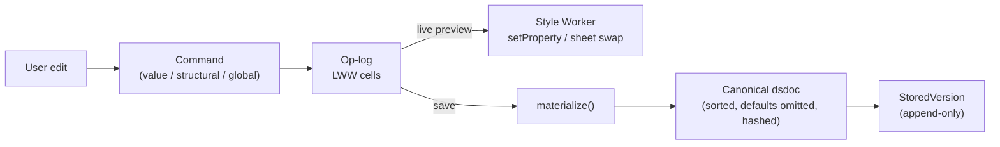
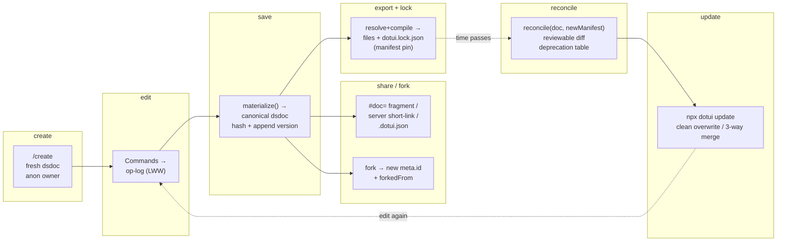

# The dsdoc — the design-system document and its lifecycle
> Part of [The Perfect dotUI](README.md) — an end-state architecture study (2026-07-04). Constitution-conformant.

A design system in dotUI is **one file**. Not a builder state plus a wire format plus a publish preset plus a lab schema — one canonical document, the **dsdoc**, media type `application/vnd.dotui.dsdoc+json`, extension `*.dotui.json`. The URL you share is a dsdoc. The row in the server database is a dsdoc plus its version history. The DTCG file you hand to Figma is a dsdoc projected through the [compiler](11-compiler.md). The `#doc=` fragment in an anonymous link is a compressed dsdoc. There is exactly one artifact, and everything else is a view of it.

The dsdoc is deliberately thin. It does not carry dotUI's vocabulary — the [axes](06-axes.md), the baseline [token graph](05-tokens.md), the per-group [Style Contracts](04-styles.md), the component roster. That vocabulary lives in the **Registry Manifest**, an immutable snapshot the dsdoc pins by version. The dsdoc stores only what *differs* from that pinned baseline: an overlay on the token graph, a handful of axis selections, the rare component style delta, the code style. A share that changes only the accent hue and the corner radius is a few hundred bytes. This is the spine of the whole design — **declaration versus selection**. The manifest declares *what can be chosen and how it renders*; the dsdoc records *what was chosen*. Minimal diffs, tiny shares, and a computable update story all fall out of that split.

This chapter is the reference for that document: its full schema, its three independent version numbers, how omission resolves against a frozen manifest, canonical form and content addressing, the migration ladder, `reconcile()` on lock upgrade, selection precedence, sync-group state and detach, presets versus fan-out axes, every storage path, and the in-session Command op-log that materializes back into canonical dsdocs. The worked fixture is Geist.

---

## 1. The top-level schema

```typescript
interface Dsdoc {
  $schema: "https://dotui.org/schema/dsdoc/v1.json"
  dsdoc: 1                               // integer SCHEMA major — drives migration (§4)
  meta: DsdocMeta                        // identity, ownership, content semver (§1.1)
  lock: RegistryLock                     // pinned immutable manifest snapshot (§2)
  engine: "tailwind" | "stylex"          // output engine — both first-class (see 04-styles.md)
  tokens: TokenGraphOverlay              // the ONLY token section — overlay on baseline graph (§3)
  axes?: Record<AxisId, AxisDecl>        // USER-declared axes (overlay; baseline axes live in the manifest)
  components?: Record<ComponentId, ComponentDelta>  // user Style Contract deltas (§6)
  syncGroups?: Record<SyncGroupId, SyncGroupState>  // detach records (§7)
  presets?: Record<PresetId, SelectionPatch>        // one-shot apply bundles (§8)
  selections: Selections                 // the chosen axis values (§5)
  codeStyle: CodeStyle                   // exported-code style (see 11-compiler.md)
}
```

Twelve keys, and every one of them is either identity, a pin, an engine choice, an overlay, or a set of selections. There is no `primitives`, no `modes`, no separate `tokens`-vs-`semantics` split — the constitution's amendment collapses the config-axes judge's `primitives`/`modes`/`tokens` trio into a **single `tokens: TokenGraphOverlay`** because the Dimensional Token Graph is the one model that already carries ramps (primitives), mode dimensions, and semantic and component nodes as one structure. The dsdoc overlays that structure; it does not re-describe it in three shapes.

Every section is optional-by-omission and unambiguous under the lock (§2, §9). A dsdoc that only recolors is:

```jsonc
{
  "$schema": "https://dotui.org/schema/dsdoc/v1.json",
  "dsdoc": 1,
  "meta": { "id": "ds_01J8ZK…", "name": "Untitled", "version": "0.1.0", "owner": { "kind": "anon" }, … },
  "lock": { "registry": "dotui.org", "manifest": "2028.03.01-a3f", "manifestHash": "9c1e44aa0f2b7d31" },
  "engine": "tailwind",
  "tokens": { "ramps": { "accent": { "producer": { "config": { "": { "seed": "#635bff" } } } } } },
  "selections": {},
  "codeStyle": {}
}
```

No `axes`, no `components`, no `syncGroups`, no `presets`. Empty `selections` and `codeStyle` resolve entirely from the pinned manifest's defaults. The one thing this document *says* is: reseed the accent ramp. Everything else it *inherits*.

### 1.1 `meta` — identity that survives renames and forks

```typescript
interface DsdocMeta {
  id: string                             // ULID "ds_01J8Z…" — minted once, immutable across versions/renames/forks-of-self
  name: string; slug: string
  version: string                        // CONTENT semver, bumped by the user (or publish flow) on save
  owner:
    | { kind: "user"; id: string; handle: string }
    | { kind: "org"; id: string; handle: string }
    | { kind: "anon" }
  forkedFrom?: { id: string; version: string; at: string }
  createdAt: string; updatedAt: string   // ISO 8601
  description?: string
  license?: string                       // SPDX, default MIT — the code is theirs
}
```

`meta.id` is minted once and never changes — renaming the system, publishing a new version, or moving it between owners does not touch it. A **fork** mints a *new* `id` and records `forkedFrom`, so lineage is explicit and a fork is a genuinely separate system, not a branch of the original. Anonymous documents carry `owner: { kind: "anon" }` and no server identity until saved.

---

## 2. The RegistryLock — pinning vocabulary, not code

```typescript
interface RegistryLock {
  registry: string                       // "dotui.org"
  manifest: string                       // "2028.03.01-a3f" — immutable, resolvable at /r/manifest/<v>
  manifestHash: string                   // sha256 prefix — tamper + self-consistency check
  components?: Record<ComponentId, string> // optional per-component version pins for granular updates
}
```

The lock is the single most important design decision in the document, and it is worth stating in one sentence: **an omitted value in a dsdoc means "the pinned manifest's value," never "whatever today's code says."**

Every default the resolver reaches for when a selection is absent — the default variant of a component, the baseline value of `color-primary`, the default corner radius, the shipped 2 mode dimensions, the ~76 semantic tokens — is *frozen data* inside the manifest snapshot named by `lock.manifest`. That snapshot is immutable and content-addressed (`2028.03.01-a3f`), served forever at `/r/manifest/<version>`, and validated on load against `manifestHash`. A dsdoc always knows *exactly which vocabulary it speaks*.

The consequence is that **a two-year-old document opens frozen**. Load a dsdoc pinned to `2026.11.20-7c2` and the [resolver](11-compiler.md) fetches *that* manifest — its axes, its defaults, its Style Contracts, its token baseline — exactly as they were the day it was authored. dotUI can add axes, retune baseline tokens, redesign the default button, and ship a hundred new manifest versions in the interim; none of it touches the frozen document. Untouched sliders cannot move under the user's feet, ever, because "untouched" resolves against a snapshot that cannot change.

Upgrading a lock to a newer manifest is an explicit, reviewed act — never implicit — and is the subject of §4.2 (`reconcile()`).

> **Why not diff against live defaults?** The obvious alternative — omit anything equal to the current code's default — makes every default change silently reinterpret every stored document. Fix `color-border`'s baseline and every doc that "used the default" now renders differently, with no record that anything changed. The lock replaces "equal to today's code" with "equal to a named frozen snapshot," which is the same byte savings with none of the silent drift. The [decision log](00-decision-log.md) records this as *pinned immutable manifest over diff-vs-live-defaults*.

**Ids are readable and permanent.** Every referent a dsdoc stores — an axis id (`button.fill`), an axis value (`sousse`), a token node (`color-primary`, `btn-bg-primary`), a mode option (`dark`), a component (`button`), a sync group (`button-like`) — is a stable, human-readable id minted from its initial slug and *never renamed*. Display labels live separately and rename freely. References are always by id. This keeps documents human-diffable (a git diff reads `color-primary`, not `tk_01H9Z`) while a registry lint forbids removing or reusing a published id, and rare id-space refactors go through a deprecation note (§4.2). This is the constitution's ruling over opaque ULIDs, and the tradeoff is discipline: the guarantee rests on "ids are permanent handles, labels rename freely" enforced by lint, not on opacity.

---

## 3. `tokens` — the Token Graph overlay

The dsdoc's token section is one overlay on the pinned manifest's **baseline Dimensional Token Graph** (fully specified in [chapter 05](05-tokens.md)). The baseline ships the ramps, the ~76 semantic nodes, the per-group component-contract nodes, and 2 mode dimensions (`scheme: [light*, dark]`, `contrast: [normal*, hc]`). The overlay carries only what the user *added or changed*:

```typescript
interface TokenGraphOverlay {
  dimensions?: Record<DimensionId, ModeDimensionDelta>  // add options, add whole dimensions, retarget priority
  dimensionPriority?: DimensionId[]                     // override the default contrast > scheme > brand
  ramps?: Record<RampId, RampSpecDelta>                 // reseed / reknob / switch producer / go fixed
  nodes?: Record<NodeId, TokenNodeDelta>                // add semantic nodes; retarget any node per cell
  order?: NodeId[]                                      // stable emission + diff order for added nodes
}

// A node delta is cell-keyed, matching the graph's resolution model (§05):
interface TokenNodeDelta {
  add?: { layer: "semantic"; category: SemanticCategory; slug: string; pool?: string[]; pairsWith?: NodeId }
  values?: Record<CellKey, TokenValue>   // '' base + per-cell overrides; retargets any existing node
  name?: string                          // rename (emitted var name + display label; id is permanent)
  deprecated?: boolean
}

interface RampSpecDelta {
  producer?: { id?: ProducerId; config?: Record<CellKey, ProducerConfig> }  // per-cell seeds/knobs
  steps?: string[]                       // extend a ramp (Geist's 1000)
  source?: "generated" | "fixed"         // paste-my-palette flips a ramp to hand-authored per cell
}
```

Three facts make this the whole token story:

1. **The overlay merges onto the baseline, cell by cell.** Retargeting `color-primary` to `neutral-1000` writes one node delta with a `values` entry; the baseline node's other cells and all its dependents flow through unchanged. Adding a `dim` scheme option is one `dimensions` delta; every existing token resolves in `dim·*` immediately by falling through to less-constrained cell keys, and the user overrides only the neutral ramp's `scheme:dim` producer config.

2. **There is no separate "global tokens" bag to drop.** Today's free-form globals (`--radius-factor`, cursor tokens, chart slots) are ordinary graph nodes with `literal`/`calc` values. Because they flow through the one resolver like every other node, they *export by construction* — there is no second field an export path can forget. The historical dropped-`tokens` bug is unrepresentable.

3. **`GenerationRecipe.modeDerivation` does not exist.** The constitution deletes `reverse | reseed | shift` as a separate concept — per-cell producer config subsumes it. "Independent dark accent" is a `scheme:dark` key in the accent ramp's producer config, not a mode-derivation policy. There is exactly one way to say "this cell differs": a cell-keyed value.

Component nodes are **system-owned**: a dsdoc can *retarget* `btn-bg-primary` (point it at a different semantic node, per cell) but cannot delete or rename it. Contract evolution — adding a contract node, renaming one — is a manifest-version concern, reconciled on lock upgrade, never a per-document edit.

---

## 4. Three version numbers, never confused

A dsdoc carries three orthogonal versions. Conflating any two is a category error the schema prevents:

| Field | Names the… | Bumped by | Governs |
|---|---|---|---|
| `dsdoc` (integer) | **schema major** — the document's *shape* | dotUI | the pure migration ladder (§4.1) |
| `meta.version` (semver) | **content version** — the *user's* system | user / publish flow on save | version history, `@version` retrieval, fork lineage |
| `lock.manifest` (string) | **vocabulary version** — the frozen snapshot referents resolve against | explicit `reconcile()` only | which axes/tokens/contracts exist and their defaults |

The manifest changes far more often than the schema shape — new axes and retuned defaults ship constantly, while `dsdoc: 1 → 2` happens only when the *document structure itself* changes. Decoupling them is why a trivial baseline tweak never forces a schema bump and a two-year-old doc opens without a migration when only the vocabulary moved on.

### 4.1 The migration ladder — pure, loud, corpus-tested

`loadDsdoc(raw)` walks a **chained, pure, numbered migration ladder** `dsdoc: 1 → 2 → … → HEAD`, then validates against the published JSON Schema (Draft 2020-12, self-identified via `$schema` so any tool — including an AI [agent](12-distribution.md) — validates without dotUI code), then runs a semantic pass:

```typescript
function loadDsdoc(raw: unknown): Result<Dsdoc, DsdocError> {
  const migrated = runLadder(raw)            // pure, total per step, frozen once shipped
  const shaped = validateSchema(migrated)    // JSON Schema Draft 2020-12
  return validateSemantics(shaped)           // every selection targets a declared axis;
                                             // every token ref names a real node;
                                             // sync invariants hold (§7)
}
```

Three properties define the ladder:

- **Pure.** Each `up_N(doc) → doc` is a total function with no I/O — deterministic, testable offline, and **frozen once shipped**. A migration that has been published is never edited; a bug is fixed by adding the next rung, never by mutating a released one.
- **Loud.** Failure is a **typed, actionable error** naming which section failed which rule — never a silent reset to defaults. `DsdocError` is a discriminated union (`{ kind: "unknown-axis"; axis; at }`, `{ kind: "dangling-ref"; node; ref }`, `{ kind: "sync-invariant"; group; member; axis }`, …). The catastrophic historical failure mode — decode fails, fall back to `DEFAULTS`, user's work silently gone — is structurally impossible: there is no fallback, only a surfaced error the builder renders as "this document needs attention," pointing at the exact offending field.
- **Corpus-guarded.** CI runs a **per-version fixture corpus** of real captured documents (invariant #8 in [chapter 13](13-testing.md)). Every schema major freezes a set of representative dsdocs at that version; the ladder must migrate all of them to HEAD and re-validate. A subtly wrong migration is caught by the fixture whose shape it corrupts.

### 4.2 `reconcile()` — the reviewable lock upgrade

Opening against the *pinned* manifest is a no-op by construction. **Upgrading the lock** — moving a document from `2026.11.20-7c2` to `2028.03.01-a3f` — is explicit and reviewable:

```typescript
function reconcile(doc: Dsdoc, newManifest: Manifest): ReconcileResult

interface ReconcileResult {
  doc: Dsdoc                              // the upgraded document — NOT applied until the user accepts
  changes: ReconcileChange[]              // every remap/fold/fallback, human-readable
  blocked: ReconcileBlock[]               // referents with no automatic resolution — need a decision
}
```

Reconcile applies the manifest's **deprecation table**. Every published referent in the new manifest is either still present or carries a `DeprecationNote` with a typed replacement:

| Deprecation kind | Meaning | Reconcile action | Surfaced as |
|---|---|---|---|
| `rename` | id changed | auto-remap the stored id | "Axis `sousse` renamed to `tunis` — no action" |
| `merge` | value folded into another | fold the selection into the survivor | "Value `soft` merged into `subtle`" |
| `removed` | referent gone | snap to a declared fallback | "Style `retro` removed — using `default` (fallback)" `⚠` |
| *(new axis)* | manifest added an axis | resolve to its new default | "New axis `hover-effect` available (default: `none`)" |

The result is a **reviewable diff** — the builder shows the full `changes` list and any `blocked` decisions *before anything is applied*. **No value ever silently degrades**: every drop is a surfaced change. Baseline tokens (system-owned) can be upgraded; a user's own added tokens are never touched by reconcile. If a referent has *no* declared resolution — the rare hard removal without a fallback — it lands in `blocked`, and the upgrade cannot complete until the user chooses.

This is the machinery behind `npx dotui update` finding "Sousse renamed to Tunis — no action" two years after export: the same `reconcile()` runs in the [CLI](12-distribution.md), producing the same reviewed change list.

---

## 5. Selections and precedence

`selections` is the small tree of *what was chosen*. Its shape mirrors the [axis](06-axes.md) scope lattice:

```typescript
interface Selections {
  density?: "compact" | "default" | "comfortable"
  global?: Record<AxisId, unknown>                       // global-scoped axis values
  groups?: Record<SyncGroupId, Record<AxisId, unknown>>  // synced values — stored ONCE per group (§7)
  components?: Record<ComponentId, Record<AxisId, unknown>>  // component-scoped + detached values only
}
```

Every axis, at every component, resolves by a fixed precedence — most-specific wins:

```
component selection   (legal ONLY if the axis is component-scoped OR the member is detached, §7)
  → group selection   (for a synced axis)
    → global selection
      → doc-declared default   (if the axis is a dsdoc overlay in doc.axes)
        → pinned manifest default
```

An absent selection means "the pinned manifest's default" — the lock makes omission unambiguous with no `"inherit"` sentinel needed. This is why a dsdoc that recolors one token stays tiny: it holds exactly the selections that differ, and resolution reaches through empty layers to frozen manifest data for everything else.

The rich mode/token/ramp state does **not** live in `selections` — it lives in the `tokens` overlay (§3), edited through dedicated token affordances. `selections` is the knob layer: enum picks, scalar values, toggles, font and icon-library choices, density.

---

## 6. Components — Style Contract deltas, never class strings

When a user's desired look exceeds any curated axis value — Geist's flat black button, an enterprise square outline — the dsdoc carries the style itself. **It carries a Style Contract delta, not a raw Tailwind class string.**

```typescript
interface ComponentDelta {
  contract?: StyleContractDelta          // lifted, engine-neutral Style Contract patch (see 04-styles.md)
  variants?: Record<string, string[]>    // add/remove instance-prop vocabulary
}
```

This is the constitution's conflict resolution, and it matters. A user authors an override two ways — through the builder's visual style editor, or by pasting raw Tailwind into a style input — and **both funnel through the same lift/validate pass** that the registry's `styles.ts` goes through at build time. The pasted Tailwind is lifted into a `StyleContractDelta` at edit time; the visual editor produces one directly. What lands in the dsdoc is always the lifted, engine-neutral JSON — slots × dimensions × states × token-typed declarations, honoring the owned-slot invariant.

Storing the *delta*, not the class string, buys three things the raw form cannot:

- **StyleX totality is checked at edit time.** When `engine: "stylex"`, a declaration with no StyleX lowering is rejected the moment it is authored, with a clear error — not discovered at export. A dsdoc that validates is guaranteed to compile in *both* engines (see the catalog-completeness invariant in [chapter 13](13-testing.md)).
- **The override participates in resolution.** A Contract delta merges onto the resolved Contract for the group; a class string would be an opaque blob the resolver cannot reason about, cell by cell.
- **Code style applies.** Because the override is data, the [compiler's](11-compiler.md) `codeStyle` AST transforms project over it exactly as they do over registry-authored Contracts. The exported override reads in the user's own taste.

Consider the Button fixture. Its `styles.ts` primary variant carries the raw escape `[--color-disabled:var(--neutral-500)]`. In the perfect dotUI that escape is a **component-contract node** (`btn-disabled-bg`) in the baseline graph, not a raw palette reach — so a user retargets it through the token overlay (§3), never through a component delta. The component delta is reserved for genuine *shape* changes the curated axes don't cover: Geist replaces the whole `solid` surface layer (§10).

---

## 7. Sync groups — synced once, detach declared

Related components form **sync groups** so a style change lands on all members together. Button and ToggleButton share the `button-like` group; changing the group's fill restyles both.

The data model makes accidental drift **unrepresentable**. A synced axis's selection is stored *once*, under the group id in `selections.groups`. There is no per-member slot for a synced axis, so Button and ToggleButton *cannot* diverge by accident:

```jsonc
"selections": {
  "groups": { "button-like": { "button.fill": "solid", "shape.radius": "--radius-sm" } }
}
```

Real systems occasionally want one intentional exception, so the escape hatch is **detach** — a per-member, per-axis opt-out, recorded explicitly:

```typescript
interface SyncGroupState {
  detached?: Record<ComponentId, AxisId[]>  // this member opts out of these synced axes
}
```

To make ToggleButton square while Button keeps `sm`:

```jsonc
"syncGroups": { "button-like": { "detached": { "toggle-button": ["shape.radius"] } } },
"selections": { "components": { "toggle-button": { "shape.radius": "0" } } }
```

Resolution for `toggle-button` now finds the component selection (legal — a detach record exists); `button` still resolves via the group. The **validator enforces the biconditional**: a component-scoped selection of a synced axis exists *if and only if* a matching detach record exists. A component selection for a synced axis with no detach record is a load-time error; a detach record with no override is dead state. Divergence is representable only when *declared*. The builder renders synced axes once at the group header, shows a "detached" chip on the exception, and re-sync deletes both records in one action.

---

## 8. Presets versus fan-out axes — two distinct primitives

Two things look like "flip one thing, change several." The dsdoc keeps them mechanically separate because they have different lifecycles.

**Fan-out axes** are ordinary axes whose `writes` is a *list*, so one selection lands in many places. The translucent-overlays switch is a single global `toggle` whose writes retarget `--color-menu`, `--color-popover`, `--color-tooltip`, and a backdrop-blur token, each with a per-value `when` condition, plus a conditional child axis for blur strength. Because it *is* an axis:

- its state is one boolean in `selections.global`,
- its control is one generated switch in the [builder](10-builder.md),
- toggling off is just selecting the other value — no inverse to compute,
- and export honors it through the same resolver.

**One-shot presets** ("start from Linear," a personality) are `SelectionPatch` bundles applied *once* at edit time. They are deliberately **not** axes because they carry no ongoing state — applying a preset writes a batch of selections and then vanishes as a concept:

```typescript
type SelectionPatch = {
  set?: Partial<Selections>          // selections to write
  tokens?: TokenGraphOverlay         // token overlay to merge
  components?: Record<ComponentId, ComponentDelta>
}
```

`presets` in the dsdoc holds patches available to *this* document; applying one mutates `selections`/`tokens`/`components` and is thereafter indistinguishable from having set those values by hand.

> **Why not merge fan-out into a preset?** A grouped tweak merged into `selections` loses its identity the instant any written value is edited — the switch's on/off state becomes ambiguous, and un-applying requires an inverse patch. A fan-out axis resolves at *resolve time*: one selection, one switch, off is just the other value. The [decision log](00-decision-log.md) records *fan-out axes for grouped tweaks (not merged patches)*.

---

## 9. Canonical form and content addressing

Stored and shared dsdocs are **canonicalized**:

1. Fixed top-level key order; every map sorted by key; order-significant lists carry explicit `order` arrays.
2. Numbers, strings, and timestamps normalized to one representation.
3. **Baseline-identical overlay entries and default-equal selections omitted** — unambiguous *because the lock pins the baseline* (§2).

Then `hash(doc) = sha256(canonicalize(doc))` **content-addresses** every version. This one hash powers dedup (identical documents store once), caching (the [preview](10-builder.md) and export layers key on it), and change detection. Two documents differing only in accent color canonicalize to a one-line git diff. The `manifestHash` in the lock (§2) is the analogous self-consistency check for the *pinned vocabulary*.

Canonical form is what makes the **anonymous flow** work. The canonical doc — usually just lock + a few selections — deflates into a `#doc=` URL fragment. The fragment carries `dsdoc` + `lock`, so a two-year-old link opens through the migration ladder against its frozen manifest, entirely client-side, and — because it is a fragment — **never hits server logs**. When a document overflows URL limits (large literal ramps pasted as `fixed`), the flow degrades two ways, both no-account-friendly:

- **server short-link** — "save for a short link" stores the canonical doc and hands back a compact id;
- **`.dotui.json` file** — download the canonical document and re-import it later, with zero server dependency (the constitution's ruling: the file flow exists as the no-account fallback).

---

## 10. Storage, versions, forks, and history

Named systems live on the server behind `/api/systems`, and the storage model is **append-only**:

```typescript
// POST /api/systems              — store a canonical doc, dedup by hash, append a version, bump head
// GET  /api/systems/:owner/:slug[@version]   — retrieve (head or a pinned content version)
// POST /api/systems/:id/fork     — mint a new meta.id, record forkedFrom, copy head
// GET  /api/systems/:id/history  — the immutable version list
// GET  /api/systems/:id/diff?from=…&to=…      — document diff + visual diff

interface StoredVersion {
  version: string                        // meta.version at save
  hash: string                           // content hash (§9) — the dedup + address key
  doc: Dsdoc                             // the full canonical document
  message?: string                       // save message
  createdAt: string
}
```

- **Append-only, immutable versions.** Saving appends a `StoredVersion` and bumps head; nothing is ever overwritten. Restore is "make an old version the new head" — itself a new append, so history is lossless.
- **Dedup by hash.** Two saves that canonicalize identically store one row. A no-op save is free.
- **Fork.** Forking mints a fresh `meta.id`, sets `forkedFrom` to the source id+version, and copies the head document. The fork is a separate system with its own lineage and its own history.
- **History and visual diff.** Because every version is a full canonical document, `history`, `restore`, and `diff` are all *document* operations — the visual diff renders both versions through the same [resolver](11-compiler.md) and compares, so a review shows exactly what changed on screen, not just in JSON.

Anonymous documents (§9) carry no server row until saved; saving is the moment `owner` moves from `anon` to a real identity and the first `StoredVersion` appears.

---

## 11. The in-session Command op-log

Everything above is the *persisted* artifact. While a user is editing in the [builder](10-builder.md), the live state is **not** a canonical dsdoc being cloned on every keystroke — it is a **Command op-log**.

Each edit is a **Command** — the constitution's edit primitive, classified into value / structural / global tiers by the axis schema (never hand-declared). The op-log is a custom log with **last-writer-wins (LWW) cells**: the editable state is a set of addressable cells (this axis selection, this token node's `scheme:dark` value, this detach record), and each Command is a timestamped write to a cell. Concurrent writes to the *same* cell resolve by LWW; writes to *different* cells are independent. This is deliberately **not a full CRDT** — it is an LWW log with a clean sync/presence seam, the arbiter's ruling that a full CRDT is more machinery than a design-system document needs, while still admitting real-time collaboration and presence at that seam.

The log gives the builder three things for free:

- **A 60fps value tier.** A value-tier Command (a hue drag) is a cell write the [Style Worker](10-builder.md) turns into ~22 `setProperty` calls — zero React renders, zero canonical-doc rebuilds. The op-log absorbs the drag; the dsdoc is untouched until save.
- **Undo/redo.** Commands are invertible; a drag coalesces into one step, and a `batch` is one step. Undo is replaying the log to an earlier point, not diffing documents.
- **A materialization boundary.** The persisted artifact is *always* the canonical dsdoc. On save, the op-log **materializes**: the current LWW cell values fold into a fresh canonical document (§9), which is hashed and appended as a `StoredVersion` (§10). Editing is a log; the artifact is a document; materialization is the one seam between them.



Materialization is also where the **AI assist** and **screenshot import** paths land: both emit Commands over the same op-log API (the schema's `aiHint`s are their vocabulary), staged on a throwaway branch that self-verifies by compiling in-worker before merging — so an AI-authored change becomes a normal set of log entries that materialize into a normal dsdoc.

---

## 12. Worked example — the Geist dsdoc

Here is a real, complete Geist document, adapted to the constitution's `tokens: TokenGraphOverlay` shape. Every section is doing exactly one job.

```jsonc
{
  "$schema": "https://dotui.org/schema/dsdoc/v1.json",
  "dsdoc": 1,
  "meta": {
    "id": "ds_01J8ZGEIST00", "name": "Geist", "slug": "geist", "version": "1.0.0",
    "owner": { "kind": "org", "id": "org_dotui", "handle": "dotui" },
    "license": "MIT", "createdAt": "2028-03-04T00:00:00Z", "updatedAt": "2028-03-04T00:00:00Z"
  },
  "lock": {
    "registry": "dotui.org", "manifest": "2028.03.01-a3f", "manifestHash": "9c1e44aa0f2b7d31"
  },
  "engine": "tailwind",

  "tokens": {
    "ramps": {
      "neutral": {                                    // Geist grays are hand-tuned → fixed producer
        "source": "fixed",
        "steps": ["50","100","200","300","400","500","600","700","800","900","950","1000"],
        "producer": { "id": "fixed", "config": {
          "": {                                       // light cell
            "50": "#fafafa", "200": "#ebebeb", "500": "#8f8f8f", "900": "#171717", "1000": "#000000"
          },
          "scheme:dark": {                            // independent dark cell, not a reversal
            "50": "#0a0a0a", "200": "#2e2e2e", "500": "#7d7d7d", "900": "#ededed", "1000": "#ffffff"
          }
        } }
      },
      "accent": {
        "source": "generated",
        "producer": { "id": "oklch", "config": {
          "": { "seed": "#0070f3" },
          "scheme:dark": { "seed": "#3291ff" }        // independent dark accent = one cell-keyed config
        } }
      }
    },
    "order": ["font-sans"],
    "nodes": {
      "color-primary": {                              // retarget baseline node: black-on-white / white-on-black
        "values": { "": { "kind": "ref", "to": "neutral-1000" } }
      },
      "color-fg-on-primary": {
        "values": { "": { "kind": "on", "of": "neutral-1000" } }
      },
      "font-sans": {                                  // a genuinely new user token
        "add": { "layer": "semantic", "category": "type", "slug": "font-sans" },
        "values": { "": { "kind": "literal", "type": "fontFamily",
                          "value": "'Geist', ui-sans-serif, system-ui" } }
      }
    }
  },

  "components": {
    "button": {                                       // no curated value = Geist-flat: a Contract delta
      "contract": {
        "slots": {
          "root": {
            "variant": {
              "solid": {                              // replace the solid surface layer
                "decls": [
                  { "prop": "background", "value": { "token": "color-primary" } },
                  { "prop": "color", "value": { "token": "color-fg-on-primary" } }
                ],
                "states": {
                  "hover": [{ "prop": "opacity", "value": { "literal": "0.9" } }]
                }
              }
            }
          }
        }
      }
    }
  },

  "selections": {
    "density": "default",
    "global": {
      "global.radiusFactor": 0.83,
      "interaction.cursor": "default",
      "elevation.family": "flat-border",
      "type.family.sans": "geist"
    },
    "groups": {
      "button-like": { "button.fill": "solid", "shape.radius": "--radius-md" }
    }
  },

  "codeStyle": {
    "format": { "printWidth": 80, "semicolons": false, "quotes": "single", "trailingComma": "all" },
    "functions": "arrow",
    "tv": { "classArrays": false, "oneLinePerVariant": true },
    "comments": { "sectionSeparators": false, "density": "terse" },
    "imports": { "style": "named", "sortOrder": "alpha", "groupBlankLines": true },
    "layout": { "styleLocation": "inline", "barrelExports": false }
  }
}
```

Reading it against the reconstruction criteria (proved in full in [chapter 07](07-reconstructions.md)):

| Geist requirement | Where it lives in the dsdoc |
|---|---|
| Hand-tuned grays, not generated | `tokens.ramps.neutral` → `source: "fixed"`, per-cell config |
| Independent dark accent (not a reversal) | `tokens.ramps.accent.producer.config["scheme:dark"]` |
| Black-primary buttons | `tokens.nodes.color-primary` retarget to `neutral-1000` |
| The extra `1000` step | `tokens.ramps.neutral.steps` extends the ladder |
| Geist typeface | `tokens.nodes.font-sans` — a new user token that *exports* |
| The flat button look (beyond curated values) | `components.button.contract` — a Style Contract delta |
| Vercel's code taste | `codeStyle` |
| Button ⇄ ToggleButton stay in sync | `selections.groups["button-like"]` — one slot, both members |
| Pinned forever | `lock.manifest = "2028.03.01-a3f"` |

Note what is *absent*: no `primitives`, `modes`, and `tokens` as three sections — one `tokens` overlay. No raw class strings in `components` — a lifted Contract delta. No `axes` — Geist declares no new knobs, only selects existing ones. The document is small because declaration lives in the pinned manifest and the dsdoc records only Geist's differences.

**A sync/detach session on top.** The user sets `shape.radius = --radius-sm` on the Buttons group header — one write to `selections.groups["button-like"]["shape.radius"]` restyles Button *and* ToggleButton. Then they want ToggleButton square: the builder writes a `detached` record for `toggle-button` on `shape.radius` and a component selection of `0`. Resolution now finds ToggleButton's component value (legal — the detach record exists) while Button still resolves through the group. The validator would reject that component selection without the detach record; divergence is representable only because it was declared (§7).

**What ships two years later.** `npx dotui update`: the doc's lock upgrades through `reconcile()` (§4.2) with a reviewed change list; Button's file — untouched since install, pristine hash matching — overwrites cleanly in the user's arrow-fn, single-quote `codeStyle`; a modal they hand-edited gets a 3-way merge. Nothing clobbers; nothing silently drifts (the full update mechanics are [chapter 12](12-distribution.md)).

---

## 13. Lifecycle timeline

The dsdoc has one shape and a long life. From first edit to a two-year-old update:



Every arrow is the same document moving through a different lens. **Create** mints a fresh anonymous dsdoc. **Edit** accumulates Commands in the op-log. **Save** materializes the log into a canonical, hashed, append-only version. **Share** deflates the canonical doc to a fragment (or short-link, or file); **fork** mints a new identity. **Export** resolves and compiles the doc and writes `dotui.lock.json` into the consumer repo, pinning the manifest. Time passes; **reconcile** upgrades the lock against a newer manifest as a reviewable diff; **update** applies it to the installed files. And then the loop closes — the reconciled document is edited again, back into the op-log. One artifact, one lifecycle, no silent drift at any step.

---

## Tradeoffs

The dsdoc design accepts these costs plainly:

- **Immutable-manifest-forever is a real storage and governance liability.** "Published means permanent" means the registry can never delete a manifest snapshot a document might pin, and must serve `/r/manifest/<v>` for arbitrarily old versions. The design accepts a hot-serve window plus a cold-storage tier ([chapter 12](12-distribution.md)), but the append-only cost is genuine and grows forever.
- **The migration ladder is load-bearing and unbounded.** Every schema major needs a pure, total, tested `up()` migration and a frozen fixture, forever. A subtly wrong migration corrupts a two-year-old document in a way that is *structurally valid but semantically wrong* — the loud-error guarantee only covers detectable failures, so the corpus must actually cover the corrupted shape to catch it.
- **Declaration/selection indirection has an authoring cost.** Turning a knob edits `selections`; authoring a new look edits `components` (a Contract delta). Two places, and the builder must keep them coherent. The "just turn knobs" simplicity applies to selection, not to authoring — power users touch the heavier delta layer.
- **The anonymous URL flow degrades to a server dependency for the most elaborate systems.** A document with large `fixed` ramps overflows URL limits and falls back to a server short-link or a downloaded file. The "pure URL, no account" promise holds cleanly only for small-to-medium documents; the file fallback keeps it *no-account*, but not *no-artifact-to-manage*.
- **Content deltas can outpace StyleX totality.** A dsdoc that validates compiles in both engines — but that guarantee is *why* a pasted arbitrary Tailwind class with no StyleX lowering is rejected at edit time under `engine: "stylex"`. Users cannot freely paste any Tailwind and get StyleX out; the vocabulary is bounded, which slightly dents "any design system" for the StyleX target specifically.
- **3-way merge quality on edited files is the real update risk.** The `reconcile()` mechanism is sound and pure, but merging regenerated code against local hand-edits — across formatter differences and `codeStyle` drift — is genuinely hard. The pristine-hash baseline makes clean overwrites trustworthy; the merge experience on divergent files is where the honesty lives ([chapter 12](12-distribution.md)).
