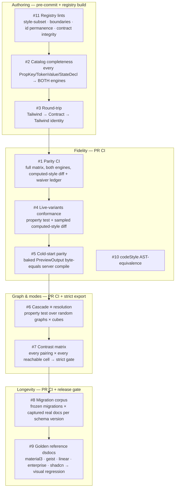

# Testing & invariants
> Part of [The Perfect dotUI](README.md) — an end-state architecture study (2026-07-04). Constitution-conformant.

Every other chapter makes a promise. [Styles](04-styles.md) promises that a button renders identically in the live preview, in the exported Tailwind file, and in the exported StyleX file. [Tokens](05-tokens.md) promises that a `dark·hc` cell is legible by construction. [The builder](10-builder.md) promises a hue drag holds 60fps over a full showcase. [The compiler](11-compiler.md) promises `preview` and `export` are the same bytes because they are the same function. [Distribution](12-distribution.md) promises that a two-year-old [dsdoc](09-dsdoc.md) opens against its frozen [Registry Manifest](03-registry.md) and exports the system it always described.

This chapter is where those promises become failing builds. A promise that isn't a test is a wish, and dotUI has no wishes — it has **eleven invariants**, each protecting exactly one of those claims, each with a mechanism, a corpus, a gate it runs at, and a defined failure. The design is arranged so that *most* fidelity is structural — the same `compile()` runs in both realms, the same `StyleContract` feeds both emitters, the same `resolve()` produces preview and export — and the test suites exist to catch the narrow seams the structure can't close on its own: the one preview shim, the two engine backends, the migration ladder that must never be edited, the reconstruction gap that names a missing axis.

The register of this chapter is operational. For each invariant: **what property it protects**, **the mechanism** (golden file, property test, computed-style render diff, fixture corpus, visual regression, byte compare), **an example failure it catches** (with real fixture values), and **where it runs** — one of five gates:

| Gate | Runs | Speed budget | Blocks |
|---|---|---|---|
| **pre-commit** | oxlint + oxfmt + registry lints, staged files only | < 2s | the commit |
| **registry build** | `pnpm build:registry` → lift, contract migration, catalog totality, round-trip | < 30s | `__generated__` drift, unmergeable PR |
| **PR CI** | everything above + parity, live-variants, cascade≡resolution, migration corpus, codeStyle | < 8min | merge |
| **release gate** | full visual-regression on the golden five, perf benchmark, byte-parity, full-matrix contrast | < 25min | publishing a Manifest |
| **strict export** | per-request contrast + StyleX totality on the actual dsdoc | < 500ms | a single user's export |

The last gate is different in kind: it runs in production, per export request, on a document the test authors never saw. It is the one place the invariants meet an adversary — an arbitrary user system — and it must fail *that user*, with a machine-readable report, not the build.

---

## 0. The map of invariants



The ordering is not arbitrary — it is the pipeline order, and CI runs it that way because each stage presupposes the last. A lint failure (#11) means the Contract can't even be lifted, so parity (#1) is meaningless until it's green. Catalog completeness (#2) is the precondition that *makes* parity provable: if one `PropKey` has no StyleX lowering, the parity render can't run at all. So the cheap, structural checks gate the expensive, rendered ones, and a red build points at the earliest broken stage.

---

## 1. Parity CI — the preview and both engines render the same pixels

**Property protected.** The load-bearing promise of the whole style layer: a component looks the same whether it's the Tailwind emission, the StyleX emission, or the live preview. This is the invariant the two-engine design exists to make *testable* rather than *hoped-for* — the [Style Contract](04-styles.md) is the single source both emitters read, so parity is a property of one artifact.

**Mechanism — computed-style diffing.** For each component in the [catalog](03-registry.md), the harness enumerates the full **render matrix**: the Cartesian product of `variant × size × density × boolean-dimensions × states`. It renders every cell in a headless browser (Playwright + Chromium), once with the Tailwind emission mounted, once with the StyleX emission mounted, into the same DOM host under the same resolved [`ResolvedSystem`](11-compiler.md). For each rendered slot node it reads `getComputedStyle()` and diffs a curated property set — every property any `PropKey` family can touch (`backgroundColor`, `color`, `borderColor`, `borderWidth`, `borderRadius`, `paddingInlineStart/End`, `blockSize`, `inlineSize`, `gap`, `outline*`, `boxShadow`, `opacity`, `transform`, `transitionProperty`, `whiteSpace`, `cursor`, and the slot-scoped `--*` custom properties). States are driven, not faked: `pressed` via `page.mouse.down()` held on the target, `focus-visible` via keyboard `Tab`, `disabled`/`pending` via props, `hover` via `page.hover()`. RAC's own `data-*` attributes are the ground truth — the harness asserts `[data-pressed]` is present before it reads the pressed cell, so a state that fails to bind is a distinct, earlier failure than a state that binds but renders differently.

Computed style, not screenshots, is the diff surface: it is exact, it names the offending property, and it is immune to font-hinting and sub-pixel antialiasing noise. Visual-regression screenshots are reserved for the golden dsdocs (#9), where the thing under test is a *look*, not a property.

**The matrix, sized honestly.** Button's matrix is `6 variants × 4 sizes × 3 densities × {isIconOnly:2} × {base, hover, focusVisible, pressed, disabled, pending, iconStart, iconEnd}` — but the product is pruned by the Contract, not enumerated blindly. States that a variant can't reach (`link` has no `pressed` background rule) contribute no cell; density × size is a real 12-cell table but boolean dimensions only fan out where a rule pins them. The pruned Button matrix is ≈ 900 rendered cells; Menu's (with its 6 slots and the `highlight` param) is ≈ 400. The full catalog is ≈ 30k cells, rendered in parallel shards. This is a PR-CI cost (≈ 6 min sharded) and a release-gate re-run.

**Example failure it catches.** Menu's `highlight = accent` param declares:

```ts
// menu/styles.ts — the real fixture
accent: { vars: { '--color-highlight': 'var(--accent-500)', '--color-fg-on-highlight': 'var(--on-accent-500)' } }
```

If the StyleX emitter dropped a `declaredVars` entry (the exact class of bug the constitution names — "menu.highlight=accent exports differently than it previews"), the Tailwind menu item at `focus` state would compute `background-color: oklch(<accent-500>)` while the StyleX menu item computed `background-color: rgba(0,0,0,0)` — the var never written, the `focus:bg-highlight` rule resolving to an unset custom property. The parity diff on the `item` slot's `focus` cell reports:

```
FAIL menu · item · state=focus · highlight=accent
  backgroundColor:  tailwind "oklch(0.62 0.19 256)"  ≠  stylex "rgba(0, 0, 0, 0)"
  → declaredVar '--color-highlight' present in tailwind emission, absent in stylex
```

Because `declaredVars` are a first-class Contract field emitted by *both* backends, this bug is normally structurally impossible; the parity CI is the proof that it stays impossible when the StyleX emitter changes.

**The waiver ledger.** The only sanctioned divergence is an [`EscapeHatch`](04-styles.md) carrying both engine renderings — or, where a contributor genuinely can't produce both, an explicit waiver. Waivers live in a checked-in ledger, not in a code comment that rots:

```jsonc
// packages/style/parity-waivers.json  — every entry is a tracked escape, reviewed on touch
{ "waivers": [
  { "id": "wv_input_addon_calc_rounding",
    "component": "input", "slot": "addonButton", "cell": "size=lg·density=comfortable",
    "property": "inlineSize",
    "reason": "calc(var(--input-h) - var(--addon-inset)*2) sub-pixel: Tailwind rounds at the utility, StyleX at calc()",
    "tolerancePx": 0.5,
    "expires": "2028-09-01", "owner": "style-team", "issue": "dotui/dotui#4821" } ] }
```

Every waiver has a tolerance, an expiry, an owner, and an issue. A cell that diverges *without* a matching waiver fails the build. A waiver whose `expires` has passed fails the build even if the cell now passes — you can't leave a dead exception in the ledger. The parity CI's summary output is the count of matrix cells rendered, cells clean, and active waivers; a PR that adds a waiver shows it in the diff, so granting an escape is a reviewed act.

**Where it runs.** PR CI (sharded, ≈ 6 min) and release gate (full, un-sharded). Not pre-commit — it needs a browser.

---

## 2. Catalog completeness — both engines are total

**Property protected.** Neither emitter can ship a component whose look one engine can render and the other silently can't. This is what upgrades parity from "we diffed the cells we thought of" to "there is no cell either engine can't express" — it makes the vocabulary a *closed, proven-total* set.

**Mechanism — enumeration, not rendering.** A pure build-time test iterates the entire Contract vocabulary independent of any component: every `PropKey` family (`bg`, `fg`, `ring`, `radius`, `paddingX`, `size`, `gap`, `truncate`, `translateX`, `transitionProperty`, …), every `TokenValue` shape (`{token}`, `{semantic}`, `{literal,type}`, `{calc}`, `{mix}`, `{componentVar}`), and every `StateDecl.kind` (`rac-render`, `rac-data`, `css-pseudo`, `relation`, `context`, `media`). For each it asserts both `tailwindEmitter` and `stylexEmitter` return a defined lowering (not `undefined`, not a `throw`). It's a totality check over a finite product — sub-second, no DOM.

**Why it's separate from parity.** Parity (#1) proves the lowerings *agree*; completeness (#2) proves the lowerings *exist*. A missing lowering wouldn't show up as a parity diff — it would show up as the parity render crashing, or worse, silently skipping the cell. Completeness runs first and turns "the emitter has a hole" into a precise, fast, DOM-free failure naming the exact `(family, valueShape, engine)` triple.

**Example failure it catches.** A contributor adds a `maskImage` PropKey family to support a new gradient-mask look and wires the Tailwind lowering (`mask-[…]`) but forgets the StyleX one:

```
FAIL catalog-completeness · PropKey "maskImage" · engine "stylex"
  tailwindEmitter.lower("maskImage", <value>) → "mask-image: linear-gradient(...)"
  stylexEmitter.lower("maskImage", <value>)   → undefined
  A PropKey family cannot ship with one engine lowering. Add the StyleX rendering or gate behind an EscapeHatch.
```

The component using `maskImage` never reaches parity CI — the build fails at catalog completeness, cheaply, with the fix named. This is the mechanism that keeps the closed vocabulary honest as it grows: promoting a new `PropKey` family is a batched, both-engine act by policy, and this test is the enforcement.

**Where it runs.** Registry build (sub-second, part of `pnpm build:registry`), re-asserted in PR CI.

---

## 3. Round-trip — the lift loses nothing

**Property protected.** The [Style Contract](04-styles.md) is a *derived* artifact, lifted from Tailwind strings. Round-trip proves the lift is lossless *for Tailwind*: `Tailwind → Contract → Tailwind` is semantic identity. If the Contract dropped or mangled anything on the way in, the re-emitted Tailwind would differ from the authored Tailwind, and the whole "derived single source of truth" claim would be a lie.

**Mechanism — canonical-form self-test.** At registry build, for every component, the compiler lifts `styles.ts` to a Contract, then runs the Tailwind emitter over that Contract, then compares the result to the authored source **after both are put in canonical class form** (deterministic class order — sorted by the Recess/Tailwind ordering — and canonical grouping). The comparison is on the canonicalized token, not the raw string: `hover:bg-primary-hover pressed:bg-primary-active` and `pressed:bg-primary-active hover:bg-primary-hover` are the same Contract and must canonicalize identically. This is the compiler's own self-test — it doesn't trust the lift, it proves it every build.

**What "semantic identity" allows.** The re-emission is byte-comparable to hand-authored output *modulo canonical order* — that's the standard the [styles chapter](04-styles.md) sets ("a Tailwind user sees a file byte-comparable to today's hand-authored output"). Peephole re-collapse is part of identity: the normalizer expands `pending:**:not-data-[slot=spinner]:opacity-0` into per-slot `opacity:0` rules on the way in, and the emitter must re-collapse them to the compact descendant idiom on the way out. Round-trip is what proves that expansion/re-collapse pair is a true inverse.

**Example failure it catches.** Button's primary variant carries a var-write that is *not* a utility:

```
[--color-disabled:var(--neutral-500)] [--color-fg-disabled:var(--neutral-300)]
```

The lift turns these into `declaredVars` scoped to `variant:primary`. If the emitter re-collapsed `declaredVars` in the wrong slot order, or emitted them as `[--color-disabled:...]` on the root rule instead of inside the primary variant slice, round-trip would report:

```
FAIL round-trip · button · variant=primary
  authored:  bg-primary text-fg-on-primary [--color-disabled:var(--neutral-500)] [--color-fg-disabled:var(--neutral-300)] hover:bg-primary-hover …
  re-emitted: bg-primary text-fg-on-primary hover:bg-primary-hover [--color-disabled:var(--neutral-500)] …  (--color-fg-disabled dropped)
  diff: declaredVar '--color-fg-disabled' present in source, absent in re-emission
```

The dropped var would then also fail parity (#1) at the `disabled` state — but round-trip catches it earlier, cheaper, at build time, and points at the *lift*, not the render.

**Where it runs.** Registry build. A round-trip failure means the `__generated__` Contract is wrong, so it blocks the build that would commit it.

---

## 4. Live-variants conformance — the one preview seam

**Property protected.** The builder preview mounts the *real* registry `base.tsx` files, whose `./styles` import resolves to a live style module (`createLiveVariants`) instead of the exported `tv()` call. This is the [single deliberate seam](10-builder.md) between "what you preview" and "what you export." The invariant: `createLiveVariants(x)(props)` produces exactly the class string that `tv(emitFiles(...))(props)` produces, for every component pattern and every prop combination. If the shim drifts from the real `tv()`, the preview lies.

**Mechanism — property test *plus* sampled computed-style diff** (the constitution's explicit "both" ruling). Two layers:

1. **Property test (class identity).** For randomized `props` — generated with `fast-check` over each component's variant/size/boolean domains plus `className` overrides — assert string equality:
   ```ts
   fc.assert(fc.property(arbProps('button'), (props) =>
     createLiveVariants('button')(props) === tv(exportedButtonConfig)(props)
   ))
   ```
   Run per `base.tsx` shape: slotless (Button), slotted (`useStyles()()` — Menu with its 6 slots), and compound-variant-bearing. This is fast (no DOM, thousands of cases) and it catches the *structural* drift — a slot the shim forgot, a compound variant it resolves in a different order, a `className` merge that `tv()` does with `tailwind-merge` but the shim doesn't.

2. **Sampled computed-style diff.** String identity proves the *class list* matches; it does not prove the live module and the exported code, mounted as real components, *render* the same. A curated sample matrix per component (not the full parity matrix — a representative slice: default cell, one hovered, one pressed, one slotted-with-icon) is rendered twice (live module vs. exported `tv()`) and `getComputedStyle`-diffed, exactly as in #1. This closes the gap where the shim returns the right string but wires it to the wrong slot element.

**Why both.** The property test is cheap and exhaustive over props but blind to mounting. The computed-style sample is expensive and narrow but catches mounting. Neither alone is sufficient: a shim that returns correct strings but attaches them to a stale DOM ref passes the property test and fails the sample; a shim that renders correctly for the sampled cells but mis-merges an un-sampled `className` passes the sample and fails the property test.

**Example failure it catches.** `createLiveVariants` for Menu must be signature-compatible with the slotted `useStyles()()` pattern. If the shim's slot resolver returned the `item` slot's classes for both `item` and `itemLabel` (an off-by-one in the slot map), the property test fires:

```
FAIL live-variants · menu · slot=itemLabel · props={size:'md'}
  live:  "text-sm gap-2 px-2 py-1 **:[svg]:not-with-[size]:size-4"   (item's classes)
  tv():  ""                                                          (itemLabel is empty)
```

**Where it runs.** PR CI. The shim is load-bearing for the entire fidelity argument — it gets a conformance suite, not trust.

---

## 5. Cold-start parity — the baked default equals a fresh compile

**Property protected.** The builder adopts a **baked default `PreviewOutput`** at startup so there's never an unstyled frame while the worker boots. That baked artifact must be byte-identical to what the server's `compile()` produces for the default dsdoc — otherwise the first frame the user sees is subtly wrong until the worker swaps it, and "preview equals export" has a hole exactly at t=0.

**Mechanism — byte compare.** At release-gate build, `compile(resolve(manifest, defaultDsdoc), { kind: 'preview', engine: 'tailwind' })` is run fresh on the server, producing `{ themeCss, utilitiesCss, runtimeVarsCss }`. Each string is byte-compared against the committed baked default the builder ships (`packages/runtime/baked/default.preview.json`). Byte-equal, not semantically-equal: the baked artifact is *the same function's output*, so any difference is a staleness bug, and byte comparison catches it with zero tolerance. The same check runs for `engine: 'stylex'` against the precomputed static atomic layer for the base doc.

**Example failure it catches.** A contributor changes Button's default radius token from `radius.md` to `radius.sm` in the Manifest baseline but doesn't rebuild the baked default. The fresh compile emits `--btn-radius: var(--radius-sm)`; the baked default still says `--radius-md`:

```
FAIL cold-start-parity · engine=tailwind · themeCss
  fresh:  "--btn-radius: var(--radius-sm);"
  baked:  "--btn-radius: var(--radius-md);"
  → baked default is stale. Rebuild packages/runtime/baked/ and commit.
```

**Where it runs.** Release gate (and locally on `pnpm build:registry` when the baked artifact is a tracked `__generated__` file, so drift is caught in the same registry-drift job that guards the rest of `__generated__`).

---

## 6. Cascade ≡ resolution — the emitted CSS reproduces the graph

**Property protected.** The [Dimensional Token Graph](05-tokens.md) resolves a node in a cell by a precise rule — *most-constrained cell key wins, ties by `dimensionPriority`*. The emitted CSS reproduces that resolution through an *entirely different mechanism*: paired media/attribute selectors ordered by ascending specificity, so the browser's cascade lands on the same value the resolver computed. Two independent machines (a topological resolver in TypeScript, the CSS cascade in the browser) must agree for every node in every reachable cell. If they disagree, the preview is right and the export is wrong (or vice versa) — and the disagreement is silent, because both "work," they just work differently.

**Mechanism — property test over random graphs and cubes.** This is the heaviest property test in the suite, because the failure mode is combinatorial and adversarial ordering is the classic bug:

1. Generate a random valid `TokenGraph`: random ramps, random semantic nodes with random `ref`/`on`/`alpha`/`mix`/`calc` values, random cell-keyed overrides across a random **mode cube** (up to the soft-cap 4 dimensions / 24 cells).
2. Compute the *oracle*: `resolve(graph)` in TypeScript, giving the expected value of every node in every reachable cell.
3. Emit the Tailwind CSS (`@theme` + `:root` + paired per-cell delta blocks).
4. For every reachable cell, load the emitted CSS in a headless browser, force that cell (`data-scheme`/`data-contrast`/… on the root — the exact mechanism the builder uses to preview a cell), and read the computed value of every emitted custom property.
5. Assert `browserValue === oracleValue` for every (node, cell).

The StyleX backend gets the mirror test: `stylex.defineVars` conditional values + `createTheme` deltas must resolve to the same oracle. And a third assertion ties them together — **Tailwind and StyleX resolved values are equal** for the same graph, which is what makes the two backends interchangeable in the compiler.

**Why random graphs, not fixtures.** A fixture graph tests the shapes the author imagined. The cascade-order bug lives in the shape the author *didn't* imagine — a compound cell `scheme:dark&contrast:hc` whose delta block emits at lower specificity than a plain `contrast:hc` block, so the browser picks the wrong one. Random generation with cube overrides is the only way to reach the adversarial ordering. The constitution names this explicitly: "property tests that emitted CSS cascade reproduces graph resolution for random graphs/cubes."

**Example failure it catches.** The generator produces `color-border` with `{ '': neutral-300, 'contrast:hc': neutral-500, 'scheme:dark': neutral-700 }` and forces `dark·hc`. The resolver's oracle says `contrast:hc` wins (higher `dimensionPriority` than `scheme`) → `neutral-500` *of the dark-generated ramp*. If the emitter ordered the `[data-contrast="hc"]` block *before* the `[data-scheme="dark"]` block (wrong — equal specificity, source order decides, and `dark` would then win), the browser computes `neutral-700`:

```
FAIL cascade≡resolution · node=color-border · cell=scheme:dark&contrast:hc
  oracle (resolver):  var(--neutral-500)   [contrast:hc wins by dimensionPriority]
  browser (cascade):  var(--neutral-700)   [scheme:dark block emitted last, wins by source order]
  → delta-block emission order violates ascending-specificity contract for compound cells
```

This is the single most important token-layer test: the [tokens chapter](05-tokens.md) rests its "delta emission reproduces resolution exactly" claim entirely on the paired-selector emitter being provably correct, and this is the proof.

**Where it runs.** PR CI (a bounded number of generated graphs per run, seeded for reproducibility) and release gate (a much larger generated corpus, longer budget). A shrunk counterexample is printed on failure so the offending graph is minimal and debuggable.

---

## 7. The contrast matrix — every pairing, every reachable cell, and the strict gate

**Property protected.** A design system cannot ship an illegible primary button. The [tokens chapter](05-tokens.md) derives contrast pairings *structurally* — from contract `pairsWith` edges (created by `surface()`), from `on`-values, and from declared semantic pairs — and verifies each in *every reachable cell*, holding `hc` cells to higher targets. This invariant has two faces: a **test** (the verifier is correct) and a **gate** (a real export in `strict` mode is blocked until every pair passes).

**Mechanism — two layers.**

1. **Verifier correctness (PR CI).** Golden-file tests over hand-constructed graphs with *known* contrast outcomes: a pair known to pass AA at 4.6:1, a pair known to fail APCA Lc 45, a `hc` cell where a pair passes normal targets but fails the boosted target. Assert `verifyGraph` classifies each exactly. This proves the WCAG2 and APCA math, the target-boosting for `contrastBoost` cells, and the `alpha`/`mix` composite handling (a `bg-inverse/10` over a resolved surface is verified against the *composited* color, not the token). The verifier is incremental in the builder (touched pairings × affected cells) and full-matrix at export — a golden test asserts the incremental result equals the full-matrix result for the same edit, so the fast path can't diverge from the slow path.

2. **The strict export gate (production, per request).** When a user exports with `verification: 'strict'`, `resolve()` runs the full-matrix verification on *their* graph. If any pairing fails in any reachable cell, the export is **blocked** and returns a machine-readable report — not a build failure, a *user-facing* one:
   ```jsonc
   { "status": "blocked", "mode": "strict",
     "failures": [
       { "pair": ["btn-fg-default", "btn-bg-default"], "cell": "scheme:dim&contrast:hc",
         "metric": "APCA", "value": 38, "target": 60,
         "proposedFix": { "op": "setValue", "node": "btn-fg-default",
           "cell": "scheme:dim&contrast:hc", "value": { "kind": "on", "of": "p:neutral-300" } } } ] }
   ```
   The fix is a **proposed, cell-scoped graph edit** — never a silent output correction (that would break source↔preview↔export equivalence). Headless callers (CI pipelines, agents) pass `--accept-fixes` to apply the proposed cell-scoped edits and emit a new Manifest-pinned dsdoc; interactive callers see the proposal and accept it in the builder. Either way the failing base value is never mutated — only a new, more-specific cell key is appended.

**Example failure it catches.** The worked "add a `dim` scheme" flow from the [tokens chapter](05-tokens.md): after adding the `dim` option, `btn-fg-default ↔ btn-bg-default` passes in `dim·normal` but fails APCA in `dim·hc` (the `hc` target is boosted toward AAA, and the dim surface is too close to the on-color). Strict export blocks; the proposed fix appends `{ cell: 'scheme:dim&contrast:hc', value: on(p:neutral-300) }`; accepting it makes only that cell change; re-export passes. The base value and every other cell are untouched — the fix cannot regress `dim·normal` or `light·hc`.

**Where it runs.** Verifier correctness: PR CI (golden) + release gate (full-matrix over the golden five). The gate itself: strict export, per request, in production.

---

## 8. The migration corpus — frozen migrations, captured real documents

**Property protected.** A [dsdoc](09-dsdoc.md) carries three version numbers; the one this protects is `dsdoc` — the *schema major*. When dotUI ships `dsdoc: 2`, every stored `dsdoc: 1` document must migrate through a pure `up()` function to the new shape, losslessly, forever. A migration, once shipped, is **frozen** — it can never be edited, because editing it retroactively changes how already-migrated documents were interpreted. The catastrophic failure this guards against: a subtly-wrong migration that produces a *structurally valid but semantically wrong* document — validation passes, the user's system is silently corrupted, and it surfaces months later as "my primary color changed."

**Mechanism — a fixture corpus, frozen per schema version.** For every schema version there is a directory of captured *real* documents — not synthetic minimal cases, but actual dsdocs pulled (with consent, anonymized) from stored user systems, chosen to cover the shapes that exist in the wild: literal-ramp systems, systems with user-added dimensions, systems with `ComponentOverride` deltas, systems near the soft-cap, systems with detached sync groups.

```
packages/schema/migration-corpus/
├── v1/
│   ├── geist.dotui.json                 # the worked Geist doc, frozen at dsdoc:1
│   ├── real-0042.dotui.json             # captured: 4 dimensions, fixed neutral ramp
│   ├── real-0117.dotui.json             # captured: detached toggle-button, custom tokens
│   └── expected/                        # each doc's canonical form AFTER up() to v2, frozen
│       ├── geist.dotui.json
│       └── …
├── v2/ …
```

Each `vN` doc has a frozen `expected/` counterpart: its exact canonical form after migrating to `vN+1`. The test loads every `vN` doc, runs the frozen migration ladder to HEAD, and byte-compares against the frozen expected output. Because both the migration *and* the expected output are frozen, a change to the migration code that alters *any* historical document's outcome fails loudly — you literally cannot edit a shipped migration without a test going red and telling you which real document you'd have corrupted.

When `dsdoc: 3` ships, the `v1/expected/` files are *regenerated to v3* and re-frozen — but the regeneration is itself reviewed: the diff between "v1 doc migrated to v2 then v3" must be inspectable, and a surprising change in a two-major-version-old document is a red flag caught in review.

**Example failure it catches.** `dsdoc: 1 → 2` renames the token category `"dimension"` to `"space"`. A naive migration does a blind string replace and also rewrites a *user's custom token* literally named `dimension` in its `description`. The frozen `real-0042` document had exactly such a description; its expected v2 output preserves the description verbatim:

```
FAIL migration-corpus · v1/real-0042 → v2
  path: tokens.tokens["radius-factor"].description
  expected: "the base dimension multiplier"
  actual:   "the base space multiplier"
  → migration mutated a description string; category rename must target the `category` field only
```

**Migrations are total-or-loud.** A document that reaches an unmapped id or an un-migratable shape does not fall back to defaults (today's silent-reset bug, structurally deleted) — it throws a *typed* error naming the section, the rule, and the specific id. A corpus fixture that is *meant* to be rejected (a genuinely corrupt input) asserts the exact error type and message. Silent data loss is not a failure mode the system has; it's a test.

**Where it runs.** PR CI (fast — pure functions, byte compares) and release gate (the full corpus, including the largest captured documents).

---

## 9. Golden reference dsdocs — reconstruction as a visual-regression test

**Property protected.** The [north star](07-reconstructions.md): the builder is flexible enough to recreate almost any design system. Five maintained reference dsdocs — **Material 3**, **Geist**, **Linear**, **classic enterprise**, and **shadcn** — are the proof. This invariant makes the proof *continuous*: the golden five are validated, published, and visual-regression-tested every build, and **a reconstruction gap is a failing test that names the missing axis**. This is where "flag the missing axis; don't invent a token" stops being a discipline and becomes a red build.

**Mechanism — three-part, per golden doc.**

1. **Validate + resolve.** Each golden dsdoc is loaded through the migration ladder, validated against the [JSON Schema](09-dsdoc.md), and resolved against its pinned Manifest. A resolve error (an unmapped token, a broken `ref`, a sync invariant violation) fails here — the reconstruction is not even well-formed.

2. **Render + visual-regression.** A canonical showcase (buttons, menus, inputs, cards, the type scale, the contrast readout) is rendered under each resolved system in a headless browser and screenshot-diffed against a committed golden image, per scheme and per contrast cell. Visual regression *is* the right tool here — unlike parity (#1), the thing under test is a *look*, and a pixel diff against "what Material 3 is supposed to look like" is exactly the assertion. Thresholded (a small per-pixel tolerance for antialiasing) with a diff image surfaced on failure.

3. **Reconstruction-gap detection.** Each golden doc carries a `reconstructionTargets` manifest: the specific looks it is *supposed* to achieve (Geist's flat black button, Material 3's tonal fill and pill radius, Linear's translucent overlays + hover-lift, enterprise's zero-radius outline). The test asserts each target is reachable *through an axis or overlay*, not through an escape hatch. If a target can only be hit by hand-editing raw classes with no covering axis, the test fails and names the gap:

```
FAIL golden · linear · reconstruction-target "command-palette-blur"
  target look: translucent command palette with 20px backdrop blur
  no axis writes `--menu-backdrop-blur`; overlays.blurStrength caps at 12px
  → MISSING AXIS: backdrop-blur strength for overlay surfaces (proposed: extend overlays.blurStrength range)
  This is not a test bug. Add the axis to the Manifest or the target is not reconstructable.
```

That failure is the mechanized form of the CLAUDE.md rule. It doesn't tell you to hardcode `blur-[20px]`; it tells you an axis is missing and the north star is not met until it exists.

**Example failure it catches (visual).** A change to the `oklch` producer's dark-derivation shifts Material 3's dark-scheme surface tone. The Geist and shadcn goldens are unaffected (Geist uses a `fixed` neutral ramp; shadcn its own), but Material 3's dark showcase screenshot diffs against its golden:

```
FAIL golden · material3 · showcase · cell=scheme:dark
  visual diff 3.1% > threshold 0.5%  (surface tone shifted, diff image attached)
  regressions: card.background, menu.background, popover.background
```

Whether that's a regression or an intended improvement is a human call — but it's a *surfaced* call, with a diff image, not a silent drift. Accepting it means re-committing the golden image in the same PR, which is a reviewed act.

**The golden five are also the shared fixtures.** Geist is *the* worked dsdoc across every chapter — the [config-axes worked example](09-dsdoc.md), the reconstruction, and this golden. Reusing one document as fixture everywhere means a change that breaks Geist breaks it visibly in the chapter examples, the reconstruction test, and the migration corpus at once.

**Where it runs.** Release gate (full visual regression — it's the slowest suite, and a Manifest publish is exactly the moment reconstruction must hold). Reconstruction-gap detection (parts 1 and 3, no screenshots) also runs in PR CI, so a PR that removes an axis a golden depends on fails before merge.

---

## 10. codeStyle AST-equivalence — the ownership layer never changes behavior

**Property protected.** [`codeStyle`](11-compiler.md) shapes the *appearance* of exported code — arrow vs. declaration functions, `tv()` class arrays vs. one-line, section comments, import order, token indirection flatten vs. preserve, density baked vs. runtime. Every one of these is a transform over the emitter's output AST. The invariant: **every `codeStyle` transform is AST-equivalent modulo formatting to the canonical emitter output.** Changing how the code *looks* must never change what it *does*.

**Mechanism — parse-back AST comparison.** For each component and each `codeStyle` option (and a sampled matrix of option *combinations*), emit the file, then parse both the canonical-`codeStyle` output and the transformed output back to ASTs, strip formatting-only nodes (whitespace, comment nodes for the `comments` axis, statement order for the `imports.sortOrder` axis), and compare the normalized ASTs for structural equality. The transforms operate on typed ASTs — never regex over strings, never `// MARK:` anchors — so the test is checking that a real AST transform preserved semantics.

Two transforms need more than AST equality:

- **`tokenIndirection: flatten | preserve`** changes emitted *values* (`bg-primary` vs. `bg-(--btn-bg-primary)`). AST equality alone would flag these as different. The test instead asserts the two emissions *resolve to the same computed styles* — a small computed-style diff, reusing #1's harness — because flatten and preserve are the same decision expressed two ways.
- **`density: baked | runtime`** changes the shipped class set (folded vs. `data-density` axis). The test asserts that for each density tier, the baked output and the runtime output *at that tier* compute identical styles.

**Guarantee: oxfmt/format is never silently swallowed.** The final emitted file is run through `oxfmt`; the test asserts the formatter is idempotent on the output (`oxfmt(oxfmt(x)) === oxfmt(x)`) and that a formatting failure surfaces as an error, not a silently-unformatted file. The constitution's phrasing — "oxfmt/format never silently swallowed" — is this idempotence-and-loudness check.

**Example failure it catches.** The `functions: 'declaration'` transform, converting an arrow component to a function declaration, accidentally drops the `displayName` assignment (`Button.displayName = 'Button'`) that the arrow form carried as a trailing statement:

```
FAIL codeStyle-ast · button · functions=declaration
  canonical AST has ExpressionStatement: Button.displayName = "Button"
  transformed AST: missing
  → transform is not AST-equivalent: a statement was dropped, not just reformatted
```

**Where it runs.** PR CI. The transforms are pure and fast; the computed-style sub-checks for `tokenIndirection`/`density` add a small browser cost.

---

## 11. Registry lints — the authoring guardrails

**Property protected.** The [registry](03-registry.md) is the product's source of truth and must stay clean and liftable. Five lints protect five distinct properties, all at pre-commit and registry build so a violation never even reaches the more expensive suites. These are the cheapest, earliest gates — a lint failure means the Contract can't be built, so nothing downstream is meaningful.

| Lint | Property | Fails when | Example (real fixture) |
|---|---|---|---|
| **`dotui/style-subset`** | Every authored class lowers to the Contract vocabulary | A class isn't in the closed whitelist, or a design value has an available token | `bg-[#635bff]` when `bg-primary` exists → error with the token hint; `[&.active]:…` selector referencing a utility class name |
| **`dotui/import-boundaries`** | Registry items import only from `@dotui/{style,tokens,runtime}`, relative paths, and published packages | A www-side import leaks in | `import { RouterLink } from '@/components'` inside a `base.tsx` |
| **`dotui/id-permanence`** | Published token/axis/component ids are never removed or reused | A committed id disappears or its slug is reassigned to a different node | `btn-bg-primary` deleted without a deprecation alias |
| **`dotui/contract-integrity`** | System-owned contract nodes have a base value and aren't deleted/renamed by users; owned-slot invariant holds | A rule describes another slot's property, or a contract node lacks a `''` cell value | a `Rule` on the `root` slot writing an `icon`-slot property that wasn't re-homed |
| **`dotui/no-hardcoded-design-values`** | The "would two design systems disagree?" test | A design value (color, radius, shadow, density-affected spacing) is a literal instead of a token | `rounded-[7px]` on a component root; `text-[#111]` |

**`style-subset` is the compiler's lowering pass in dry-run.** This is the single most important lint fact: the lint and the compiler share one code path. `style-subset` *is* `lift()` run in dry-run mode, so **lints clean ⇒ compiles**. A green `style-subset` is not a heuristic approximation of "will this lift?" — it is the lift, without the emit. This is what lets the pre-commit lint be trusted: it can't pass on something the registry build then fails to lift.

**The hardcoded-value test discriminates look from mechanics.** `no-hardcoded-design-values` does not ban all literals — component *mechanics* (`border`, `p-0`, `top-1/2`, hairlines, `**:[svg]:shrink-0`) are allowlisted, because those are internal layout, not design decisions. The test is exactly CLAUDE.md's rule: would two design systems disagree on this value? A radius would; a `shrink-0` wouldn't. The lint encodes that boundary as an allowlist of mechanics families, and a genuinely new mechanic that isn't allowlisted fails *with a prompt to justify it as mechanics or tokenize it* — the contributor is never left guessing.

**Example failure it catches.** A contributor copies a shadcn button class verbatim including a hardcoded focus ring color:

```
FAIL dotui/no-hardcoded-design-values · button/styles.ts:9
  'focus-visible:ring-[#3b82f6]' hardcodes a design color
  → an available token covers this: use `focus-visible:focus-ring` (writes --color-focus-ring)
  If no token covers the look, flag the missing axis — do not invent a literal.
```

**Where it runs.** Pre-commit (staged files, sub-second) and registry build (whole registry). The pre-commit run is the first line: it's the fastest feedback and it keeps `main` liftable at every commit.

---

## 12. Unit-test layout and the fixture strategy

The eleven invariants are the *integration* spine. Beneath them, each package carries unit tests scoped to its own kernel, and one shared fixture strategy runs through all of them.

**Per-package unit tests.**

| Package | What its unit tests cover | Notable coverage |
|---|---|---|
| `@dotui/schema` | Canonical form idempotence, `validate()` against the JSON Schema, each migration `up()` in isolation | `canonicalize(canonicalize(x)) === canonicalize(x)`; every migration is total on its version's fixtures |
| `@dotui/tokens` | Each producer (`oklch`, `tailwind`, `contrast`, `material`, `fixed`), graph edits + invariants (Tarjan cycle, layer-violation, dup-slug, contract-integrity), `verify` (WCAG2/APCA math, nudge), DTCG (de)serializer round-trip | producer determinism (same config + cell → same ramp); `applyEdit` rejects without mutating |
| `@dotui/style` | `lift`/`normalize` (the eight passes), Contract schema migrations, both emitters as pure functions | each normalization pass has a golden input/output pair |
| `@dotui/compiler` | `resolve()` stages (validate → migrate → graph merge → ramp materialization → axis resolution → contract resolution), each `compile()` target | resolve is deterministic; precedence + sync fan-out + detach |
| `@dotui/runtime` | `DesignScope` scoping/containment, `createLiveVariants` slot resolution, worker protocol serialization | (its cross-package guarantee is #4) |
| `@dotui/cli` | `plan()` — clean overwrite on pristine-hash match, 3-way merge on edited files | pristine hash detection; conflict-marker output |

The heaviest unit suite belongs to `@dotui/tokens` — the producer and verify tests — because the color math is where a silent numeric bug does the most damage and a rendered test wouldn't localize it.

**The shared fixture strategy.** Fixtures are shared *by design*, not by accident, so a change that breaks a fixture breaks it in every suite that uses it — the blast radius is visible.

- **Button** — the shared component fixture for *authored input*: today's real `styles.ts`, with its `pending:**:not-data-[slot=spinner]` complement expansion, `[--color-disabled:var(--neutral-500)]` var-writes, `not-with-[size]` icon guards, and `sizes()` density table. Every style-layer suite (lift, round-trip, both emitters, parity, live-variants, codeStyle) runs on Button. It is the worst case that exercises every normalization pass at once.
- **Menu** — the shared fixture for *slotted components and declaredVars*: 6 slots, the `highlight` param with its `--color-highlight`/`--color-fg-on-highlight` vars. It is the fixture that proves the menu.highlight export bug stays dead — every suite that could regress it (parity #1, live-variants #4, codeStyle #10) touches Menu.
- **Geist** — the worked *dsdoc*: the reconstruction, the golden (#9), the migration corpus anchor (#8), the config-axes worked example. One document, four roles.
- **The golden five** — the reconstruction set (#9), doubling as the largest realistic `resolve()` inputs for compiler unit tests.

Because Button and Menu are the *real* registry files (not simplified test doubles), the fixtures can never drift from the product — they *are* the product. A contributor who changes Button's styles updates the same file every style test reads.

---

## 13. Performance regression — the frame-budget benchmark

The 60fps promise is a number, and a number needs a regression test, because performance rots silently — a well-meaning refactor that adds one whole-doc clone per edit doesn't fail any correctness test, it just makes the hue drag stutter, and nobody notices until a user does.

**The benchmark — the hue drag, measured.** The canonical worst case from the [builder chapter](10-builder.md): dragging the accent hue over a full showcase (3 menus ≈ 40 items, buttons, inputs, cards). The benchmark drives the exact [value-tier](06-axes.md) path in a headless browser:

1. Mount the showcase under a `DesignScope`, warm the worker.
2. Fire a scripted sequence of `palette.setSeed` commands at 120Hz for 2 seconds (rAF-coalesced, as in production).
3. Measure, per frame: main-thread time (command dispatch → `setProperty` writes → the browser's `requestAnimationFrame` callback returning), the count of `setProperty` calls, and — the assertions that matter — **zero React commits** and **zero stylesheet swaps** during the drag.

**Assertions.**

```
assert p95(mainThreadFrameMs) < 16.6      // the frame budget
assert reactCommitCount === 0             // value tier never re-renders
assert sheetSwapCount === 0               // value tier is inline setProperty only
assert setPropertyCount ≤ 24 per frame    // one ramp's worth of vars, per the constitution's ~22
```

The `reactCommitCount === 0` and `sheetSwapCount === 0` assertions are the important ones: they don't measure speed, they measure *architecture*. A regression that reintroduces a React render on the hot path (the classic identity-cache-defeat bug) fails them *even on a fast CI machine where the frame budget still passes* — the benchmark catches the architectural regression before it becomes a perf regression on a slow user device. Wall-clock time is the noisy assertion (widened tolerance, machine-normalized); the render/swap counts are the exact ones.

**Example failure it catches.** A refactor of the worker protocol starts sending the whole `ResolvedSystem` back on every value edit instead of a `VarOp[]` delta, and the main thread does a React `setState` to store it:

```
FAIL perf · hue-drag · reactCommitCount
  expected: 0 commits during 2s drag
  actual:   238 commits  (one per coalesced frame)
  → value-tier edit triggered a React render. The worker must return VarOp[] deltas, not whole-doc snapshots.
```

**Where it runs.** Release gate (machine-normalized, so the wall-clock assertion is stable), with the count-based assertions (`reactCommitCount`, `sheetSwapCount`, `setPropertyCount`) also runnable in PR CI because they're machine-independent.

---

## 14. What a red build tells a contributor — the error-quality bar

A test suite is only as good as the failure it prints. dotUI holds every invariant to an **error-quality bar**: a failing test must name the property violated, show the concrete disagreement, and point at the fix or the missing axis. A red build is a diagnosis, not a riddle.

The bar, stated as rules every suite obeys:

1. **Name the invariant.** The failure header says which of the eleven (or which lint) fired — `FAIL cascade≡resolution`, not `assertion failed`.
2. **Show both sides, concretely.** Never "values differ" — always `oracle: var(--neutral-500)` vs. `browser: var(--neutral-700)`, with the exact node and cell. A parity failure shows the property, the Tailwind computed value, and the StyleX computed value.
3. **Localize to source.** A lint points at `button/styles.ts:9`; a round-trip failure names the variant slice; a migration failure names the JSON path (`tokens.tokens["radius-factor"].description`).
4. **Point at the fix, or name the missing axis.** This is the highest rule. `no-hardcoded-design-values` names the covering token (`use focus-visible:focus-ring`). A reconstruction gap names the missing axis and *explicitly says it is not a test bug* — "Add the axis to the Manifest or the target is not reconstructable." A contrast failure ships the proposed cell-scoped graph edit. The contributor is never left to reverse-engineer the intent.
5. **Reproduce deterministically.** Property tests print the seed and the *shrunk* counterexample — the minimal graph or props that fail — so "flaky random test" is never an excuse; the failure is a fixed, minimal, checked-in-able case.

The reconstruction-gap failure is the emblem of the whole chapter. When a golden dsdoc can't reach a target look, the build doesn't say "test failed" and it doesn't quietly let someone hardcode `blur-[20px]`. It says: *this look is not reachable through any axis; here is the missing axis; the north star is not met until it exists.* That is the CLAUDE.md discipline — "flag the missing axis; don't invent a token" — turned from a code-review admonition into a machine that stops the release. The tests don't just protect the code; they protect the *product thesis*.

---

## Tradeoffs

The testing architecture buys its guarantees at real, stated cost.

- **The parity matrix is expensive and grows with the catalog.** ≈ 30k rendered cells across ≈ 72 components is a genuine CI bill (sharded ≈ 6 min on PR, longer on release). It scales with `components × variants × sizes × states`, and a component with many orthogonal boolean dimensions inflates it. The mitigation — Contract-driven pruning of unreachable cells, sampling on PR and full-matrix only on release — keeps it bounded but means PR CI proves parity over a *pruned* matrix, and the full un-pruned proof waits for the release gate.

- **The golden images are maintenance the team must actually do.** Visual regression fails on *intended* improvements exactly as loudly as on regressions; every deliberate look change re-commits golden screenshots, and a lazy "just accept all the goldens" habit would hollow out the suite. The guardrail is that accepting a golden is a reviewed diff in the same PR — but the review has to be real.

- **Frozen migrations are a permanent, append-only liability.** Every schema major adds a migration that can never be edited and a fixture corpus that lives forever. The corpus must be curated (real captured documents, consented and anonymized) and re-frozen (`expected/` regenerated) on every subsequent major — that regeneration is reviewed, but it is ongoing work with no end date, the price of "a two-year-old document opens correctly."

- **Random-graph property tests trade determinism for coverage.** #6 (cascade≡resolution) and #4 (live-variants) find the shapes nobody imagined precisely because they're random — but a random test that fails only on seed 0x8F3A is a worse debugging experience than a fixture until the shrinker does its job. The design leans hard on `fast-check`'s shrinking and on printing the seed; a suite where shrinking is weak would surface huge counterexamples. The mitigation (seeded runs, checked-in shrunk counterexamples promoted to fixtures) works only if the team promotes them.

- **The strict-export gate runs in production, per request, on an adversary.** Full-matrix contrast verification on an arbitrary user graph inside a 500ms export budget is the one suite that can't be pre-computed. Incremental verification keeps the *builder* interactive, but the *export* pays for a full walk, and a pathological system (4 dimensions, 24 cells, hundreds of pairings) is near the budget. The soft-caps (4 dimensions / 24 cells) exist partly to keep this gate tractable — they are a product constraint that a testing cost helped set.

- **Byte-parity is unforgiving by design (#5), and that's a feature with a cost.** A baked default that byte-differs from a fresh compile fails with zero tolerance — which is correct (it's the same function's output) but means every Manifest baseline change that touches the default doc requires a baked-artifact rebuild, and a forgotten rebuild is a red release gate rather than a silent wrong first frame. The cost is discipline; the alternative (tolerant comparison) would let real drift through.

The through-line: dotUI spends most of its fidelity *structurally* — one compiler, one Contract, one resolver — so the test suites are narrow and targeted rather than a brute-force everything-diff. The eleven invariants each guard one seam the structure can't close on its own, and the cost is concentrated in exactly the two places rendering is unavoidable: the parity matrix and the golden images. Everything else — completeness, round-trip, cascade≡resolution, migration corpus, codeStyle, the lints — is fast, pure, and structural, which is why they gate the cheap early stages and the rendered suites gate the expensive late ones.
