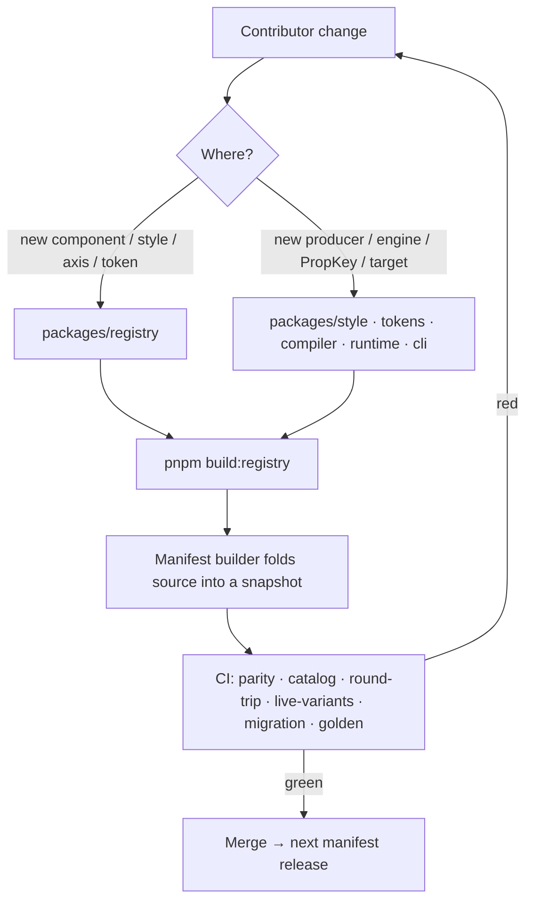

# Contributor workflows
> Part of [The Perfect dotUI](README.md) — an end-state architecture study (2026-07-04). Constitution-conformant.

This chapter is the field manual. Every prior chapter describes a layer of the system as a finished thing; this one describes what a contributor *does* to extend that thing, step by step, with the exact files they touch, the commands they run, and the bar a reviewer holds them to. The other chapters answer "how does it work"; this one answers "how do I add to it without breaking the guarantees."

The guarantees are load-bearing and they are all mechanical. Preview equals export because one pure `resolve`/`compile` pipeline runs in both the worker and the server. Tailwind equals StyleX because both emitters are proven total over the Style Contract vocabulary. A two-year-old **dsdoc** opens because its `lock` pins an immutable **Registry Manifest**. None of these survive a contributor who "just adds a class" outside the whitelist, or "just references a primitive" from a component, or "just renames an id." So every workflow below ends in the same place: the specific CI job that fails if you got it wrong, and the review bar that catches what CI can't.

Nine recipes follow, ordered from the everyday (a new component) to the rare and consequential (a new engine, a new mode dimension in the baseline). Governance policies that cut across several recipes — the subset-extension waiver, the axis-addition bar, id permanence, the manifest release process — are set off as **Policy** sidebars where they first bite. The worked fixtures are the ones the whole study shares: **Button** (the real `styles.ts` as authored input), **Menu** (declared highlight vars), **Loader** (file-variant).

---

## 0. The contributor's map

Every recipe lands changes in one of two places, and the distinction governs everything downstream:

- **Registry source** (`packages/registry/**`) — the product's source of truth. Components, styles, contracts, axis declarations, demos. Engine-neutral, imports only published surfaces. Changes here become part of the next **Registry Manifest** snapshot ([§ Policy: Manifest release](#policy-manifest-release-snapshot-version-deprecate)).
- **Engine/compiler packages** (`packages/{style,tokens,compiler,runtime,cli}/**`) — the machinery. New producers, new emitters, new export targets, new PropKey families live here. Changes here are versioned with the package, and the ones that widen the vocabulary the manifest speaks (a new producer id, a new PropKey) are also a manifest concern.



The commands recur across every recipe, so they are stated once here:

| Command | What it does | When |
|---|---|---|
| `pnpm build:registry` | Lifts `styles.ts` → Style Contracts, folds contracts/axes into the manifest, regenerates `__generated__` | After any registry change |
| `pnpm check` | oxlint (incl. `dotui/style-subset`, import-boundary, `dotui/id-permanence`) + format check | Before every commit |
| `pnpm typecheck` | Whole-monorepo tsc | Before every commit |
| `pnpm test` | vitest — token engine, resolver, emitter parity, migration corpus | After touching machinery or golden docs |
| `pnpm parity` | Renders the full state matrix in both engines, diffs `getComputedStyle` | After any style or emitter change |
| `pnpm build:references` | Regenerates API-reference docs from `types.ts` | After touching a `types.ts` |

---

## 1. New component

Adding a component is the most common contribution and touches the most files, but almost all of it is mechanical: scaffold, author behavior, author styles, declare the contract and axes, write demos, prove parity, and register it into the manifest.

**Files you create** under `packages/registry/ui/<component>/`:

| File | Ships? | You author |
|---|---|---|
| `base.tsx` | yes (transformed) | RAC template with explicit slots + the neutral style seam |
| `styles.ts` | no (lifted) | `defineComponentStyles` with `sizes()` |
| `contract.ts` | no (folded into manifest) | `defineContract`/`surface`/`scalar` token nodes |
| `axes.ts` | no (folded into manifest) | per-component axis declarations |
| `meta.ts` | no (drives everything) | kind, files, deps, group, sync group |
| `types.ts` | no (drives docs) | prop interfaces |
| `index.tsx` | no (site-only) | www-side wrapper (router links) |
| `demos/*.tsx` | no | one docs demo per file |
| `examples.tsx` | no | `/create` preview grid entries |

### 1.1 Scaffold

```bash
pnpm registry:new switch --group inputs --sync-group field-like
```

The generator writes the folder with the nine files stubbed, `meta.ts` pre-filled, and `base.tsx` carrying the neutral template skeleton. It does not invent styles or a contract — those are design decisions, not scaffolding.

### 1.2 The behavior template — explicit slots, one style seam

`base.tsx` is plain React Aria Components plus a single style-application line. Two non-negotiable rules, both from [Registry §2](03-registry.md) and [Styles §3](04-styles.md), because they are what make StyleX reach parity with Tailwind:

1. **Relation slots are explicit props, never children scanning.** A trailing-icon padding change reads `suffix != null`, not a walk of `children` for an `<svg>`. `hasIconEnd` is then a deterministic boolean that the Tailwind `:has()` binding and the StyleX runtime boolean read from the *same* truth source.
2. **Every rendered slot carries `data-slot`.** The owned-slot normalization pass targets slots by attribute; `data-slot="spinner" | "content" | "icon"` are the anchors the emitted CSS and the runtime both use.

```tsx
'use client'
import * as SwitchPrimitive from 'react-aria-components/Switch'
import { composeRenderProps } from 'react-aria-components/composeRenderProps'
import type { VariantProps } from '@dotui/style'
import { switchStyles, useStyles } from './styles'

type SwitchVariants = VariantProps<typeof switchStyles>

export function Switch({ size = 'md', children, ...props }: SwitchProps) {
  const styles = useStyles(switchStyles, { size })
  return (
    <SwitchPrimitive.Switch {...props}>
      {composeRenderProps(children, (rendered) => (
        <>
          <span data-slot="track" {...styles.track()}>
            <span data-slot="thumb" {...styles.thumb()} />
          </span>
          <span data-slot="content">{rendered}</span>
        </>
      ))}
    </SwitchPrimitive.Switch>
  )
}
```

The `{...styles.track()}` seam is engine-agnostic: it spreads a `className` under Tailwind and `stylex.props(...)` output under StyleX. The template above the seam is identical for both engines — that is what lets wrapper-level `codeStyle` (arrow vs declaration, file layout) apply once.

### 1.3 `styles.ts` — `defineComponentStyles` + `sizes()`

Author Tailwind strings under the closed whitelist. Density × size geometry goes through `sizes()` — this is the **canonical way**, not optional sugar. A reviewer rejects ad-hoc per-density ladders (three hand-written `variants.size` blocks) on sight; see [Density & sizing §](08-density-sizing.md).

```ts
import { defineComponentStyles, sizes } from '@dotui/style'
import switchMeta from './meta'

export const switchStyles = defineComponentStyles(switchMeta, {
  slots: ['track', 'thumb', 'content'],
  track: {
    base: 'inline-flex shrink-0 items-center rounded-full bg-(--switch-off) transition-colors selected:bg-(--switch-on) focus-visible:focus-ring disabled:bg-disabled',
  },
  thumb: {
    base: 'rounded-full bg-(--switch-thumb) transition-transform selected:translate-x-(--switch-travel)',
  },
  sizes: sizes({
    // one table; the lift folds it into density-pinned rules
    default:     { sm: { trackW: 7, trackH: 4, thumb: 3 }, md: { trackW: 9, trackH: 5, thumb: 4 }, lg: {/*…*/} },
    compact:     { sm: {/*…*/}, md: { trackW: 8, trackH: 4.5, thumb: 3.5 }, lg: {/*…*/} },
    comfortable: { sm: {/*…*/}, md: { trackW: 10, trackH: 6, thumb: 5 }, lg: {/*…*/} },
  }),
})
```

Compare against the shadcn equivalent before you finish. Their `style-mira/nova/vega` map to `compact/default/comfortable`; classes live in both `styles/style-<name>.css` and the component base file — check both or you will "discover" missing classes that are simply in the other file.

### 1.4 `contract.ts` — the token-contract nodes

The component references **only** component-contract nodes (`--switch-on`, `--switch-thumb`, `--switch-travel`) or semantic nodes — **never primitives** ([Tokens §3](05-tokens.md), Constitution §3/§4 edge rule). `defineContract`/`surface`/`scalar` generate the nodes; `surface()` creates the structural `pairsWith` edges that power contrast verification.

```ts
import { defineContract, surface, scalar, ref, calc } from '@dotui/tokens'

export default defineContract('switch', {   // owner 'switch'; sync group members share these nodes
  on:    surface({ bg: ref('color-primary') }),       // → c:switch-on, pairsWith the thumb-on pair
  off:   surface({ bg: ref('color-neutral') }),
  thumb: scalar('color', ref('color-bg')),
  travel: scalar('dimension', calc('trackW - thumb - 2')),
})
```

Every contract node ships with a base value, so nothing the component consumes can dangle. Users retarget these nodes; they never delete or rename them — contract evolution is a manifest-version concern ([§ Policy: Manifest release](#policy-manifest-release-snapshot-version-deprecate)).

### 1.5 `axes.ts` — the per-component axes

Component axes are synthesized from contract declarations, but **exposure is curated** — no auto-axis for internal mechanics. Declare the axes a *user* should see; a synced axis belongs to the group, not the member ([Axes §1, §5](06-axes.md)).

```ts
import { defineAxes } from '@dotui/registry/axes'

export default defineAxes('switch', {
  // 'thumbShape' is component-scoped; 'radius' and 'hoverEffect' come from the field-like sync group
})
```

If your component's look needs a knob no axis covers, **stop** — that is a new-axis proposal ([Recipe 3](#3-new-axis)), not a same-PR addition. Slipping an axis into a component PR is a specifically-prohibited move (Constitution §12, CLAUDE.md).

### 1.6 Demos, docs, references

Write `demos/*.tsx` (one component per file), fill `examples.tsx` for the `/create` grid, and complete `types.ts`. Then:

```bash
pnpm build:references   # regenerates modules/references/generated from types.ts — commit the full-run output
```

Documented props come from `types.ts`, not `base.tsx`. Commit the full-run output; scoped `-f` runs can flip union-member order.

### 1.7 Parity run and manifest inclusion

```bash
pnpm build:registry   # lifts styles.ts → Switch's Style Contract; folds contract + axes into the manifest
pnpm parity           # renders variant × size × density × state in BOTH engines, diffs getComputedStyle
pnpm check && pnpm typecheck && pnpm test
```

`build:registry` is what actually adds the component to the product: the manifest builder reads `meta.ts`, lifts `styles.ts`, folds `contract.ts` and `axes.ts` into the baseline graph and axis catalog, and emits the Contract into `__generated__`. Commit the regenerated `__generated__/*` — CI's registry-drift job diffs exactly those files.

**Review bar (new component):**
- `styles.ts` uses `sizes()`; no hand-authored density ladders; no un-tokenized design values (a `bg-[#…]` on a color family is a `dotui/style-subset` error carrying the token hint).
- `base.tsx` reads relations from explicit slot props; every slot has `data-slot`.
- `contract.ts` references only semantic/contract nodes; `surface()` pairs exist for every rendered fg-on-bg.
- No new axis smuggled in.
- `pnpm parity` is green for the new component; escapes (if any) are enumerated and waived ([§ Policy: Subset extension](#policy-subset-extension-escape-now-promote-per-release)).
- `__generated__` and `build:references` output are committed and drift-clean.

---

## 2. New named style for an existing group

A named style is a curated variant of a component's look — "outline" buttons, "translucent" menus — authored as a **delta** over the group's base Contract and resolved to a *complete* Contract before anything downstream reads it. Because Button ⇄ ToggleButton are a sync group, a named style is authored **once** and applies to both.

### 2.1 Author the delta

Named styles are role-safe override bundles: retargets (contract nodes → semantic nodes, never primitives) plus optional style-slice overrides. Author them where the group's styles live:

```ts
// packages/registry/ui/button/styles.ts — a new value on the `variant`-adjacent `styleFamily` axis
export const buttonNamedStyles = defineNamedStyles('button', {
  outline: {
    retargets: {
      'btn-bg-default': ref('color-transparent'),
      'btn-line-default': ref('color-border'),
    },
    slices: { root: 'border bg-transparent hover:bg-inverse/5 pressed:bg-inverse/10' },
  },
})
```

The delta is an authoring convenience. At `resolve` time the compiler applies it over the base Contract and produces a **complete** Contract for the `outline` value — forking, diffing, LLM generation, and export all operate on complete documents; the delta never leaks downstream (Constitution §3, [Styles §4](04-styles.md) named-style resolution).

### 2.2 Cross-system portability check

The decisive property: a dotUI-curated named style must render correctly through **any user's graph**. Because retargets point at semantic nodes and resolve against the user's token graph, an "outline" style styled with `color-border` picks up *their* border color, in *their* modes, verified in *their* reachable cells. The check is mechanical:

```bash
pnpm build:registry
pnpm parity --style outline                 # both engines, full matrix, on the named style
pnpm test golden -- --style outline         # renders 'outline' through all five golden dsdocs
```

The golden run is the portability proof: if `outline` references a token that doesn't exist in one of the golden graphs, or produces a failing contrast pair in a golden system's dark·hc cell, that is a failing test — not a runtime surprise in a user's export.

**Review bar (new named style):**
- Delta retargets reference semantic nodes only (edge rule); no raw primitives, no literal hexes.
- Sync group: the style is authored once under the group id; both members render it (the `pnpm parity` matrix includes ToggleButton).
- `pnpm test golden` passes for the new style across all five reference systems — proven, not asserted.
- Contrast pairs (from `surface()` `pairsWith`) verified in every reachable cell of the golden systems.

---

## 3. New axis

Every visual decision is a user-configurable axis — but **adding an axis is a product decision**, not an engineering one. This is the highest-friction everyday workflow by design.

### Policy: Axis-addition bar (propose-and-approve)

> Before writing any code, the axis is **proposed and approved**. The bar is one question, from CLAUDE.md and the Constitution: **would two design systems disagree on it?** If Material and Linear would render the decision differently, it is an axis. If it is component mechanics — an internal hairline, a hit-area, a layout gap that no design system would tweak — it is a plain value and must **not** be tokenized or exposed. A missing look with no covering axis is flagged as a *missing axis* (a product signal), never patched with an invented token.
>
> Proposal lives in a GitHub issue on `mehdibha/dotUI` (Constitution §12; CLAUDE.md tracks PRDs there). It states: the visual decision, the two+ systems that disagree, the axis `kind` and `scope`, the `writes` targets, and the default (which must equal the current look so nothing moves for existing docs). Approval, then implementation. Slipping an axis into an unrelated component PR is prohibited.

### 3.1 Declare the axis

Once approved, the axis is a declaration in the manifest baseline (or, for a power-user overlay, in a dsdoc). Same object either way; the builder renders it identically ([Axes §1](06-axes.md)). For a global elevation-family axis:

```ts
// packages/registry/axes/elevation.ts
export const elevationFamily: AxisDecl = {
  id: 'elevation.family',            // permanent, readable — never renamed (see id-permanence policy)
  kind: 'enum',
  label: 'Elevation',
  scope: { level: 'global' },
  values: [
    { id: 'shadow', label: 'Shadows' },
    { id: 'flat-border', label: 'Flat + border' },
    { id: 'tonal', label: 'Tonal fill' },
  ],
  default: 'shadow',                 // == current look; existing docs are unaffected
  writes: [
    { to: 'tokenWrite', token: 'shadow-md', target: { value: 'none' }, when: 'flat-border' },
    { to: 'styleLayer', component: 'card', when: 'flat-border' },
    // …fan-out across every surface component
  ],
}
```

### 3.2 Wire the writes and pick the tier

`writes` is a list — one axis fans out across many tokens/components. The **tier** is *derived* from what the writes target, never hand-declared ([Axes §6](06-axes.md), Constitution §6):

| Axis targets | Derived tier | Preview cost |
|---|---|---|
| token/producer/scalar/mode-flip | **value** | CSS-variable write, 60fps |
| enum style/density/variant default/fileVariant | **structural** | one style-tree swap |
| add/rename token, add mode, custom style, engine switch | **global** | recompile |

An `enum` axis writing `styleLayer` is **structural**; a `scalar` writing `cssVar` is **value**. If you wrote the tier by hand, that is a review reject — the classifier owns it.

### 3.3 Golden-doc updates

An axis exists to widen reconstruction coverage. Update the golden dsdocs that need it and add the reconstruction assertion ([Reconstructions §](07-reconstructions.md), [Testing §](13-testing.md)):

```bash
pnpm build:registry
pnpm test golden          # the five reference systems now exercise elevation.family
```

If a golden system was previously *unreconstructable* for want of this axis, its failing test now passes — that closed gap is the axis's justification made mechanical.

**Review bar (new axis):**
- Linked approval issue clearing the "two design systems disagree" bar.
- `default` equals the current look; no existing dsdoc changes resolved output.
- Tier is derived, not declared; `when` predicates are shared between panel visibility and resolution.
- Panel control is generated (no hand-written React — a `toCommand` that returns a stub is a type error, [Builder §](10-builder.md)).
- Golden docs updated; a previously-missing reconstruction now renders.
- `id` is readable and permanent.

---

## 4. New token or semantic-vocabulary change

Changing the baseline token vocabulary — adding a semantic token, retargeting a default, deprecating one — is **baseline evolution**. It ships in a manifest version and every stored dsdoc that pins an older manifest is unaffected until its owner explicitly reconciles.

### 4.1 Add a semantic node

Baseline semantics live in the registry's committed baseline graph. Add a `SemanticNode` with a permanent readable id and a base value:

```ts
// packages/registry/manifest/baseline/semantics.ts
{
  id: 'color-info',                 // permanent id; label renames freely
  layer: 'semantic',
  category: 'background',
  values: {
    '': { kind: 'ref', to: 'blue-500' },
    'scheme:dark': { kind: 'ref', to: 'blue-400' },
  },
  pairsWith: 'color-fg-on-info',    // seeds a verification pair
}
```

Adding a node is a **minor** manifest bump: it ships with a sensible default, appears in every compatible picker, and cannot break an older doc (older docs don't reference it). The baseline is ~76 semantic tokens; a genuine gap in that vocabulary is what this recipe is for.

### 4.2 Deprecation and reconcile implications

Renaming or removing is a **major** manifest bump and requires a `DeprecationNote` so `reconcile(doc, newManifest)` can produce a reviewable diff instead of silent loss ([dsdoc §8.2](09-dsdoc.md), Constitution §5):

```ts
{ id: 'color-accent', deprecated: { kind: 'rename', to: 'color-primary' } }   // reconcile auto-remaps
{ id: 'color-legacy-panel', deprecated: { kind: 'merge', into: 'color-card' } }
{ id: 'color-gone', deprecated: { kind: 'removed', fallback: { kind: 'ref', to: 'color-neutral' } } }
```

`reconcile` applies the table: `rename` → auto id-remap; `merge` → fold; `removed` → snap to the declared fallback with a warning. Every drop is a surfaced change in the returned `{ doc, changes[], blocked[] }` — a stored system never silently degrades. Emitted var names for a rename ship a deprecation alias for one major version so long-lived consumer repos don't get a churned utility name overnight.

### 4.3 Verify

```bash
pnpm build:registry
pnpm test           # contrast matrix picks up the new pair; migration corpus proves reconcile
pnpm test golden    # golden docs still resolve; a shadcn-token-name doc still round-trips
```

**Review bar (token change):**
- New node has a permanent readable id and a base (`''`) value; edge rule holds (semantic references primitives/semantics only).
- Rename/removal carries a `DeprecationNote`; nothing is hard-deleted (id permanence).
- Contrast pairs declared where the token is a surface/fg.
- Migration corpus + golden docs green; `reconcile` produces a reviewable diff, never a silent reset.

---

## 5. New producer

A producer generates a color ramp for a cell — `oklch` (default), `tailwind`, `contrast`, `material` (HCT), `fixed` (paste-a-palette). The registry is open; adding one (say `hsluv`) is a `packages/tokens` change plus registration.

### 5.1 Implement the `Producer` interface

```ts
interface Producer<C> {
  id: string
  schema: ZodType<C>                                   // config validated at edit time
  produce(config: C, ctx: CellCtx): {                  // per (ramp, cell)
    scale: Record<string, string>                      // step → color
    on: Record<string, string>                         // step → autocontrast fg
  }
}
interface CellCtx {
  cell: Cell; isDark: boolean; contrastBoost: number   // from mode-option roles
  steps: readonly string[]; surface: string            // resolved bg for this cell
}
```

The **per-cell contract** is the whole point: `produce` is called once per reachable cell with that cell's `isDark`/`contrastBoost`/`surface`. Dark is not ramp reversal (which exists nowhere) — an `isDark` producer derives a *real* dark. High-contrast is not a separate producer — `contrastBoost → 1` raises targets toward AAA inside the same producer, which is how `hc` composes with every scheme.

```ts
export const hsluv: Producer<HsluvConfig> = {
  id: 'hsluv',
  schema: HsluvConfigSchema,
  produce(config, ctx) {
    const anchorL = ctx.isDark ? config.darkAnchor : config.lightAnchor
    const targetBoost = 1 + ctx.contrastBoost * 0.3   // hc pushes toward AAA in-producer
    const scale = buildScale(config.hue, config.sat, anchorL, ctx.steps, targetBoost)
    return { scale, on: deriveOnColors(scale, ctx.surface) }
  },
}
```

### 5.2 Register and verify

```ts
// packages/tokens/producers/index.ts
registerProducer(hsluv)
```

Verification hooks are not optional. A producer is only correct if:

```bash
pnpm test producers -- --producer hsluv
```

...passes the producer conformance suite: it must produce a legible ramp in **every reachable cell** (base, dark, hc, dark·hc), its `on` colors must clear the contrast targets the verifier holds each cell to, and — because a StyleX consumer who changes a seed re-runs *this* code — it must be a pure function of `(config, ctx)` with no ambient state.

**Review bar (new producer):**
- `id` registered; `schema` validates config at edit time (a bad seed is a rejected `applyEdit`, not a broken export).
- `produce` is pure and per-cell; honors `isDark` (real dark, not reversal) and `contrastBoost` (in-producer AAA push).
- Conformance suite green across all reachable cells; `on`-colors clear targets.
- DTCG note: generative recipes freeze to `fixed` on Figma re-import — documented, not silently lossy.

---

## 6. New engine

Adding a third style engine (say vanilla-extract, or a native-CSS-modules target) alongside Tailwind and StyleX is the largest single contribution in the system. The Style Contract is engine-neutral by design so that this is *possible*; it is still large, and the checklist below is deliberately exhaustive because a partial engine that passes some cases is worse than no engine — it ships wrong output.

### 6.1 Implement `EngineEmitter`

```ts
interface EngineEmitter {
  id: EngineId                                         // 'vanilla-extract'
  emitComponent(contract: StyleContract, codeStyle: CodeStyle): RegistryFile[]
  emitTokens(resolved: ResolvedGraph, codeStyle: CodeStyle): RegistryFile[]
  emitPreview(resolved: ResolvedSystem): PreviewOutput // themeCss/utilitiesCss/runtimeVarsCss analogue
  lower: EngineCatalog                                 // §6.2 — the total lowering table
}
```

The emitter is a **pure function of the Contract and the ResolvedGraph** — the same two artifacts Tailwind and StyleX read. The engine was never in the token model or the Contract; it lives only in the final serializer. If your emitter needs information the Contract doesn't carry, the Contract is wrong to extend, not the emitter to reach around.

### 6.2 Catalog lowerings for **every** PropKey and state

This is the bulk of the work and the thing the **catalog completeness test** enforces. The Contract vocabulary is closed and total; your engine must lower every point of it:

- **Every `PropKey` family** — `bg`, `fg`, `ring`, `radius`, `paddingX`, `size`, `gap`, `truncate`, `translateX`, `transitionProperty`, … each with its expected `TokenType` and its rendering in your engine (e.g. `truncate` expands to three declarations).
- **Every `TokenValue` shape** — `{token}`, `{semantic}`, `{literal}`, `{calc}`, `{mix}`, `{componentVar}`. Symbolic references stay symbolic — your engine emits `var(--…)` or its native handle, never a resolved OKLCH literal (that would kill runtime theming).
- **Every `StateDecl` kind** — `css-pseudo` (`:hover`), `rac-render` (`isPressed` boolean), `rac-data` (`[data-invalid]`), `relation` (the `hasIconEnd` boolean from an explicit slot prop, **never** children scanning), `context` (in-modal), `media`.
- **`declaredVars`** — a variant that writes `--color-disabled` (Button) or a highlight var (Menu) must emit that write in your engine, or the Menu highlight bug returns.
- **Dimensions including `density`** — variant/size/boolean/`density` pins; both `codeStyle.density: 'baked'` and `'runtime'`.
- **`EscapeHatch`** — either a rendering in your engine or a CI-surfaced parity waiver.

```bash
pnpm test catalog -- --engine vanilla-extract   # FAILS until every PropKey × TokenValue × StateDecl has a lowering
```

A family with one rendering cannot ship. This test is what makes "two engines agree" a proof rather than a hope, and it is the reason a partial engine is caught before merge.

### 6.3 Parity suite

```bash
pnpm parity --engine vanilla-extract   # renders variant × size × density × state for EVERY component, both vs new engine, diffs getComputedStyle
```

Empty diff by construction — because the Contract is total and every lowering exists. A non-empty diff names the exact (component, variant, size, density, state) cell that disagrees.

### 6.4 Preview static layer

The builder preview runs the **selected engine** ([Builder §](10-builder.md), Constitution §7). A new engine needs its cold-start story so preview equals export from the first frame:

- A **static precomputed layer** for the base doc so cold start is equal to Tailwind's (its ~40KB utility layer / StyleX's precomputed atomic layer).
- Incremental compilation in the worker for novel classes/vars from user-defined tokens and styles, at click frequency, never on a drag.
- A **baked default `PreviewOutput`** that CI proves byte-equal to a fresh server compile (cold-start parity test).
- `createLiveVariants` conformance: `createLiveVariants(x)(props) === <yourEngine>(emitFiles(...))(props)` plus computed-style sample diffs.

**Review bar (new engine):**
- `emitComponent`/`emitTokens`/`emitPreview` are pure over Contract + ResolvedGraph; no Contract extension to serve one engine.
- **Catalog completeness green** — every PropKey, TokenValue, StateDecl, `declaredVars`, both density modes lowered.
- **Parity green** for every component across the full matrix.
- Preview: static base layer + worker-incremental path + cold-start byte-equality + live-variants conformance.
- Escapes enumerated and waived; no silent divergence.
- `codeStyle` AST transforms apply to the new emitter's output (AST-equivalent modulo formatting).

---

## 7. New export target

A target is a packaging of one resolved system — v0, Bolt, Lovable, a zip, a Figma DTCG file. The compiler already produces `RegistryFile[]`, DTCG, and static embeds; a target is a **profile** over that output plus bundle verification.

### 7.1 Write a target profile

```ts
// packages/compiler/targets/lovable.ts
export const lovableTarget: TargetProfile = {
  id: 'lovable',
  label: 'Lovable',
  framework: 'remix',
  themeDelivery: 'real-files',            // host strips registry css/cssVars → theme ships as project files
  dependencyResolution: 'inline-closure', // host can't follow registryDependencies
  deps: { pin: 'exact' },                 // exact versions, no ranges
  layout: {
    themeCss: 'app/globals.css',
    entry: 'app/routes/_index.tsx',
    componentsDir: 'app/components/ui',
    importStyle: 'relative',
  },
  autocontrast: 'bake',                   // host can't run the plugin → bake on-* foregrounds
}
```

The profile declares the host's constraints as data ([Distribution §4](12-distribution.md) is the schema's home). It does not re-implement compilation — the one bundle emitter runs `compile(resolved, { kind: 'export', engine, codeStyle })` and packages the output per the profile. Served at `/r/bundle?doc=…&target=lovable` (Constitution §9).

### 7.2 Bundle verification

A target ships only when its bundle is proven installable and faithful:

```bash
pnpm test targets -- --target lovable
```

The suite: the bundle honors every declared constraint (theme delivered per `themeDelivery`, deps pinned per `deps.pin`, layout correct); it installs into a scratch host project; and the installed result renders **byte-identically to the same doc's preview** (the isomorphic-pipeline guarantee — same `resolve`/`compile`, so preview equals this target's export).

**Review bar (new target):**
- Profile is data over `compile`; no bespoke re-compilation.
- Constraints declared and verified; deps pinned; theme/token CSS delivered per `themeDelivery`.
- Installed bundle renders byte-equal to the doc's preview.

---

## 8. New mode dimension option in the baseline

The baseline ships two mode dimensions: `scheme: [light*, dark]` and `contrast: [normal*, hc]`. Adding a baseline option (an OLED-black `midnight` under `scheme`, or a `dim` scheme) is a token-graph change plus verification across the newly reachable cells.

### 8.1 Add the option

```ts
// packages/registry/manifest/baseline/dimensions.ts — the scheme dimension
{
  id: 'scheme',
  options: [
    { id: 'light', role: {} },
    { id: 'dark', role: { isDark: true } },
    { id: 'midnight', role: { isDark: true }, surface: 'color-bg' },  // new
  ],
  defaultOption: 'light',
  binding: { kind: 'class' },
}
```

Adding an option is guarded like any graph edit. Every token resolves in `midnight·*` immediately by falling through to less-constrained keys; you override only the cells that genuinely diverge (the neutral ramp's `scheme:midnight` producer config, surface lightness ≈ 0.10). `contrast:hc` composes onto `midnight` for free — the composition is the reason modes are dimensions and not a flat list (Constitution §4).

### 8.2 Verify the new cells

The soft cap is 4 dimensions / 24 reachable cells; a new option grows the cube, so verification must walk it:

```bash
pnpm build:registry
pnpm test contrast     # verifies every derived pairing × every NEWLY reachable cell (midnight·normal, midnight·hc)
pnpm test golden       # golden docs that opt into midnight resolve and pass strict export
```

A failing pair in `midnight·hc` produces a **proposed, cell-scoped** autofix — an override key on that cell only, never a mutation of the base value, never silent output correction. In headless strict export the run blocks with a machine-readable report; `--accept-fixes` applies the cell-scoped fixes and emits a manifest.

**Review bar (new mode dimension option):**
- Option added with correct `role` (`isDark`, `contrastBoost`, `surface`); base values fall through, overrides only where cells diverge.
- New cells stay within the soft cap; UI guidance if approaching it.
- Contrast verified in every newly reachable cell; failures propose cell-scoped fixes, not silent corrections.
- Golden docs that use the option pass strict export; DTCG gains the mode in the right collection.

---

## Policy sidebars

### Policy: Subset extension (escape now, promote per-release)

> The style whitelist (variants, utilities, arbitrary-value forms) is closed on purpose: it is what makes both emitters total. When a design system genuinely needs an unmodeled CSS family — a mask, an exotic gradient, a niche container-query — a contributor has two moves, and the cadence between them is fixed policy:
>
> 1. **Escape now, with a waiver.** An `EscapeHatch` carries either both engine renderings *or* a reviewed parity waiver. It ships immediately so no contributor is hard-blocked; it is enumerated in the parity CI report so the divergence is never silent. Waived escapes are visible, counted, and reviewed.
> 2. **Promote a family, batched per release.** Turning an escape into a first-class `PropKey` family requires two engine renderings and a catalog-completeness entry, and it is **batched per manifest release**, not landed ad hoc — because a new family widens the vocabulary every engine must be total over. Family promotion is a machinery change ([Recipe 6](#6-new-engine)'s catalog is what it feeds), reviewed as one.
>
> The fixtures need zero escapes; the hatch costs nothing in practice and exists so the closed system never becomes a hard wall.

### Policy: id permanence

> Every referent — axis, axis value, token, mode, component, sync group, contract node, Contract rule — has a **permanent readable id** minted from its initial slug (`color-primary`, `btn-bg-primary`, `elevation.family`). Ids are the handles stored dsdocs reference; a rename of the id is a stored-document break.
>
> - **Never rename or reuse an id.** A display `name`/`label` renames freely (it drives emitted var names and UI labels, initialized equal to the id). References use ids, never labels.
> - The `dotui/id-permanence` lint (part of `pnpm check`) fails a PR that removes or reuses a published id. Removal goes through a `DeprecationNote`, not a delete.
> - A renamed emission ships a deprecation alias for one major version so consumer utility names don't churn overnight.
>
> This is the discipline that makes readable ids as safe as opaque ULIDs while keeping documents human-diffable — the guarantee is the discipline plus the lint, not opacity.

### Policy: Manifest release (snapshot, version, deprecate)

> A **Registry Manifest** snapshot is the release unit. Publishing one is the mechanism by which every registry-source change above reaches users, and it is immutable and permanent once published (npm-shaped: published means permanent).
>
> - **Snapshot.** `pnpm build:registry` folds the current registry source — every component Contract, every contract node, every axis, the baseline token graph, code-style option declarations — into a content-addressed snapshot (`2028.03.01-a3f`), served forever at `/r/manifest/<version>`.
> - **Version.** Additive changes (new component, new axis with a current-look default, new semantic token) are a **minor** bump — no stored doc changes resolved output. Breaking changes (rename/remove a contract node, remove an axis value, id-space refactor) are a **major** bump carrying a full **deprecation table**.
> - **Deprecate.** The deprecation table is what `reconcile(doc, newManifest)` reads to produce a reviewable diff on an explicit lock upgrade: `rename → auto-remap`, `merge → fold`, `removed → declared fallback + warning`, `new → resolve to default + flag`. No value ever degrades silently; a two-year-old dsdoc opens against its *own* frozen manifest and only moves when its owner reconciles.
> - **Retain.** Snapshots are never deleted. A hot-serve window keeps recent versions fast; older ones move to a cold-storage tier but stay resolvable.

---

## The one review question, restated

Every recipe reduces to the same test, applied at the right layer:

- A **value** decision (color, radius, shadow, density-affected spacing) flows through a token or Contract node — `bg-primary`, not `bg-[#635bff]`.
- A **mechanics** decision (hairline, hit-area, internal gap) stays a plain value — no token, no axis.
- A **new knob** two design systems would disagree on is an **axis** — proposed, approved, defaulted to the current look.
- A **look with no covering axis** is a **flagged missing axis** — a product signal, never an invented token.

CI enforces the rest: `dotui/style-subset` (portable authoring), import boundaries (registry cleanliness), `dotui/id-permanence` (stored-doc safety), catalog completeness (engine totality), parity (preview = export = both engines), the migration corpus (docs open forever), and the golden five (reconstruction is proven, not asserted). A green pipeline is the claim that a contribution kept every guarantee the architecture makes.

---

## Tradeoffs this chapter accepts honestly

- **The friction is front-loaded and real.** Adding an axis requires a product proposal and approval before a line of code; adding an engine requires a catalog lowering for every PropKey and a parity pass for every component; adding a producer requires conformance across every reachable cell. This is deliberate — the guarantees are only as strong as the weakest merged contribution — but it makes dotUI a slower place to contribute than a copy-paste component library, and the bar can feel heavy for a small change.
- **Machinery blast radius.** Because one Contract and one resolver feed everything, a bug a contributor introduces in a shared lowering or the token resolver corrupts *both* engines and every export at once. The catalog and parity tests are the guardrail, but the surface a contributor can break with one wrong table entry is larger than a single mis-authored class string in a hand-styled library.
- **The whitelist is a ceiling until a release.** A genuinely novel CSS look escapes immediately with a waiver, but promoting it to a first-class family waits for a batched manifest release. A contributor who needs a new PropFamily *now* ships a waived escape and lives with the visible divergence marker until promotion — correct for the system, occasionally annoying for the individual PR.
- **Manifest permanence is a standing cost.** "Published means permanent" means the registry never deletes a snapshot a document might pin. The retention tiering keeps it affordable, but it is a growing operational liability that a mutable-defaults system would not carry — the price paid so a two-year-old dsdoc opens exactly as authored.
- **Golden-doc maintenance never ends.** The five reference systems must be updated whenever an axis or token that touches them lands, and their visual-regression baselines re-approved. This is the cost of proving reconstruction by rendering rather than asserting by metadata — cheaper than shipping a system that *claims* to reconstruct Material 3 and doesn't, but a real recurring tax on every contributor whose change reaches a golden system.
